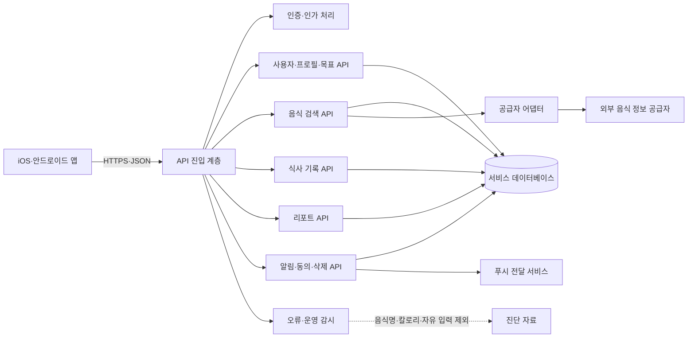

## 1. 문서 정보

- **API 버전**: v1.0
- **작성일**: 2026-10-01
- **작성자**: 백엔드팀
- **문서 상태**: 검토 중
- **적용 범위**: 식단 기록 앱 MVP 서버 API 초안
- **작성 기준**: 회의에서 정리된 기능과 데이터 처리 원칙을 반영했습니다. 경로, 자료 형식, 인증 토큰 구성, 요청 제한, 응답 시간 등 회의에서 확정되지 않은 구현 세부는 **설계 제안** 또는 **추정 필요**로 표시했습니다. 제안 사항은 회의 확정 사항이 아닙니다.

**변경 이력**

| 버전 | 날짜 | 변경 내용 | 작성자 |
|---|---|---|---|
| v1.0 | 2026-10-01 | 회의 내용을 바탕으로 MVP API 명세 초안 작성 | 백엔드팀 |

## 2. 개요

### 2.1 API 정보

이 API는 iOS·안드로이드 공통 앱에서 사용하는 식단 기록 기능을 제공합니다. 사용자는 음식 검색, 최근 기록·즐겨찾기 조회, 직접 입력, 식사 기록 생성·수정·삭제, 날짜별 기록 조회, 주간 리포트 확인, 알림 설정 및 계정 삭제 요청을 이용할 수 있습니다. 음식 검색이 실패하거나 영양 정보가 없어도 기록이 막히지 않도록 설계합니다.

식사 기록은 사용자별로 분리하며, 기록 당시의 음식 이름과 영양값을 스냅샷으로 보관합니다. 따라서 외부 음식 데이터가 변경되어도 과거 기록과 리포트 값은 자동으로 바뀌지 않습니다. 외부 식품 데이터 공급처는 미확정이므로, 공급자 응답을 내부 표준 형식으로 바꾸는 구조를 전제로 합니다. 외부 공급자에게는 검색어만 전달하고 사용자 식별 정보와 식사 기록은 전달하지 않는 방향입니다.

| 항목 | 값 |
|---|---|
| **기본 주소** | `https://api.example.com/v1` **(제안, 실제 주소 추정 필요)** |
| **프로토콜** | HTTPS 전용 **(제안)** |
| **자료 형식** | JSON (`application/json`) |
| **문자 인코딩** | UTF-8 |
| **인증 방식** | 인증 제공자 범위 미확정. 접근 토큰 방식은 구현 제안이며, JWT 사용 여부·발급자·만료 정책은 추정 필요 |
| **요청 제한** | 미정. 외부 음식 API 호출 제한과 계약 조건 확인 후 산정 필요 |
| **응답 시간 제한** | 미정. 음식 검색 응답 목표와 공급자 응답 지연 처리 기준은 검증 필요 |
| **시간 처리** | 생성·수정 시각은 UTC 기준, 식사 날짜는 사용자 현지 날짜를 별도 저장하는 방향 |
| **개인정보 원칙** | 음식명·칼로리·체중·자유 입력 내용은 제품 분석 이벤트에 포함하지 않음 |

> `api.example.com`은 문서 예시 주소입니다. 실제 주소가 확정된 것은 아닙니다.

### 2.2 버전 관리

**경로에 버전을 포함하는 방식**을 제안합니다.

- `/v1/`: MVP용 첫 API 버전
- `/v2/`: 추후 별도 버전이 필요할 때 추가할 수 있는 경로. 현재 개발·시험 중이라는 의미로 확정된 것은 아닙니다.
- 응답 필드의 선택적 추가와 같은 하위 호환 변경은 같은 버전에서 제공하고, 기존 필드의 의미 변경이나 제거는 새 버전에서 처리하는 방향을 제안합니다.
- 새 버전의 지원 기간, 이전 버전 종료 방식은 추정 필요입니다.

## 3. 인증

### 3.1 인증 방식

로그인 제공자는 미확정입니다. 회의에서는 이메일·Apple·Google 인증을 우선 검토하고, 카카오는 1차 우선순위에서 제외하는 방향을 논의했습니다. 게스트 시작, 게스트 데이터 저장 위치와 계정 연결·병합 여부도 확정되지 않았습니다.

아래와 같이 Bearer 방식의 접근 토큰을 사용하는 형태를 **구현 제안**으로 제시합니다. 토큰 형식이 JWT인지, 토큰 유효 기간과 갱신 방식이 무엇인지는 인증 제공자와 보안 검토 후 확정해야 합니다.

```http
GET /v1/me HTTP/1.1
Host: api.example.com
Authorization: Bearer <접근_토큰>
Accept: application/json
User-Agent: MealRecordApp/1.0
```

### 3.2 인증 시작 및 토큰 발급

**POST** `/v1/auth/token`

인증 제공자에서 발급한 인증 결과를 서버가 검증하고, 서비스용 접근 토큰을 발급하는 형태의 **설계 제안**입니다. 실제 인증 제공자와 인증 교환 방식은 미확정입니다. 비밀번호를 서버에 원문으로 저장하지 않으며, 인증 제공자 토큰을 요청에 넣는 구체적인 방식도 제공자 확정 후 정합니다.

**요청 본문 예시**

```json
{
  "provider": "apple",
  "providerToken": "<인증_제공자_토큰>",
  "device": {
    "platform": "ios",
    "appVersion": "1.0.0"
  }
}
```

**성공 응답 예시 `200 OK`**

```json
{
  "success": true,
  "data": {
    "accessToken": "<서비스_접근_토큰>",
    "refreshToken": "<갱신_토큰>",
    "tokenType": "Bearer",
    "expiresIn": 3600,
    "user": {
      "id": "usr_0192d6a9-38a8-7c1f-9f3a-90b11ab41234",
      "accountStatus": "active"
    }
  },
  "meta": {
    "timestamp": "2026-10-01T02:00:00Z",
    "requestId": "req_0192d6aa-7e18-7c31-a435-0b1d5fb11f01"
  }
}
```

`expiresIn`은 예시 값이며 실제 만료 시간은 추정 필요입니다. 게스트 계정 발급과 계정 연결·병합 요청은 별도 인증 흐름 확정 후 추가합니다.

### 3.3 토큰 갱신

**POST** `/v1/auth/refresh`

**요청 본문 예시**

```json
{
  "refreshToken": "<갱신_토큰>"
}
```

**성공 응답 예시 `200 OK`**

```json
{
  "success": true,
  "data": {
    "accessToken": "<새_서비스_접근_토큰>",
    "refreshToken": "<새_갱신_토큰>",
    "tokenType": "Bearer",
    "expiresIn": 3600
  },
  "meta": {
    "timestamp": "2026-10-01T02:05:00Z",
    "requestId": "req_0192d6ab-1dc0-7055-8b66-4e9df7087b20"
  }
}
```

토큰 갱신 정책, 갱신 토큰 회전 여부, 로그아웃·탈퇴 시 토큰 폐기 방식은 추정 필요입니다.

### 3.4 인증·인가 원칙

- 사용자 개인 자료를 다루는 경로는 인증을 요구합니다.
- 요청 본문이나 경로에 다른 사용자 식별값이 전달되더라도 이를 권한 판단의 근거로 사용하지 않습니다. 사용자 식별값은 인증 문맥에서 가져옵니다.
- 개인 음식, 즐겨찾기, 식사 기록은 요청 사용자의 소유 여부를 확인한 뒤 조회·수정·삭제합니다.
- 소유 여부를 확인할 수 없는 기록 식별값은 다른 사용자의 존재가 드러나지 않도록 `404 Not Found`로 응답하는 방식을 제안합니다.
- 삭제 요청이 접수된 계정은 서비스 접근을 제한하는 방향을 제안합니다. 실제 상태 전이 시점과 재인증 방식은 추정 필요입니다.
- 운영자에 의한 식사 기록 조회는 일반 API로 제공하지 않습니다. 운영상 접근이 필요한 경우 동의·권한 승인·접근 기록을 갖춘 별도 절차가 필요합니다.

## 4. 공통 규약

### 4.1 요청 규약

| 항목 | 규칙 |
|---|---|
| `Content-Type` | 본문이 있는 요청은 `application/json` |
| `Accept` | `application/json` |
| `Authorization` | 인증이 필요한 요청은 `Bearer <토큰>` |
| `User-Agent` | 앱 이름과 버전을 포함하는 방향을 제안합니다. 형식과 필수 여부는 추정 필요입니다. |
| 요청 식별값 | 기록 생성·재시도에는 `Idempotency-Key` 요청 헤더 사용을 제안합니다. 헤더 이름과 보존 기간은 구현 확정 필요입니다. |
| 시간 | API 시각 값은 ISO 8601 형식의 UTC 시각 사용을 제안합니다. 식사 날짜는 `YYYY-MM-DD` |
| 빈 값 | 영양 정보 미입력은 `null`로 표현합니다. 실제 값 `0`과 구분합니다. |
| 개인정보 | 검색어는 외부 식품 공급자에게 전달될 수 있습니다. 분석 이벤트·일반 오류 로그에는 저장하지 않습니다. |

**중복 생성 방지 헤더 예시**

```http
Idempotency-Key: 0192d6ac-6f7d-7458-9e1c-9d72a8b4c005
```

요청 식별값의 저장 기간과 재사용 조건은 추정 필요입니다. 같은 사용자가 같은 키로 같은 요청을 재전송하면 기존 처리 결과를 반환하는 방식을 제안합니다.

### 4.2 응답 규약

모든 응답에 `success`와 `meta`를 포함하는 공통 응답 틀을 **설계 제안**으로 사용합니다. 목록 조회 응답에는 페이지 정보가 필요한 경우 `pagination`을 추가합니다. 일부 응답의 실제 필드 구성은 구현 단계에서 확정해야 합니다.

**성공 응답 예시**

```json
{
  "success": true,
  "data": {
    "id": "mei_0192d6ad-ea1a-7e33-9255-83efaa988210"
  },
  "meta": {
    "timestamp": "2026-10-01T02:10:00Z",
    "requestId": "req_0192d6ae-01ca-7b2f-84d6-1cfc7023af13"
  }
}
```

**오류 응답 예시**

```json
{
  "success": false,
  "error": {
    "code": "VALIDATION_ERROR",
    "message": "요청 내용을 확인해 주세요.",
    "details": [
      {
        "field": "consumedDate",
        "message": "미래 날짜는 식사 날짜로 지정할 수 없습니다."
      }
    ]
  },
  "meta": {
    "timestamp": "2026-10-01T02:10:00Z",
    "requestId": "req_0192d6ae-01ca-7b2f-84d6-1cfc7023af13"
  }
}
```

오류 응답에 검색어, 음식명, 영양값, 자유 입력 내용을 자동으로 포함하지 않습니다.

### 4.3 HTTP 상태 코드

| 코드 | 설명 | 사용 예 |
|---:|---|---|
| `200` | 요청 성공 | 조회·수정·인증 토큰 발급 |
| `201` | 자료 생성 성공 | 식사 항목·개인 음식·즐겨찾기 생성 |
| `202` | 처리를 접수했으나 후속 처리가 진행 중 | 계정 삭제 요청 접수 |
| `204` | 삭제 성공, 응답 본문 없음 | 개별 식사 기록 삭제 |
| `400` | 요청 형식 또는 매개변수 오류 | 날짜 형식 오류 |
| `401` | 인증 실패 또는 토큰 만료 | 인증 토큰 누락·유효하지 않음 |
| `403` | 이용 권한 없음 | 계정 상태상 요청 제한 |
| `404` | 자료 없음 또는 요청 사용자의 소유가 아님 | 식사 항목 조회 |
| `409` | 현재 상태와 충돌 | 중복 즐겨찾기, 삭제 진행 중 계정 |
| `422` | 자료 형식은 맞지만 값 검증 실패 | 미래 식사 날짜, 허용되지 않은 식사 구분 |
| `429` | 요청 제한 초과 | 제한 정책 확정 후 적용 |
| `500` | 서버 내부 오류 | 예기치 않은 처리 실패 |
| `502` | 외부 음식 공급자 오류 | 공급자 응답 오류 또는 이용 불가 |
| `503` | 일시적으로 서비스 사용 불가 | 자체 검색·기록 API 점검 |

`429`, `502`, `503`의 세부 재시도 정책과 적용 범위는 추정 필요입니다. 외부 음식 API 오류가 식사 기록 생성·조회·수정·삭제까지 차단하지 않아야 합니다.

## 5. 엔드포인트 목록

아래 경로는 구현 검토용 제안입니다. 회의에서 실제 URL이나 요청·응답 형식을 확정하지 않았습니다. 경로는 문서 본문에서 `/v1`을 생략해 표기합니다.

| 메서드 | 경로 | 설명 | 인증 | 요청 제한 |
|---|---|---|---|---|
| `POST` | `/auth/token` | 인증 제공자 결과 확인 및 서비스 토큰 발급 | 아니요 | 추정 필요 |
| `POST` | `/auth/refresh` | 접근 토큰 갱신 | 아니요 | 추정 필요 |
| `GET` | `/me` | 로그인 사용자 기본 정보 조회 | 필요 | 추정 필요 |
| `GET` | `/me/profile` | 선택적 프로필 조회 | 필요 | 추정 필요 |
| `PATCH` | `/me/profile` | 선택적 프로필 수정 | 필요 | 추정 필요 |
| `GET` | `/me/goals` | 목표 이력 조회 | 필요 | 추정 필요 |
| `POST` | `/me/goals` | 목표 생성 또는 변경 이력 추가 | 필요 | 추정 필요 |
| `GET` | `/foods/search` | 음식 검색 | 필요 여부 미정, 로그인 없이 허용할지 확인 필요 | 추정 필요 |
| `GET` | `/foods/recent` | 최근 기록 음식 조회 | 필요 | 추정 필요 |
| `GET` | `/foods/favorites` | 즐겨찾기 목록 조회 | 필요 | 추정 필요 |
| `POST` | `/foods/favorites` | 음식 즐겨찾기 등록 | 필요 | 추정 필요 |
| `DELETE` | `/foods/favorites/{favoriteId}` | 즐겨찾기 해제 | 필요 | 추정 필요 |
| `GET` | `/me/foods` | 사용자가 입력한 개인 음식 목록 조회 | 필요 | 추정 필요 |
| `POST` | `/me/foods` | 개인 음식 생성 | 필요 | 추정 필요 |
| `GET` | `/me/meals` | 날짜별 식사 항목 조회·합계 | 필요 | 추정 필요 |
| `POST` | `/me/meals` | 식사 음식 항목 생성 | 필요 | 추정 필요 |
| `GET` | `/me/meals/{mealEntryId}` | 식사 음식 항목 상세 조회 | 필요 | 추정 필요 |
| `PATCH` | `/me/meals/{mealEntryId}` | 식사 음식 항목 수정 | 필요 | 추정 필요 |
| `DELETE` | `/me/meals/{mealEntryId}` | 식사 음식 항목 삭제 | 필요 | 추정 필요 |
| `GET` | `/me/reports/weekly` | 완료된 지난주 기록 기반 리포트 조회 | 필요 | 추정 필요 |
| `GET` | `/me/settings/notifications` | 알림 설정 조회 | 필요 | 추정 필요 |
| `PUT` | `/me/settings/notifications` | 기록 알림 설정 변경 | 필요 | 추정 필요 |
| `POST` | `/me/push-devices` | 푸시 기기 등록 또는 갱신 | 필요 | 추정 필요 |
| `DELETE` | `/me/push-devices/{deviceId}` | 푸시 기기 해제 | 필요 | 추정 필요 |
| `GET` | `/me/consents` | 동의 상태 조회 | 필요 | 추정 필요 |
| `PUT` | `/me/consents/{consentType}` | 선택 동의 상태 변경 | 필요 | 추정 필요 |
| `POST` | `/me/account-deletion` | 계정 삭제 요청 | 필요 | 추정 필요 |
| `GET` | `/me/account-deletion` | 계정 삭제 요청 상태 조회 | 필요 | 추정 필요 |

> 식사 사진 첨부는 회의 내에서 제외와 포함 의견이 모두 확인됩니다. 따라서 사진 업로드 API는 아래 기본 목록에 확정 기능으로 포함하지 않았습니다. 최종 포함 승인이 나면 파일 업로드·삭제 경로와 파일 제한, 저장소 접근 방식 및 보존 정책을 별도 확정해야 합니다.

## 6. 상세 명세

### 6.1 인증 토큰 발급

**POST** `/v1/auth/token`

인증 제공자 범위와 게스트 지원 여부가 미확정입니다. 아래는 인증 제공자 토큰을 서버에서 검증하는 구현 제안입니다.

**요청 본문**

| 필드 | 형식 | 필수 | 제약·설명 |
|---|---|---:|---|
| `provider` | 문자열 | 예 | `apple`, `google`, `email` 중 확정된 제공자 |
| `providerToken` | 문자열 | 예 | 인증 제공자에서 받은 검증용 토큰 |
| `device.platform` | 문자열 | 예 | `ios` 또는 `android` |
| `device.appVersion` | 문자열 | 예 | 앱 버전 |
| `guestSessionId` | 문자열 | 아니요 | 게스트 흐름이 승인될 경우 사용. 현재 미정 |

**요청 예시**

```json
{
  "provider": "google",
  "providerToken": "<인증_제공자_토큰>",
  "device": {
    "platform": "android",
    "appVersion": "1.0.0"
  }
}
```

**성공 응답 `200 OK`**

```json
{
  "success": true,
  "data": {
    "accessToken": "<서비스_접근_토큰>",
    "refreshToken": "<갱신_토큰>",
    "tokenType": "Bearer",
    "expiresIn": 3600,
    "user": {
      "id": "usr_0192d6a9-38a8-7c1f-9f3a-90b11ab41234",
      "accountStatus": "active"
    }
  },
  "meta": {
    "timestamp": "2026-10-01T02:00:00Z",
    "requestId": "req_0192d6aa-7e18-7c31-a435-0b1d5fb11f01"
  }
}
```

**주요 처리 사례**

| 사례 | 처리 |
|---|---|
| 인증 제공자 토큰이 유효함 | 기존 계정 확인 후 토큰 발급. 계정 자동 병합은 하지 않는 방향을 제안 |
| 처음 로그인한 제공자 계정 | 내부 사용자 생성 후 토큰 발급 |
| 제공자 토큰이 만료·위조됨 | `401`, `INVALID_PROVIDER_TOKEN` |
| 승인되지 않은 제공자 사용 | `422`, `UNSUPPORTED_AUTH_PROVIDER` |
| 같은 제공자 계정이 이미 다른 계정에 연결됨 | `409`, 계정 연결 정책에 따라 처리. 자동 병합은 금지하고 사용자 확인 흐름 필요 |

**오류 응답 예시**

```json
{
  "success": false,
  "error": {
    "code": "INVALID_PROVIDER_TOKEN",
    "message": "인증 정보를 확인할 수 없습니다."
  },
  "meta": {
    "timestamp": "2026-10-01T02:00:00Z",
    "requestId": "req_0192d6aa-7e18-7c31-a435-0b1d5fb11f01"
  }
}
```

### 6.2 인증 토큰 갱신

**POST** `/v1/auth/refresh`

**요청 본문**

| 필드 | 형식 | 필수 | 설명 |
|---|---|---:|---|
| `refreshToken` | 문자열 | 예 | 서버가 발급한 갱신 토큰 |

**요청 예시**

```json
{
  "refreshToken": "<갱신_토큰>"
}
```

**성공 응답 `200 OK`**

```json
{
  "success": true,
  "data": {
    "accessToken": "<새_접근_토큰>",
    "refreshToken": "<새_갱신_토큰>",
    "tokenType": "Bearer",
    "expiresIn": 3600
  },
  "meta": {
    "timestamp": "2026-10-01T02:05:00Z",
    "requestId": "req_0192d6ab-1dc0-7055-8b66-4e9df7087b20"
  }
}
```

| 사례 | 처리 |
|---|---|
| 유효한 갱신 토큰 | 새 접근 토큰 발급 |
| 만료된 갱신 토큰 | `401`, 재인증 필요 |
| 탈퇴 처리 중인 계정의 토큰 | 정책에 따라 `403` 또는 `401`. 실제 응답은 확정 필요 |
| 잘못된 요청 본문 | `422`, 필드 오류 반환 |
| 토큰 저장소·인증 처리 장애 | `500`, 토큰 원문을 로그에 남기지 않음 |

### 6.3 로그인 사용자 조회

**GET** `/v1/me`

**인증**: 필요

**성공 응답 `200 OK`**

```json
{
  "success": true,
  "data": {
    "id": "usr_0192d6a9-38a8-7c1f-9f3a-90b11ab41234",
    "accountStatus": "active",
    "createdAt": "2026-10-01T01:30:00Z",
    "profileCompleted": false
  },
  "meta": {
    "timestamp": "2026-10-01T02:15:00Z",
    "requestId": "req_0192d6b2-15d0-7b21-8de0-909544b02003"
  }
}
```

| 사례 | 처리 |
|---|---|
| 유효한 인증 사용자 | 사용자 기본 정보 반환 |
| 토큰 없음·만료 | `401` |
| 사용자를 찾을 수 없음 | `404` 또는 `401`. 토큰 검증 정책 확정 필요 |
| 삭제 요청이 진행 중인 계정 | `403` 또는 제한된 삭제 상태 정보 반환. 정책 확정 필요 |
| 서버 오류 | `500`, 내부 상세 내용은 숨김 |

이 응답에는 음식 기록, 체중 등 식사 내용은 포함하지 않습니다.

### 6.4 프로필 조회 및 수정

#### 프로필 조회

**GET** `/v1/me/profile`

**성공 응답 `200 OK`**

```json
{
  "success": true,
  "data": {
    "timezone": "Asia/Seoul",
    "birthDate": null,
    "heightCm": null,
    "weightKg": null,
    "sex": null
  },
  "meta": {
    "timestamp": "2026-10-01T02:20:00Z",
    "requestId": "req_0192d6b3-bca0-73d8-92cb-a439e193e7d2"
  }
}
```

#### 프로필 수정

**PATCH** `/v1/me/profile`

신체 정보의 실제 수집 항목과 연령 입력 방식은 미정입니다. 입력하지 않은 값은 `null`로 보존하는 방향입니다. 신체 정보는 수정·삭제할 수 있어야 한다는 원칙을 반영합니다.

**요청 본문 예시**

```json
{
  "timezone": "Asia/Seoul",
  "birthDate": null,
  "heightCm": 165.5,
  "weightKg": 62.0,
  "sex": null
}
```

**필드 검증**

| 필드 | 형식 | 필수 | 검증 |
|---|---|---:|---|
| `timezone` | 문자열 | 아니요 | 시간대 식별값이어야 함 |
| `birthDate` | 날짜 또는 `null` | 아니요 | 형식 `YYYY-MM-DD`. 수집 여부·연령 기준은 미정 |
| `heightCm` | 숫자 또는 `null` | 아니요 | 양수. 허용 범위는 추정 필요 |
| `weightKg` | 숫자 또는 `null` | 아니요 | 양수. 허용 범위는 추정 필요 |
| `sex` | 문자열 또는 `null` | 아니요 | 필수 여부와 허용 선택지는 미정 |

**성공 응답 `200 OK`**

```json
{
  "success": true,
  "data": {
    "timezone": "Asia/Seoul",
    "birthDate": null,
    "heightCm": 165.5,
    "weightKg": 62.0,
    "sex": null,
    "updatedAt": "2026-10-01T02:21:00Z"
  },
  "meta": {
    "timestamp": "2026-10-01T02:21:00Z",
    "requestId": "req_0192d6b4-4a5b-7de3-9c25-a6705ba182aa"
  }
}
```

| 사례 | 처리 |
|---|---|
| 선택 필드만 변경 | 전달된 필드만 수정 |
| 값에 `null` 전달 | 해당 값 삭제. 필드 생략과 구분 |
| 키·체중에 0 또는 음수 전달 | `422`, 값 검증 오류 |
| 잘못된 시간대 전달 | `422`, 시간대 오류 |
| 토큰 무효 또는 타인 자료 요청 | `401`; 사용자 식별값을 요청에서 받지 않음 |

### 6.5 목표 이력 조회 및 생성

#### 목표 이력 조회

**GET** `/v1/me/goals`

선택적 쿼리 매개변수:

| 매개변수 | 형식 | 필수 | 설명 |
|---|---|---:|---|
| `from` | 날짜 | 아니요 | 조회 시작일 |
| `to` | 날짜 | 아니요 | 조회 종료일 |

**성공 응답 `200 OK`**

```json
{
  "success": true,
  "data": {
    "goals": [
      {
        "id": "gol_0192d6b5-95f9-7b5d-8723-f88fd702b981",
        "dailyEnergyKcal": 1800,
        "validFrom": "2026-10-01",
        "validTo": null,
        "createdAt": "2026-10-01T02:30:00Z"
      }
    ]
  },
  "meta": {
    "timestamp": "2026-10-01T02:30:00Z",
    "requestId": "req_0192d6b5-e262-7d23-8768-29476fce0877"
  }
}
```

#### 목표 생성 또는 변경

**POST** `/v1/me/goals`

자동 권장 칼로리는 MVP에서 제공하지 않는 방향입니다. 사용자가 직접 목표 수치를 입력할 수 있는지와 안전 기준은 미확정입니다. 아래 경로는 목표 이력 구조를 위한 설계 제안이며, 목표 수치 입력 화면과 허용 범위가 승인되기 전에는 개발 확정 요구사항으로 보지 않습니다.

**요청 본문 예시**

```json
{
  "dailyEnergyKcal": 1800,
  "validFrom": "2026-10-01"
}
```

**성공 응답 `201 Created`**

```json
{
  "success": true,
  "data": {
    "id": "gol_0192d6b5-95f9-7b5d-8723-f88fd702b981",
    "dailyEnergyKcal": 1800,
    "validFrom": "2026-10-01",
    "validTo": null,
    "createdAt": "2026-10-01T02:30:00Z"
  },
  "meta": {
    "timestamp": "2026-10-01T02:30:00Z",
    "requestId": "req_0192d6b5-e262-7d23-8768-29476fce0877"
  }
}
```

| 사례 | 처리 |
|---|---|
| 목표 없이 시작 | 목표 자료 없이 기록·리포트 기능 제공 |
| 승인된 목표 수치 입력 | 새 목표 이력 생성, 기존 목표의 유효 기간 종료 |
| 자동 권장 목표 요청 | `422` 또는 기능 미지원 응답. 자동 권장 수치는 임의 생성하지 않음 |
| 위험 범위 또는 미확정 범위의 목표 입력 | 안전 기준 확정 전 저장 정책 미정. 기준 확정 후 검증 |
| 목표 유효 기간 중복 | `409`, 목표 이력 충돌 |

목표 변경은 기존 기록에 소급 적용하지 않고, 식사 날짜 기준 당시 유효한 목표를 사용합니다.

### 6.6 음식 검색

**GET** `/v1/foods/search`

음식 검색은 한 글자 검색을 허용하는 방향으로 정리됐습니다. 회의 내용에는 검색 대기 시간이 약 300밀리초와 약 350밀리초로 서로 다르게 제시되어 있어, 지연 시간은 최종 구현값을 확정해야 합니다. 앱이 디바운스를 적용하더라도 서버는 개별 요청을 안전하게 처리해야 합니다.

**쿼리 매개변수**

| 매개변수 | 형식 | 필수 | 기본값 | 제약·설명 |
|---|---|---:|---|---|
| `q` | 문자열 | 예 | 없음 | 검색어. 분석 이벤트·일반 로그에 원문 저장 금지 |
| `limit` | 정수 | 아니요 | 미정 | 결과 수 제한. 상한 추정 필요 |
| `cursor` | 문자열 | 아니요 | 없음 | 결과가 많을 때 이어 보기. 적용 여부 추정 필요 |

**요청 예시**

```http
GET /v1/foods/search?q=닭가슴살&limit=10 HTTP/1.1
Host: api.example.com
Authorization: Bearer <접근_토큰>
Accept: application/json
```

**성공 응답 `200 OK`**

```json
{
  "success": true,
  "data": {
    "items": [
      {
        "id": "fod_0192d6b6-0e01-796b-910c-75652a14d2d1",
        "name": "닭가슴살",
        "brandName": null,
        "sourceType": "provider",
        "serving": {
          "name": "기준 제공량",
          "amount": 100,
          "unit": "g"
        },
        "nutrients": {
          "energyKcal": 165,
          "carbohydrateG": 0,
          "proteinG": 31,
          "fatG": 3.6
        },
        "nutrientAvailability": {
          "energyKcal": "available",
          "carbohydrateG": "available",
          "proteinG": "available",
          "fatG": "available"
        },
        "source": {
          "name": "음식 정보 제공처",
          "reference": "provider-item-123"
        }
      }
    ],
    "nextCursor": null
  },
  "meta": {
    "timestamp": "2026-10-01T02:40:00Z",
    "requestId": "req_0192d6b6-6d0e-7b55-8988-fd4c7337c04c"
  }
}
```

위 음식명과 영양값은 응답 구조를 설명하기 위한 예시이며, 실제 공급자 데이터가 아닙니다. `0`은 실제 값이 0인 경우만 사용하고, 정보 없음은 `null` 및 `unavailable` 상태로 표현합니다.

**대표 처리 사례**

| 사례 | 상태 | 처리 |
|---|---:|---|
| 검색 결과가 있음 | `200` | 내부 표준 모델로 변환한 결과 반환 |
| 검색 결과가 없음 | `200` | `items: []`, `resultStatus: "no_results"`를 반환하는 방식 제안. 직접 입력 경로 제공 |
| 공급자 응답 오류 | `502` 또는 `503` | 검색 실패와 빈 결과를 구분. 직접 입력·최근 음식으로 기록을 이어갈 수 있게 함 |
| 공급자 응답 지연 | `504` 제안 또는 `503` | 실제 시간 제한은 추정 필요. 검색어를 유지하도록 앱에 오류 상태 반환 |
| 잘못된 매개변수·공백만 있는 검색어 | `400` 또는 `422` | 매개변수 오류 반환 |
| 공급자 계약상 검색어 처리 불가 | 서비스 정책에 따라 제한 | 계약과 개인정보 안내 확인 전 외부 공급자 호출 금지 |

**검색 응답 오류 예시**

```json
{
  "success": false,
  "error": {
    "code": "FOOD_PROVIDER_UNAVAILABLE",
    "message": "음식 검색을 일시적으로 이용할 수 없습니다. 직접 입력하거나 최근 음식을 선택해 주세요."
  },
  "meta": {
    "timestamp": "2026-10-01T02:40:00Z",
    "requestId": "req_0192d6b6-6d0e-7b55-8988-fd4c7337c04c"
  }
}
```

**개인정보·공급자 처리**

- 외부 공급자 호출에는 검색어만 전달합니다.
- 사용자 식별값, 이메일, 섭취 날짜, 식사 기록은 전달하지 않습니다.
- 검색어 보관 조건, 재표시 권한, 캐시 보관 허용 여부, 국외 처리 여부와 비용은 공급자 계약 확인 전 미정입니다.
- 검색어 자체는 제품 분석 이벤트와 일반 오류 로그에 넣지 않습니다.
- 공급자 응답은 앱에 그대로 전달하지 않고 내부 표준 자료 형식으로 변환합니다.
- 부정확한 결과를 자동 선택하거나 자동 저장하지 않습니다.

### 6.7 최근 음식 조회

**GET** `/v1/foods/recent`

최근 음식은 최근에 저장한 식사 항목을 기준으로 조회하는 제안입니다. 조회 기간과 중복 항목 제거 규칙은 회의에서 확정되지 않았습니다.

**쿼리 매개변수**

| 매개변수 | 형식 | 필수 | 설명 |
|---|---|---:|---|
| `limit` | 정수 | 아니요 | 반환할 음식 수. 기본값·상한 추정 필요 |

**성공 응답 `200 OK`**

```json
{
  "success": true,
  "data": {
    "items": [
      {
        "foodId": "fod_0192d6b6-0e01-796b-910c-75652a14d2d1",
        "name": "닭가슴살",
        "sourceType": "provider",
        "lastConsumedAt": "2026-10-01T01:20:00Z",
        "nutrients": {
          "energyKcal": 165,
          "carbohydrateG": 0,
          "proteinG": 31,
          "fatG": 3.6
        }
      },
      {
        "userFoodId": "ufd_0192d6b7-76fd-7a33-a1c1-8fa644516a50",
        "name": "집에서 만든 국",
        "sourceType": "user_input",
        "lastConsumedAt": "2026-09-30T23:10:00Z",
        "nutrients": {
          "energyKcal": null,
          "carbohydrateG": null,
          "proteinG": null,
          "fatG": null
        }
      }
    ]
  },
  "meta": {
    "timestamp": "2026-10-01T02:45:00Z",
    "requestId": "req_0192d6b7-d3a4-7be7-8ae0-d3011c7f9130"
  }
}
```

| 사례 | 처리 |
|---|---|
| 기록이 있는 사용자 | 최근 순으로 반환 |
| 기록이 없는 사용자 | 빈 `items` 반환 |
| 개인 음식이 포함됨 | 해당 사용자에게만 반환 |
| 요청 제한 초과 | 제한 정책 확정 후 `429` 적용 |
| 인증 오류 | `401` |

최근 기록에서 음식을 선택해 새 기록을 만들더라도, 새 기록은 새 항목으로 생성하고 과거 기록을 변경하지 않습니다.

### 6.8 개인 음식 조회·생성

#### 개인 음식 조회

**GET** `/v1/me/foods`

**성공 응답 `200 OK`**

```json
{
  "success": true,
  "data": {
    "items": [
      {
        "id": "ufd_0192d6b7-76fd-7a33-a1c1-8fa644516a50",
        "name": "집에서 만든 국",
        "servingName": "1회분",
        "nutrients": {
          "energyKcal": null,
          "carbohydrateG": null,
          "proteinG": null,
          "fatG": null
        },
        "createdAt": "2026-10-01T02:50:00Z"
      }
    ]
  },
  "meta": {
    "timestamp": "2026-10-01T02:50:00Z",
    "requestId": "req_0192d6b8-4dd6-7bbb-8c77-990f6482ae08"
  }
}
```

#### 개인 음식 생성

**POST** `/v1/me/foods`

**요청 본문**

| 필드 | 형식 | 필수 | 제약·설명 |
|---|---|---:|---|
| `name` | 문자열 | 예 | 음식명. 앞뒤 공백 제거 후 빈 값 불가. 길이 상한 추정 필요 |
| `servingName` | 문자열 | 아니요 | 미입력 시 `1회분` 제안 |
| `nutrients.energyKcal` | 숫자 또는 `null` | 아니요 | 0 이상 |
| `nutrients.carbohydrateG` | 숫자 또는 `null` | 아니요 | 0 이상 |
| `nutrients.proteinG` | 숫자 또는 `null` | 아니요 | 0 이상 |
| `nutrients.fatG` | 숫자 또는 `null` | 아니요 | 0 이상 |

**요청 예시**

```json
{
  "name": "집에서 만든 국",
  "servingName": "1회분",
  "nutrients": {
    "energyKcal": null,
    "carbohydrateG": null,
    "proteinG": null,
    "fatG": null
  }
}
```

**성공 응답 `201 Created`**

```json
{
  "success": true,
  "data": {
    "id": "ufd_0192d6b7-76fd-7a33-a1c1-8fa644516a50",
    "name": "집에서 만든 국",
    "servingName": "1회분",
    "nutrients": {
      "energyKcal": null,
      "carbohydrateG": null,
      "proteinG": null,
      "fatG": null
    },
    "createdAt": "2026-10-01T02:50:00Z"
  },
  "meta": {
    "timestamp": "2026-10-01T02:50:00Z",
    "requestId": "req_0192d6b8-4dd6-7bbb-8c77-990f6482ae08"
  }
}
```

| 사례 | 처리 |
|---|---|
| 음식명만 입력 | 생성 허용, 영양값은 `null` |
| 영양값이 실제 0 | 숫자 `0`으로 저장해 미입력과 구분 |
| 영양값이 음수 또는 숫자 형식이 아님 | `422` |
| 이름이 공백뿐임 | `422` |
| 다른 사용자의 개인 음식 식별값 사용 | `404` 또는 `403`; 타인 자료 존재 노출 방지 |
| 같은 이름의 개인 음식 생성 | 중복 허용 여부 미정. 사용자 경험·중복 기준 확인 필요 |

개인 음식은 다른 사용자의 검색 결과에 노출하지 않습니다. 공용 음식 자료로 올리는 기능은 별도 동의 절차가 없으므로 이 명세 범위에 포함하지 않습니다.

### 6.9 즐겨찾기 조회·등록·해제

#### 즐겨찾기 조회

**GET** `/v1/foods/favorites`

**성공 응답 `200 OK`**

```json
{
  "success": true,
  "data": {
    "items": [
      {
        "id": "fav_0192d6b9-3fd1-700a-bb2f-e59df6e73d94",
        "food": {
          "id": "fod_0192d6b6-0e01-796b-910c-75652a14d2d1",
          "name": "닭가슴살",
          "sourceType": "provider"
        },
        "createdAt": "2026-10-01T02:55:00Z"
      }
    ]
  },
  "meta": {
    "timestamp": "2026-10-01T02:55:00Z",
    "requestId": "req_0192d6b9-7fda-722b-9dab-d6e7a91a6d16"
  }
}
```

#### 즐겨찾기 등록

**POST** `/v1/foods/favorites`

**요청 본문**

```json
{
  "foodId": "fod_0192d6b6-0e01-796b-910c-75652a14d2d1"
}
```

개인 음식은 `userFoodId`를 사용합니다. 두 식별값을 동시에 보내는 요청은 허용하지 않습니다.

**성공 응답 `201 Created`**

```json
{
  "success": true,
  "data": {
    "id": "fav_0192d6b9-3fd1-700a-bb2f-e59df6e73d94",
    "foodId": "fod_0192d6b6-0e01-796b-910c-75652a14d2d1",
    "userFoodId": null,
    "createdAt": "2026-10-01T02:55:00Z"
  },
  "meta": {
    "timestamp": "2026-10-01T02:55:00Z",
    "requestId": "req_0192d6b9-7fda-722b-9dab-d6e7a91a6d16"
  }
}
```

#### 즐겨찾기 해제

**DELETE** `/v1/foods/favorites/{favoriteId}`

**성공 응답 `204 No Content`**

| 사례 | 처리 |
|---|---|
| 사용자 소유 즐겨찾기 등록 | `201` |
| 이미 등록된 즐겨찾기 재등록 | `409` 또는 기존 결과 반환. 정책 확정 필요 |
| 공용 음식·개인 음식 식별값을 모두 전달 | `422` |
| 다른 사용자의 개인 음식 지정 | `404` |
| 즐겨찾기 해제 성공 | `204` |
| 존재하지 않거나 다른 사용자의 즐겨찾기 해제 | `404` |

### 6.10 날짜별 식사 기록 조회

**GET** `/v1/me/meals`

요청 사용자의 식사 음식 항목을 조회합니다. 화면에서는 같은 섭취 날짜와 식사 구분의 항목을 묶어 보여주고 합산합니다. 별도 식사 묶음 식별값은 사용하지 않습니다.

**쿼리 매개변수**

| 매개변수 | 형식 | 필수 | 기본값 | 설명·검증 |
|---|---|---:|---|---|
| `date` | 날짜 | 아니요 | 사용자 현지 오늘 | `YYYY-MM-DD` |
| `from` | 날짜 | 아니요 | 없음 | 기간 조회 시작일 |
| `to` | 날짜 | 아니요 | 없음 | 기간 조회 종료일 |
| `mealType` | 문자열 | 아니요 | 없음 | `breakfast`, `lunch`, `dinner`, `snack` |
| `cursor` | 문자열 | 아니요 | 없음 | 큰 목록의 이어 보기 여부는 추정 필요 |

`date`와 `from`·`to`를 함께 보낼 수 있는지, 기간의 최대 길이는 미정입니다. 화면 날짜 탐색은 최근 7일 안으로 제한하는 안이 제시됐지만, 더 오래된 과거 날짜를 선택할 수 있도록 하는 화면 정책도 논의됐습니다. API는 임의의 과거 날짜 조회를 지원하는 방향을 제안합니다.

**요청 예시**

```http
GET /v1/me/meals?date=2026-10-01 HTTP/1.1
Host: api.example.com
Authorization: Bearer <접근_토큰>
Accept: application/json
```

**성공 응답 `200 OK`**

```json
{
  "success": true,
  "data": {
    "date": "2026-10-01",
    "timezone": "Asia/Seoul",
    "meals": [
      {
        "mealType": "lunch",
        "items": [
          {
            "id": "mei_0192d6ba-5084-7e90-aead-2e081223885a",
            "food": {
              "id": "fod_0192d6bb-0e01-796b-910c-75652a14d2d1",
              "name": "닭가슴살"
            },
            "foodNameSnapshot": "닭가슴살",
            "quantityMultiplier": 1.0,
            "servingNameSnapshot": "100g",
            "nutrientSourceType": "provider",
            "nutrients": {
              "energyKcal": 165,
              "carbohydrateG": 0,
              "proteinG": 31,
              "fatG": 3.6
            },
            "createdAt": "2026-10-01T03:10:00Z"
          }
        ],
        "totals": {
          "entryCount": 1,
          "energyKcal": 165,
          "carbohydrateG": 0,
          "proteinG": 31,
          "fatG": 3.6
        }
      }
    ],
    "dayTotals": {
      "entryCount": 1,
      "energyKcal": 165,
      "carbohydrateG": 0,
      "proteinG": 31,
      "fatG": 3.6
    }
  },
  "meta": {
    "timestamp": "2026-10-01T03:15:00Z",
    "requestId": "req_0192d6bb-5d7a-7b47-84d7-f9cdb9c8496b"
  }
}
```

**주요 처리 사례**

| 사례 | 처리 |
|---|---|
| 선택 날짜에 기록이 있음 | 항목·식사 구분별 합계 반환 |
| 선택 날짜에 기록이 없음 | 빈 식사 목록 반환. 칼로리 0으로 오해되지 않게 상태를 구분 |
| 일부 항목에 영양값이 없음 | 해당 영양소만 집계에서 제외하고 기록 수에는 포함 |
| 미래 날짜 조회 | 조회 자체 허용 여부는 미정. 생성 제한과 구분해 정책 확정 필요 |
| 잘못된 날짜·시작일이 종료일보다 늦음 | `400` 또는 `422` |
| 다른 사용자 식별값으로 조회 시도 | 사용자 식별값을 요청으로 받지 않음. 인증된 사용자 자료만 조회 |

영양값이 `null`인 항목을 `0`으로 합산하지 않습니다. 영양소별로 값이 있는 항목만 따로 합산합니다.

### 6.11 식사 기록 생성

**POST** `/v1/me/meals`

이름은 식사 기록 경로로 사용하지만, 본문에서 생성하는 자원은 **식사 음식 항목 한 건**입니다. 한 끼에 여러 음식을 추가하면 항목마다 요청해 즉시 저장합니다.

**요청 헤더**

```http
Authorization: Bearer <접근_토큰>
Content-Type: application/json
Idempotency-Key: 0192d6bc-55bc-7cde-a54a-9c126c8dc011
```

**요청 본문 필드**

| 필드 | 형식 | 필수 | 검증·설명 |
|---|---|---:|---|
| `foodId` | 문자열 | 조건부 | 공용 음식 식별값 |
| `userFoodId` | 문자열 | 조건부 | 사용자 개인 음식 식별값 |
| `consumedDate` | 날짜 | 예 | 실제 섭취 날짜. 미래 날짜는 허용하지 않는 방향 |
| `consumedAt` | 시각 또는 `null` | 아니요 | 실제 섭취 시각. 사용자가 입력하지 않을 수 있음 |
| `mealType` | 문자열 | 예 | 아침·점심·저녁·간식의 내부 값 |
| `quantityMultiplier` | 숫자 | 예 | 양의 수. 기본값 `1.0`을 앱이 전달하는 방식 제안 |
| `foodNameSnapshot` | 문자열 | 조건부 | 사용자가 직접 입력한 음식명 또는 선택 시점 이름 |
| `nutrients` | 객체 | 예 | 영양 정보 스냅샷. 각 항목은 숫자 또는 `null` |
| `nutrientSourceType` | 문자열 | 예 | `provider`, `user_input`, `none` |
| `sourceReference` | 문자열 또는 `null` | 아니요 | 표시 가능한 출처 정보 |

`foodId`와 `userFoodId` 중 정확히 하나만 지정해야 합니다. 해당 음식의 이름·영양값·기준 제공량은 서버가 조회해 스냅샷을 만드는 방향을 권장합니다. 앱에서 스냅샷을 직접 제출하도록 허용할지는 공급자 신뢰·조작 방지 관점에서 구현 확정이 필요합니다.

**요청 예시**

```json
{
  "foodId": "fod_0192d6bb-0e01-796b-910c-75652a14d2d1",
  "userFoodId": null,
  "consumedDate": "2026-10-01",
  "consumedAt": "2026-10-01T12:15:00+09:00",
  "mealType": "lunch",
  "quantityMultiplier": 1.0
}
```

**직접 입력 음식 기록 예시**

```json
{
  "userFoodId": "ufd_0192d6bd-9d0e-7b6b-87c5-7f84794262d4",
  "foodId": null,
  "consumedDate": "2026-10-01",
  "consumedAt": null,
  "mealType": "lunch",
  "quantityMultiplier": 1.0
}
```

**성공 응답 `201 Created`**

```json
{
  "success": true,
  "data": {
    "id": "mei_0192d6be-8ef2-7362-9e89-6e6b5e63f310",
    "consumedDate": "2026-10-01",
    "consumedAt": "2026-10-01T03:15:00Z",
    "mealType": "lunch",
    "foodNameSnapshot": "집에서 만든 국",
    "quantityMultiplier": 1.0,
    "nutrients": {
      "energyKcal": null,
      "carbohydrateG": null,
      "proteinG": null,
      "fatG": null
    },
    "nutrientSourceType": "none",
    "createdAt": "2026-10-01T03:16:00Z"
  },
  "meta": {
    "timestamp": "2026-10-01T03:16:00Z",
    "requestId": "req_0192d6be-cdc6-727f-a074-5888e67af63a"
  }
}
```

**주요 처리 사례**

| 사례 | 상태 | 처리 |
|---|---:|---|
| 공용 음식 항목 생성 | `201` | 기록 시점 음식명·영양값 스냅샷 저장 |
| 영양 정보가 없는 개인 음식 생성 | `201` | 기록은 저장하고 영양값은 `null`로 유지 |
| 동일 요청 식별값으로 재전송 | `201` 또는 기존 결과 | 중복 생성 없이 최초 결과 반환 |
| `foodId`와 `userFoodId`를 모두 지정하거나 모두 생략 | `422` | 음식 참조 검증 오류 |
| 다른 사용자의 개인 음식 지정 | `404` | 타인 자료 존재 여부를 노출하지 않음 |
| 미래 날짜 또는 잘못된 식사 구분 | `422` | 기록 생성 거부 |
| 외부 음식 공급자 장애 | 기록 생성은 차단하지 않음 | 이미 선택한 내부 음식·개인 음식 기록은 저장 가능 |
| 저장소·서버 오류 | `500` 또는 `503` | 요청 식별값을 활용해 재시도, 입력값 보존은 앱에서 처리 |

한 식사 구분에 여러 항목을 저장할 수 있으며, 같은 날짜·식사 구분의 항목을 조회할 때 합산합니다. 별도 식사 모음 자원은 MVP에서 두지 않습니다.

### 6.12 식사 기록 상세 조회·수정·삭제

#### 상세 조회

**GET** `/v1/me/meals/{mealEntryId}`

**성공 응답 `200 OK`**

```json
{
  "success": true,
  "data": {
    "id": "mei_0192d6be-8ef2-7362-9e89-6e6b5e63f310",
    "consumedDate": "2026-10-01",
    "consumedAt": null,
    "mealType": "lunch",
    "foodNameSnapshot": "집에서 만든 국",
    "quantityMultiplier": 1.0,
    "nutrients": {
      "energyKcal": null,
      "carbohydrateG": null,
      "proteinG": null,
      "fatG": null
    },
    "nutrientSourceType": "none",
    "createdAt": "2026-10-01T03:16:00Z",
    "updatedAt": "2026-10-01T03:16:00Z"
  },
  "meta": {
    "timestamp": "2026-10-01T03:20:00Z",
    "requestId": "req_0192d6bf-4b49-7d59-9980-982e6b2a1e4d"
  }
}
```

#### 수정

**PATCH** `/v1/me/meals/{mealEntryId}`

**요청 본문 예시**

```json
{
  "consumedDate": "2026-09-30",
  "consumedAt": "2026-09-30T11:30:00+09:00",
  "mealType": "dinner",
  "quantityMultiplier": 0.5
}
```

**성공 응답 `200 OK`**

```json
{
  "success": true,
  "data": {
    "id": "mei_0192d6be-8ef2-7362-9e89-6e6b5e63f310",
    "consumedDate": "2026-09-30",
    "consumedAt": "2026-09-30T02:30:00Z",
    "mealType": "dinner",
    "foodNameSnapshot": "집에서 만든 국",
    "quantityMultiplier": 0.5,
    "nutrients": {
      "energyKcal": null,
      "carbohydrateG": null,
      "proteinG": null,
      "fatG": null
    },
    "updatedAt": "2026-10-01T03:21:00Z"
  },
  "meta": {
    "timestamp": "2026-10-01T03:21:00Z",
    "requestId": "req_0192d6bf-943f-7773-9b8a-0f4a6c0d93be"
  }
}
```

수정 시 음식 마스터의 최신 정보로 영양값을 자동 갱신하지 않습니다. 사용자가 양을 바꾸면 기록 당시 스냅샷 값에 변경된 배수를 적용합니다. 음식 정보를 최신 값으로 갱신하는 기능은 MVP에 포함하지 않습니다.

#### 삭제

**DELETE** `/v1/me/meals/{mealEntryId}`

**성공 응답 `204 No Content`**

| 사례 | 처리 |
|---|---|
| 사용자 소유 항목 조회 | `200` |
| 존재하지 않거나 타인 소유 항목 조회 | `404` |
| 유효한 수정 요청 | `200`, 허용된 필드만 변경 |
| 미래 날짜·잘못된 식사 구분·0 이하 배수 | `422` |
| 수정 대상이 타인 소유 항목 | `404` |
| 삭제 성공 | `204`, 홈·리포트는 다음 조회에서 최신 자료로 계산 |
| 이미 삭제된 항목 | `404` 또는 반복 삭제 성공 처리 중 하나로 정책 확정 필요 |

수정·삭제 후 리포트 캐시를 사용하는 경우 무효화해야 합니다. MVP 기본은 리포트 화면 진입 시 다시 계산하는 방향입니다.

### 6.13 주간 리포트 조회

**GET** `/v1/me/reports/weekly`

MVP는 한국 시간 기준 월요일부터 일요일까지의 **완료된 지난주**를 제공합니다. 리포트는 사용자가 열 때 서버에서 기록 당시 영양값을 기준으로 계산합니다. 기록이 없는 날은 0으로 계산하지 않습니다.

**쿼리 매개변수**

| 매개변수 | 형식 | 필수 | 설명 |
|---|---|---:|---|
| `weekStart` | 날짜 | 아니요 | 조회할 주의 월요일. 미입력 시 완료된 지난주를 선택하는 방식 제안 |
| `timezone` | 문자열 | 아니요 | 기본은 프로필 시간대. MVP 한국 기준 정책의 최종 적용 범위 확인 필요 |

**요청 예시**

```http
GET /v1/me/reports/weekly?weekStart=2026-09-21 HTTP/1.1
Host: api.example.com
Authorization: Bearer <접근_토큰>
Accept: application/json
```

**성공 응답 `200 OK`**

```json
{
  "success": true,
  "data": {
    "period": {
      "startDate": "2026-09-21",
      "endDate": "2026-09-27",
      "timezone": "Asia/Seoul"
    },
    "recordedDayCount": 4,
    "unrecordedDayCount": 3,
    "averageOnRecordedDays": {
      "energyKcal": 1720,
      "carbohydrateG": 190,
      "proteinG": 82,
      "fatG": 58
    },
    "goalComparison": {
      "available": true,
      "dailyEnergyKcalGoal": 1800,
      "averageOnRecordedDaysKcal": 1720
    },
    "mealPattern": {
      "mostRecordedMealType": "lunch",
      "recordCountsByMealType": {
        "breakfast": 2,
        "lunch": 4,
        "dinner": 3,
        "snack": 1
      }
    },
    "days": [
      {
        "date": "2026-09-21",
        "hasRecords": true,
        "entryCount": 3,
        "nutrients": {
          "energyKcal": 1680,
          "carbohydrateG": 180,
          "proteinG": 85,
          "fatG": 52
        },
        "hasMissingNutrients": true
      },
      {
        "date": "2026-09-22",
        "hasRecords": false,
        "entryCount": 0,
        "nutrients": {
          "energyKcal": null,
          "carbohydrateG": null,
          "proteinG": null,
          "fatG": null
        },
        "hasMissingNutrients": false
      }
    ],
    "notice": "기록된 내용 기준이며, 일부 음식 정보가 없어 영양소별 합계가 다를 수 있어요."
  },
  "meta": {
    "timestamp": "2026-10-01T03:30:00Z",
    "requestId": "req_0192d6c0-d555-78c0-825c-cf4d5f8e67d7"
  }
}
```

응답 수치는 형식 설명용 예시입니다. 실제 리포트는 기록 자료에서 계산합니다.

| 사례 | 처리 |
|---|---|
| 주간 기록이 있음 | 기록 일수, 기록한 날 기준 평균, 끼니 패턴 반환 |
| 기록이 전혀 없음 | 빈 상태 자료 반환. 영양값은 `null`, 기록 일수는 0 |
| 목표가 있는 주 | 해당 식사 날짜에 유효한 목표만 비교에 사용 |
| 목표가 없는 날짜 | 목표 비교를 제공하지 않음 |
| 영양소별 값 누락 | 각 영양소별로 값이 있는 항목만 계산하고 누락 안내 제공 |
| 요청 기간이 완료된 주가 아님 | 현재 주를 지난주 리포트로 오인하지 않도록 `422` 또는 명시적 미지원 처리. 정책 확정 필요 |
| 잘못된 주 시작 날짜 | `422`, 월요일 기준 검증 오류 |
| 비교 자료가 부족함 | 지난주 비교를 반환하지 않거나 `available: false`로 제공. 최소 기록 기준 미정 |

리포트에는 건강 점수, 좋음·나쁨 평가, 실패를 암시하는 표현 또는 직접적인 식품 추천을 포함하지 않습니다. 칼로리 평균이 전체 날짜 평균인지 기록한 날 평균인지 명시해야 하며, MVP에서는 기록한 날 기준으로 계산합니다.

### 6.14 알림 설정 조회·변경

#### 알림 설정 조회

**GET** `/v1/me/settings/notifications`

**성공 응답 `200 OK`**

```json
{
  "success": true,
  "data": {
    "dailyReminderEnabled": false,
    "reminderLocalTime": "20:00",
    "platformPermissionStatus": "unknown",
    "weeklyReportReminderEnabled": false
  },
  "meta": {
    "timestamp": "2026-10-01T03:40:00Z",
    "requestId": "req_0192d6c1-0190-7b15-9da8-78cc8156c64e"
  }
}
```

`weeklyReportReminderEnabled`는 회의에서 주간 리포트 푸시 제외 결정이 확인되므로 기본 명세에서는 사용하지 않는 값입니다. 일부 논의에서 선택형 주간 리포트 알림이 언급된 충돌을 기록하기 위한 예시일 뿐, MVP 기능으로 확정하지 않습니다.

#### 알림 설정 변경

**PUT** `/v1/me/settings/notifications`

**요청 본문 예시**

```json
{
  "dailyReminderEnabled": true,
  "reminderLocalTime": "20:00"
}
```

알림 기본값은 꺼짐이며, 사용자가 앱 안에서 명시적으로 선택해야 합니다. 기본 시간은 저녁 8시로 정리됐습니다. 시스템 권한이 없으면 앱 내 알림 설정만 켠 상태로 발송하지 않습니다.

**성공 응답 `200 OK`**

```json
{
  "success": true,
  "data": {
    "dailyReminderEnabled": true,
    "reminderLocalTime": "20:00",
    "platformPermissionStatus": "granted"
  },
  "meta": {
    "timestamp": "2026-10-01T03:41:00Z",
    "requestId": "req_0192d6c1-aee9-7ca0-81f6-1a1bf1591e5a"
  }
}
```

| 사례 | 처리 |
|---|---|
| 사용자가 기록 알림을 켬 | 설정 저장. 시스템 권한은 앱이 별도로 확인 |
| 사용자가 알림을 끔 | 설정 저장, 예약 발송은 발송 직전 설정을 다시 확인해 중단 |
| 설정을 바꾸지 않고 운영체제 권한만 허용 | 앱 안의 명시적 선택이 없으면 발송하지 않음 |
| 권한이 거부된 상태에서 알림 활성화 시도 | 서버 발송 설정과 운영체제 상태를 분리해 반환 |
| 해당 날짜에 기록이 한 건 이상 있음 | 당일 기록 알림 발송을 건너뜀 |
| 알림 시각 형식 오류 | `422` |
| 같은 날짜에 발송 재시도 | 중복 발송 방지. 구체적인 발송 식별 방식은 추정 필요 |

푸시 본문에는 음식명·칼로리·체중 등 개인 기록을 넣지 않습니다. 하루 최대 한 번만 보내며, 리포트 푸시는 MVP 기본 범위에서 제외합니다.

### 6.15 푸시 기기 등록·해제

#### 기기 등록 또는 갱신

**POST** `/v1/me/push-devices`

**요청 본문 예시**

```json
{
  "platform": "ios",
  "pushToken": "<푸시_토큰>",
  "permissionStatus": "granted",
  "appVersion": "1.0.0"
}
```

**성공 응답 `201 Created`**

```json
{
  "success": true,
  "data": {
    "deviceId": "pde_0192d6c2-ec5c-7571-8ebd-f7e0d2921d48",
    "platform": "ios",
    "permissionStatus": "granted",
    "isActive": true,
    "updatedAt": "2026-10-01T03:45:00Z"
  },
  "meta": {
    "timestamp": "2026-10-01T03:45:00Z",
    "requestId": "req_0192d6c3-24f0-7cc5-b29d-d5f55b161823"
  }
}
```

#### 기기 해제

**DELETE** `/v1/me/push-devices/{deviceId}`

성공 시 `204 No Content`를 반환하는 방식을 제안합니다.

| 사례 | 처리 |
|---|---|
| 유효한 기기 등록 | 사용자와 기기를 연결 |
| 같은 토큰 재등록 | 새 기기를 중복 생성하지 않고 갱신 |
| 잘못된 운영체제 값 | `422` |
| 다른 사용자의 기기 해제 요청 | `404` |
| 계정 삭제 요청 | 연결된 푸시 토큰 비활성화·삭제 흐름 수행 |
| 푸시 공급자 오류 | 식사 기록 API에 영향을 주지 않음 |

푸시 토큰의 보관 기간·암호화·삭제 시점과 푸시 사업자의 처리 위치는 확인이 필요합니다.

### 6.16 동의 조회·변경

#### 동의 상태 조회

**GET** `/v1/me/consents`

**성공 응답 `200 OK`**

```json
{
  "success": true,
  "data": {
    "items": [
      {
        "consentType": "product_analysis",
        "accepted": false,
        "policyVersion": "1.0",
        "recordedAt": "2026-10-01T03:50:00Z"
      }
    ]
  },
  "meta": {
    "timestamp": "2026-10-01T03:50:00Z",
    "requestId": "req_0192d6c3-b05d-7846-86a2-c888620ab312"
  }
}
```

#### 선택 동의 변경

**PUT** `/v1/me/consents/{consentType}`

허용할 동의 유형은 계약·개인정보 검토 후 확정해야 합니다. 서비스 이용약관, 개인정보 처리 동의, 제품 분석, 푸시 설정은 서로 구분합니다. 마케팅 알림 동의는 MVP 범위에 포함하지 않습니다.

**요청 본문 예시**

```json
{
  "accepted": true,
  "policyVersion": "1.0"
}
```

**성공 응답 `200 OK`**

```json
{
  "success": true,
  "data": {
    "consentType": "product_analysis",
    "accepted": true,
    "policyVersion": "1.0",
    "recordedAt": "2026-10-01T03:51:00Z"
  },
  "meta": {
    "timestamp": "2026-10-01T03:51:00Z",
    "requestId": "req_0192d6c4-44a7-7f02-b5d3-41825606c94d"
  }
}
```

| 사례 | 처리 |
|---|---|
| 제품 분석 동의 | 선택적 행동 이벤트 전송 허용 |
| 제품 분석 거부·철회 | 제품 분석을 중단. 서비스 보안·장애 대응 최소 로그와 분리 |
| 푸시 동의 | 앱 알림 설정과 운영체제 권한을 별도로 관리 |
| 존재하지 않는 동의 유형 | `422` |
| 문서 버전이 현재와 다름 | 서버가 최신 문서 정보를 반환하거나 `409` 처리하는 방식 검토 |
| 동의 변경 저장 실패 | 변경되지 않은 상태를 명확히 반환 |

이벤트에 음식명, 칼로리, 체중, 이메일, 자유 입력 내용을 포함하지 않습니다.

### 6.17 계정 삭제 요청 및 상태 조회

#### 삭제 요청

**POST** `/v1/me/account-deletion`

계정 삭제 시 계정과 연관 식사 기록을 함께 삭제하는 방향입니다. 요청 접수 후 처리 상태, 삭제 완료 시간, 백업의 완전 삭제 시점은 정책 확인이 필요합니다.

**요청 본문 예시**

```json
{
  "confirmation": true
}
```

재인증을 요구할지 여부는 미정입니다. 실제 적용 전 보안·법무 검토가 필요합니다.

**접수 응답 `202 Accepted`**

```json
{
  "success": true,
  "data": {
    "requestId": "del_0192d6c5-2165-73b2-ae8c-19e77e3400bc",
    "status": "requested",
    "requestedAt": "2026-10-01T04:00:00Z",
    "message": "계정 삭제 요청을 접수했습니다."
  },
  "meta": {
    "timestamp": "2026-10-01T04:00:00Z",
    "requestId": "req_0192d6c5-6890-75a4-b32e-bc568cba20af"
  }
}
```

#### 삭제 요청 상태 조회

**GET** `/v1/me/account-deletion`

**성공 응답 `200 OK`**

```json
{
  "success": true,
  "data": {
    "requestId": "del_0192d6c5-2165-73b2-ae8c-19e77e3400bc",
    "status": "processing",
    "requestedAt": "2026-10-01T04:00:00Z",
    "completedAt": null
  },
  "meta": {
    "timestamp": "2026-10-01T04:05:00Z",
    "requestId": "req_0192d6c6-001c-7600-8607-42cba06fe639"
  }
}
```

| 사례 | 처리 |
|---|---|
| 삭제 확인값이 유효함 | `202`, 삭제 처리 접수 |
| 확인값 누락 또는 거짓 | `422` |
| 이미 삭제 요청이 진행 중 | `409` 또는 기존 요청 상태 반환. 정책 확정 필요 |
| 계정이 존재하지 않음 | `404` |
| 삭제 처리 중 로그인·푸시 | 접근 제한 및 푸시 토큰 비활성화 방향. 정확한 시점 미정 |
| 삭제 완료 | 상태 조회를 허용할 최소 범위·기간은 미정 |
| 데이터 삭제 작업 실패 | 실패 상태와 재처리 방식을 운영 절차로 관리 |

사용자가 계정을 유지한 채 기록 전체를 초기화하는 기능은 MVP 필수 범위에서 제외되어 있으므로 관련 API는 이 명세에 포함하지 않습니다. 개별 기록 삭제는 별도 경로를 사용합니다.

### 6.18 식사 사진 처리 API

사진 첨부는 회의 안에서 제외와 포함 결정이 모두 확인됩니다. 앞선 논의에서는 사진 첨부와 자동 인식을 모두 제외하는 결정이 있었고, 후반 논의에서는 식사당 한 장 첨부를 포함하되 식사 저장 후 별도로 올리는 방식이 정리됐습니다. 따라서 아래 기능은 **최종 승인 전 설계 제안**이며, 확정 API가 아닙니다.

포함 승인이 나면 다음 원칙을 우선 반영합니다.

- 식사 기록 저장이 사진 업로드 실패로 막히지 않게 합니다.
- 사진은 별도 저장소에 보관하고 데이터베이스에는 저장 식별값만 둡니다.
- 사진을 외부 분석 API로 보내지 않습니다.
- EXIF 제거, 비공개 접근, 사진 삭제·보관 기간, 용량 제한을 먼저 정합니다.
- 사진 자동 인식은 별도 기능이며 MVP 기본 약속에 포함하지 않습니다.

업로드 방식과 실제 엔드포인트는 저장소 선택, 파일 크기 제한, 만료형 접근 방식이 확정된 뒤 작성합니다.

## 7. 데이터 모델

아래는 API가 주고받을 내부 자료 형식 초안입니다. 식별값 형식은 예시이며 실제 식별 체계는 구현 시 확정해야 합니다.

### 7.1 사용자

| 필드 | 형식 | 필수 | 설명 |
|---|---|---:|---|
| `id` | 문자열 | 예 | 내부 사용자 식별값 |
| `accountStatus` | 문자열 | 예 | 예: `active`, `deletion_pending`, `deleted` |
| `createdAt` | 문자열 | 예 | ISO 8601 UTC 시각 |
| `profileCompleted` | 불리언 | 예 | 서비스 화면 구성용 상태 제안 |

이메일, 이름, 전화번호는 음식 기록 API 응답에 포함하지 않습니다. 인증 제공자와 이메일의 저장 여부는 미정입니다.

### 7.2 프로필

| 필드 | 형식 | 필수 | 설명 |
|---|---|---:|---|
| `timezone` | 문자열 | 예 | 사용자 시간대 |
| `birthDate` | 날짜 또는 `null` | 아니요 | 수집 여부 미정 |
| `heightCm` | 숫자 또는 `null` | 아니요 | 선택적 신체 정보 |
| `weightKg` | 숫자 또는 `null` | 아니요 | 선택적 신체 정보. 일별 체중 추적은 MVP 제외 |
| `sex` | 문자열 또는 `null` | 아니요 | 필수 여부·입력 선택지 미정 |

### 7.3 목표 이력

| 필드 | 형식 | 필수 | 설명 |
|---|---|---:|---|
| `id` | 문자열 | 예 | 목표 이력 식별값 |
| `dailyEnergyKcal` | 숫자 또는 `null` | 아니요 | 일일 칼로리 목표 |
| `dailyCarbohydrateG` | 숫자 또는 `null` | 아니요 | 탄수화물 목표. 입력 제공 여부 미정 |
| `dailyProteinG` | 숫자 또는 `null` | 아니요 | 단백질 목표. 입력 제공 여부 미정 |
| `dailyFatG` | 숫자 또는 `null` | 아니요 | 지방 목표. 입력 제공 여부 미정 |
| `validFrom` | 날짜 | 예 | 목표 적용 시작일 |
| `validTo` | 날짜 또는 `null` | 아니요 | 목표 적용 종료일 |

자동 권장 칼로리는 MVP에서 제공하지 않습니다. 사용자가 직접 목표를 입력할 수 있는 범위와 안전 기준은 확인 필요입니다.

### 7.4 음식 검색 결과

| 필드 | 형식 | 필수 | 설명 |
|---|---|---:|---|
| `id` | 문자열 | 예 | 내부 음식 식별값 |
| `name` | 문자열 | 예 | 화면에 표시할 음식명 |
| `brandName` | 문자열 또는 `null` | 아니요 | 브랜드명 |
| `sourceType` | 문자열 | 예 | 예: `provider`, `public`, `internal` |
| `serving.name` | 문자열 또는 `null` | 아니요 | 제공량 이름 |
| `serving.amount` | 숫자 또는 `null` | 아니요 | 제공량 수치 |
| `serving.unit` | 문자열 또는 `null` | 아니요 | 제공량 단위 |
| `nutrients` | 객체 | 예 | 기록 가능한 영양값 |
| `nutrientAvailability` | 객체 | 예 | 영양값 존재 여부 |
| `source` | 객체 또는 `null` | 아니요 | 출처 확인 정보 |

제공량이나 출처가 없는 항목에 임의의 기본 단위를 만들지 않습니다. 음식 정보는 참고값이며 정확한 섭취량으로 표현하지 않습니다.

### 7.5 영양값

| 필드 | 형식 | 설명 |
|---|---|---|
| `energyKcal` | 숫자 또는 `null` | 칼로리 |
| `carbohydrateG` | 숫자 또는 `null` | 탄수화물 |
| `proteinG` | 숫자 또는 `null` | 단백질 |
| `fatG` | 숫자 또는 `null` | 지방 |

- `null`: 값이 없거나 입력되지 않은 상태
- `0`: 실제 값이 0인 상태
- 리포트는 영양소별로 값이 있는 항목만 집계합니다.
- 영양값에는 데이터 출처를 함께 관리합니다.

### 7.6 식사 음식 항목

| 필드 | 형식 | 필수 | 설명 |
|---|---|---:|---|
| `id` | 문자열 | 예 | 기록 항목 식별값 |
| `consumedDate` | 날짜 | 예 | 현지 섭취 날짜, 리포트 집계 기준 |
| `consumedAt` | 문자열 또는 `null` | 아니요 | 실제 섭취 시각 |
| `mealType` | 문자열 | 예 | `breakfast`, `lunch`, `dinner`, `snack` |
| `foodNameSnapshot` | 문자열 | 예 | 기록 당시 음식명 |
| `quantityMultiplier` | 숫자 | 예 | 기준 제공량의 배수 |
| `servingNameSnapshot` | 문자열 또는 `null` | 아니요 | 기록 당시 제공량 이름 |
| `nutrients` | 객체 | 예 | 기록 시점 영양값 스냅샷 |
| `nutrientSourceType` | 문자열 | 예 | `provider`, `user_input`, `none` |
| `createdAt` | 문자열 | 예 | 기록 생성 시각 |
| `updatedAt` | 문자열 | 예 | 기록 수정 시각 |

생성 시각과 섭취 날짜를 분리합니다. 시간대 변경으로 과거 섭취 날짜를 자동 재계산하지 않습니다.

### 7.7 공통 오류 자료

| 필드 | 형식 | 필수 | 설명 |
|---|---|---:|---|
| `success` | 불리언 | 예 | 처리 성공 여부 |
| `error.code` | 문자열 | 실패 시 | 기계 판독용 오류 코드 |
| `error.message` | 문자열 | 실패 시 | 사용자에게 전달할 수 있는 안내 |
| `error.details` | 배열 | 선택 | 필드 단위 검증 오류 |
| `meta.requestId` | 문자열 | 예 | 요청 추적 식별값 |
| `meta.timestamp` | 문자열 | 예 | 응답 시각 |

## 8. 오류 코드

| 코드 | HTTP | 설명 | 처리 방향 |
|---|---:|---|---|
| `INVALID_PARAMS` | 400 | 쿼리·경로 매개변수 오류 | 매개변수 형식과 허용값 확인 |
| `MALFORMED_REQUEST` | 400 | JSON 형식 등 요청 본문 오류 | 본문 형식 확인 |
| `UNAUTHORIZED` | 401 | 인증 정보 없음·유효하지 않음 | 재인증 |
| `TOKEN_EXPIRED` | 401 | 접근 토큰 만료 | 토큰 갱신 또는 재인증 |
| `FORBIDDEN` | 403 | 계정 상태 또는 정책에 따른 이용 제한 | 계정 상태와 권한 확인 |
| `NOT_FOUND` | 404 | 자료 없음 또는 사용자가 소유하지 않은 자료 | 식별값과 사용자 소유 여부 확인 |
| `DUPLICATE_RESOURCE` | 409 | 중복 자료 등록 | 기존 자료 확인 |
| `IDEMPOTENCY_CONFLICT` | 409 | 같은 요청 식별값을 다른 본문으로 재사용 | 새 요청 식별값 사용 |
| `ACCOUNT_DELETION_IN_PROGRESS` | 409 | 계정 삭제 처리 중 | 허용된 삭제 상태 조회 경로 이용 |
| `VALIDATION_ERROR` | 422 | 요청 값 검증 실패 | 필드별 오류 확인 |
| `FUTURE_CONSUMED_DATE` | 422 | 미래 식사 날짜 입력 | 과거 또는 오늘 날짜로 수정 |
| `INVALID_MEAL_TYPE` | 422 | 식사 구분 오류 | 네 가지 허용값 사용 |
| `INVALID_NUTRIENT_VALUE` | 422 | 영양값이 음수 또는 형식 오류 | 값 또는 `null` 확인 |
| `INVALID_FOOD_REFERENCE` | 422 | 음식 식별값이 누락·중복 지정됨 | 공용 음식 또는 개인 음식 중 하나 지정 |
| `UNSUPPORTED_AUTH_PROVIDER` | 422 | 지원되지 않는 인증 제공자 | 확정된 제공자 사용 |
| `INVALID_PROVIDER_TOKEN` | 401 | 인증 제공자 토큰 검증 실패 | 인증 제공자에서 다시 인증 |
| `FOOD_PROVIDER_UNAVAILABLE` | 502 | 외부 음식 공급자 오류 | 직접 입력·최근 음식 이용 |
| `FOOD_PROVIDER_TIMEOUT` | 503 | 음식 공급자 응답 지연 | 검색어를 유지하고 재시도 |
| `RATE_LIMIT_EXCEEDED` | 429 | 요청 한도 초과 | 응답 헤더의 재시도 정보를 확인 |
| `INTERNAL_ERROR` | 500 | 예상하지 못한 서버 오류 | 요청 식별값과 함께 문의 |
| `SERVICE_UNAVAILABLE` | 503 | 서버가 일시적으로 요청을 처리할 수 없음 | 잠시 뒤 재시도 |

### 오류 응답 예시

```json
{
  "success": false,
  "error": {
    "code": "VALIDATION_ERROR",
    "message": "요청 내용을 확인해 주세요.",
    "details": [
      {
        "field": "mealType",
        "message": "식사 구분은 아침, 점심, 저녁, 간식 중 하나여야 합니다."
      }
    ]
  },
  "meta": {
    "timestamp": "2026-10-01T04:10:00Z",
    "requestId": "req_0192d6c7-2ae5-7cd0-a5da-d9a27d27eb63"
  }
}
```

## 9. 요청 제한과 시간 제한

### 9.1 요청 제한

회의에서는 구체적인 API 요청 한도를 확정하지 않았습니다. 기본 제한값은 **추정 필요**입니다. 사용자 수·검색 호출량·외부 음식 공급자 계약·비용을 확인한 뒤 제한을 정해야 합니다.

| 구분 | 제한 | 시간 구간 | 상태 |
|---|---:|---|---|
| 인증 요청 | 추정 필요 | 추정 필요 | 인증 제공자·보안 방식 확정 후 결정 |
| 음식 검색 | 추정 필요 | 추정 필요 | 공급자 계약의 호출 한도와 캐시 허용 조건 확인 |
| 식사 기록 생성·수정·삭제 | 추정 필요 | 추정 필요 | 중복 방지와 악용 방지 기준 산정 필요 |
| 리포트 조회 | 추정 필요 | 추정 필요 | 온디맨드 계산 성능을 측정한 뒤 결정 |
| 일반 인증 요청 | 추정 필요 | 추정 필요 | 사용자 수와 운영 규모 산정 필요 |

요청 제한 초과 시 `429`를 반환하는 방식을 제안합니다. 실제 한도와 사용자별·주소별 제한 방식은 확정 전입니다.

**제안 응답 헤더 예시**

```http
HTTP/1.1 429 Too Many Requests
Retry-After: 60
X-RateLimit-Limit: <확정_전>
X-RateLimit-Remaining: 0
X-RateLimit-Reset: <확정_전>
```

`Retry-After`와 나머지 헤더의 실제 적용 방식은 구현 확정이 필요합니다.

### 9.2 시간 제한과 재시도

| 항목 | 기준 |
|---|---|
| API 응답 시간 제한 | 미정. 기능별 시험 결과로 결정 |
| 음식 검색 응답 | 대부분 2초 안에 응답하는 목표가 논의됐으나 검증 목표이며 확정된 서비스 수준은 아님 |
| 검색 지연 표시 | 3초 이상 응답이 없을 때 재시도 안내가 제안됨. 실제 판정 시간은 확정 필요 |
| 외부 공급자 시간 제한 | 공급자별 계약·응답 특성 확인 후 확정 |
| 기록 저장 재시도 | 요청 식별값을 이용해 중복 생성을 방지하는 방향 |
| 전체 API 자동 재시도 | `POST` 재시도는 요청 식별값이 있을 때만 허용하는 방식 제안 |
| 응답 시각·측정 | UTC 시각을 사용. 밀리초 단위 사용자 행동 기록은 최소 수집 필요성 확인 |

응답 시간이 지연돼도 앱은 입력 중인 검색어와 식사 기록 작성 내용을 유지해야 합니다. 검색 결과 없음과 공급자 오류를 구분하고, 검색 실패가 직접 입력과 최근 기록 이용을 막아서는 안 됩니다.

## 10. API 아키텍처



### 10.1 구성 원칙

- 앱은 서버 API를 통해 식사 기록을 조회·저장합니다.
- 외부 음식 검색은 서버가 중계하고, 공급자 응답을 내부 표준 자료 형식으로 변환합니다.
- 외부 음식 공급자에는 검색어만 전달하며 사용자 식별값과 기록 자료를 보내지 않습니다.
- 리포트는 내부 데이터베이스의 기록 시점 스냅샷을 기준으로 계산하며 화면 생성 과정에서 외부 음식 API를 호출하지 않습니다.
- 푸시는 사용자가 앱 안에서 명시적으로 켠 경우에만 발송합니다. 발송 직전에 최신 설정과 해당 날짜 기록 여부를 확인합니다.
- 오류·운영 감시에는 요청 식별값, 오류 코드, 앱 버전, 플랫폼 등 진단에 필요한 자료만 포함합니다.
- 음식명, 칼로리, 체중, 자유 입력 내용은 제품 분석 이벤트와 일반 오류 로그에 포함하지 않습니다.
- 식사 기록의 사용자별 소유권은 API 권한 검사와 데이터베이스 제약으로 함께 보호하는 방식을 제안합니다.

## 11. 시험 안내

### 11.1 시험 환경

시험 서버 주소와 도구는 미정입니다. 시험용 인증정보와 시험 사용자 계정은 별도로 발급해야 하며, 실제 사용자의 식사 기록을 시험 자료로 사용하지 않습니다.

| 항목 | 상태 |
|---|---|
| 시험용 API 주소 | 추정 필요 |
| 시험용 인증 제공자 | 로그인 방식 결정 후 확정 |
| 시험 사용자 | 별도 발급 필요. 실제 계정 정보와 분리 |
| 음식 시험 자료 | 식품 공급처 미정 상태에서는 임시 자료 사용 가능 |
| 시험 자료 보관·삭제 | 목적·보관 기간·삭제 방법 안내 후 운영 |

### 11.2 핵심 시험 항목

- 음식 검색에서 결과 있음·결과 없음·외부 공급자 오류를 구분합니다.
- 검색 실패 뒤 직접 입력 또는 최근 음식 선택으로 기록을 완료할 수 있는지 확인합니다.
- 실제 영양값 `0`과 미입력 `null`이 응답·합계에서 구분되는지 확인합니다.
- 사용자 한 명이 한 식사 구분에 여러 항목을 기록하고, 구분별 합계가 맞는지 확인합니다.
- 항목 생성·수정·삭제 후 날짜별 조회와 리포트가 갱신되는지 확인합니다.
- 기록 당시 음식 이름과 영양값 스냅샷이 외부 음식 정보 변경에도 유지되는지 확인합니다.
- 과거 날짜 기록이 허용되고 미래 날짜 기록이 차단되는지 확인합니다.
- 시간대 변경 시 과거 섭취 날짜가 자동으로 바뀌지 않는지 확인합니다.
- 같은 요청 식별값으로 재전송했을 때 중복 기록이 생기지 않는지 확인합니다.
- 사용자가 다른 사람의 개인 음식·식사 기록 식별값을 전달해도 조회·수정·삭제할 수 없는지 확인합니다.
- 목표가 없는 사용자에게 목표 비교와 칼로리 목표 표시가 노출되지 않는지 확인합니다.
- 영양소별 누락이 합계와 리포트 문구에 올바르게 반영되는지 확인합니다.
- 사용자가 알림을 끄거나 운영체제 권한을 거부했을 때 발송되지 않는지 확인합니다.
- 계정 삭제 요청 시 관련 기록과 푸시 토큰의 처리 상태가 확인되는지 점검합니다.
- 오류 응답과 진단 자료에 음식명·칼로리·체중·자유 입력 내용이 포함되지 않는지 검사합니다.

사용성·성능 수치는 베타에서 기준선을 확인하는 목적이며, 회의에서 논의된 값이 모두 확정 목표인 것은 아닙니다. 데이터 유실은 기능 추가보다 우선해 수정합니다.

## 12. 변경 로그

| 날짜 | 버전 | 변경 내용 |
|---|---|---|
| 2026-10-01 | v1.0 | 회의 내용과 선행 기능·데이터베이스 문서를 참고해 MVP API 명세 초안 작성 |

## 13. 미정·추정 필요 항목

| 항목 | 현재 상태 | 확정에 필요한 내용 |
|---|---|---|
| API 실제 주소 | 제안 주소만 기재 | 배포 환경과 도메인 결정 |
| 인증 제공자 | 미확정 | 이메일·Apple·Google·게스트 범위, 계정 연결·병합 방식 |
| 접근 토큰 형식 | 미확정 | JWT 여부, 발급·검증 방식, 만료·갱신 정책 |
| 게스트 계정 | 미확정 | 기기 저장·서버 저장, 앱 삭제 시 처리, 계정 연결 |
| 음식 데이터 공급자 | 미확정 | 국내 커버리지, 비용, 사용권, 검색어 처리, 캐시 조건 |
| API 요청 제한 | 미정 | 앱 사용량과 공급자 계약을 바탕으로 산정 |
| API 시간 제한 | 미정 | 공급자별 응답 시간 측정과 서비스 목표 결정 |
| 검색 지연 시간 | 상충된 제안 존재 | 약 300밀리초 또는 약 350밀리초 중 구현값 확정 |
| 식사 사진 API | 회의 내 포함·제외 결정 충돌 | 출시 포함 최종 승인, 저장소·삭제·접근 정책 확정 |
| 목표 입력 API | 구조는 제안 가능 | 직접 입력 허용 여부, 안전 기준·전문가 검토 |
| 주간 리포트 비교 | 비교 최소 기준 미정 | 최소 기록 기준과 전문가 검토 |
| 주간 리포트 푸시 | 기본 MVP 범위에서는 제외 | 후속 범위 또는 별도 승인 여부 |
| 검색 응답 페이지 크기 | 미정 | 공급자 자료량·화면 설계에 따라 결정 |
| 데이터 삭제 완료 시점 | 미정 | 서비스 자료·백업·운영 로그별 정책 확인 |
| 분석 동의와 서비스 로그 구분 | 원칙 논의됨 | 제품 분석 업체·보관 기간·동의 문구 확정 |
| 오류 응답의 상세 수준 | 설계 제안 | 앱 사용자 안내와 내부 진단 정보의 분리 확정 |

## 14. 작성 완료 후 확인사항

- [x] HTTP 메서드, 경로, 목적을 포함한 API 경로 초안을 작성함
- [x] 요청 매개변수와 본문 필드의 형식·필수 여부를 설명함
- [x] 주요 성공·실패 응답 예시를 작성함
- [x] HTTP 상태 코드와 서비스 오류 코드를 정의함
- [x] 인증·인가와 사용자별 소유권 확인 원칙을 작성함
- [x] 음식 검색 실패·영양값 누락·중복 저장 대응을 포함함
- [x] 기록 시점 음식명·영양값 스냅샷과 날짜 기준을 반영함
- [x] 요청 제한·시간 제한이 미확정임을 표시함
- [x] API 버전 관리 방식의 제안을 작성함
- [x] 아키텍처 그림과 시험 항목을 포함함
- [x] 사진 첨부 관련 회의 내 상충 내용을 미정 항목으로 표시함
- [ ] 인증 제공자·토큰 정책 승인 필요
- [ ] 식품 데이터 공급자·사용권·검색어 처리 조건 확인 필요
- [ ] 요청 제한·응답 시간 기준 측정 및 확정 필요
- [ ] 사진 첨부 API 포함 여부와 개인정보·저장 정책 승인 필요
- [ ] 목표 입력 안전 기준과 사용자 데이터 수집 범위 확인 필요
- [ ] 계정 삭제·백업 삭제 완료 시점 확정 필요