## 1. 문서 정보

- **문서 버전**: v1.0
- **작성일**: 2026-10-01
- **작성자**: 데이터팀
- **문서 상태**: 검토 중
- **설계 기준**: PostgreSQL 15.x를 기준으로 한 설계 초안입니다. 회의에서 확정된 데이터 원칙과 설계 제안을 구분했으며, 미정 사항은 별도 확인 항목으로 표시했습니다.

**변경 이력**

| 버전 | 날짜 | 변경 내용 | 작성자 |
|---|---|---|---|
| v1.0 | 2026-10-01 | 회의 내용을 바탕으로 식단 기록 앱 데이터베이스 설계 초안 작성 | 데이터팀 |

> **범위 충돌 기록**: 회의 초반과 최종 정리에는 사진 첨부와 사진 자동 인식이 MVP에서 제외된다고 되어 있으나, 후반 일부 논의에는 식사당 사진 한 장 첨부를 포함한다는 내용이 있습니다. 본 설계의 기본 범위는 회의 말미의 최종 정리와 앞선 명시적 제외 결정을 따라 **사진 첨부와 사진 자동 인식을 MVP에서 제외**하는 것으로 작성했습니다. 사진 관련 테이블은 기본 DDL에 넣지 않았으며, 최종 결정에 따라 별도 확장해야 합니다.

---

## 2. 데이터베이스 개요

| 항목 | 내용 |
|---|---|
| **DBMS** | PostgreSQL 15.x 제안 |
| **목적** | 사용자 계정, 선택적 프로필·목표, 음식 데이터, 식사 기록, 즐겨찾기, 알림 설정, 동의·삭제 이력 저장 |
| **특징** | 관계형 구조, 트랜잭션 보장, 외래 키·검사 제약 지원, 날짜 집계와 검색에 적합 |
| **문자셋** | UTF-8 |
| **시간 저장 기준** | 생성·수정 시각은 `TIMESTAMPTZ`로 저장하고 UTC 기준으로 처리 |
| **식사 날짜 기준** | 사용자 시간대의 현지 섭취 날짜를 별도 `DATE` 필드에 저장 |
| **기본 시간대** | `Asia/Seoul`을 기본값으로 제안. 사용자 시간대 변경 정책은 확정 필요 |
| **영양 정보** | 음식 마스터의 최신 정보와 기록 당시 영양값을 분리. 기록 당시 값은 식사 항목에 스냅샷으로 저장 |
| **리포트** | MVP에서는 화면 진입 시 저장된 식사 기록을 기준으로 계산. 별도 리포트 결과 테이블이나 정기 집계 작업은 두지 않음 |
| **개인정보 원칙** | 주소록·위치 정보는 수집하지 않음. 외부 식품 API에는 검색어만 전달하고 사용자 식별 정보·식사 기록은 전달하지 않음 |
| **사진** | 기본 설계에서는 MVP 제외. 사진 기능이 최종 포함되면 별도 저장소와 삭제 연계 구조를 추가해야 함 |
| **DB 분류** | 본 설계는 단일 관계형 DB를 기본으로 함. 제품 분석 도구·푸시 서비스는 DB 외부 구성으로 취급 |

### 선정 이유

- 식사 기록과 식사 항목, 음식, 목표 이력 간 관계를 명확히 표현할 수 있습니다.
- 외래 키와 검사 제약으로 사용자별 데이터 분리, 값 범위, 중복 방지 조건을 데이터베이스 수준에서 보완할 수 있습니다.
- 주간 리포트는 기록 시점의 영양값을 바탕으로 관계형 질의를 통해 계산할 수 있습니다.
- 음식 공급자별 응답은 내부 음식 모델로 정규화하여 공급자 교체 시 앱과 핵심 기록 구조의 영향을 줄일 수 있습니다.
- JSONB는 외부 공급자 원문을 장기간 저장하는 데 기본 사용하지 않습니다. 계약상 보관 허용 여부와 개인정보 검토가 선행되어야 하며, MVP에서는 필요한 필드만 표준 컬럼으로 보관하는 방안을 제안합니다.

### 설계 결정과 확인 항목

| 구분 | 내용 |
|---|---|
| **회의에서 정리된 원칙** | 기록 당시 음식명과 영양값을 보존하고, 사용자별 기록과 개인 음식 데이터를 분리합니다. |
| **설계 제안** | UUID 기본 키를 사용하고, 인증 제공자 계정은 사용자 정보와 별도 테이블로 관리합니다. |
| **미정·확인 필요** | 최종 로그인 제공자, 게스트 계정 및 계정 병합 방식, 음식 공급처와 캐시 정책, 신체 정보의 실제 수집 범위, 장기 보관·백업 삭제 정책 |
| **제품 분석** | 제품 분석은 선택 동의를 전제로 별도 도구에 최소 이벤트를 전송하는 방향입니다. 본 설계에는 선택적 이벤트 원장 테이블을 제안으로 포함했으며, 실제 도입과 보관 기간은 확인이 필요합니다. |

---

## 3. ERD

다음 도식은 MVP 기본 데이터 구조입니다. 사진, 리포트 저장 결과, 기록 전체 초기화 작업은 기본 엔티티에서 제외했습니다.

```mermaid
erDiagram
    USERS ||--o| USER_PROFILES : "프로필 보유"
    USERS ||--o{ AUTH_IDENTITIES : "인증 연결"
    USERS ||--o{ USER_GOALS : "목표 이력 보유"
    USERS ||--o{ USER_FOODS : "개인 음식 보유"
    USERS ||--o{ MEAL_ENTRIES : "식사 항목 보유"
    USERS ||--o{ FAVORITE_FOODS : "즐겨찾기 보유"
    USERS ||--|| NOTIFICATION_SETTINGS : "알림 설정 보유"
    USERS ||--o{ PUSH_DEVICES : "푸시 기기 보유"
    USERS ||--o{ CONSENT_RECORDS : "동의 이력 보유"
    USERS ||--o{ DELETION_REQUESTS : "삭제 요청 보유"
    USERS ||--o{ PRODUCT_EVENTS : "선택적 이벤트 발생"

    FOOD_PROVIDERS ||--o{ FOODS : "음식 출처 제공"
    FOODS ||--o{ FOOD_NUTRIENTS : "영양 정보 보유"
    FOODS ||--o{ MEAL_ENTRIES : "기록에 참조"
    FOODS ||--o{ FAVORITE_FOODS : "즐겨찾기 대상"
    USER_FOODS ||--o{ MEAL_ENTRIES : "개인 음식 참조"
    USER_FOODS ||--o{ FAVORITE_FOODS : "개인 음식 즐겨찾기"

    NUTRIENTS ||--o{ FOOD_NUTRIENTS : "영양소 정의"

    USERS {
        uuid id PK
        varchar account_status
        timestamptz created_at
        timestamptz updated_at
        timestamptz deleted_at
    }

    AUTH_IDENTITIES {
        uuid id PK
        uuid user_id FK
        varchar provider
        varchar provider_subject
        timestamptz created_at
    }

    USER_PROFILES {
        uuid user_id PK,FK
        varchar timezone
        date birth_date
        numeric height_cm
        numeric weight_kg
        varchar sex
        timestamptz updated_at
    }

    USER_GOALS {
        uuid id PK
        uuid user_id FK
        numeric daily_energy_kcal
        date valid_from
        date valid_to
        timestamptz created_at
    }

    FOOD_PROVIDERS {
        uuid id PK
        varchar provider_code UK
        varchar provider_name
        varchar license_status
    }

    FOODS {
        uuid id PK
        uuid provider_id FK
        varchar provider_food_id
        varchar display_name
        varchar brand_name
        varchar source_type
        varchar serving_name
        numeric serving_amount
        varchar serving_unit
        timestamptz updated_at
    }

    NUTRIENTS {
        smallint id PK
        varchar nutrient_code UK
        varchar nutrient_name
        varchar unit
    }

    FOOD_NUTRIENTS {
        uuid food_id PK,FK
        smallint nutrient_id PK,FK
        numeric amount_per_serving
        varchar value_status
    }

    USER_FOODS {
        uuid id PK
        uuid user_id FK
        varchar food_name
        numeric energy_kcal
        numeric protein_g
        numeric carbohydrate_g
        numeric fat_g
        timestamptz created_at
    }

    MEAL_ENTRIES {
        uuid id PK
        uuid user_id FK
        uuid food_id FK
        uuid user_food_id FK
        date consumed_date
        varchar meal_type
        numeric quantity_multiplier
        varchar food_name_snapshot
        numeric energy_kcal_snapshot
        timestamptz created_at
    }

    FAVORITE_FOODS {
        uuid user_id PK,FK
        uuid food_id PK,FK
        uuid user_food_id PK,FK
        timestamptz created_at
    }

    NOTIFICATION_SETTINGS {
        uuid user_id PK,FK
        boolean daily_reminder_enabled
        time reminder_local_time
        boolean product_analysis_enabled
        timestamptz updated_at
    }

    PUSH_DEVICES {
        uuid id PK
        uuid user_id FK
        varchar platform
        varchar token
        boolean is_active
        timestamptz updated_at
    }

    CONSENT_RECORDS {
        uuid id PK
        uuid user_id FK
        varchar consent_type
        varchar policy_version
        boolean accepted
        timestamptz recorded_at
    }

    DELETION_REQUESTS {
        uuid id PK
        uuid user_id FK
        varchar request_status
        timestamptz requested_at
        timestamptz completed_at
    }

    PRODUCT_EVENTS {
        uuid id PK
        uuid user_id FK
        varchar event_name
        timestamptz occurred_at
    }
```



### ERD 관계 해석

- 사용자와 프로필은 1:0..1 관계입니다. 프로필 입력을 건너뛸 수 있으므로 프로필 행이 없을 수 있습니다.
- 사용자와 인증 연결은 1:N 관계입니다. 한 사용자가 복수의 인증 제공자를 연결할 수 있게 한 설계 제안입니다.
- 사용자와 목표 이력은 1:N 관계입니다. 목표 변경 시 새 이력을 추가하고 유효 기간으로 적용 범위를 관리합니다.
- 사용자와 식사 항목은 1:N 관계입니다. 식사 구분·섭취 날짜별로 항목을 묶어 화면에서 합산하며, 별도 식사 묶음 식별값은 두지 않습니다.
- 음식과 식사 항목은 1:N 관계입니다. 개인 음식은 공용 음식과 분리된 `USER_FOODS`에서 참조합니다.
- 음식과 영양소는 N:N 관계이며, 연결 테이블에 해당 음식의 영양값과 값 상태를 보관합니다.
- 사용자와 음식 간 즐겨찾기는 연결 테이블을 통한 N:N 관계입니다. 공용 음식과 개인 음식 중 하나만 참조하도록 제약을 둡니다.

---

## 4. 테이블 상세 설계

### 4.1 공통 데이터 형식과 규칙

- 기본 키는 `UUID`로 구성합니다.
- 시각 정보는 `TIMESTAMPTZ`를 사용합니다. 앱과 서버 간 저장은 UTC를 기준으로 합니다.
- 날짜만 필요한 식사 섭취일은 `DATE`로 저장합니다. 시간대가 바뀌어도 과거 식사 날짜를 자동으로 다시 계산하지 않습니다.
- 식사 구분은 `breakfast`, `lunch`, `dinner`, `snack` 네 값만 허용합니다.
- 영양 정보가 없으면 `NULL`로 저장하고 실제 값 0과 구분합니다.
- 수량은 제공량의 배수로 저장합니다. 자유 형식 단위와 그램 환산은 MVP 범위로 두지 않습니다.
- 사용자가 삭제를 요청하면 서비스 데이터 삭제 흐름을 수행합니다. 계정 삭제 요청 상태와 실제 데이터 삭제 완료 시점은 운영 정책 확정이 필요합니다.
- 데이터베이스의 `ON DELETE CASCADE`는 사용자 데이터 종속 관계에 적용합니다. 삭제 정책상 물리 삭제가 지연되어야 한다면 애플리케이션의 삭제 절차와 함께 운영 검토가 필요합니다.

### 4.2 `users` — 사용자

#### 컬럼 명세

| 컬럼명 | 타입 | NULL | 키 | 기본값 | 설명 | 제약조건 |
|---|---|---:|---|---|---|---|
| `id` | UUID | 불가 | PK | `gen_random_uuid()` | 내부 사용자 식별값 | 기본 키 |
| `account_status` | VARCHAR(20) | 불가 |  | `'active'` | 계정 상태 | `active`, `deletion_pending`, `deleted` 중 하나 |
| `created_at` | TIMESTAMPTZ | 불가 |  | 현재 시각 | 계정 생성 시각 | UTC 기준 |
| `updated_at` | TIMESTAMPTZ | 불가 |  | 현재 시각 | 마지막 수정 시각 | UTC 기준 |
| `deleted_at` | TIMESTAMPTZ | 가능 |  |  | 삭제 완료 시각 | 상태와 일관성 확인 필요 |

인증 제공자, 이메일, 비밀번호 해시를 사용자 본문에 고정하지 않습니다. 이메일 수집과 이메일 인증 방식은 미확정이며, 원문 비밀번호를 저장하지 않는다는 원칙에 따라 인증 정보를 별도 테이블로 둡니다.

**DDL**

```sql
CREATE TABLE users (
    id UUID PRIMARY KEY DEFAULT gen_random_uuid(),
    account_status VARCHAR(20) NOT NULL DEFAULT 'active',
    created_at TIMESTAMPTZ NOT NULL DEFAULT now(),
    updated_at TIMESTAMPTZ NOT NULL DEFAULT now(),
    deleted_at TIMESTAMPTZ,

    CONSTRAINT ck_users_account_status
        CHECK (account_status IN ('active', 'deletion_pending', 'deleted')),

    CONSTRAINT ck_users_deleted_state
        CHECK (
            (account_status = 'deleted' AND deleted_at IS NOT NULL)
            OR
            (account_status <> 'deleted' AND deleted_at IS NULL)
        )
);

CREATE INDEX idx_users_account_status
    ON users (account_status);

CREATE INDEX idx_users_created_at
    ON users (created_at);
```

### 4.3 `auth_identities` — 인증 연결 정보

로그인 제공자는 미확정입니다. 이메일·Apple·Google 등을 확정한 뒤 제공자 값과 인증 절차를 적용합니다. 원문 비밀번호는 저장하지 않습니다.

| 컬럼명 | 타입 | NULL | 키 | 기본값 | 설명 | 제약조건 |
|---|---|---:|---|---|---|---|
| `id` | UUID | 불가 | PK | 생성값 | 인증 연결 식별값 | 기본 키 |
| `user_id` | UUID | 불가 | FK |  | 사용자 식별값 | `users.id` 참조 |
| `provider` | VARCHAR(30) | 불가 |  |  | 인증 제공자 | 허용 목록 제약 |
| `provider_subject` | VARCHAR(255) | 불가 | UK |  | 제공자 내부 계정 식별값 | 제공자 내 유일 |
| `email` | VARCHAR(320) | 가능 |  |  | 제공자가 반환한 이메일 | 선택 저장, 수집 필요성 확인 |
| `created_at` | TIMESTAMPTZ | 불가 |  | 현재 시각 | 연결 시각 |  |
| `updated_at` | TIMESTAMPTZ | 불가 |  | 현재 시각 | 수정 시각 |  |

```sql
CREATE TABLE auth_identities (
    id UUID PRIMARY KEY DEFAULT gen_random_uuid(),
    user_id UUID NOT NULL REFERENCES users(id) ON DELETE CASCADE,
    provider VARCHAR(30) NOT NULL,
    provider_subject VARCHAR(255) NOT NULL,
    email VARCHAR(320),
    created_at TIMESTAMPTZ NOT NULL DEFAULT now(),
    updated_at TIMESTAMPTZ NOT NULL DEFAULT now(),

    CONSTRAINT ck_auth_identities_provider
        CHECK (provider IN ('apple', 'google', 'email', 'guest')),

    CONSTRAINT uq_auth_identities_provider_subject
        UNIQUE (provider, provider_subject)
);

CREATE INDEX idx_auth_identities_user_id
    ON auth_identities (user_id);
```

> `guest` 제공자 사용 여부와 게스트 계정의 서버 저장·앱 삭제 처리·계정 병합 방식은 확정되지 않았습니다. 게스트 계정을 채택하지 않으면 해당 제공자 값과 관련 흐름을 제거합니다.

### 4.4 `user_profiles` — 선택적 프로필

체중·키 등 신체 정보의 수집 여부와 필드는 전문가·개인정보 검토가 필요합니다. 체중의 일별 추적은 MVP에서 제외합니다.

| 컬럼명 | 타입 | NULL | 키 | 기본값 | 설명 | 제약조건 |
|---|---|---:|---|---|---|---|
| `user_id` | UUID | 불가 | PK, FK |  | 사용자 식별값 | `users.id` 참조 |
| `timezone` | VARCHAR(64) | 불가 |  | `'Asia/Seoul'` | 사용자 시간대 | 시간대 식별값 검증 필요 |
| `birth_date` | DATE | 가능 |  |  | 생년월일 | 수집 여부 미정 |
| `height_cm` | NUMERIC(5,2) | 가능 |  |  | 키 | 양수 범위 |
| `weight_kg` | NUMERIC(5,2) | 가능 |  |  | 목표 계산 등에 사용될 수 있는 현재 체중 | 양수 범위, 일별 추적 아님 |
| `sex` | VARCHAR(20) | 가능 |  |  | 계산 참고용 성별 정보 | 필수 여부·허용값 미정 |
| `updated_at` | TIMESTAMPTZ | 불가 |  | 현재 시각 | 수정 시각 |  |

```sql
CREATE TABLE user_profiles (
    user_id UUID PRIMARY KEY REFERENCES users(id) ON DELETE CASCADE,
    timezone VARCHAR(64) NOT NULL DEFAULT 'Asia/Seoul',
    birth_date DATE,
    height_cm NUMERIC(5,2),
    weight_kg NUMERIC(5,2),
    sex VARCHAR(20),
    updated_at TIMESTAMPTZ NOT NULL DEFAULT now(),

    CONSTRAINT ck_user_profiles_height_positive
        CHECK (height_cm IS NULL OR height_cm > 0),

    CONSTRAINT ck_user_profiles_weight_positive
        CHECK (weight_kg IS NULL OR weight_kg > 0),

    CONSTRAINT ck_user_profiles_sex
        CHECK (sex IS NULL OR sex IN ('female', 'male', 'other', 'not_disclosed'))
);
```

> 성별 입력 선택지와 생년월일 대신 연령대를 받을지 여부는 미정입니다. 실제 제품에 사용하지 않을 항목은 수집하지 않는 것을 원칙으로 합니다.

### 4.5 `user_goals` — 목표 이력

자동 권장 칼로리는 MVP에서 제공하지 않는 방향입니다. 사용자가 직접 목표를 입력하는 범위와 안전 기준은 전문가 검토가 필요합니다. 목표가 없다면 해당 사용자에게 목표 행이 없어도 됩니다.

| 컬럼명 | 타입 | NULL | 키 | 기본값 | 설명 | 제약조건 |
|---|---|---:|---|---|---|---|
| `id` | UUID | 불가 | PK | 생성값 | 목표 이력 식별값 | 기본 키 |
| `user_id` | UUID | 불가 | FK |  | 사용자 식별값 | `users.id` 참조 |
| `daily_energy_kcal` | NUMERIC(8,2) | 가능 |  |  | 일일 에너지 목표 | 안전 범위 미정 |
| `daily_carbohydrate_g` | NUMERIC(8,2) | 가능 |  |  | 탄수화물 목표 |  |
| `daily_protein_g` | NUMERIC(8,2) | 가능 |  |  | 단백질 목표 |  |
| `daily_fat_g` | NUMERIC(8,2) | 가능 |  |  | 지방 목표 |  |
| `valid_from` | DATE | 불가 |  |  | 적용 시작일 | 사용자별 목표 기간 관리 |
| `valid_to` | DATE | 가능 |  |  | 적용 종료일 | 종료일 미포함 방식 제안 |
| `created_at` | TIMESTAMPTZ | 불가 |  | 현재 시각 | 생성 시각 |  |

```sql
CREATE TABLE user_goals (
    id UUID PRIMARY KEY DEFAULT gen_random_uuid(),
    user_id UUID NOT NULL REFERENCES users(id) ON DELETE CASCADE,
    daily_energy_kcal NUMERIC(8,2),
    daily_carbohydrate_g NUMERIC(8,2),
    daily_protein_g NUMERIC(8,2),
    daily_fat_g NUMERIC(8,2),
    valid_from DATE NOT NULL,
    valid_to DATE,
    created_at TIMESTAMPTZ NOT NULL DEFAULT now(),

    CONSTRAINT ck_user_goals_non_negative
        CHECK (
            (daily_energy_kcal IS NULL OR daily_energy_kcal >= 0)
            AND (daily_carbohydrate_g IS NULL OR daily_carbohydrate_g >= 0)
            AND (daily_protein_g IS NULL OR daily_protein_g >= 0)
            AND (daily_fat_g IS NULL OR daily_fat_g >= 0)
        ),

    CONSTRAINT ck_user_goals_valid_period
        CHECK (valid_to IS NULL OR valid_to > valid_from)
);

CREATE INDEX idx_user_goals_user_valid_from
    ON user_goals (user_id, valid_from DESC);

CREATE UNIQUE INDEX uq_user_goals_one_open_period
    ON user_goals (user_id)
    WHERE valid_to IS NULL;
```

> 기간이 겹치는 목표 행의 완전한 방지는 별도 트리거 또는 애플리케이션 트랜잭션 검증이 필요합니다. 종료일은 해당 날짜를 포함할지 제외할지 API와 리포트 계산 규칙에서 일관되게 확정해야 합니다.

### 4.6 `food_providers` — 음식 정보 공급자

공급자와 라이선스 조건은 미확정입니다. 이 테이블은 공급자별 데이터 출처와 상태를 관리하기 위한 설계 제안입니다.

| 컬럼명 | 타입 | NULL | 키 | 기본값 | 설명 | 제약조건 |
|---|---|---:|---|---|---|---|
| `id` | UUID | 불가 | PK | 생성값 | 공급자 식별값 | 기본 키 |
| `provider_code` | VARCHAR(50) | 불가 | UK |  | 내부 공급자 코드 | 중복 금지 |
| `provider_name` | VARCHAR(200) | 불가 |  |  | 공급자 표시명 |  |
| `license_status` | VARCHAR(30) | 불가 |  | `'under_review'` | 사용 조건 확인 상태 | 허용값 제한 |
| `commercial_use_allowed` | BOOLEAN | 가능 |  |  | 상업적 재표시 가능 여부 | 계약 확인 전 `NULL` |
| `cache_allowed` | BOOLEAN | 가능 |  |  | 응답 캐시 가능 여부 | 계약 확인 전 `NULL` |
| `created_at` | TIMESTAMPTZ | 불가 |  | 현재 시각 | 생성 시각 |  |
| `updated_at` | TIMESTAMPTZ | 불가 |  | 현재 시각 | 수정 시각 |  |

```sql
CREATE TABLE food_providers (
    id UUID PRIMARY KEY DEFAULT gen_random_uuid(),
    provider_code VARCHAR(50) NOT NULL UNIQUE,
    provider_name VARCHAR(200) NOT NULL,
    license_status VARCHAR(30) NOT NULL DEFAULT 'under_review',
    commercial_use_allowed BOOLEAN,
    cache_allowed BOOLEAN,
    created_at TIMESTAMPTZ NOT NULL DEFAULT now(),
    updated_at TIMESTAMPTZ NOT NULL DEFAULT now(),

    CONSTRAINT ck_food_providers_license_status
        CHECK (license_status IN ('under_review', 'approved', 'rejected', 'expired'))
);
```

### 4.7 `foods` — 공용 음식 마스터

음식 정보는 내부 표준 모델로 정규화합니다. 공급자 원본의 캐시·재표시·보관 조건은 계약 확인 뒤 적용합니다.

| 컬럼명 | 타입 | NULL | 키 | 기본값 | 설명 | 제약조건 |
|---|---|---:|---|---|---|---|
| `id` | UUID | 불가 | PK | 생성값 | 내부 음식 식별값 | 기본 키 |
| `provider_id` | UUID | 가능 | FK |  | 데이터 공급자 | `food_providers.id` 참조 |
| `provider_food_id` | VARCHAR(255) | 가능 |  |  | 공급자 음식 식별값 | 공급자별 중복 방지 |
| `source_type` | VARCHAR(20) | 불가 |  |  | 출처 유형 | `provider`, `public`, `internal` |
| `display_name` | VARCHAR(300) | 불가 |  |  | 음식 표시명 | 공용 음식 이름 |
| `brand_name` | VARCHAR(200) | 가능 |  |  | 브랜드명 |  |
| `serving_name` | VARCHAR(100) | 가능 |  |  | 기준 제공량 이름 | 임의 생성 금지 |
| `serving_amount` | NUMERIC(10,3) | 가능 |  |  | 기준 제공량 수치 | 양수 |
| `serving_unit` | VARCHAR(30) | 가능 |  |  | 기준 제공량 단위 | 공급 데이터 기준 |
| `source_reference` | VARCHAR(500) | 가능 |  |  | 출처 확인 정보 | 계약·표시 조건 반영 |
| `is_active` | BOOLEAN | 불가 |  | `TRUE` | 검색 사용 가능 여부 |  |
| `created_at` | TIMESTAMPTZ | 불가 |  | 현재 시각 | 생성 시각 |  |
| `updated_at` | TIMESTAMPTZ | 불가 |  | 현재 시각 | 수정 시각 |  |

```sql
CREATE TABLE foods (
    id UUID PRIMARY KEY DEFAULT gen_random_uuid(),
    provider_id UUID REFERENCES food_providers(id) ON DELETE RESTRICT,
    provider_food_id VARCHAR(255),
    source_type VARCHAR(20) NOT NULL,
    display_name VARCHAR(300) NOT NULL,
    brand_name VARCHAR(200),
    serving_name VARCHAR(100),
    serving_amount NUMERIC(10,3),
    serving_unit VARCHAR(30),
    source_reference VARCHAR(500),
    is_active BOOLEAN NOT NULL DEFAULT TRUE,
    created_at TIMESTAMPTZ NOT NULL DEFAULT now(),
    updated_at TIMESTAMPTZ NOT NULL DEFAULT now(),

    CONSTRAINT ck_foods_source_type
        CHECK (source_type IN ('provider', 'public', 'internal')),

    CONSTRAINT ck_foods_serving_amount
        CHECK (serving_amount IS NULL OR serving_amount > 0),

    CONSTRAINT ck_foods_provider_required
        CHECK (
            (source_type = 'provider' AND provider_id IS NOT NULL)
            OR
            (source_type <> 'provider')
        ),

    CONSTRAINT uq_foods_provider_food
        UNIQUE (provider_id, provider_food_id)
);

CREATE INDEX idx_foods_display_name
    ON foods (display_name);

CREATE INDEX idx_foods_active_display_name
    ON foods (is_active, display_name)
    WHERE is_active = TRUE;

CREATE INDEX idx_foods_brand_name
    ON foods (brand_name)
    WHERE brand_name IS NOT NULL;
```

> 한국어 부분 검색, 띄어쓰기 정규화, 초성 검색의 실제 구현 방식은 검색 공급처와 데이터 규모를 확인한 뒤 결정합니다. `display_name`의 단순 B-tree 인덱스만으로 임의 문자열 부분 검색이 충분히 빨라진다고 가정하지 않습니다.

### 4.8 `nutrients` — 영양소 사전

영양소 명칭과 단위를 데이터 행으로 관리해 음식별 영양값을 정규화합니다. 기본 영양소는 칼로리, 탄수화물, 단백질, 지방입니다.

| 컬럼명 | 타입 | NULL | 키 | 기본값 | 설명 | 제약조건 |
|---|---|---:|---|---|---|---|
| `id` | SMALLINT | 불가 | PK | 생성값 | 영양소 식별값 | 기본 키 |
| `nutrient_code` | VARCHAR(30) | 불가 | UK |  | 영양소 코드 | 중복 금지 |
| `nutrient_name` | VARCHAR(100) | 불가 |  |  | 표시용 영양소명 |  |
| `unit` | VARCHAR(20) | 불가 |  |  | 저장 단위 | `kcal`, `g` 등 |
| `is_active` | BOOLEAN | 불가 |  | `TRUE` | 사용 여부 |  |

```sql
CREATE TABLE nutrients (
    id SMALLINT GENERATED ALWAYS AS IDENTITY PRIMARY KEY,
    nutrient_code VARCHAR(30) NOT NULL UNIQUE,
    nutrient_name VARCHAR(100) NOT NULL,
    unit VARCHAR(20) NOT NULL,
    is_active BOOLEAN NOT NULL DEFAULT TRUE,

    CONSTRAINT ck_nutrients_code
        CHECK (nutrient_code IN ('energy_kcal', 'carbohydrate_g', 'protein_g', 'fat_g'))
);

INSERT INTO nutrients (nutrient_code, nutrient_name, unit)
VALUES
    ('energy_kcal', '에너지', 'kcal'),
    ('carbohydrate_g', '탄수화물', 'g'),
    ('protein_g', '단백질', 'g'),
    ('fat_g', '지방', 'g');
```

> 데이터 커버리지가 확인되기 전에는 식이섬유·나트륨을 활성 영양소로 추가하지 않습니다.

### 4.9 `food_nutrients` — 음식별 최신 영양 정보

영양소가 없는 상태와 실제 값 0을 구분하기 위해 값이 없는 영양소는 행을 만들지 않습니다. 실제 값 0은 `amount_per_serving = 0`으로 저장합니다.

| 컬럼명 | 타입 | NULL | 키 | 기본값 | 설명 | 제약조건 |
|---|---|---:|---|---|---|---|
| `food_id` | UUID | 불가 | PK, FK |  | 음식 식별값 | `foods.id` 참조 |
| `nutrient_id` | SMALLINT | 불가 | PK, FK |  | 영양소 식별값 | `nutrients.id` 참조 |
| `amount_per_serving` | NUMERIC(12,4) | 불가 |  |  | 기준 제공량당 영양값 | 0 이상 |
| `updated_at` | TIMESTAMPTZ | 불가 |  | 현재 시각 | 최신 정보 수정 시각 |  |

```sql
CREATE TABLE food_nutrients (
    food_id UUID NOT NULL REFERENCES foods(id) ON DELETE CASCADE,
    nutrient_id SMALLINT NOT NULL REFERENCES nutrients(id) ON DELETE RESTRICT,
    amount_per_serving NUMERIC(12,4) NOT NULL,
    updated_at TIMESTAMPTZ NOT NULL DEFAULT now(),

    CONSTRAINT pk_food_nutrients
        PRIMARY KEY (food_id, nutrient_id),

    CONSTRAINT ck_food_nutrients_non_negative
        CHECK (amount_per_serving >= 0)
);

CREATE INDEX idx_food_nutrients_nutrient_id
    ON food_nutrients (nutrient_id, food_id);
```

### 4.10 `user_foods` — 사용자 개인 음식

사용자 입력 음식은 기본적으로 해당 사용자에게만 노출합니다. 공용 DB에 올리는 기능은 별도 동의를 받아야 하며 MVP 기본 범위로 포함하지 않습니다.

| 컬럼명 | 타입 | NULL | 키 | 기본값 | 설명 | 제약조건 |
|---|---|---:|---|---|---|---|
| `id` | UUID | 불가 | PK | 생성값 | 개인 음식 식별값 | 기본 키 |
| `user_id` | UUID | 불가 | FK |  | 소유 사용자 | `users.id` 참조 |
| `food_name` | VARCHAR(300) | 불가 |  |  | 사용자가 입력한 음식명 | 필수 |
| `serving_name` | VARCHAR(100) | 불가 |  | `'1회분'` | 기준 제공량 이름 | 기본 제공량 |
| `energy_kcal` | NUMERIC(12,4) | 가능 |  |  | 칼로리 | 미입력은 `NULL` |
| `carbohydrate_g` | NUMERIC(12,4) | 가능 |  |  | 탄수화물 | 미입력은 `NULL` |
| `protein_g` | NUMERIC(12,4) | 가능 |  |  | 단백질 | 미입력은 `NULL` |
| `fat_g` | NUMERIC(12,4) | 가능 |  |  | 지방 | 미입력은 `NULL` |
| `created_at` | TIMESTAMPTZ | 불가 |  | 현재 시각 | 생성 시각 |  |
| `updated_at` | TIMESTAMPTZ | 불가 |  | 현재 시각 | 수정 시각 |  |

```sql
CREATE TABLE user_foods (
    id UUID PRIMARY KEY DEFAULT gen_random_uuid(),
    user_id UUID NOT NULL REFERENCES users(id) ON DELETE CASCADE,
    food_name VARCHAR(300) NOT NULL,
    serving_name VARCHAR(100) NOT NULL DEFAULT '1회분',
    energy_kcal NUMERIC(12,4),
    carbohydrate_g NUMERIC(12,4),
    protein_g NUMERIC(12,4),
    fat_g NUMERIC(12,4),
    created_at TIMESTAMPTZ NOT NULL DEFAULT now(),
    updated_at TIMESTAMPTZ NOT NULL DEFAULT now(),

    CONSTRAINT ck_user_foods_nutrients_non_negative
        CHECK (
            (energy_kcal IS NULL OR energy_kcal >= 0)
            AND (carbohydrate_g IS NULL OR carbohydrate_g >= 0)
            AND (protein_g IS NULL OR protein_g >= 0)
            AND (fat_g IS NULL OR fat_g >= 0)
        )
);

CREATE INDEX idx_user_foods_user_created
    ON user_foods (user_id, created_at DESC);

CREATE INDEX idx_user_foods_user_name
    ON user_foods (user_id, food_name);
```

### 4.11 `meal_entries` — 식사 음식 항목

회의에서는 한 식사 구분에 여러 음식을 추가하고, 각 항목을 즉시 저장하며, 같은 섭취 날짜와 식사 구분의 항목을 함께 합산하는 방향이 정리됐습니다. 별도의 식사 묶음 식별값은 두지 않습니다.

기록 당시의 음식명과 영양값을 스냅샷으로 저장합니다. 음식 마스터가 갱신되어도 과거 기록과 리포트가 바뀌지 않습니다.

| 컬럼명 | 타입 | NULL | 키 | 기본값 | 설명 | 제약조건 |
|---|---|---:|---|---|---|---|
| `id` | UUID | 불가 | PK | 생성값 | 식사 항목 식별값 | 기본 키 |
| `user_id` | UUID | 불가 | FK |  | 사용자 식별값 | `users.id` 참조 |
| `food_id` | UUID | 가능 | FK |  | 공용 음식 식별값 | `foods.id` 참조 |
| `user_food_id` | UUID | 가능 | FK |  | 개인 음식 식별값 | `user_foods.id` 참조 |
| `request_id` | UUID | 불가 |  |  | 저장 재시도 중복 방지 식별값 | 사용자별 유일 |
| `consumed_date` | DATE | 불가 |  |  | 현지 섭취 날짜 | 리포트 집계 기준 |
| `consumed_at` | TIMESTAMPTZ | 가능 |  |  | 실제 섭취 시각 | 사용자가 입력하지 않으면 비어 있을 수 있음 |
| `meal_type` | VARCHAR(20) | 불가 |  |  | 식사 구분 | 네 가지 고정값 |
| `quantity_multiplier` | NUMERIC(8,3) | 불가 |  | `1.0` | 기준 제공량의 배수 | 양수 |
| `quantity_unit_snapshot` | VARCHAR(30) | 가능 |  |  | 기록 당시 단위 표기 | 임의 단위 생성 금지 |
| `food_name_snapshot` | VARCHAR(300) | 불가 |  |  | 기록 당시 음식명 | 필수 스냅샷 |
| `serving_name_snapshot` | VARCHAR(100) | 가능 |  |  | 기록 당시 제공량 이름 |  |
| `energy_kcal_snapshot` | NUMERIC(12,4) | 가능 |  |  | 기록 당시 칼로리 | 누락은 `NULL` |
| `carbohydrate_g_snapshot` | NUMERIC(12,4) | 가능 |  |  | 기록 당시 탄수화물 | 누락은 `NULL` |
| `protein_g_snapshot` | NUMERIC(12,4) | 가능 |  |  | 기록 당시 단백질 | 누락은 `NULL` |
| `fat_g_snapshot` | NUMERIC(12,4) | 가능 |  |  | 기록 당시 지방 | 누락은 `NULL` |
| `nutrient_source_type` | VARCHAR(20) | 불가 |  |  | 영양값 출처 유형 | 공급자·사용자 입력·정보 없음 |
| `source_reference_snapshot` | VARCHAR(500) | 가능 |  |  | 기록 당시 출처 표시 정보 | 공급자 조건 확인 |
| `created_at` | TIMESTAMPTZ | 불가 |  | 현재 시각 | 최초 기록 생성 시각 | 생성 시각과 섭취일 분리 |
| `updated_at` | TIMESTAMPTZ | 불가 |  | 현재 시각 | 마지막 수정 시각 |  |

```sql
CREATE TABLE meal_entries (
    id UUID PRIMARY KEY DEFAULT gen_random_uuid(),
    user_id UUID NOT NULL REFERENCES users(id) ON DELETE CASCADE,
    food_id UUID REFERENCES foods(id) ON DELETE RESTRICT,
    user_food_id UUID REFERENCES user_foods(id) ON DELETE RESTRICT,
    request_id UUID NOT NULL,
    consumed_date DATE NOT NULL,
    consumed_at TIMESTAMPTZ,
    meal_type VARCHAR(20) NOT NULL,
    quantity_multiplier NUMERIC(8,3) NOT NULL DEFAULT 1.0,
    quantity_unit_snapshot VARCHAR(30),
    food_name_snapshot VARCHAR(300) NOT NULL,
    serving_name_snapshot VARCHAR(100),
    energy_kcal_snapshot NUMERIC(12,4),
    carbohydrate_g_snapshot NUMERIC(12,4),
    protein_g_snapshot NUMERIC(12,4),
    fat_g_snapshot NUMERIC(12,4),
    nutrient_source_type VARCHAR(20) NOT NULL,
    source_reference_snapshot VARCHAR(500),
    created_at TIMESTAMPTZ NOT NULL DEFAULT now(),
    updated_at TIMESTAMPTZ NOT NULL DEFAULT now(),

    CONSTRAINT ck_meal_entries_meal_type
        CHECK (meal_type IN ('breakfast', 'lunch', 'dinner', 'snack')),

    CONSTRAINT ck_meal_entries_exactly_one_food_source
        CHECK (
            (food_id IS NOT NULL AND user_food_id IS NULL)
            OR
            (food_id IS NULL AND user_food_id IS NOT NULL)
        ),

    CONSTRAINT ck_meal_entries_quantity_positive
        CHECK (quantity_multiplier > 0),

    CONSTRAINT ck_meal_entries_nutrients_non_negative
        CHECK (
            (energy_kcal_snapshot IS NULL OR energy_kcal_snapshot >= 0)
            AND (carbohydrate_g_snapshot IS NULL OR carbohydrate_g_snapshot >= 0)
            AND (protein_g_snapshot IS NULL OR protein_g_snapshot >= 0)
            AND (fat_g_snapshot IS NULL OR fat_g_snapshot >= 0)
        ),

    CONSTRAINT ck_meal_entries_nutrient_source
        CHECK (nutrient_source_type IN ('provider', 'user_input', 'none')),

    CONSTRAINT uq_meal_entries_user_request
        UNIQUE (user_id, request_id)
);

CREATE INDEX idx_meal_entries_user_date_type
    ON meal_entries (user_id, consumed_date DESC, meal_type);

CREATE INDEX idx_meal_entries_user_date_created
    ON meal_entries (user_id, consumed_date DESC, created_at DESC);

CREATE INDEX idx_meal_entries_food_id
    ON meal_entries (food_id)
    WHERE food_id IS NOT NULL;

CREATE INDEX idx_meal_entries_user_food_id
    ON meal_entries (user_food_id)
    WHERE user_food_id IS NOT NULL;
```

**중요한 소유권 검증**

일반적인 외래 키만으로는 `user_id`가 개인 음식의 소유자와 일치하는지 보장할 수 없습니다. 개인 음식 참조가 다른 사용자의 항목을 가리키지 않도록 다음 중 한 방식을 적용해야 합니다.

1. 식사 항목 생성·수정 API에서 소유자 일치 여부를 트랜잭션 안에서 검증합니다.
2. `user_foods`에 `(id, user_id)` 복합 유일 제약을 두고, 식사 항목에서 `(user_food_id, user_id)` 복합 외래 키를 사용합니다.

두 번째 방식의 추가 제약 예시는 다음과 같습니다.

```sql
ALTER TABLE user_foods
    ADD CONSTRAINT uq_user_foods_id_user
    UNIQUE (id, user_id);

ALTER TABLE meal_entries
    ADD CONSTRAINT fk_meal_entries_user_food_owner
    FOREIGN KEY (user_food_id, user_id)
    REFERENCES user_foods (id, user_id);
```

공용 음식 참조의 사용자 소유권 문제는 없지만, 개인 음식과 공용 음식 중 정확히 하나만 참조하도록 검사 제약을 유지합니다.

### 4.12 `favorite_foods` — 즐겨찾기

공용 음식 또는 개인 음식 중 하나를 사용자별로 즐겨찾기합니다.

| 컬럼명 | 타입 | NULL | 키 | 기본값 | 설명 | 제약조건 |
|---|---|---:|---|---|---|---|
| `user_id` | UUID | 불가 | PK, FK |  | 사용자 | `users.id` 참조 |
| `food_id` | UUID | 가능 | PK, FK |  | 공용 음식 | 둘 중 하나만 지정 |
| `user_food_id` | UUID | 가능 | PK, FK |  | 개인 음식 | 둘 중 하나만 지정 |
| `created_at` | TIMESTAMPTZ | 불가 |  | 현재 시각 | 즐겨찾기 등록 시각 |  |

```sql
CREATE TABLE favorite_foods (
    user_id UUID NOT NULL REFERENCES users(id) ON DELETE CASCADE,
    food_id UUID REFERENCES foods(id) ON DELETE CASCADE,
    user_food_id UUID REFERENCES user_foods(id) ON DELETE CASCADE,
    created_at TIMESTAMPTZ NOT NULL DEFAULT now(),

    CONSTRAINT ck_favorite_foods_exactly_one_source
        CHECK (
            (food_id IS NOT NULL AND user_food_id IS NULL)
            OR
            (food_id IS NULL AND user_food_id IS NOT NULL)
        )
);

CREATE UNIQUE INDEX uq_favorite_foods_public
    ON favorite_foods (user_id, food_id)
    WHERE food_id IS NOT NULL;

CREATE UNIQUE INDEX uq_favorite_foods_private
    ON favorite_foods (user_id, user_food_id)
    WHERE user_food_id IS NOT NULL;

CREATE INDEX idx_favorite_foods_user_created
    ON favorite_foods (user_id, created_at DESC);
```

개인 음식 즐겨찾기에 대해서도 음식 소유자와 즐겨찾기 사용자가 일치하는지 API 또는 복합 외래 키로 검증해야 합니다.

### 4.13 `notification_settings` — 알림 설정

회의에서 정리된 MVP 알림은 사용자 선택형 매일 기록 알림입니다. 기본값은 꺼짐이며, 기본 시간은 저녁 8시로 논의됐습니다. 운영체제 권한 상태는 기기별로 달라질 수 있으므로 이 테이블에는 앱 내 설정을 저장하고 기기별 상태는 `push_devices`에서 관리합니다.

| 컬럼명 | 타입 | NULL | 키 | 기본값 | 설명 | 제약조건 |
|---|---|---:|---|---|---|---|
| `user_id` | UUID | 불가 | PK, FK |  | 사용자 | `users.id` 참조 |
| `daily_reminder_enabled` | BOOLEAN | 불가 |  | `FALSE` | 기록 알림 선택 여부 | 기본 꺼짐 |
| `reminder_local_time` | TIME | 불가 |  | `'20:00'` | 사용자 현지 기준 발송 시각 | 기본 시각 |
| `product_analysis_enabled` | BOOLEAN | 불가 |  | `FALSE` | 선택적 제품 분석 동의 여부 | 제품 분석 도입 여부 확인 |
| `updated_at` | TIMESTAMPTZ | 불가 |  | 현재 시각 | 수정 시각 |  |

```sql
CREATE TABLE notification_settings (
    user_id UUID PRIMARY KEY REFERENCES users(id) ON DELETE CASCADE,
    daily_reminder_enabled BOOLEAN NOT NULL DEFAULT FALSE,
    reminder_local_time TIME NOT NULL DEFAULT TIME '20:00',
    product_analysis_enabled BOOLEAN NOT NULL DEFAULT FALSE,
    updated_at TIMESTAMPTZ NOT NULL DEFAULT now()
);
```

주간 리포트 푸시는 회의 초반 및 최종 정리에서 제외됐습니다. 일부 후반 대화에서는 별도 선택형 알림이 언급되지만, 기본 설계에는 넣지 않습니다. 출시 전에 범위가 바뀌면 별도 설정 필드를 추가합니다.

### 4.14 `push_devices` — 푸시 기기 정보

푸시 토큰은 개인정보 흐름과 삭제 대상에 포함해 관리해야 합니다. 실제 푸시 공급자·저장 기간·데이터 처리 위치는 확인이 필요합니다.

| 컬럼명 | 타입 | NULL | 키 | 기본값 | 설명 | 제약조건 |
|---|---|---:|---|---|---|---|
| `id` | UUID | 불가 | PK | 생성값 | 기기 연결 식별값 | 기본 키 |
| `user_id` | UUID | 불가 | FK |  | 사용자 | `users.id` 참조 |
| `platform` | VARCHAR(20) | 불가 |  |  | 운영체제 구분 | iOS 또는 Android |
| `push_token` | VARCHAR(512) | 불가 | UK |  | 푸시 토큰 | 접근 제한 필요 |
| `permission_status` | VARCHAR(20) | 불가 |  |  | 운영체제 권한 상태 | 허용·거부·알 수 없음 |
| `is_active` | BOOLEAN | 불가 |  | `TRUE` | 유효 기기 여부 | 토큰 무효화 시 꺼짐 |
| `last_seen_at` | TIMESTAMPTZ | 가능 |  |  | 마지막 확인 시각 |  |
| `created_at` | TIMESTAMPTZ | 불가 |  | 현재 시각 | 등록 시각 |  |
| `updated_at` | TIMESTAMPTZ | 불가 |  | 현재 시각 | 수정 시각 |  |

```sql
CREATE TABLE push_devices (
    id UUID PRIMARY KEY DEFAULT gen_random_uuid(),
    user_id UUID NOT NULL REFERENCES users(id) ON DELETE CASCADE,
    platform VARCHAR(20) NOT NULL,
    push_token VARCHAR(512) NOT NULL UNIQUE,
    permission_status VARCHAR(20) NOT NULL DEFAULT 'unknown',
    is_active BOOLEAN NOT NULL DEFAULT TRUE,
    last_seen_at TIMESTAMPTZ,
    created_at TIMESTAMPTZ NOT NULL DEFAULT now(),
    updated_at TIMESTAMPTZ NOT NULL DEFAULT now(),

    CONSTRAINT ck_push_devices_platform
        CHECK (platform IN ('ios', 'android')),

    CONSTRAINT ck_push_devices_permission_status
        CHECK (permission_status IN ('granted', 'denied', 'unknown'))
);

CREATE INDEX idx_push_devices_user_active
    ON push_devices (user_id, is_active);
```

### 4.15 `consent_records` — 동의 이력

이용약관, 개인정보 처리, 선택적 제품 분석, 푸시 수신 동의를 서로 구분합니다. 마케팅 동의는 MVP 범위에 포함하지 않습니다. 동의 문구와 보관 의무는 개인정보 담당자 확인이 필요합니다.

| 컬럼명 | 타입 | NULL | 키 | 기본값 | 설명 | 제약조건 |
|---|---|---:|---|---|---|---|
| `id` | UUID | 불가 | PK | 생성값 | 동의 이력 식별값 | 기본 키 |
| `user_id` | UUID | 불가 | FK |  | 사용자 | `users.id` 참조 |
| `consent_type` | VARCHAR(40) | 불가 |  |  | 동의 유형 | 허용 목록 제한 |
| `policy_version` | VARCHAR(40) | 불가 |  |  | 동의 문서 버전 | 버전 보존 |
| `accepted` | BOOLEAN | 불가 |  |  | 동의·철회 상태 | 명시 기록 |
| `recorded_at` | TIMESTAMPTZ | 불가 |  | 현재 시각 | 동의·철회 시각 |  |
| `source` | VARCHAR(30) | 불가 |  |  | 동의가 변경된 화면·경로 |  |

```sql
CREATE TABLE consent_records (
    id UUID PRIMARY KEY DEFAULT gen_random_uuid(),
    user_id UUID NOT NULL REFERENCES users(id) ON DELETE CASCADE,
    consent_type VARCHAR(40) NOT NULL,
    policy_version VARCHAR(40) NOT NULL,
    accepted BOOLEAN NOT NULL,
    recorded_at TIMESTAMPTZ NOT NULL DEFAULT now(),
    source VARCHAR(30) NOT NULL,

    CONSTRAINT ck_consent_records_type
        CHECK (
            consent_type IN (
                'terms_of_service',
                'privacy_processing',
                'product_analysis',
                'push_daily_reminder'
            )
        )
);

CREATE INDEX idx_consent_records_user_type_time
    ON consent_records (user_id, consent_type, recorded_at DESC);
```

> 동의 이력을 계정 삭제 뒤에도 보관해야 하는지, 어떤 식별 방식으로 보관할지는 법무·개인정보 담당자 확인이 필요합니다. 계정 데이터 전체 삭제 원칙과 법적 이력 보존 의무가 충돌할 수 있으므로 확정 전에는 보존 기간을 단정하지 않습니다.

### 4.16 `deletion_requests` — 계정 삭제 요청

사용자가 앱 안에서 계정 삭제를 요청할 수 있게 합니다. 계정과 연관 기록의 삭제를 기본으로 하되, 백업 삭제 시점과 처리 완료 안내 시점은 미정입니다.

| 컬럼명 | 타입 | NULL | 키 | 기본값 | 설명 | 제약조건 |
|---|---|---:|---|---|---|---|
| `id` | UUID | 불가 | PK | 생성값 | 삭제 요청 식별값 | 기본 키 |
| `user_id` | UUID | 불가 | FK |  | 요청 사용자 | `users.id` 참조 |
| `request_status` | VARCHAR(30) | 불가 |  | `'requested'` | 처리 상태 | 허용 상태 제한 |
| `requested_at` | TIMESTAMPTZ | 불가 |  | 현재 시각 | 요청 시각 |  |
| `completed_at` | TIMESTAMPTZ | 가능 |  |  | 완료 시각 | 완료 상태에서 기록 |
| `failure_code` | VARCHAR(50) | 가능 |  |  | 실패 사유 코드 | 민감한 내용 저장 금지 |

```sql
CREATE TABLE deletion_requests (
    id UUID PRIMARY KEY DEFAULT gen_random_uuid(),
    user_id UUID NOT NULL REFERENCES users(id) ON DELETE CASCADE,
    request_status VARCHAR(30) NOT NULL DEFAULT 'requested',
    requested_at TIMESTAMPTZ NOT NULL DEFAULT now(),
    completed_at TIMESTAMPTZ,
    failure_code VARCHAR(50),

    CONSTRAINT ck_deletion_requests_status
        CHECK (
            request_status IN ('requested', 'processing', 'completed', 'failed')
        ),

    CONSTRAINT ck_deletion_requests_completed_at
        CHECK (
            (request_status = 'completed' AND completed_at IS NOT NULL)
            OR
            (request_status <> 'completed' AND completed_at IS NULL)
        )
);

CREATE INDEX idx_deletion_requests_status_time
    ON deletion_requests (request_status, requested_at);
```

> 사용자가 삭제를 요청한 뒤 관련 데이터를 실제로 제거하면서 삭제 요청 기록도 함께 없애야 하는지, 비식별 처리 후 상태만 남길지 확정이 필요합니다. 이 테이블을 사용자 삭제 뒤에도 유지하려면 `user_id` 외부 키와 계정 삭제 순서를 별도로 설계해야 합니다.

### 4.17 `product_events` — 선택적 제품 분석 이벤트

제품 분석 이벤트는 동의 여부에 따라 수집하고, 음식명·칼로리·체중·자유 입력 내용을 저장하지 않습니다. 검색 이벤트에는 검색어 대신 결과 유무 등 최소 정보만 포함합니다.

| 컬럼명 | 타입 | NULL | 키 | 기본값 | 설명 | 제약조건 |
|---|---|---:|---|---|---|---|
| `id` | UUID | 불가 | PK | 생성값 | 이벤트 식별값 | 기본 키 |
| `user_id` | UUID | 가능 | FK |  | 내부 사용자 식별값 | 분석 동의와 연결 |
| `event_name` | VARCHAR(50) | 불가 |  |  | 허용 이벤트명 | 허용 목록 제한 |
| `occurred_at` | TIMESTAMPTZ | 불가 |  | 현재 시각 | 이벤트 시각 | 밀리초 단위 정밀도는 필요성 검토 |
| `duration_ms` | INTEGER | 가능 |  |  | 흐름 소요 시간 | 음수 불가 |
| `result_found` | BOOLEAN | 가능 |  |  | 검색 결과 유무 등 | 이벤트별 선택값 |
| `entry_method` | VARCHAR(20) | 가능 |  |  | 검색 또는 직접 입력 구분 | 음식명 미저장 |
| `is_test_account` | BOOLEAN | 불가 |  | `FALSE` | 테스트 계정 표시 | 일반 분석과 분리 |

```sql
CREATE TABLE product_events (
    id UUID PRIMARY KEY DEFAULT gen_random_uuid(),
    user_id UUID REFERENCES users(id) ON DELETE SET NULL,
    event_name VARCHAR(50) NOT NULL,
    occurred_at TIMESTAMPTZ NOT NULL DEFAULT now(),
    duration_ms INTEGER,
    result_found BOOLEAN,
    entry_method VARCHAR(20),
    is_test_account BOOLEAN NOT NULL DEFAULT FALSE,

    CONSTRAINT ck_product_events_duration
        CHECK (duration_ms IS NULL OR duration_ms >= 0),

    CONSTRAINT ck_product_events_entry_method
        CHECK (entry_method IS NULL OR entry_method IN ('search', 'direct')),

    CONSTRAINT ck_product_events_name
        CHECK (
            event_name IN (
                'signup_completed',
                'goal_setup_skipped',
                'goal_setup_completed',
                'first_meal_entry_completed',
                'meal_entry_completed',
                'food_search_executed',
                'food_search_result_selected',
                'food_search_no_result',
                'direct_food_entry',
                'weekly_report_opened',
                'push_permission_selected'
            )
        )
);

CREATE INDEX idx_product_events_time_name
    ON product_events (occurred_at DESC, event_name);

CREATE INDEX idx_product_events_user_time
    ON product_events (user_id, occurred_at DESC)
    WHERE user_id IS NOT NULL;
```

> 본 테이블은 DB 적재가 확정된 요구사항이 아니라 설계 제안입니다. 선택적 분석 도구를 사용한다면 해당 도구의 처리 위치, 보관 기간, 동의·철회 연계를 확인해야 합니다. 보안·장애 대응 로그는 제품 분석 데이터와 분리합니다.

### 4.18 음식 정보 변경·보정 이력

음식 정보 오류 신고와 운영자 보정 기록은 논의됐지만, 운영 도구와 수정 정책은 확정되지 않았습니다. MVP에서 음식 값을 임의로 덮어쓰지 않도록 별도 이력 테이블을 두는 방안을 제안합니다.

```sql
CREATE TABLE food_corrections (
    id UUID PRIMARY KEY DEFAULT gen_random_uuid(),
    food_id UUID NOT NULL REFERENCES foods(id) ON DELETE RESTRICT,
    nutrient_id SMALLINT REFERENCES nutrients(id) ON DELETE RESTRICT,
    original_value NUMERIC(12,4),
    corrected_value NUMERIC(12,4),
    correction_reason VARCHAR(500) NOT NULL,
    evidence_reference VARCHAR(500),
    corrected_by VARCHAR(100) NOT NULL,
    created_at TIMESTAMPTZ NOT NULL DEFAULT now(),

    CONSTRAINT ck_food_corrections_value
        CHECK (
            original_value IS NULL
            OR original_value >= 0
        ),

    CONSTRAINT ck_food_corrections_corrected_value
        CHECK (
            corrected_value IS NULL
            OR corrected_value >= 0
        )
);

CREATE INDEX idx_food_corrections_food_time
    ON food_corrections (food_id, created_at DESC);
```

이 테이블은 운영 방식과 수정 권한이 확정된 경우에만 적용합니다. 공급자 원본과 내부 보정값은 서로 구분해야 합니다.

---

## 5. 인덱스 전략

### 5.1 주요 인덱스 목록

| 인덱스명 | 테이블 | 컬럼 | 유형 | 목적 | 중요도 |
|---|---|---|---|---|---|
| 기본 키 인덱스 | 주요 테이블 | `id` 또는 복합 기본 키 | B-tree | 단건 조회·관계 연결 | 높음 |
| `idx_auth_identities_user_id` | `auth_identities` | `user_id` | B-tree | 사용자 인증 연결 조회 | 높음 |
| `uq_auth_identities_provider_subject` | `auth_identities` | `provider`, `provider_subject` | 고유 B-tree | 같은 제공자 계정 중복 연결 방지 | 높음 |
| `idx_user_goals_user_valid_from` | `user_goals` | `user_id`, `valid_from DESC` | B-tree | 식사 날짜 기준 유효 목표 조회 | 높음 |
| `idx_foods_active_display_name` | `foods` | `is_active`, `display_name` | 부분 B-tree | 활성 음식 이름 조회 | 높음 |
| `idx_foods_brand_name` | `foods` | `brand_name` | 부분 B-tree | 브랜드 음식 탐색 | 중간 |
| `idx_food_nutrients_nutrient_id` | `food_nutrients` | `nutrient_id`, `food_id` | B-tree | 영양소별 음식 데이터 조회 | 중간 |
| `idx_user_foods_user_created` | `user_foods` | `user_id`, `created_at DESC` | B-tree | 사용자의 최근 직접 입력 음식 조회 | 높음 |
| `idx_user_foods_user_name` | `user_foods` | `user_id`, `food_name` | B-tree | 사용자 개인 음식 이름 조회 | 중간 |
| `idx_meal_entries_user_date_type` | `meal_entries` | `user_id`, `consumed_date DESC`, `meal_type` | B-tree | 홈·날짜별·식사 구분 조회 및 주간 집계 | 매우 높음 |
| `idx_meal_entries_user_date_created` | `meal_entries` | `user_id`, `consumed_date DESC`, `created_at DESC` | B-tree | 날짜별 정렬·기록 목록 | 높음 |
| `uq_meal_entries_user_request` | `meal_entries` | `user_id`, `request_id` | 고유 B-tree | 저장 재시도 중복 방지 | 매우 높음 |
| `idx_favorite_foods_user_created` | `favorite_foods` | `user_id`, `created_at DESC` | B-tree | 즐겨찾기 목록 조회 | 높음 |
| `idx_push_devices_user_active` | `push_devices` | `user_id`, `is_active` | B-tree | 활성 푸시 기기 조회 | 중간 |
| `idx_consent_records_user_type_time` | `consent_records` | `user_id`, `consent_type`, `recorded_at DESC` | B-tree | 최신 동의 상태 확인 | 높음 |
| `idx_deletion_requests_status_time` | `deletion_requests` | `request_status`, `requested_at` | B-tree | 삭제 처리 대상 조회 | 높음 |
| `idx_product_events_time_name` | `product_events` | `occurred_at DESC`, `event_name` | B-tree | 기간·이벤트별 분석 | 중간 |

### 5.2 음식 검색 인덱스

음식 검색은 이름 일치, 띄어쓰기 정규화, 자주 쓰는 동의어, 부분 검색이 논의됐습니다. 기본 B-tree 인덱스는 접두 검색에 활용할 수 있지만, 임의 부분 문자열 검색이나 유사도 검색의 성능을 보장하지 않습니다.

**단계별 제안**

1. 초기 개발은 공급자 API 또는 내부 데이터 검색으로 시작합니다.
2. 앱이 공급자 응답에 종속되지 않도록 내부 표준 모델로 변환합니다.
3. 검색 계약상 허용되는 경우에만 응답 캐시를 적용합니다.
4. 내부 DB 검색이 필요해지면 검색 규모와 품질을 측정한 뒤 `pg_trgm` 또는 전문 검색 인덱스 도입을 검토합니다.
5. 검색어 자체를 제품 분석 이벤트나 일반 로그에 저장하지 않습니다.

예시 확장 인덱스는 제안이며, 공급자 계약·검색 방식 확정 전에는 적용을 확정하지 않습니다.

```sql
-- 검색 요구와 데이터 규모 확인 후 적용하는 제안
CREATE EXTENSION IF NOT EXISTS pg_trgm;

CREATE INDEX idx_foods_display_name_trgm
    ON foods USING GIN (display_name gin_trgm_ops)
    WHERE is_active = TRUE;
```

### 5.3 인덱스 설계 원칙

- 실제 조회 조건에 맞춰 복합 인덱스의 컬럼 순서를 정합니다.
- 식사 기록 조회의 첫 조건은 사용자 식별값과 섭취 날짜이므로 이를 복합 인덱스 앞쪽에 둡니다.
- `request_id`의 사용자별 고유 제약으로 네트워크 재시도 중복 저장을 방지합니다.
- 외래 키 대상·자주 조인하는 외래 키에는 필요한 인덱스를 둡니다.
- 값 종류가 적은 상태 컬럼만 단독으로 인덱싱하지 않습니다. 처리 현황 조회에 실제로 쓰이는 경우에만 복합 인덱스를 둡니다.
- 모든 인덱스는 쓰기 비용과 저장 공간을 늘리므로 운영 지표를 보고 정리합니다.

---

## 6. 제약조건

### 6.1 기본 키

- 모든 주요 테이블에 기본 키를 둡니다.
- 사용자·음식·기록 식별자는 UUID를 사용합니다.
- 영양소 사전의 내부 번호는 작은 정수 자동 생성값을 사용합니다.
- 즐겨찾기와 음식별 영양 정보는 복합 키 또는 부분 고유 인덱스로 중복을 방지합니다.

### 6.2 외래 키와 삭제 동작

| 외래 키 | 자식 테이블 | 부모 테이블 | 삭제 규칙 | 목적 |
|---|---|---|---|---|
| `auth_identities.user_id` | `auth_identities` | `users` | CASCADE | 사용자 삭제 시 인증 연결 삭제 |
| `user_profiles.user_id` | `user_profiles` | `users` | CASCADE | 사용자 삭제 시 프로필 삭제 |
| `user_goals.user_id` | `user_goals` | `users` | CASCADE | 사용자 삭제 시 목표 이력 삭제 |
| `foods.provider_id` | `foods` | `food_providers` | RESTRICT | 참조 음식이 남은 공급자 제거 방지 |
| `food_nutrients.food_id` | `food_nutrients` | `foods` | CASCADE | 음식 삭제 시 최신 영양 정보 삭제 |
| `food_nutrients.nutrient_id` | `food_nutrients` | `nutrients` | RESTRICT | 사용 중인 영양소 삭제 방지 |
| `user_foods.user_id` | `user_foods` | `users` | CASCADE | 사용자 삭제 시 개인 음식 삭제 |
| `meal_entries.user_id` | `meal_entries` | `users` | CASCADE | 사용자 삭제 시 식사 기록 삭제 |
| `meal_entries.food_id` | `meal_entries` | `foods` | RESTRICT | 기록이 참조하는 음식의 무단 삭제 방지 |
| `favorite_foods.user_id` | `favorite_foods` | `users` | CASCADE | 사용자 삭제 시 즐겨찾기 삭제 |
| `push_devices.user_id` | `push_devices` | `users` | CASCADE | 사용자 삭제 시 푸시 토큰 제거 |
| `consent_records.user_id` | `consent_records` | `users` | CASCADE | 개인정보 검토 전 임시 제안 |
| `deletion_requests.user_id` | `deletion_requests` | `users` | CASCADE | 삭제 요청과 계정 생명주기 관리 필요 |
| `product_events.user_id` | `product_events` | `users` | SET NULL | 이벤트 보관 시 사용자와 연결 해제 |

> 동의 이력과 삭제 요청 이력의 계정 삭제 후 처리 방식은 법무·개인정보 담당 확인이 필요합니다. 위 CASCADE 규칙은 기본 구조 제안이며, 별도 보존 의무가 확인되면 비식별 처리 또는 별도 보관 구조로 조정해야 합니다.

### 6.3 고유 제약

| 테이블 | 컬럼 | 설명 |
|---|---|---|
| `auth_identities` | `(provider, provider_subject)` | 동일 제공자 계정의 중복 연결 방지 |
| `foods` | `(provider_id, provider_food_id)` | 같은 공급자 음식 중복 방지 |
| `user_goals` | 사용자별 미종료 목표 행 | 현재 목표 이력 중복 방지 |
| `meal_entries` | `(user_id, request_id)` | 재전송에 따른 기록 중복 방지 |
| `favorite_foods` | 사용자와 공용 음식 또는 개인 음식 조합 | 즐겨찾기 중복 방지 |

### 6.4 검사 제약

| 테이블 | 조건 | 설명 |
|---|---|---|
| `users` | 허용된 계정 상태 | 계정 상태 제한 |
| `user_profiles` | 키·체중이 `NULL` 또는 양수 | 음수·0 값 방지 |
| `user_goals` | 영양 목표가 `NULL` 또는 0 이상 | 음수 목표 방지 |
| `foods` | 기준 제공량이 `NULL` 또는 양수 | 잘못된 제공량 방지 |
| `food_nutrients` | 영양값 0 이상 | 음수 영양값 방지 |
| `user_foods` | 영양값이 `NULL` 또는 0 이상 | 미입력과 0 구분 |
| `meal_entries` | 식사 구분이 네 가지 중 하나 | 사용자 정의 식사 구분 방지 |
| `meal_entries` | 공용 음식과 개인 음식 중 정확히 하나 참조 | 기록 대상의 모호성 방지 |
| `meal_entries` | 양 배수가 양수 | 0 또는 음수 섭취량 방지 |
| `favorite_foods` | 공용 음식과 개인 음식 중 정확히 하나 참조 | 즐겨찾기 대상 구분 |
| `push_devices` | 플랫폼·권한 상태 제한 | 허용값만 저장 |

---

## 7. 뷰

MVP 리포트는 별도 저장 테이블 없이 기록을 바탕으로 요청 시 계산하는 방향입니다. 다음 뷰는 화면 조회의 공통 집계 기준을 맞추기 위한 설계 제안입니다.

### 7.1 식사 구분별 일일 합계 뷰

각 영양소는 해당 값이 있는 항목만 합산합니다. 이 뷰는 칼로리가 없는 기록을 0으로 바꾸지 않으며, 합계 값이 없는 경우 `NULL`로 유지합니다.

```sql
CREATE VIEW meal_daily_nutrient_totals AS
SELECT
    user_id,
    consumed_date,
    meal_type,
    COUNT(*) AS entry_count,
    COUNT(energy_kcal_snapshot) AS energy_entry_count,
    COUNT(carbohydrate_g_snapshot) AS carbohydrate_entry_count,
    COUNT(protein_g_snapshot) AS protein_entry_count,
    COUNT(fat_g_snapshot) AS fat_entry_count,
    SUM(energy_kcal_snapshot * quantity_multiplier)
        FILTER (WHERE energy_kcal_snapshot IS NOT NULL) AS energy_kcal_total,
    SUM(carbohydrate_g_snapshot * quantity_multiplier)
        FILTER (WHERE carbohydrate_g_snapshot IS NOT NULL) AS carbohydrate_g_total,
    SUM(protein_g_snapshot * quantity_multiplier)
        FILTER (WHERE protein_g_snapshot IS NOT NULL) AS protein_g_total,
    SUM(fat_g_snapshot * quantity_multiplier)
        FILTER (WHERE fat_g_snapshot IS NOT NULL) AS fat_g_total
FROM meal_entries
GROUP BY user_id, consumed_date, meal_type;
```

### 7.2 날짜별 영양 정보 합계 뷰

```sql
CREATE VIEW daily_nutrient_totals AS
SELECT
    user_id,
    consumed_date,
    COUNT(*) AS entry_count,
    COUNT(energy_kcal_snapshot) AS energy_entry_count,
    COUNT(carbohydrate_g_snapshot) AS carbohydrate_entry_count,
    COUNT(protein_g_snapshot) AS protein_entry_count,
    COUNT(fat_g_snapshot) AS fat_entry_count,
    SUM(energy_kcal_snapshot * quantity_multiplier)
        FILTER (WHERE energy_kcal_snapshot IS NOT NULL) AS energy_kcal_total,
    SUM(carbohydrate_g_snapshot * quantity_multiplier)
        FILTER (WHERE carbohydrate_g_snapshot IS NOT NULL) AS carbohydrate_g_total,
    SUM(protein_g_snapshot * quantity_multiplier)
        FILTER (WHERE protein_g_snapshot IS NOT NULL) AS protein_g_total,
    SUM(fat_g_snapshot * quantity_multiplier)
        FILTER (WHERE fat_g_snapshot IS NOT NULL) AS fat_g_total
FROM meal_entries
GROUP BY user_id, consumed_date;
```

### 7.3 뷰 사용 시 주의사항

- 기록이 전혀 없는 날짜는 뷰에 행이 생기지 않습니다. 리포트 화면에서 7일 달력 틀을 만들고, 해당 날짜 행이 없는 상태를 미기록으로 표시해야 합니다.
- 기록은 있지만 특정 영양값이 없는 경우, 그 영양소의 합계를 미입력 상태와 구분해 표시해야 합니다.
- 리포트 평균은 기록이 있는 날짜만 계산하고, 화면에 “기록한 날 기준”임을 표시합니다.
- 목표 비교는 식사 날짜에 유효한 목표를 조회합니다.
- 목표가 없던 날짜에는 목표 비교를 하지 않습니다.
- 뷰는 저장 결과를 보장하는 리포트 기록이 아닙니다. 기록 수정·삭제 후 재조회하면 최신 데이터가 반영됩니다.

---

## 8. 트리거

### 8.1 수정 시각 자동 갱신

다음 트리거는 수정 시각을 자동으로 현재 시각으로 설정하는 제안입니다.

```sql
CREATE OR REPLACE FUNCTION set_updated_at()
RETURNS TRIGGER AS $$
BEGIN
    NEW.updated_at = now();
    RETURN NEW;
END;
$$ LANGUAGE plpgsql;

CREATE TRIGGER trg_users_updated_at
BEFORE UPDATE ON users
FOR EACH ROW
EXECUTE FUNCTION set_updated_at();

CREATE TRIGGER trg_auth_identities_updated_at
BEFORE UPDATE ON auth_identities
FOR EACH ROW
EXECUTE FUNCTION set_updated_at();

CREATE TRIGGER trg_user_profiles_updated_at
BEFORE UPDATE ON user_profiles
FOR EACH ROW
EXECUTE FUNCTION set_updated_at();

CREATE TRIGGER trg_food_providers_updated_at
BEFORE UPDATE ON food_providers
FOR EACH ROW
EXECUTE FUNCTION set_updated_at();

CREATE TRIGGER trg_foods_updated_at
BEFORE UPDATE ON foods
FOR EACH ROW
EXECUTE FUNCTION set_updated_at();

CREATE TRIGGER trg_user_foods_updated_at
BEFORE UPDATE ON user_foods
FOR EACH ROW
EXECUTE FUNCTION set_updated_at();

CREATE TRIGGER trg_meal_entries_updated_at
BEFORE UPDATE ON meal_entries
FOR EACH ROW
EXECUTE FUNCTION set_updated_at();

CREATE TRIGGER trg_notification_settings_updated_at
BEFORE UPDATE ON notification_settings
FOR EACH ROW
EXECUTE FUNCTION set_updated_at();

CREATE TRIGGER trg_push_devices_updated_at
BEFORE UPDATE ON push_devices
FOR EACH ROW
EXECUTE FUNCTION set_updated_at();
```

### 8.2 목표 기간 검증

목표 이력의 기간 겹침 방지는 단순한 행 단위 검사만으로 충분하지 않습니다. 동시 저장까지 고려해 다음 방안 중 하나를 적용해야 합니다.

- 목표 변경을 사용자별 직렬화 트랜잭션으로 처리하고 기존 목표 종료일과 새 목표 시작일을 함께 갱신합니다.
- PostgreSQL 범위형 제약과 배제 제약을 사용합니다. 적용 시 확장 모듈 및 기간 경계 규칙을 확인합니다.
- 애플리케이션에서 기간 중복을 검사하되, 데이터베이스 잠금 또는 직렬화 격리 수준으로 경쟁 상태를 방지합니다.

### 8.3 삭제 처리

사용자 데이터 삭제에 대해 광범위한 소프트 삭제 트리거를 적용하지 않습니다.

- 회의에서는 계정 및 연관 기록 삭제 필요성을 확인했습니다.
- 실제 삭제 대기, 인증·푸시 토큰 비활성화, 사진·기록의 비동기 삭제가 논의됐으나 처리 시간과 백업 삭제 시점은 확정되지 않았습니다.
- 삭제 정책 확정 전에는 트리거만으로 삭제 완료를 표현하지 않고, 애플리케이션의 삭제 절차와 상태 기록을 설계합니다.
- 개인정보가 담길 수 있는 식사 항목을 일반 활동 로그나 오류 로그에 복사하지 않습니다.

### 8.4 사용자별 데이터 접근 통제

행 수준 보안 적용은 설계 제안입니다. 애플리케이션의 모든 쿼리에서 인증된 사용자 식별값을 조건으로 사용해야 하며, 운영자 접근에는 별도 권한과 접근 기록이 필요합니다.

예시 정책은 실제 연결 사용자 설정 방식과 배포 구조를 확인한 뒤 적용합니다.

```sql
-- 예시 정책: 연결된 세션 설정값을 사용하는 경우
ALTER TABLE meal_entries ENABLE ROW LEVEL SECURITY;

CREATE POLICY meal_entries_owner_policy
ON meal_entries
USING (
    user_id = current_setting('app.user_id', true)::uuid
)
WITH CHECK (
    user_id = current_setting('app.user_id', true)::uuid
);
```

이 예시를 적용하려면 연결 풀에서 사용자 식별값을 안전하게 설정·초기화해야 합니다. 설정 누락 또는 재사용에 따른 다른 사용자 데이터 노출이 없도록 보안 검증을 수행해야 합니다.

---

## 9. 데이터 마이그레이션

### 9.1 마이그레이션 도구

| 도구 | 적용 방향 |
|---|---|
| 데이터베이스 변경 관리 도구 | 사용 도구 미정. 앱 개발 기술 구성과 배포 흐름을 확인해 선택 |
| SQL 마이그레이션 파일 | 스키마 변경을 버전별로 관리하는 방안 제안 |
| ORM 기반 마이그레이션 | 사용 ORM과 배포 방식 확정 뒤 도입 여부 결정 |
| 초기 데이터 적재 | 기본 영양소 코드와 검증용 음식 데이터 적재에 활용 |

### 9.2 마이그레이션 파일 예시

```text
migrations/
├── 001_create_users.sql
├── 002_create_auth_identities_and_profiles.sql
├── 003_create_goals.sql
├── 004_create_food_provider_and_food_tables.sql
├── 005_create_user_foods_and_meal_entries.sql
├── 006_create_favorites_and_notifications.sql
├── 007_create_consents_and_deletion_requests.sql
└── 008_create_optional_product_events.sql
```

### 9.3 마이그레이션 절차

1. 변경 목적, 대상 테이블, 영향받는 화면·API를 기록합니다.
2. 변경 전 데이터베이스 백업을 수행합니다.
3. 개발·시험 환경에 같은 마이그레이션을 적용합니다.
4. 제약 위반, 조회 성능, 사용자별 데이터 분리를 확인합니다.
5. 운영 반영은 트랜잭션으로 가능한 변경과 별도 단계가 필요한 변경을 구분합니다.
6. 데이터가 큰 테이블의 컬럼 추가·인덱스 생성은 잠금 영향과 실행 시간을 확인합니다.
7. 되돌리기 스크립트와 데이터 복원 가능성을 점검합니다.
8. 운영 배포 후 핵심 기록 생성·조회·수정·삭제와 주간 집계 결과를 검증합니다.

### 9.4 롤백 계획

- 스키마 변경 전 자동 백업과 복구 가능 여부를 확인합니다.
- 하위 호환이 필요한 변경은 신규 컬럼 추가, 응용 프로그램 전환, 이전 컬럼 제거 순으로 나눕니다.
- 영양 스냅샷 컬럼을 변경할 때는 과거 기록 값을 공급자 최신값으로 다시 채우지 않습니다.
- 식사 기록 삭제·계정 삭제 관련 변경은 시험 데이터로 삭제 범위를 확인한 뒤 배포합니다.
- 데이터 복구 시 이미 사용자가 삭제를 요청한 데이터가 복구본에 다시 나타나지 않도록 삭제 요청 반영 절차가 필요합니다. 처리 방식은 운영 정책 확인 사항입니다.

---

## 10. 백업 및 복구

### 10.1 백업 원칙

회의에서는 자동 백업, 백업 암호화·접근 권한 관리, 출시 전 최소 한 번의 복구 시험이 논의됐습니다. 백업 주기, 보관 기간, RPO·RTO는 회의에서 확정되지 않았습니다.

| 항목 | 설계 내용 | 상태 |
|---|---|---|
| 자동 백업 | 데이터베이스 자동 백업 구성 | 필요성이 논의됨. 구현 방식·주기 미정 |
| 백업 암호화 | 저장·전송 구간 암호화와 접근 권한 제한 | 설계 필요 |
| 복구 시험 | 출시 전에 최소 한 번 복구 검증 | 회의에서 필요성이 확인됨 |
| 백업 보관 기간 | 개인정보·운영 정책 확인 후 설정 | 미정 |
| 삭제 데이터와 백업 | 계정 삭제 후 백업에서 제거되는 시점 확인 | 미정 |
| 복구 목표 | RPO·RTO 설정 | **추정 필요** |
| 백업 저장 위치 | 리전·외부 업체 처리 위치 확인 | 미정 |
| 백업 접근 권한 | 최소 권한, 접근 기록 관리 | 설계 필요 |

### 10.2 RPO·RTO

회의에서는 RPO·RTO 수치를 확정하지 않았습니다. 임의의 서비스 수준을 확정하지 않으며 아래와 같이 표시합니다.

| 항목 | 현재 값 | 결정 필요 사항 |
|---|---|---|
| **RPO** | 미정, **추정 필요** | 허용 가능한 기록 유실 시간과 백업·로그 복구 방식 검토 |
| **RTO** | 미정, **추정 필요** | 장애 후 서비스 복구 목표 시간과 운영 인력·구성 확인 |
| **복구 시험** | 출시 전 최소 1회 검증 필요 | 시험 범위, 담당 역할, 성공 기준 확정 |
| **데이터 무결성** | 사용자·식사 기록·목표 이력 관계 검증 | 복구 뒤 사용자별 조회와 주간 집계 일치 확인 |

### 10.3 백업·복구 절차 제안

1. 운영 데이터베이스와 백업 대상의 암호화·접근 권한을 확인합니다.
2. 백업 작업의 성공·실패 상태를 모니터링합니다.
3. 복구 대상 시점과 대상 환경을 확인합니다.
4. 운영 환경을 덮어쓰기 전에 별도 복구 환경에서 데이터를 복원합니다.
5. 사용자 수, 식사 항목 수, 외래 키 무결성, 삭제 상태, 목표 기간, 영양 스냅샷을 점검합니다.
6. `meal_entries`의 사용자별 날짜 조회와 주간 집계를 비교합니다.
7. 개인정보 삭제 요청이 백업 복구 과정에서 어떻게 반영되는지 확인합니다.
8. 검증 결과와 소요 시간을 기록합니다.

### 10.4 백업과 계정 삭제의 관계

- 서비스 데이터에서의 삭제와 백업에서의 물리 삭제는 완료 시점이 다를 수 있습니다.
- 백업 보관 기간, 백업에서의 삭제 처리, 법적 보관 의무는 개인정보 처리방침과 함께 확정해야 합니다.
- 사용자에게 삭제 완료 시점을 안내하기 전에는 즉시 완전 삭제된다고 단정하지 않습니다.
- 운영 로그와 백업에 식사명·영양값·자유 입력 내용이 불필요하게 복사되지 않도록 합니다.

---

## 11. 성능 최적화와 용량 계획

### 11.1 데이터 크기 추정

회의에는 가입자 수, 월별 사용자 증가율, 실제 기록 생성량이 확정되어 있지 않습니다. 따라서 레코드 수와 증가율은 **추정 필요**입니다.

다음은 규모를 산정할 때 사용할 계산식이며, 수치는 요구사항이 아닙니다.

- 월간 식사 항목 수  
  `월간 활성 사용자 수 × 사용자당 월 기록 일수 × 기록일당 항목 수`
- 음식 마스터 규모  
  공급자 데이터 제공 범위, 내부 적재 여부, 캐시·재표시 계약 조건에 따라 달라집니다.
- 개인 음식 규모  
  사용자당 직접 입력 음식 생성량과 삭제율을 측정해야 합니다.
- 제품 이벤트 규모  
  동의율, 사용자당 이벤트 수, 보관 기간에 따라 달라집니다.
- 푸시 기기 정보 규모  
  사용자당 활성 기기 수에 따라 달라집니다.

| 데이터 묶음 | 예상 레코드 수 | 증가율 | 확인 방법 |
|---|---|---|---|
| 사용자 | 미정, 추정 필요 | 미정 | 베타·출시 후 가입 추이 측정 |
| 식사 항목 | 미정, 추정 필요 | 미정 | 기록일 수·일별 항목 수 측정 |
| 공용 음식 | 공급자 범위 미정 | 미정 | 계약·라이선스와 데이터 적재 범위 확인 |
| 개인 음식 | 미정, 추정 필요 | 사용자 증가와 함께 증가 | 베타 입력량과 재사용 비율 측정 |
| 즐겨찾기 | 미정, 추정 필요 | 사용자별 즐겨찾기 개수 측정 | 베타 사용량 확인 |
| 동의 이력 | 계정·정책 버전 변경에 따라 증가 | 정책 변경 시 증가 | 문서 버전 정책 확인 |
| 제품 이벤트 | 도입 여부 미정 | 이벤트 사용량에 따라 증가 | 선택 동의율·이벤트 수 검증 |
| 푸시 기기 | 사용자당 기기 수 미정 | 로그인 기기 추가에 따라 증가 | 실제 기기 연결량 측정 |

### 11.2 주요 질의와 처리 방향

#### 오늘 홈 조회

- 사용자와 현지 섭취 날짜로 식사 항목을 조회합니다.
- `idx_meal_entries_user_date_type` 인덱스를 이용합니다.
- 식사 구분별 합계는 `quantity_multiplier`를 반영해 계산합니다.
- 목표가 없는 사용자는 목표 비교를 수행하지 않습니다.

#### 주간 리포트

- 한국 시간 기준으로 완료된 지난주 월요일부터 일요일까지의 섭취 날짜를 사용합니다.
- 기록이 없는 날짜는 기록 행이 없는 상태로 표시하고 0으로 만들지 않습니다.
- 영양소별로 해당 값이 존재하는 항목만 집계합니다.
- 외부 식품 API를 호출하지 않습니다.
- 수정·삭제 이후 리포트 화면을 다시 열면 최신 기록으로 계산합니다.
- 초기에는 온디맨드 계산으로 처리하고, 성능 확인 뒤 캐시 여부를 검토합니다.

#### 최근 기록

- 사용자의 최신 식사 항목에서 음식 참조값을 추출해 제공하는 방안을 제안합니다.
- 최근 기록의 목록 범위와 중복 음식 처리 방식은 제품 동작으로 확정해야 합니다.
- 최근 기록은 검색어 기록과 구분합니다. 검색어 자체를 저장하지 않는 원칙을 유지합니다.

### 11.3 파티셔닝

MVP의 핵심 데이터인 `meal_entries`에 대해 즉시 파티셔닝을 적용한다고 확정하지 않습니다.

**기본 방침**

- 초기에는 사용자·날짜 복합 인덱스로 성능을 관리합니다.
- 실제 데이터 크기와 조회 성능을 측정합니다.
- 사용자 수와 기록량 증가로 단일 테이블 운영이 부담이 되는 경우 파티셔닝을 재검토합니다.

**검토 후보**

| 대상 | 파티셔닝 후보 | 현재 적용 여부 | 판단 기준 |
|---|---|---:|---|
| `meal_entries` | `consumed_date` 기준 월별 범위 파티셔닝 | 적용 미정 | 데이터량, 기간별 조회 성능, 삭제·보관 정책 |
| `product_events` | `occurred_at` 기준 월별 범위 파티셔닝 | 적용 미정 | 이벤트 도입 여부와 실제 증가량 |
| `consent_records` | 기본은 비파티션 | 미적용 제안 | 데이터량과 보존 정책에 따라 재검토 |

파티셔닝은 자식 테이블의 기본 키·고유 제약 설계와 마이그레이션 복잡도를 증가시킬 수 있습니다. 특히 `meal_entries`의 사용자별 요청 식별값 중복 방지와 함께 적용 가능한지 확인해야 합니다.

### 11.4 성능 운영 원칙

- 필요한 컬럼만 조회하고 무분별한 전체 행 조회를 피합니다.
- 사용자와 날짜를 기준으로 기록을 제한해 조회합니다.
- 페이지가 필요한 경우 큰 `OFFSET`보다 마지막 확인 시각·식별값을 사용하는 방식의 적용을 검토합니다.
- 리포트 집계는 기록 당시 스냅샷만 사용합니다.
- 음식 검색 외부 호출과 기록 저장·리포트 계산을 분리합니다.
- 외부 API 응답 지연이나 실패가 식사 기록 생성·수정·삭제를 막지 않게 합니다.
- 검색 캐시 적용 여부, 보관 기간, 호출 제한은 공급자 계약 확인 뒤 결정합니다.
- DB 연결 수, 질의 시간, 저장 실패율, 외부 API 오류율과 비용을 관찰합니다.
- 오류 기록에는 음식명·영양값·프로필 값·자유 입력 내용을 남기지 않습니다.

---

## 정규화와 스냅샷 설계

### 제3정규형 적용 기준

- 사용자 계정, 프로필, 목표 이력, 음식 공급자, 음식 마스터, 영양소 사전을 각기 별도 테이블로 분리합니다.
- 음식과 영양소의 다대다 관계는 `food_nutrients` 연결 테이블로 분리합니다.
- 사용자가 직접 입력한 음식은 `user_foods`로 분리해 사용자별 노출 범위를 강제합니다.
- 즐겨찾기는 사용자와 음식의 연결 테이블로 관리합니다.
- 동의 유형과 인증 제공자 같은 구분값은 정해진 허용값으로 제한합니다.
- 데이터베이스 제약과 애플리케이션 검증을 함께 사용합니다.

### 의도적인 비정규화

`meal_entries`에는 기록 당시 음식명, 단위, 영양값을 중복 저장합니다. 이는 일반적인 정규화만을 위한 중복이 아니라 회의에서 논의된 **과거 기록의 불변성**을 지키기 위한 스냅샷입니다.

- 외부 음식 마스터가 변경되어도 과거 기록은 바뀌지 않습니다.
- 사용자가 선택한 양의 배수를 기록 당시 영양값에 적용해 조회합니다.
- 영양 정보가 없는 값을 0으로 치환하지 않습니다.
- 최신 음식 정보로 과거 기록을 갱신하는 기능은 MVP에 포함하지 않습니다.

---

## 미확정·사람 확인 항목

| 항목 | 현재 설계 처리 | 확인할 내용 |
|---|---|---|
| 로그인 방식 | 인증 연결 테이블로 여러 제공자를 수용할 수 있게 설계 | Apple·Google·이메일·게스트 제공 범위 및 계정 병합 |
| 게스트 계정 | 사용 여부 미정 | 로컬·서버 저장, 앱 삭제 시 처리, 계정 연결 |
| 식품 데이터 공급자 | 공급자 어댑터 구조를 전제로 설계 | 국내 음식 범위, 라이선스, 비용, 검색어 보관, 캐시 허용 |
| 신체 프로필 | 선택적 컬럼으로 설계 | 실제 수집 항목, 목적, 성별 선택지, 보관 기간 |
| 직접 입력 목표 | 목표 이력 테이블로 수용 | 칼로리 목표 직접 입력 여부와 안전 범위 |
| 음식 검색 | 이름·브랜드 중심 인덱스 제안 | 한 글자 검색·디바운스·부분 검색·동의어 처리 |
| 사진 첨부 | 기본 MVP 범위에서 제외 | 회의 내 포함·제외 의견 충돌의 최종 승인 |
| 주간 리포트 푸시 | 기본 설계에서 제외 | 후속 버전 포함 여부 |
| 리포트 비교 최소 기준 | 온디맨드 집계 설계 | 비교를 제공할 최소 기록 기준 |
| 계정 삭제 | 연관 사용자 데이터를 삭제하는 구조 | 처리 완료 시점, 재인증, 백업 삭제 시점 |
| 동의 이력 보관 | 사용자 연결 구조로 초안 작성 | 탈퇴 후 보관 필요성·보관 기간·비식별 처리 |
| 데이터 사본 다운로드 | 기본 스키마에 별도 내보내기 기록 없음 | MVP 필요 여부와 법무 검토 |
| 기록 전체 초기화 | 기능 및 테이블 범위에 미포함 | 개별 기록·개인 음식·즐겨찾기 중 삭제 대상 정의 |
| 운영 로그 | 본 업무 테이블과 분리 | 보관 기간, IP 처리, 관리자 접근 기록 |
| RPO·RTO | 미정, 추정 필요 | 서비스 수준과 복구 구성에 따른 수치 확정 |
| 데이터 증가량 | 미정, 추정 필요 | 가입자·기록량·이벤트량 기준선 측정 |

---

## 작성 완료 후 확인사항

- [x] 데이터베이스 개요와 선택 근거를 작성함
- [x] 회의에서 논의된 주요 엔티티와 관계를 ERD로 표현함
- [x] 주요 테이블에 컬럼, 타입, NULL 여부, 키, 기본값, 제약조건을 작성함
- [x] 핵심 테이블의 실제 PostgreSQL DDL을 작성함
- [x] 사용자별 개인 음식 분리와 소유권 검증 방안을 포함함
- [x] 기록 시점 영양값·이름 스냅샷을 반영함
- [x] 미입력 영양값과 실제 0을 구분함
- [x] 주간 리포트 온디맨드 계산 방향을 반영함
- [x] 인덱스 전략과 파티셔닝 검토 기준을 작성함
- [x] 정규화 원칙과 의도적 스냅샷 중복을 설명함
- [x] 마이그레이션, 백업·복구, 성능 운영 원칙을 작성함
- [x] 데이터 크기와 증가율을 근거 없이 확정하지 않고 추정 필요로 표시함
- [x] RPO·RTO가 회의에서 확정되지 않았음을 표시함
- [ ] 로그인 제공자·게스트 처리 최종 확정 필요
- [ ] 음식 데이터 공급자·계약·검색어·캐시 정책 확인 필요
- [ ] 사진 첨부 범위 충돌에 대한 최종 승인 필요
- [ ] 신체 정보 수집 항목과 목표 안전 기준 검토 필요
- [ ] 탈퇴·동의 이력·백업 삭제 정책 확인 필요
- [ ] 운영 환경의 보관 기간, RPO·RTO와 예상 데이터 규모 산정 필요