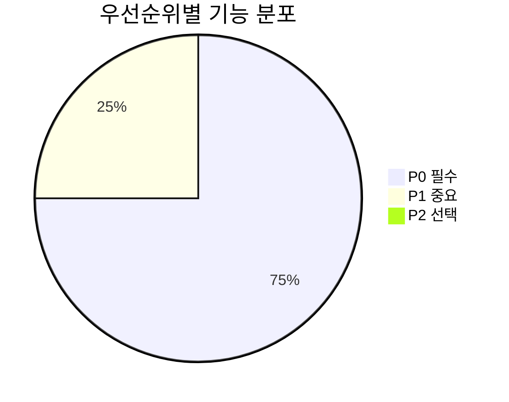
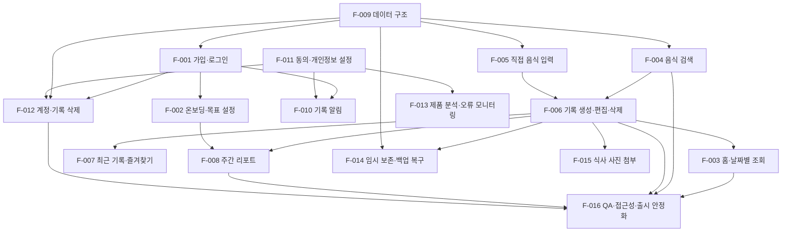
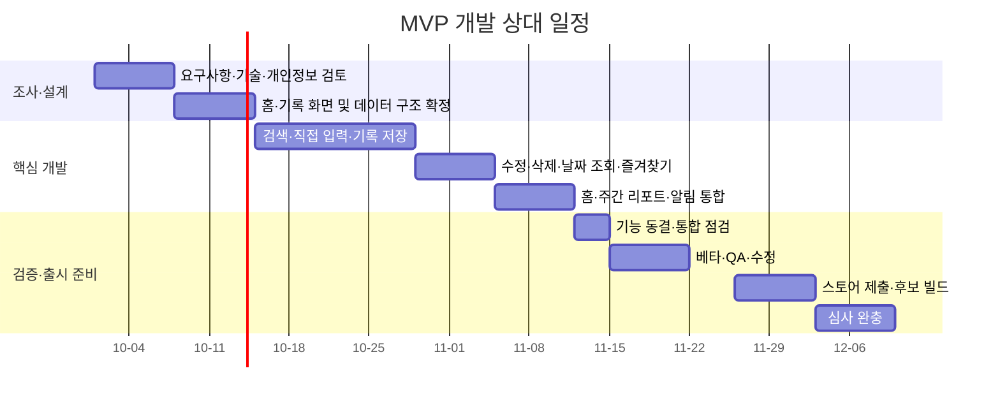

## 1. 문서 정보

- **문서 버전**: v1.0
- **작성일**: 2026-10-01
- **작성자**: 기획팀
- **문서 상태**: 검토 중

**작성 기준**: 회의에서 합의된 내용과 미확정·상충 내용을 구분했습니다. 공수는 회의에서 확정된 값이 아니므로 기능별 **개발 공수 추정치**로 표시했으며, 담당자는 실명이 지정되지 않아 역할 기준으로 작성했습니다.

**변경 이력**

| 버전 | 날짜 | 변경 내용 | 작성자 |
|---|---|---|---|
| v1.0 | 2026-10-01 | 회의 내용을 바탕으로 MVP 기능 목록 및 상세 명세 초안 작성 | 기획팀 |

## 2. 기능 개요

| 항목 | 내용 |
|---|---|
| **총 기능 수** | 16개 |
| **우선순위 분류** | P0(필수): 12개, P1(중요): 4개, P2(선택): 0개 |
| **총 예상 공수** | 98인일, 약 4.9인월 |
| **개발 기간** | 8주 목표, 스토어 심사 변수를 고려한 9주 차 완충 |
| **담당 팀** | 앱 프론트엔드, 백엔드, 디자인, 기획·QA |
| **개발 전제** | iOS·안드로이드 공통 앱, React Native 사용 방향. 개발 지원 인력 배정은 확인 필요 |
| **공수 산정 기준** | 개발 역할별 합산 공수 추정. 디자인, 기획, 법무·보안 검토 및 외부 업체 협의 공수는 별도 산정 필요 |

**우선순위 정의**

- **P0(필수)**: 식사 기록, 기록 확인, 기본 주간 리포트와 개인정보·삭제 흐름 등 MVP의 핵심 이용 경험에 필요한 기능
- **P1(중요)**: 사용성 또는 운영 안정성을 높이지만, 일정 압박 시 범위·구현 수준을 조정할 수 있는 기능
- **P2(선택)**: 이번 기능 목록에서는 확정된 P2 기능을 두지 않음. 미확정 기능은 P2로 확정하지 않고 별도 확인 항목으로 관리

**기능 분포**

## 3. 기능 목록

### 3.1 기능 요약

| 기능 ID | 기능명 | 우선순위 | 개발 공수 추정 | 담당 역할 | 선행 기능 | 목표 일정 | 위험도 |
|---|---|---:|---:|---|---|---|---|
| F-001 | 가입·로그인 및 계정 연결 | P0 | 8인일 | 앱 프론트엔드, 백엔드, 디자인 | 데이터 구조 초안 | 1~3주 차 | 높음 |
| F-002 | 온보딩·선택적 목표 설정 | P0 | 4인일 | 앱 프론트엔드, 디자인, 백엔드 | F-001, F-009 | 1~3주 차 | 높음 |
| F-003 | 오늘 홈·날짜별 기록 조회 | P0 | 5인일 | 앱 프론트엔드, 백엔드, 디자인 | F-006, F-009 | 2~4주 차 | 중간 |
| F-004 | 음식 검색·검색 결과 제공 | P0 | 8인일 | 앱 프론트엔드, 백엔드, 디자인 | F-009, 식품 데이터 공급처 결정 | 1~5주 차 | 높음 |
| F-005 | 직접 음식 입력·개인 음식 관리 | P0 | 4인일 | 앱 프론트엔드, 백엔드, 디자인 | F-009 | 3~5주 차 | 중간 |
| F-006 | 식사 기록 생성·편집·삭제 | P0 | 8인일 | 앱 프론트엔드, 백엔드, 디자인 | F-004, F-005, F-009 | 3~5주 차 | 높음 |
| F-007 | 최근 기록·즐겨찾기 | P0 | 4인일 | 앱 프론트엔드, 백엔드, 디자인 | F-005, F-006, F-009 | 4~5주 차 | 중간 |
| F-008 | 주간 리포트 | P0 | 8인일 | 앱 프론트엔드, 백엔드, 디자인 | F-006, F-009 | 5~6주 차 | 높음 |
| F-009 | 기록·음식·목표 데이터 기반 구조 | P0 | 8인일 | 백엔드, 앱 프론트엔드 | 로그인 방식 검토, 식품 API 조사 | 1~3주 차 | 높음 |
| F-010 | 선택형 기록 알림·푸시 설정 | P0 | 6인일 | 앱 프론트엔드, 백엔드, 디자인 | F-001, F-011 | 4~6주 차 | 중간 |
| F-011 | 약관·동의·개인정보 설정 | P0 | 6인일 | 앱 프론트엔드, 백엔드, 디자인, 기획 | 개인정보 흐름 검토 | 1~6주 차 | 높음 |
| F-012 | 계정 삭제·기록 삭제 요청 | P0 | 7인일 | 앱 프론트엔드, 백엔드, 디자인 | F-001, F-009, F-011 | 4~6주 차 | 높음 |
| F-013 | 선택적 제품 분석·오류 모니터링 | P1 | 4인일 | 앱 프론트엔드, 백엔드 | F-011, 핵심 기능 이벤트 정의 | 4~7주 차 | 중간 |
| F-014 | 저장 실패 방지·임시 보존·백업 복구 | P0 | 5인일 | 앱 프론트엔드, 백엔드 | F-006, F-009 | 3~7주 차 | 높음 |
| F-015 | 식사 사진 한 장 첨부 | P1 | 6인일 | 앱 프론트엔드, 백엔드, 디자인 | F-006, 스토리지·삭제 정책 검토 | 4~6주 차 | 높음 |
| F-016 | QA·접근성·출시 안정화 | P0 | 8인일 | 기획·QA, 앱 프론트엔드, 백엔드, 디자인 | 핵심 기능 통합 | 6~8주 차 | 높음 |

> **기능 수 산정 기준**: 기능별로 독립적인 개발·검증 단위를 부여해 16개로 정의했습니다. 이는 회의에서 기능 수를 확정한 것이 아니라, 요구사항 추적과 일정 관리를 위한 문서상 분류입니다.

### 3.2 기능별 상세 명세

#### F-001: 가입·로그인 및 계정 연결

| 항목 | 내용 |
|---|---|
| **설명** | 사용자가 인증 후 개인 기록을 이용할 수 있도록 계정을 생성·인증하고, 계정별 데이터를 분리합니다. |
| **우선순위** | P0 (필수) |
| **상태** | 로그인 방식 미확정. 이메일·Apple·Google을 우선 검토하며, 게스트 방식과 계정 병합 여부도 확인 필요 |
| **공수** | 총 8인일 추정: 백엔드 4인일, 앱 프론트엔드 3인일, 디자인 1인일 |
| **담당자** | 백엔드 담당, 앱 프론트엔드 담당, 디자이너 |
| **의존성** | F-009 데이터 구조 |
| **목표 일정** | 1~3주 차. 인증 제공자 범위는 다음 주 화요일까지 동결 목표 |
| **위험도** | 높음. 제공자별 구현·계정 연결·탈퇴 처리 및 iOS 심사 조건 확인 필요 |

**요구사항**

- 이메일·Apple·Google 인증을 우선 검토합니다. 카카오 로그인은 1차 우선순위에서 제외하는 방향이나, 최종 제공자 범위는 미확정입니다.
- 게스트 시작 여부, 게스트 데이터 저장 위치, 앱 삭제 시 처리, 이후 계정 연결·병합 방식을 확정해야 합니다.
- 원문 비밀번호를 저장하지 않습니다. 인증 제공자 또는 안전한 인증 구조를 사용합니다.
- 사용자 계정과 식사 기록은 사용자별로 분리합니다.
- 인증 방식 결정이 지연될 경우 로그인 제공자 수나 게스트 범위를 조정하는 대안을 검토합니다.

**완료 기준**

- 사용자가 선택된 인증 방식으로 가입 또는 로그인할 수 있습니다.
- 인증 실패 시 앱 내에서 재시도하거나 문의 경로를 찾을 수 있습니다.
- 서로 다른 사용자의 음식·기록 데이터가 섞이지 않습니다.
- 가입·인증 제공자 범위가 확정되기 전까지 해당 범위는 개발 확정 요구사항으로 간주하지 않습니다.

#### F-002: 온보딩·선택적 목표 설정

| 항목 | 내용 |
|---|---|
| **설명** | 앱의 기록 방식을 안내하고, 사용자가 목표 없이 시작하거나 선택적으로 목표 설정 흐름을 이용할 수 있게 합니다. |
| **우선순위** | P0 (필수) |
| **공수** | 총 4인일 추정: 앱 프론트엔드 2인일, 디자인 2인일 |
| **담당자** | 앱 프론트엔드 담당, 디자이너, 기획 담당 |
| **의존성** | F-001, F-009 |
| **목표 일정** | 1~3주 차 |
| **위험도** | 높음. 자동 목표 산출 및 직접 입력의 안전 기준 미확정 |

**요구사항**

- 목표 유형 선택 화면은 ‘식사 습관 확인’, ‘체중 목표 설정’, ‘목표 없이 기록’의 선택지를 유사한 위계로 제공합니다.
- 키·체중·나이·성별 등 신체 정보 입력은 앱 시작의 필수 조건으로 두지 않습니다.
- 자동 권장 칼로리는 전문가 검토 및 안전 기준 확인 전에는 임의의 수치로 노출하지 않습니다.
- 목표가 없어도 음식 검색, 기록, 기록 기반 리포트를 이용할 수 있습니다.
- 목표 수치 입력 가능 여부와 위험하게 낮은 목표를 차단할 기준은 미정이며, 확인 후 범위를 확정합니다.
- 목표 화면과 리포트의 건강 관련 문구는 전문가 의견 확인 전까지 변경 가능 상태로 관리합니다.

**완료 기준**

- 사용자가 목표 설정을 건너뛰고 기록 기능으로 이동할 수 있습니다.
- 목표 미설정 상태에서 칼로리 목표 게이지나 목표 비교가 노출되지 않습니다.
- 신체 정보를 입력받는 경우 수집 이유를 안내하고 수정·삭제가 가능해야 합니다.

#### F-003: 오늘 홈·날짜별 기록 조회

| 항목 | 내용 |
|---|---|
| **설명** | 사용자가 오늘의 기록 상태와 식사별 기록 항목을 확인하고, 기록을 시작하거나 과거 기록을 조회할 수 있게 합니다. |
| **우선순위** | P0 (필수) |
| **공수** | 총 5인일 추정: 앱 프론트엔드 3인일, 백엔드 1인일, 디자인 1인일 |
| **담당자** | 앱 프론트엔드 담당, 백엔드 담당, 디자이너 |
| **의존성** | F-006, F-009 |
| **목표 일정** | 2~4주 차 |
| **위험도** | 중간. 날짜 변경·현지 날짜 처리와 홈 집계 규칙에 영향 |

**요구사항**

- 홈은 기록하기와 오늘의 기록 상태를 우선 노출하고, 칼로리·영양 정보는 보조로 제공합니다.
- 목표가 없는 사용자에게 칼로리 게이지를 표시하지 않습니다.
- 식사 구분은 아침·점심·저녁·간식 네 가지로 고정합니다.
- 각 식사 구분 아래 음식 항목과 해당 구분의 합계를 표시합니다.
- 과거 날짜 조회 및 기록은 허용합니다. 날짜 탐색 화면의 최근 7일 제한 여부와 오래된 날짜 선택 방식은 최종 화면 정책 확인이 필요합니다.
- 미래 날짜 기록은 허용하지 않는 방향으로 설계합니다.
- 날짜 변경 후 앱으로 돌아오거나 날짜가 바뀐 경우 화면 데이터를 다시 불러옵니다.
- 기록이 없는 날짜는 0칼로리로 오해되지 않도록 빈 상태로 표시합니다.

#### F-004: 음식 검색·검색 결과 제공

| 항목 | 내용 |
|---|---|
| **설명** | 외부 식품 데이터 또는 내부 데이터에서 음식을 검색하고, 결과가 없어도 직접 입력이나 최근 기록으로 기록을 이어가게 합니다. |
| **우선순위** | P0 (필수) |
| **공수** | 총 8인일 추정: 백엔드 4인일, 앱 프론트엔드 3인일, 디자인 1인일 |
| **담당자** | 백엔드 담당, 앱 프론트엔드 담당, 디자이너 |
| **의존성** | F-009, 식품 데이터 공급처·계약 조건 확인 |
| **목표 일정** | 1~5주 차. 1주 차 금요일까지 샘플·계약 조건 확인 목표, 2주 차 화요일까지 공급처 미정이면 일정 위험으로 상향 |
| **위험도** | 높음. 국내 음식·브랜드 커버리지, 라이선스, 비용, 검색어 처리 조건이 미확정 |

**요구사항**

- 음식명 검색은 한 글자 입력도 허용하는 방향으로 진행합니다. 입력 후 약 350밀리초 대기하는 검색 지연 적용은 제안 상태이며, 공급자 호출 제한 및 캐시 조건 확인이 필요합니다.
- 최근 음식과 캐시 결과를 활용할 수 있도록 설계합니다.
- 검색어는 외부 공급자에게 전달될 수 있으므로 공급자의 보관·처리 조건 및 개인정보 고지 내용을 출시 전에 확인합니다.
- 외부 식품 API에는 검색어만 전달하고 사용자 식별 정보, 기록 날짜, 식사 기록은 전달하지 않습니다.
- 검색 결과는 내부 표준 모델로 변환하고, 앱이 외부 공급자 응답 형식에 직접 종속되지 않도록 합니다.
- 공백 정규화와 자주 쓰는 동의어 20~30개 매핑을 검토합니다.
- 검색 결과에는 음식명, 제공량, 확인 가능한 영양 정보와 출처를 표시합니다. 제공량이나 출처가 없으면 임의의 기본 단위를 만들지 않습니다.
- 결과 없음과 API 오류를 서로 다른 상태로 표현합니다.
- 결과가 없거나 검색 요청이 실패해도 직접 입력으로 이동할 수 있어야 하며, 유사하다는 이유만으로 결과를 자동 선택하지 않습니다.
- 대표 메뉴 50개와 브랜드 상품 20개 검색 시험 자료를 마련하고, 미발견·오매칭·검색 정확도를 확인합니다.

#### F-005: 직접 음식 입력·개인 음식 관리

| 항목 | 내용 |
|---|---|
| **설명** | 검색 결과가 없거나 영양 정보를 모르는 경우에도 음식명을 기록하고, 입력한 음식이 다른 사용자에게 노출되지 않도록 합니다. |
| **우선순위** | P0 (필수) |
| **공수** | 총 4인일 추정: 앱 프론트엔드 2인일, 백엔드 1인일, 디자인 1인일 |
| **담당자** | 앱 프론트엔드 담당, 백엔드 담당, 디자이너 |
| **의존성** | F-009 |
| **목표 일정** | 3~5주 차 |
| **위험도** | 중간. 입력 음식의 공용·개인 노출 구분과 영양값 결측 처리 필요 |

**요구사항**

- 음식명은 필수로 받고, 칼로리·탄수화물·단백질·지방은 선택 입력으로 처리합니다.
- 영양 정보를 모르는 음식도 저장할 수 있어야 합니다.
- 값이 실제 0인 상태와 값이 입력되지 않은 상태를 구분합니다.
- 직접 입력 음식의 영양 정보가 없는 경우 해당 영양소 합계 계산에서 제외합니다. 기록 자체는 유지합니다.
- 기록에 일부 영양 정보가 포함되지 않았음을 리포트에서 안내합니다.
- 개인 입력 음식은 기본적으로 해당 사용자에게만 표시합니다.
- 공용 음식 데이터로 전환하려면 별도의 동의 절차가 필요합니다.
- 음식 입력 메모는 MVP에서 제외합니다.

#### F-006: 식사 기록 생성·편집·삭제

| 항목 | 내용 |
|---|---|
| **설명** | 음식 항목을 식사 구분과 날짜에 기록하고, 기록 당시의 음식명·양·영양값을 보존하며 수정·삭제할 수 있게 합니다. |
| **우선순위** | P0 (필수) |
| **공수** | 총 8인일 추정: 백엔드 4인일, 앱 프론트엔드 3인일, 디자인 1인일 |
| **담당자** | 백엔드 담당, 앱 프론트엔드 담당, 디자이너 |
| **의존성** | F-004, F-005, F-009 |
| **목표 일정** | 3~5주 차 |
| **위험도** | 높음. 중복 저장, 날짜 처리, 영양값 스냅샷, 네트워크 실패 대응 필요 |

**요구사항**

- 한 식사 구분에 여러 음식 항목을 추가할 수 있습니다.
- 항목은 추가할 때마다 저장합니다. 별도의 시간대별 식사 묶음은 MVP에서 사용하지 않습니다.
- 같은 날짜와 식사 구분의 항목을 묶어 합산해 보여줍니다.
- 식사 구분은 아침·점심·저녁·간식으로 고정하며, 시간에 따른 구분은 추천에만 사용합니다. 사용자는 저장 전에 변경할 수 있어야 합니다.
- 기록 추가 시 현재 사용자 날짜를 기본값으로 사용하고, 과거 날짜 입력을 허용합니다. 미래 날짜 입력은 막는 방향입니다.
- 기록 생성 시각과 실제 섭취 날짜를 분리합니다. 리포트는 섭취 날짜 기준으로 집계합니다.
- 음식명과 영양값은 기록 시점의 스냅샷으로 보존합니다. 외부 음식 데이터 변경으로 과거 기록이나 리포트가 자동 변경되지 않아야 합니다.
- 검색 데이터에 기준 제공량이 있으면 표시하고 양을 배수로 조절합니다. 직접 입력 음식은 1회분을 기본으로 합니다.
- 그램 환산과 자유 형식 단위 입력은 MVP에서 제외합니다.
- 기록 수정과 개별 삭제를 지원합니다. 계정을 유지한 채 기록 전체를 초기화하는 기능은 필수 범위에서 제외합니다.
- 식사 기록은 사진 업로드 여부와 독립적으로 저장되어야 합니다.

#### F-007: 최근 기록·즐겨찾기

| 항목 | 내용 |
|---|---|
| **설명** | 최근 기록 또는 즐겨찾기한 음식을 다시 선택해 반복 입력 부담을 낮춥니다. |
| **우선순위** | P0 (필수) |
| **공수** | 총 4인일 추정: 앱 프론트엔드 2인일, 백엔드 1인일, 디자인 1인일 |
| **담당자** | 앱 프론트엔드 담당, 백엔드 담당, 디자이너 |
| **의존성** | F-005, F-006, F-009 |
| **목표 일정** | 4~5주 차 |
| **위험도** | 중간. 사용자 입력 음식과 공용 음식의 권한 분리 필요 |

**요구사항**

- 최근 기록과 즐겨찾기를 음식 추가 흐름에서 확인할 수 있습니다.
- 공용 음식과 사용자 입력 음식 모두 즐겨찾기할 수 있습니다.
- 즐겨찾기는 사용자와 음식의 연결 정보로 관리합니다.
- 최근 기록과 즐겨찾기에서 선택한 뒤 양과 식사 구분을 확인하고 저장할 수 있습니다.
- 사용자의 개인 입력 음식이 다른 사용자에게 노출되지 않아야 합니다.
- ‘인기 메뉴’ 목록은 MVP에서 제공하지 않습니다.

#### F-008: 주간 리포트

| 항목 | 내용 |
|---|---|
| **설명** | 완료된 한 주의 기록 일수, 기록된 날의 영양 평균 및 끼니 기록 패턴을 중립적으로 보여줍니다. |
| **우선순위** | P0 (필수) |
| **공수** | 총 8인일 추정: 백엔드 4인일, 앱 프론트엔드 3인일, 디자인 1인일 |
| **담당자** | 백엔드 담당, 앱 프론트엔드 담당, 디자이너 |
| **의존성** | F-006, F-009, F-002 |
| **목표 일정** | 5~6주 차 |
| **위험도** | 높음. 기록 결측, 목표 이력, 집계 기준과 비교 문구에 따른 오해 가능성 |

**요구사항**

- 주간 리포트는 한국 시간 기준 월요일부터 일요일까지의 완료된 주를 ‘지난주’로 표시합니다. 현재 주간 현황은 홈에서 확인하는 방향입니다.
- 지난 7일 중 기록한 날짜 수를 표시합니다.
- 칼로리 평균은 기록이 있는 날짜만을 기준으로 계산하며, 이를 화면에 명시합니다.
- 기본 영양소는 칼로리·탄수화물·단백질·지방입니다. 영양소별로 해당 값이 있는 항목만 따로 합산합니다.
- 영양 정보가 없는 항목은 해당 영양소의 합계에서 제외하되, 기록 자체에는 포함합니다.
- 영양 정보 누락 안내 문구는 다음과 같이 표시합니다: **“일부 음식 정보가 없어 영양소별 합계가 다를 수 있어요.”**
- 기록이 없는 날은 0으로 표시하지 않고 빈칸이나 점선 등으로 구분합니다.
- 가장 자주 기록한 식사 시간대 또는 끼니별 기록 패턴을 제공합니다.
- 목표 비교는 목표가 설정된 경우에만 제공합니다. 목표가 없던 과거 날짜에는 비교하지 않습니다.
- 목표 변경 이력을 적용하여 식사 날짜 당시 유효한 목표를 기준으로 비교합니다.
- 건강 점수, 좋음·나쁨 평가, 실패를 암시하는 문구, 직접적인 식품 추천은 제공하지 않습니다.
- 리포트는 사용자가 열 때 서버에서 계산합니다. 수정·삭제 후 다시 열 때 최신 기록으로 갱신합니다. 성능 확인 뒤 캐시 적용 여부를 검토합니다.
- 지난주 비교는 데이터가 충분한 경우에만 보조로 제공합니다. 최소 기록 기준은 미정이며 전문가 검토가 필요합니다.

#### F-009: 기록·음식·목표 데이터 기반 구조

| 항목 | 내용 |
|---|---|
| **설명** | 사용자별 데이터 분리, 영양값 스냅샷, 목표 이력, 날짜 기준 집계를 지원하는 데이터 구조와 API 기반을 마련합니다. |
| **우선순위** | P0 (필수) |
| **공수** | 총 8인일 추정: 백엔드 6인일, 앱 프론트엔드 1인일, 기술·기능 검토 1인일 |
| **담당자** | 백엔드 담당, 앱 프론트엔드 담당, 기획 담당 |
| **의존성** | 인증 방식 및 식품 데이터 공급처 조사 |
| **목표 일정** | 1~3주 차 |
| **위험도** | 높음. 외부 공급자 모델, 계정 방식, 개인정보 보관 정책이 구조에 영향 |

**데이터 모델 초안**

| 데이터 묶음 | 핵심 필드 및 원칙 |
|---|---|
| 사용자 | 내부 사용자 식별값, 인증 제공자 연결 정보, 생성·수정 시각 |
| 프로필 | 선택적 신체 정보, 사용자 시간대. 수집 목적을 안내하고 수정·삭제 가능하게 함 |
| 목표 이력 | 목표 값, 유효 시작일·종료일. 변경 목표를 과거 기록에 소급 적용하지 않음 |
| 음식 마스터 | 내부 음식 식별값, 공급자 식별값, 표시 이름, 브랜드, 영양 정보, 기준 제공량, 출처 |
| 식사 기록 | 사용자, 기록 생성 시각, 섭취 날짜, 현지 날짜, 식사 구분 |
| 식사 음식 항목 | 기록 당시 음식명·영양값 스냅샷, 섭취 배수, 표시 단위, 데이터 출처 |
| 즐겨찾기 | 사용자와 음식 식별값의 연결 |
| 알림 설정 | 알림 선택 여부, 시간, 운영체제 권한 상태 |
| 동의 이력 | 약관·개인정보 처리·제품 분석·알림 동의의 구분과 동의 시각 |
| 삭제 요청 | 요청 상태, 요청 시각, 계정·기록 삭제 처리 상태 |

**기술·데이터 처리 요구사항**

- 외부 음식 데이터는 내부 표준 모델로 변환하고 공급자 어댑터를 둡니다.
- 음식 마스터의 최신 정보와 기록 당시 스냅샷을 분리합니다.
- 데이터베이스에는 UTC 시각을 저장하고 사용자 시간대 및 기록 당시 현지 날짜를 함께 고려합니다.
- 시간대 변경으로 과거 식사 날짜를 자동 재계산하지 않습니다.
- 개인 입력 음식은 기본적으로 사용자별로 분리합니다.
- 주소록과 위치 정보는 수집하지 않습니다.
- 원문 비밀번호, 음식명·자유 메모 등 민감한 기록 내용을 오류 로그에 남기지 않습니다.
- 탈퇴 시 사용자와 연결된 기록을 삭제하는 흐름을 지원합니다. 백업의 완전 삭제 시점과 보관 기간은 별도 정책 확인이 필요합니다.

#### F-010: 선택형 기록 알림·푸시 설정

| 항목 | 내용 |
|---|---|
| **설명** | 사용자가 명시적으로 선택한 경우에만 설정 시간에 하루 최대 한 번 기록 알림을 보냅니다. |
| **우선순위** | P0 (필수) |
| **공수** | 총 6인일 추정: 백엔드 3인일, 앱 프론트엔드 2인일, 디자인 1인일 |
| **담당자** | 백엔드 담당, 앱 프론트엔드 담당, 디자이너 |
| **의존성** | F-001, F-011 |
| **목표 일정** | 4~6주 차 |
| **위험도** | 중간. 운영체제 권한과 앱 내 설정 상태의 동기화 필요 |

**요구사항**

- 알림 기본값은 꺼짐입니다. 약관 동의와 알림 동의는 분리합니다.
- 사용자가 앱 안에서 기록 알림을 선택한 경우에만 활성화합니다.
- 기본 시간은 저녁 8시로 제안됐으나, 사용자가 직접 시간을 선택하는 범위와 방식은 확인이 필요합니다.
- 해당 날짜에 식사 기록이 한 건 이상 있으면 알림을 보내지 않습니다.
- 하루 최대 한 번 보냅니다.
- 첫 실행 직후 운영체제 권한을 요청하지 않습니다. 첫 기록 완료 후 인라인 안내를 제공하고, 사용자가 선택하면 권한을 요청합니다.
- 권한이 거부되면 앱 내 설정 상태를 허용된 것처럼 표시하지 않습니다. 필요한 경우 운영체제 설정으로 이동하도록 안내합니다.
- 푸시 내용에는 음식명·칼로리·체중 등 개인 정보를 포함하지 않습니다.
- 주간 리포트 푸시 알림은 첫 버전에서 제외하는 방향이 회의에서 반복됐으나, 일부 논의에는 별도 선택형 주간 알림 포함 내용도 있습니다. **출시 범위 확정 필요**입니다.
- 알림을 켜지 않아도 앱 이용과 리포트 열람이 가능합니다.

#### F-011: 약관·동의·개인정보 설정

| 항목 | 내용 |
|---|---|
| **설명** | 이용약관, 개인정보 처리 동의, 선택적 제품 분석 및 푸시 동의를 구분하고 사용자가 설정을 관리할 수 있게 합니다. |
| **우선순위** | P0 (필수) |
| **공수** | 총 6인일 추정: 앱 프론트엔드 2인일, 백엔드 1인일, 디자인 1인일, 기획·검토 2인일 |
| **담당자** | 앱 프론트엔드 담당, 백엔드 담당, 디자이너, 기획 담당 |
| **의존성** | 개인정보 흐름 및 외부 업체 처리 조건 확인 |
| **목표 일정** | 1~6주 차, 개인정보 검토는 개발과 병행 |
| **위험도** | 높음. 외부 식품 API·분석·푸시 업체의 처리 위치와 계약 조건 미확정 |

**요구사항**

- 이용약관, 개인정보 처리 동의, 푸시 수신 동의를 구분합니다.
- 마케팅 알림 동의와 광고 SDK는 MVP에 포함하지 않습니다.
- 선택 동의는 기본 해제 상태로 제공합니다.
- 제품 분석은 사용자가 거부할 수 있게 하고, 거부해도 핵심 기능이 정상 동작해야 합니다.
- 외부 식품 API에 검색어가 전달될 수 있음을 처리 흐름 및 개인정보 안내에 반영해야 합니다.
- 외부 공급자에게 사용자 ID, 이메일, 기록 날짜, 식사 기록을 보내지 않습니다.
- 외부 업체의 데이터 보관·처리 위치, 국외 이전 여부, 식품 정보 재표시·캐시·라이선스 조건을 출시 전에 확인합니다.
- 푸시 토큰, 분석 식별자, 서버 접근 로그 등의 수집 목적과 보관 기간은 개인정보 담당자 확인이 필요합니다.
- 개인정보 처리방침에는 수집 항목과 목적, 보관 기간, 삭제, 위탁 업체 등 확인된 정보를 반영합니다.

#### F-012: 계정 삭제·기록 삭제 요청

| 항목 | 내용 |
|---|---|
| **설명** | 사용자가 앱 안에서 계정 삭제를 요청하고, 계정과 연관된 기록을 삭제하도록 합니다. |
| **우선순위** | P0 (필수) |
| **공수** | 총 7인일 추정: 백엔드 4인일, 앱 프론트엔드 2인일, 디자인·기획 1인일 |
| **담당자** | 백엔드 담당, 앱 프론트엔드 담당, 디자이너, 기획 담당 |
| **의존성** | F-001, F-009, F-011 |
| **목표 일정** | 4~6주 차 |
| **위험도** | 높음. 삭제 처리 시간, 백업 보존 기간, 법적 보관 의무 미확정 |

**요구사항**

- 앱 안에서 계정 삭제를 요청할 수 있어야 합니다.
- 삭제 전 삭제 대상과 처리 방식을 안내하고 확인 단계를 둡니다.
- 탈퇴 시 사용자 계정과 연관 기록을 함께 삭제하는 것을 기본으로 합니다.
- 계정 삭제 요청 이후 로그인 및 푸시 토큰을 비활성화하는 흐름을 검토합니다.
- 식사 기록 삭제와 계정 삭제는 구분합니다.
- 개별 기록 삭제는 F-006에 포함합니다.
- 계정을 유지하면서 기록 전체를 초기화하는 기능은 MVP 필수에서 제외하고, 난이도 산정 후 추가할 후보로 둡니다.
- 백업에서의 완전 삭제 시점, 삭제 완료 안내 시점, 운영 로그 보관, 법적 보관 의무는 정책 확정 전까지 미정으로 둡니다.
- 장기 미사용 계정 자동 삭제는 정책 확정 전까지 구현하지 않습니다.

#### F-013: 선택적 제품 분석·오류 모니터링

| 항목 | 내용 |
|---|---|
| **설명** | 핵심 이용 흐름을 이해하는 최소 행동 이벤트와 서비스 장애 진단 정보를 분리해 수집합니다. |
| **우선순위** | P1 (중요) |
| **공수** | 총 4인일 추정: 백엔드 1인일, 앱 프론트엔드 2인일, 기획·검토 1인일 |
| **담당자** | 앱 프론트엔드 담당, 백엔드 담당, 기획 담당 |
| **의존성** | F-011, 이벤트 항목 정의 |
| **목표 일정** | 4~7주 차 |
| **위험도** | 중간. SDK 처리 위치, 옵트아웃 및 서비스 로그 구분 확인 필요 |

**요구사항**

- 제품 분석 이벤트 후보는 가입 완료, 목표 설정 여부, 첫 기록 완료, 검색 실행·결과 유무, 직접 입력, 리포트 열람, 푸시 선택 등입니다.
- 음식명, 칼로리, 체중, 이메일, 자유 입력 메모를 분석 도구로 전송하지 않습니다.
- 검색어 자체를 분석 이벤트에 저장하지 않고 검색 결과 유무 등 최소 정보만 사용합니다.
- 내부 사용자 식별값은 가명 처리하고 로그인 정보를 분석 도구에 직접 전달하지 않습니다.
- 제품 분석 동의를 거부해도 앱 기능이 제한되지 않습니다.
- 보안·장애 대응 로그는 제품 분석과 구분하며, 필요한 진단 정보만 수집합니다.
- 오류 모니터링 정보는 플랫폼, 앱 버전, 오류 코드, 요청 ID 등으로 제한합니다.
- 오류 로그에 음식명이나 자유 메모가 자동 첨부되지 않도록 설정합니다.
- 제품 분석·오류 모니터링 도구의 데이터 처리 위치와 보관 조건을 확인합니다.

#### F-014: 저장 실패 방지·임시 보존·백업 복구

| 항목 | 내용 |
|---|---|
| **설명** | 네트워크 오류 시 입력값 유실과 중복 저장을 방지하고, 출시 전 데이터 백업 복구를 검증합니다. |
| **우선순위** | P0 (필수) |
| **공수** | 총 5인일 추정: 백엔드 3인일, 앱 프론트엔드 2인일 |
| **담당자** | 백엔드 담당, 앱 프론트엔드 담당 |
| **의존성** | F-006, F-009 |
| **목표 일정** | 3~7주 차. 복구 시험은 출시 전 |
| **위험도** | 높음. 완전 오프라인 동기화는 범위에서 제외하고 임시 보존 수준을 확정해야 함 |

**요구사항**

- 완전한 오프라인 검색·동기화는 MVP에서 제외합니다.
- 입력 도중 통신이 끊겨도 작성 내용이 사라지지 않도록 임시 보존 가능성을 검토합니다.
- 저장 중·저장 완료·저장 실패 상태를 사용자에게 구분해 보여줍니다.
- 저장 실패 시 입력값을 유지하고 재시도 안내를 제공합니다.
- 재전송에 요청 ID를 사용해 중복 기록 생성을 방지합니다.
- 오프라인 상태에서 최근 음식은 활용할 수 있는 방향으로 설계합니다. 새 검색은 연결 복구 전까지 제한될 수 있습니다.
- 자동 백업, 백업 암호화 및 접근 권한 관리가 필요합니다.
- 출시 전에 최소 한 번 백업 복구 시험을 실시합니다.
- 서버 오류율, 응답 시간, 저장 실패율을 모니터링하며 민감한 기록 내용은 로그에 남기지 않습니다.
- 외부 API 호출량과 서버 비용에 대한 사용량 알림·제한 방안을 마련합니다. 비용 상한은 API 견적 확인 후 재검토하며, 회의에서 언급된 월 30만 원은 확정 한도가 아닙니다.

#### F-015: 식사 사진 한 장 첨부

| 항목 | 내용 |
|---|---|
| **설명** | 식사 기록에 사진 한 장을 보조 정보로 첨부하고 다시 확인할 수 있도록 합니다. |
| **우선순위** | P1 (중요) |
| **공수** | 총 6인일 추정: 백엔드 3인일, 앱 프론트엔드 2인일, 디자인 1인일 |
| **담당자** | 백엔드 담당, 앱 프론트엔드 담당, 디자이너 |
| **의존성** | F-006, 스토리지·파일 보관·삭제 정책 확인 |
| **목표 일정** | 4~6주 차. 검색 API와 기본 기록 이후 5주 차까지 여건이 되는 경우 통합 |
| **위험도** | 높음. 회의 내 포함·제외 결정이 상충하며 스토리지 비용과 삭제 정책도 확인 필요 |

**요구사항**

- 자동 사진 인식은 MVP 필수 기능에 포함하지 않습니다.
- 사진 첨부는 사진 자동 분석과 별개의 기능입니다.
- 후반부 논의에서는 식사당 한 장 첨부를 포함하기로 했으나, 회의 내 다른 결정에는 사진 첨부 제외도 명시되어 있습니다. 따라서 **출시 포함 여부는 최종 확인이 필요**합니다.
- 포함하기로 확정하는 경우, 식사 기록을 먼저 저장하고 사진 업로드는 별도로 처리합니다.
- 사진 업로드 실패가 식사 기록 저장을 막아서는 안 됩니다.
- 사진 원본은 별도 저장소에 보관하고 데이터베이스에는 파일 식별값만 저장하는 방향입니다.
- 외부 사진 분석 서비스로 사진을 전달하지 않는 방향입니다.
- EXIF 제거, 비공개 접근, 파일 삭제 시점, 용량 제한, 업로드 재시도 방식은 기술·개인정보 검토가 필요합니다.
- 여러 장 첨부와 사진 자동 분석은 MVP 범위에서 제외합니다.

#### F-016: QA·접근성·출시 안정화

| 항목 | 내용 |
|---|---|
| **설명** | 핵심 기록 흐름, 오류 상태, 기기별 화면, 개인정보·삭제, 접근성 및 출시 전 운영 준비를 검증합니다. |
| **우선순위** | P0 (필수) |
| **공수** | 총 8인일 추정: 기획·QA 3인일, 앱 프론트엔드 2인일, 백엔드 2인일, 디자인 1인일 |
| **담당자** | 기획·QA 담당, 앱 프론트엔드 담당, 백엔드 담당, 디자이너 |
| **의존성** | 주요 기능 통합 |
| **목표 일정** | 기능 동결은 6주 차 초 목표, 베타·QA는 6~8주 차, 7주 차 말 스토어 제출 목표 |
| **위험도** | 높음. 전담 QA 부재, 개발 지원 인력과 스토어 심사 일정 미확정 |

**검증 범위**

- 음식 검색의 한글 띄어쓰기, 브랜드 이름 일부 검색, 결과 없음, API 오류
- 직접 입력, 영양 정보 누락, 양 조절 및 기록 저장
- 기록 생성·수정·삭제, 날짜 변경, 미래 날짜 입력 차단
- 중복 저장 방지, 네트워크 오류 시 입력값 보존·재시도
- 앱을 다시 열거나 날짜가 바뀐 뒤 홈과 리포트가 갱신되는지 확인
- 계정 삭제와 사용자별 데이터 분리
- 푸시 설정 변경·권한 거부·알림 해제
- 백업 복구 시험
- iOS·안드로이드 기기별 화면 확인. 구체적인 지원 OS 버전은 사용 범위 근거 확인 후 확정
- 색상만으로 상태를 구분하지 않기, 시스템 글자 크기에서 주요 화면이 깨지지 않기, 버튼에 읽을 수 있는 이름 제공

**테스트 운영 방향**

- 프로토타입 테스트: 5~6명, 가상 식단 사용, 실제 개인정보 입력 없이 진행하는 안
- 베타 테스트: 사내 인원과 외부 참가자 등 약 20~30명 규모가 후반 논의에서 제시됨. 별도 논의에는 사내 10명·외부 10명 수준의 안도 있으므로 참가자 수는 최종 확정 필요
- 실제 기록을 받는 경우 목적·수집 항목·보관 기간·삭제 방법을 안내하고 별도 동의를 받습니다.
- 테스트 계정은 일반 서비스 분석과 분리하거나 별도 표시합니다.
- 베타 지표는 첫 기록 완료율, 기록 소요 시간, 주간 기록 일수, 검색 실패 후 이탈, 직접 입력 비율, 리포트 열람률 등을 기준선 확인 목적으로 봅니다.
- 첫 실행 후 2분 이내 첫 기록 완료 비율 75% 이상은 검증 가설이며, 확정 성능 목표가 아닙니다.
- 베타 품질 기준으로 제안된 기록 흐름 완료율 95% 이상, 치명적 데이터 유실 0건, 크래시 없는 세션 99% 이상은 제안 수치입니다. 표본과 시험 결과를 보고 확정해야 합니다.
- 검색 응답 대부분 2초 이내, 3초 이상 지연 시 재시도 안내는 검증 대상 목표입니다.

## 4. 기능 상세 명세

### 4.1 공통 사용자 흐름

1. 사용자는 선택된 인증 방식으로 가입하거나 로그인합니다. 인증 제공자 범위는 미정입니다.
2. 온보딩에서 목표 없이 시작하거나 선택적으로 목표 설정을 진행합니다.
3. 홈에서 오늘 날짜와 기록 상태를 확인합니다.
4. 음식 검색, 최근 기록, 즐겨찾기 또는 직접 입력으로 음식을 선택합니다.
5. 식사 구분과 양을 확인하고 저장합니다.
6. 기록은 항목별로 저장되며, 같은 날짜·식사 구분의 항목을 합산해 보여줍니다.
7. 사용자는 기록을 수정하거나 삭제할 수 있습니다.
8. 주간 리포트에서 완료된 지난주 기록 일수, 기록한 날 기준 영양 정보, 끼니 패턴을 확인합니다.
9. 사용자는 설정에서 알림과 개인정보 동의를 관리하거나 계정 삭제를 요청할 수 있습니다.

### 4.2 공통 데이터·화면 상태 규칙

- 영양값이 없는 상태와 실제 값 0을 구분합니다.
- 기록이 없는 날은 0으로 표시하지 않습니다.
- 기록에 필요한 영양값이 일부 누락되어도 기록 자체는 저장합니다.
- 외부 식품 데이터가 바뀌어도 기존 기록의 이름·영양값 스냅샷은 자동 변경하지 않습니다.
- 검색 결과 없음과 네트워크·API 오류를 구분합니다.
- 저장 완료 여부가 불명확한 상태로 화면을 닫지 않습니다.
- 식사 기록 데이터, 제품 분석 이벤트, 장애 진단 로그를 구분합니다.
- 개인정보 처리와 외부 업체 계약 조건이 확인되지 않은 기능은 출시 승인 항목으로 남깁니다.

### 4.3 공통 API 초안

아래 경로와 요청 구조는 회의에서 확정된 API 명세가 아니라 구현 논의를 위한 **초안**입니다. 인증 방식, API 체계, 개인정보·보안 검토 후 확정해야 합니다.

| 기능 | API 초안 | 주요 처리 |
|---|---|---|
| 인증 | 제공자별 인증 경로 미정 | 가입·로그인 및 계정 연결 |
| 음식 검색 | `GET /api/foods/search?q=...` | 검색어 처리, 내부 표준 응답 반환 |
| 개인 음식 생성 | `POST /api/user-foods` | 개인 음식 저장, 사용자별 접근 제한 |
| 기록 조회 | `GET /api/meals?date=...` | 날짜·식사 구분별 기록 조회 |
| 기록 생성 | `POST /api/meals/items` | 음식 항목 저장, 기록 시점 스냅샷 생성 |
| 기록 수정 | `PATCH /api/meals/items/{id}` | 사용자 소유 기록의 수정 |
| 기록 삭제 | `DELETE /api/meals/items/{id}` | 사용자 소유 기록 삭제 |
| 주간 리포트 | `GET /api/reports/weekly?week=...` | 완료된 주의 기록 기반 집계 |
| 알림 설정 | `PUT /api/settings/notifications` | 앱 내 알림 선택과 시간 저장 |
| 계정 삭제 요청 | `POST /api/account/deletion` | 삭제 요청 접수 및 처리 상태 기록 |

**공통 API 원칙**

- 외부 식품 API에는 검색어만 전달하고 사용자 식별값·기록 데이터는 전달하지 않습니다.
- 저장 재시도 시 요청 식별값을 이용해 중복 생성을 방지하는 방안을 적용합니다.
- 식품 API 오류가 기록 생성·수정·조회 기능 전체를 막지 않도록 분리합니다.
- 실제 인증 토큰 방식, 만료 시간, 호출 제한, 응답 시간 목표는 구현·보안 검토 후 확정합니다.

### 4.4 공통 데이터베이스 초안

| 데이터 묶음 | 필수 검토 항목 |
|---|---|
| 사용자·인증 | 인증 제공자, 계정 연결, 사용자별 데이터 분리 |
| 프로필 | 선택 입력값, 수집 목적, 수정·삭제 가능 여부 |
| 목표 이력 | 목표값, 유효 시작일·종료일, 과거 목표 비교 기준 |
| 음식 마스터 | 공급자 식별값, 내부 식별값, 영양값, 단위, 출처, 라이선스 |
| 식사 기록 | 사용자, 생성 시각, 섭취 날짜, 시간대, 식사 구분 |
| 식사 음식 항목 | 기록 당시 이름·영양값, 양, 단위, 영양 정보 출처 |
| 즐겨찾기 | 사용자·음식 연결 및 개인 음식 접근 제한 |
| 알림 설정 | 앱 내 동의 여부, 알림 시간, 운영체제 권한 상태 |
| 동의·삭제 | 동의 구분과 시각, 삭제 요청 상태, 백업 삭제 정책 |
| 사진 파일 정보 | 사진 기능 포함 확정 시 별도 저장소 식별값과 삭제 연결 정보 |

**개발 전에 추가 확정할 항목**

- 목표 값 입력 방식과 안전 기준, 전문가 검토 결과
- 이메일·Apple·Google·게스트 중 최종 로그인 조합
- 음식 데이터 공급자, 상업적 재표시·캐시·검색어 보관 조건
- 사진 첨부 기능의 최종 포함 여부
- 주간 리포트 푸시 포함 여부
- 지원 OS 버전과 기기별 시험 범위
- 기록 탐색 날짜 범위와 과거 날짜 선택 방식
- 계정 삭제 처리 시간, 백업 보존·삭제 기간, 데이터 사본 제공 방식

## 5. 기능 의존 관계

### 5.1 의존 관계도

### 5.2 의존성 테이블

| 기능 ID | 기능명 | 선행 기능 | 주요 후속 기능 |
|---|---|---|---|
| F-001 | 가입·로그인 및 계정 연결 | F-009 | F-002, F-010, F-012 |
| F-002 | 온보딩·선택적 목표 설정 | F-001, F-009 | F-003, F-008 |
| F-003 | 오늘 홈·날짜별 기록 조회 | F-006, F-009 | F-016 |
| F-004 | 음식 검색·검색 결과 제공 | F-009, 공급처 확정 | F-006, F-007, F-016 |
| F-005 | 직접 음식 입력·개인 음식 관리 | F-009 | F-006, F-007, F-016 |
| F-006 | 식사 기록 생성·편집·삭제 | F-004, F-005, F-009 | F-003, F-007, F-008, F-014, F-015, F-016 |
| F-007 | 최근 기록·즐겨찾기 | F-005, F-006, F-009 | F-016 |
| F-008 | 주간 리포트 | F-002, F-006, F-009 | F-016 |
| F-009 | 기록·음식·목표 데이터 기반 구조 | 인증·식품 API 조사 | F-001~F-008, F-012, F-014 |
| F-010 | 선택형 기록 알림·푸시 설정 | F-001, F-011 | F-016 |
| F-011 | 약관·동의·개인정보 설정 | 데이터 흐름·외부 업체 확인 | F-010, F-012, F-013 |
| F-012 | 계정 삭제·기록 삭제 요청 | F-001, F-009, F-011 | F-016 |
| F-013 | 선택적 제품 분석·오류 모니터링 | F-011, 이벤트 정의 | 베타 지표 확인, 운영 점검 |
| F-014 | 저장 실패 방지·임시 보존·백업 복구 | F-006, F-009 | F-016 |
| F-015 | 식사 사진 한 장 첨부 | F-006, 사진 저장·삭제 정책 | F-016 |
| F-016 | QA·접근성·출시 안정화 | 핵심 기능 통합 | 후보 빌드·스토어 제출 |

## 6. 우선순위별 일정

### 6.1 주차별 계획

| 일정 | 주요 작업 | 선행 조건·완료 기준 |
|---|---|---|
| 1주 차 | 요구사항 정리, 데이터 흐름 작성, 식품 API·인증 방식 조사, 기술 검증, 개인정보·법무 검토 착수 | API 샘플·계약 조건 확인. 사진 자동 분석은 기술 검증만 진행하며 출시 필수로 간주하지 않음 |
| 2주 차 | 홈·기록 화면 디자인 확정, 데이터베이스·API 골격, 인증 제공자 범위 및 목표 기능 범위 확정 | 로그인 방식과 공급처가 지연되면 범위를 줄이는 결정 필요. 목표 안전 기준 미확정 시 자동 권장 칼로리 제외 |
| 3주 차 | 음식 검색, 기록 생성, 직접 입력 및 데이터 저장 개발 | F-009 기본 구조와 기록 화면 흐름 확정 후 시작 |
| 4주 차 | 기록 수정·삭제, 날짜별 조회, 최근 기록·즐겨찾기, 저장 오류 대응 | 핵심 저장 흐름 통합 |
| 5주 차 | 홈 화면 완성, 주간 리포트 집계, 사진 기능 검토·통합 여부 판단 | 사진 첨부는 회의 내 상충 결정 확인 후 진행. 일정 영향이 있으면 제외 또는 범위 조정 |
| 6주 차 초 | 주요 기능 동결 | 이 시점 이후 신규 기능 추가를 제한하고 결함 수정·안정화 우선 |
| 6주 차 | 리포트·알림·개인정보·삭제 흐름 통합, 내부 시험 | 리포트·계정 삭제·푸시 상태 검증 |
| 7주 차 | 베타 시험, 결함 수정, 스토어 자료와 제출 준비 | 베타 결과 검토 후 치명적 결함 수정. 7주 차 말 스토어 제출 목표 |
| 8주 차 | 후보 빌드 및 출시 준비, 심사 대응 | 8주 차는 출시 후보·제출 목표이며 공개일은 심사 결과와 베타 검토 후 결정 |
| 9주 차 | 스토어 심사 완충 | 외부 심사 지연 시 대응. 공개 날짜를 사전에 확정하지 않음 |

> 주차는 킥오프 시점부터의 상대 일정입니다. 날짜별 시작·종료일은 회의에서 확정되지 않았습니다. 선행 작업의 완료와 검증이 끝난 뒤 다음 단계로 넘어가도록 운영합니다.

### 6.2 작업 선후관계와 일정 검산

| 선행 작업 | 검증·승인 기준 | 후속 작업 |
|---|---|---|
| 식품 데이터 공급처 조사 | 국내 음식·브랜드 범위, 라이선스, 비용, 검색어 처리·캐시 조건 확인 | 실제 API 연결. 공급처 미정 시 임시 데이터로 개발하고 출시 위험으로 상향 |
| 로그인 방식 조사 | 제공자 범위, iOS 심사 조건, 게스트·계정 연결 범위 확인 | 인증 개발 및 QA |
| 목표 안전 기준 검토 | 전문가·법무 의견 확인 | 확인되지 않으면 자동 칼로리 목표를 MVP에서 제외 |
| 개인정보 흐름 검토 | 앱·서버·외부 업체별 수집 항목과 목적 확인 | 동의 화면 및 개인정보 처리 안내 확정 |
| 핵심 화면·데이터 구조 확정 | 홈·기록 흐름, 날짜·식사 구분, API 모델 승인 | 3주 차 핵심 기록 개발 |
| 주요 기능 구현·통합 | 6주 차 초 기능 동결 목표 | 베타·QA 및 결함 수정 |
| 베타·결함 검증 | 치명적 데이터 유실 및 핵심 흐름 결함 확인 | 스토어 제출 |
| 스토어 심사 | 승인 여부 확인 | 공개일 결정 |

### 6.3 간트 차트

> 위 차트의 날짜는 2026-10-01 킥오프를 기준으로 주차를 배치한 일정 초안입니다. 실제 주차 경계, 휴일·인력 투입 가능일 및 심사 기간은 일정 담당자 확인 후 보정해야 합니다.

## 7. 리스크 관리

| 리스크 | 발생 가능성 | 영향 | 대응 방안 |
|---|---|---|---|
| 식품 데이터 공급처·라이선스 미확정 | 높음 | 높음 | 1주 차에 샘플·계약·비용·국내 커버리지를 비교합니다. 공급처 확정 전에는 임시 데이터로 화면·어댑터 개발을 진행하고, 2주 차 화요일까지 미확정이면 일정 위험으로 상향합니다. |
| 음식 검색 품질 부족 | 중간~높음 | 높음 | 대표 메뉴 50개와 브랜드 상품 20개 시험 자료로 미발견·오매칭을 확인합니다. 결과가 불확실하면 자동 선택하지 않고 직접 입력을 제공합니다. |
| 외부 API 검색어 처리 조건 불명확 | 중간 | 높음 | 공급자 보관·처리 조건, 사용자 식별 정보 미전달, 개인정보 안내 반영 여부를 출시 전에 확인합니다. |
| 로그인 방식 및 계정 병합 범위 미확정 | 높음 | 높음 | 이메일·Apple·Google·게스트 방식과 심사 조건을 조사하고 기한 내 선택합니다. 일정 위험 시 제공자 수 또는 게스트 범위를 줄입니다. |
| 자동 칼로리 목표 안전 기준 미확정 | 높음 | 높음 | 전문가·법무 검토를 진행합니다. 확인이 지연되면 자동 권장 칼로리를 MVP에서 제외하고 목표 없이 기록할 수 있게 합니다. |
| 사진 첨부 포함 여부 상충 | 중간 | 중간~높음 | 회의에 제외와 포함 결정이 모두 존재합니다. 저장·삭제 정책과 일정 영향을 검토해 최종 승인 후 착수합니다. |
| 주간 리포트 푸시 포함 여부 상충 | 중간 | 중간 | 기록 알림만 제공하고 주간 리포트 푸시는 제외한다는 결론이 반복됐으나 일부 논의에서는 선택형 포함이 언급됐습니다. 기본 범위는 제외로 보고 최종 확인합니다. |
| 개발 지원 인력 부족 | 중간~높음 | 높음 | 앱 프론트엔드 지원 인력과 투입 시점을 확인합니다. 공통 화면 요소를 우선 전달해 병렬 개발하고, 기능 동결을 6주 차 초로 유지합니다. |
| 네트워크 오류로 인한 기록 유실·중복 | 중간 | 높음 | 요청 식별값 기반 중복 방지, 입력값 임시 보존, 저장 상태 표시, 재시도 처리를 검증합니다. 완전 오프라인 동기화는 범위에서 제외합니다. |
| 개인정보·외부 업체 검토 지연 | 중간 | 높음 | 데이터 흐름과 수집 목적을 초기에 작성하고, 법무·보안 검토를 개발과 병행합니다. 미확인 외부 처리는 출시 전 승인 조건으로 둡니다. |
| 계정·기록·백업 삭제 범위 미확정 | 중간 | 높음 | 앱 내 계정 삭제와 연관 기록 삭제를 우선 구현합니다. 백업 삭제 시점·보관 기간·처리 시간은 정책 확정 전 단정하지 않습니다. |
| 스토어 계정·권한 및 심사 지연 | 중간 | 높음 | 앱 등록 권한, 인증서, 푸시 설정과 스토어 제출 자료를 조기에 확인합니다. 7주 차 말 제출을 목표로 하고 9주 차를 완충으로 둡니다. |
| 전담 QA 부재 및 기기별 검증 부족 | 높음 | 중간~높음 | 기능·기기·사용성·개인정보 검증을 분리하고, 사내·외부 베타를 활용합니다. 최소 지원 OS와 기기 수는 근거 확인 후 확정합니다. |
| 분석·오류 로그에 식단 내용이 포함될 위험 | 중간 | 높음 | 분석 이벤트 목록과 오류 로그 기준을 정의합니다. 음식명·칼로리·체중·자유 메모를 차단하는 코드 검토 항목을 둡니다. |
| API·스토리지 비용 초과 | 중간 | 중간~높음 | 사용자 수별 호출량과 캐시 적용 전후 비용을 비교하고, 호출량 알림·제한을 검토합니다. 월 30만 원은 검토 기준으로 언급됐으며 확정 상한은 아닙니다. |
| 기능 범위 증가로 통합·검증 시간 부족 | 높음 | 높음 | 6주 차 초 기능 동결, 이후 결함 수정·안정화 우선 원칙을 적용합니다. 사진 등 일정 영향을 받는 기능은 핵심 검색·기록 기능 이후 판단합니다. |

## 8. 메트릭 및 KPI

회의에서 제시된 수치는 확정 성능 목표가 아니라 검증 가설 또는 시험 제안입니다. 베타 결과는 정량 지표와 인터뷰·관찰 내용을 함께 해석합니다.

| 지표 | 현재 | 목표·해석 방식 | 측정 방법 |
|---|---|---|---|
| 첫 식단 기록 완료율 | 미정 | 베타에서 기준선 확보 | 첫 실행 이후 기록 완료 이벤트 집계 |
| 첫 기록 완료 시간 | 미정 | 2분 이내 완료 비율 75% 이상은 검증 가설 | 입력 시작과 저장 완료 시각 차이 측정. 음식명은 수집하지 않음 |
| 주간 기록 일수 | 미정 | 수치 목표 미정. 사용 지속 패턴 파악 | 섭취 날짜 기준 기록 일수 집계 |
| 검색 결과 없음 비율 | 미정 | 기준선 확보 후 공급처·동의어 개선 검토 | 검색 결과 유무만 집계하고 검색어 자체는 저장하지 않음 |
| 검색 후 직접 입력 비율 | 미정 | 기준선 확보 | 검색 선택과 직접 입력 여부를 구분 |
| 첫 기록 흐름 완료율 | 미정 | 95% 이상은 베타 품질 제안값이며 확정 필요 | 시험 경로 완료 여부 집계 |
| 치명적인 데이터 유실 | 미정 | 0건은 베타 품질 제안 기준 | 저장 후 재조회·수정·삭제 확인 및 사용자 제보 |
| 크래시 없는 세션 비율 | 미정 | 99% 이상은 베타 품질 제안 기준 | 앱 오류 진단 정보 집계 |
| 검색 응답 시간 | 미정 | 대부분 2초 이내는 검증 제안값 | 요청 시각·응답 시각 측정, 음식명은 제외 |
| 리포트 이해도 | 미정 | 사전 수치 목표 없음 | 참가자 인터뷰·관찰과 화면 이해 확인 |
| 리포트 열람률 | 미정 | 기준선 확보 | 리포트 화면 진입 이벤트 |
| 푸시 허용 여부 | 미정 | 사용자 선택 현황 파악 | 동의·권한 상태를 구분해 집계 |

### 지표 수집 원칙

- 선택적 제품 분석 이벤트에는 음식명, 칼로리, 체중, 이메일, 자유 입력 메모를 포함하지 않습니다.
- 검색어는 분석 목적으로 저장하지 않습니다. 외부 식품 API에 검색어가 전달되는 경우는 별도 처리 조건과 고지를 확인합니다.
- 테스트 계정은 일반 서비스 분석에서 제외하거나 별도 표시합니다.
- 지표만으로 기능 범위를 판단하지 않고 사용자 인터뷰와 사용 관찰 결과를 함께 검토합니다.
- 베타 표본이 적으므로 수치 변동을 시장 전체의 사용자 행동으로 일반화하지 않습니다.

### 작성 완료 후 확인사항

- [x] 모든 기능에 기능 ID, 설명, 우선순위, 공수, 담당 역할, 의존성이 기재됨
- [x] 미정·제안·회의 내 상충 항목을 구분함
- [x] 기능 간 의존 관계를 표와 그림으로 정리함
- [x] 상대 주차 기준 일정과 선행 작업·검증 순서를 정리함
- [x] 개발 구현 검토용 API·데이터 구조 초안을 포함함
- [x] 위험 관리와 측정 지표를 포함함
- [ ] 로그인 제공자, 음식 데이터 공급처, 사진 첨부 및 주간 리포트 알림 범위 최종 승인 필요
- [ ] 인력 배정, 지원 OS 버전, 개인정보·삭제 정책, 외부 업체 계약 조건 확인 필요