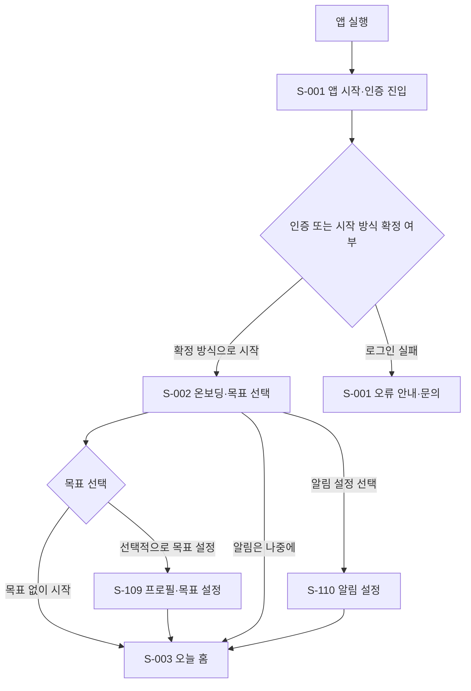
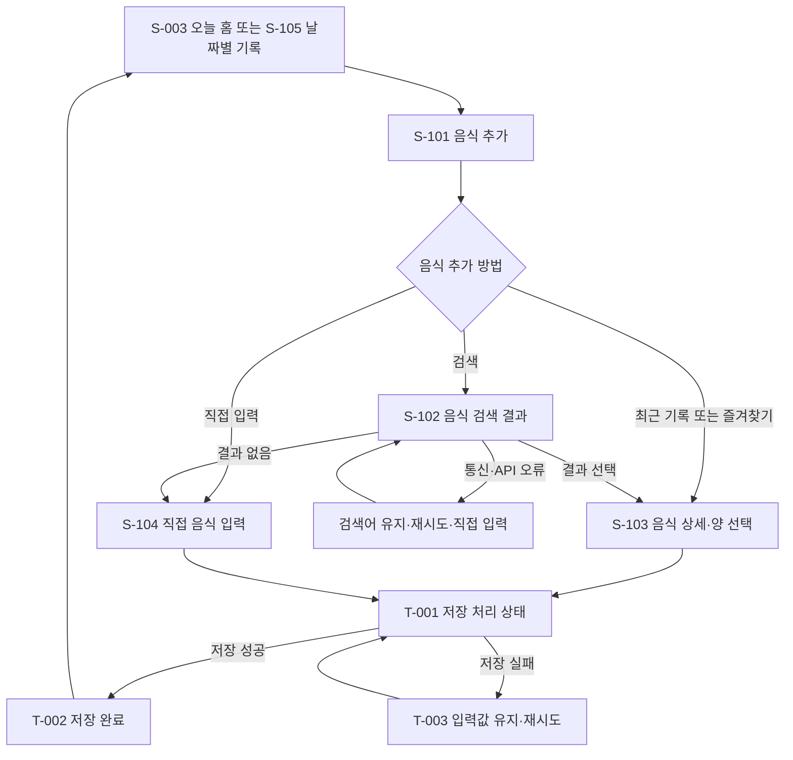
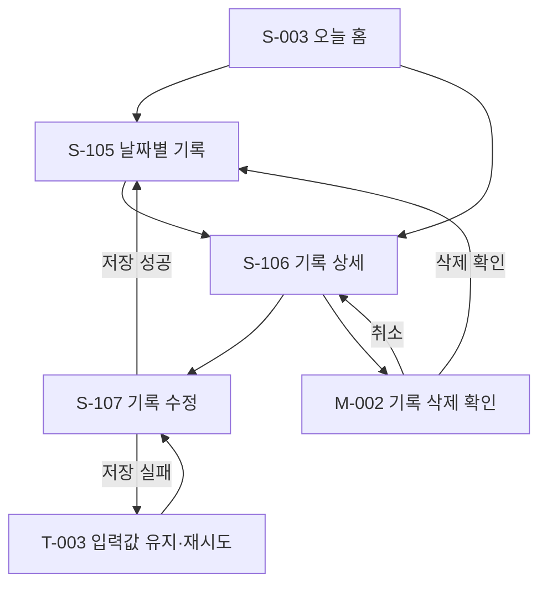
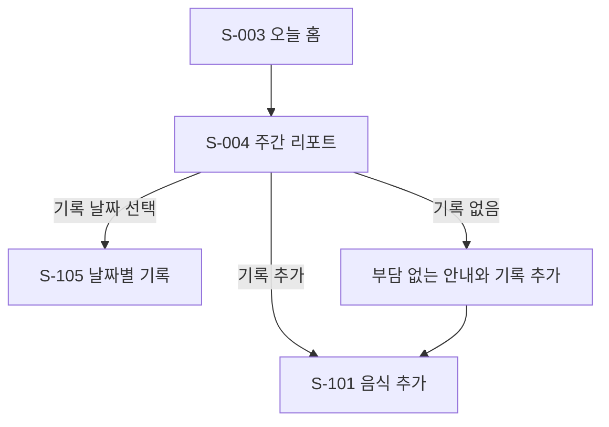
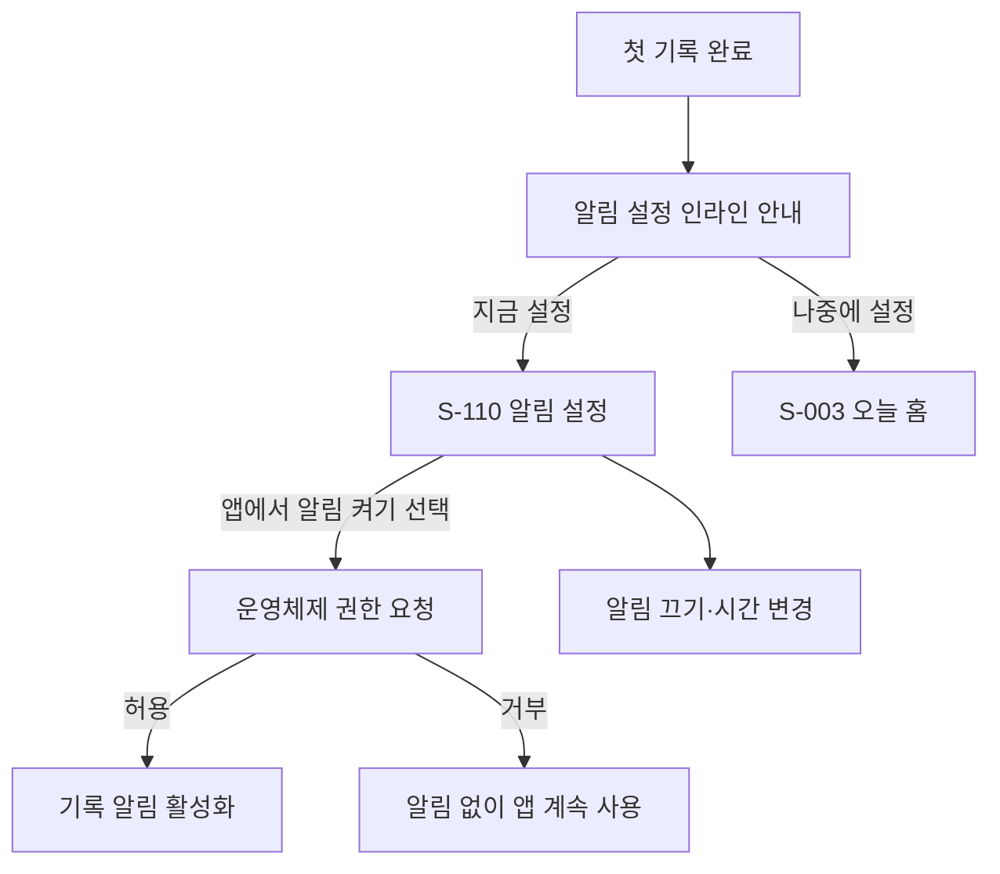
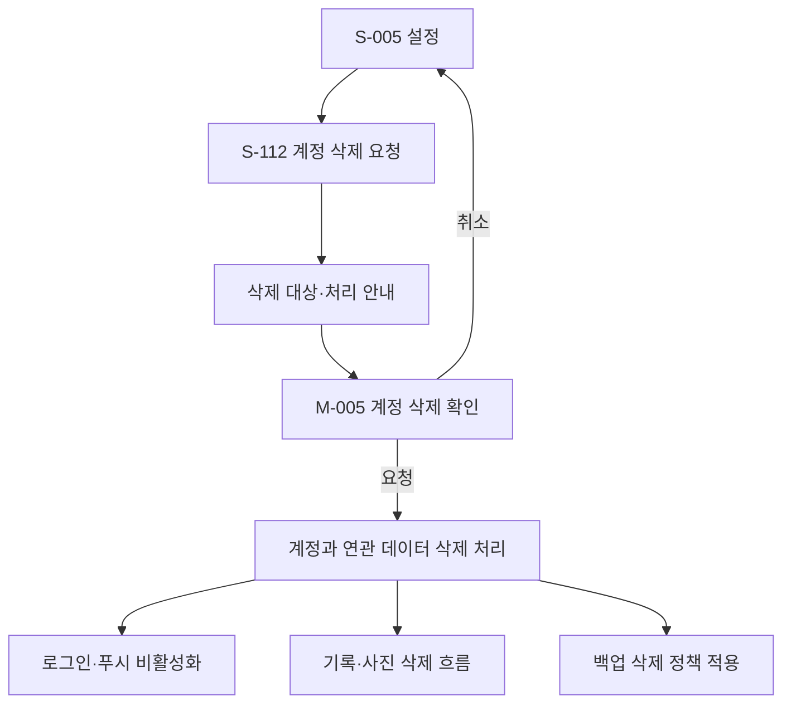

## 1. 문서 정보

- **문서 버전**: v1.0
- **작성일**: 2026-10-01
- **작성자**: 디자인팀
- **문서 상태**: 검토 중
- **작성 기준**: 회의 원문의 결정과 미정 사항을 구분하고, 선행 화면 목록 정의서의 화면 ID·화면명·경로를 유지했습니다. 수치가 회의에서 확정되지 않은 시각 규격은 구현을 위한 **제안값**으로 표시했습니다.
- **기준 화면 크기**: 모바일 세로 화면을 기본으로 설계합니다. 태블릿·데스크톱은 앱 화면을 넓은 영역에 배치하는 검토안이며, 별도 웹 제품으로 제공하는 것은 범위에 포함하지 않습니다.

### 변경 이력

| 버전 | 날짜 | 변경 내용 | 작성자 |
|---|---|---|---|
| v1.0 | 2026-10-01 | 회의 내용을 바탕으로 핵심 화면·상태·디자인 규격 초안 작성 | 디자인팀 |

### 문서 내 상태 표기

| 표기 | 의미 |
|---|---|
| 회의 확정 | 회의 원문에서 결정한 내용 |
| 미정 | 추가 확인이나 결정을 기다리는 내용 |
| 제안 | 실제 구현을 구체화하기 위한 디자인 제안 |
| 추정 필요 | 회의에 기준이 없어 담당자의 확인이 필요한 내용 |

## 2. 화면 구성도

선행 화면 목록 정의서의 화면 ID와 화면명, 경로를 유지했습니다. 화면 목록에는 모달·토스트와 주요 화면 상태를 더해 상세 와이어프레임의 누락을 방지했습니다. 우선순위는 제품 일정에 맞춘 **문서상 제안**이며, 회의에서 화면별 우선순위가 확정된 것은 아닙니다.

| 화면 ID | 화면명 | 경로 | 목적 | 주요 기능 | 우선순위 |
|---|---|---|---|---|---|
| S-001 | 앱 시작·인증 진입 | `/entry` | 앱 이용 시작과 인증 진입 | 로그인·계정 생성 진입, 약관·개인정보 안내, 문의 이동 | P0 |
| S-002 | 온보딩·목표 선택 | `/onboarding` | 서비스 안내와 선택적 시작 방식 제공 | 목표 없이 시작, 선택적 목표 설정, 알림 안내 | P0 |
| S-003 | 오늘 홈 | `/home` | 오늘의 기록 상태를 확인하고 기록 시작 | 날짜 이동, 식사별 기록, 기록 추가, 영양 정보 보조 표시 | P0 |
| S-004 | 주간 리포트 | `/reports/weekly` | 완료된 주의 기록을 중립적으로 돌아보기 | 기록 일수, 기록한 날 기준 평균, 식사 패턴, 조건부 목표 비교 | P0 |
| S-005 | 설정 | `/settings` | 계정·앱 설정 진입 | 프로필·목표, 알림, 개인정보·동의, 계정 삭제, 문의 | P0 |
| S-101 | 음식 추가 | `/food/add` | 음식 추가 경로 선택 | 검색, 최근 기록, 즐겨찾기, 직접 입력 | P0 |
| S-102 | 음식 검색 결과 | `/food/search` | 검색한 음식의 결과 확인 | 결과 목록, 출처·제공량 확인, 직접 입력, 오류·빈 상태 | P0 |
| S-103 | 음식 상세·양 선택 | `/food/:foodId/select` | 음식과 양을 확인해 기록 | 기준 제공량, 양 배수, 식사 구분, 저장, 즐겨찾기 | P0 |
| S-104 | 직접 음식 입력 | `/food/custom/new` | 검색에 없는 음식도 기록 | 음식명 필수 입력, 영양 정보 선택 입력, 저장 | P0 |
| S-105 | 날짜별 기록 | `/records/:date` | 날짜별·식사 구분별 기록 조회 | 항목·합계 확인, 기록 추가, 날짜 이동 | P0 |
| S-106 | 기록 상세 | `/records/items/:itemId` | 저장된 기록 확인 | 기록 시점 음식명·양·영양값·출처 확인, 수정·삭제 진입 | P0 |
| S-107 | 기록 수정 | `/records/items/:itemId/edit` | 기존 기록 변경 | 양, 식사 구분, 섭취 날짜·시간 수정 및 삭제 | P0 |
| S-108 | 식사 사진 보기 | `/records/:recordId/photo` | 기록에 첨부한 사진 확인 | 사진 보기, 사진 삭제 진입 여부 | 미정 |
| S-109 | 프로필·목표 설정 | `/settings/profile-goal` | 선택 정보와 목표 관리 | 프로필 수정, 목표 설정·변경 이력 반영 | P0 |
| S-110 | 알림 설정 | `/settings/notifications` | 사용자가 선택한 기록 알림 관리 | 알림 켜기·끄기, 시간 설정, 운영체제 권한 상태 안내 | P0 |
| S-111 | 개인정보·동의 관리 | `/settings/privacy` | 개인정보와 동의 상태 확인 | 약관·개인정보 안내, 선택적 제품 분석 동의, 삭제 진입 | P0 |
| S-112 | 계정 삭제 요청 | `/settings/account/delete` | 계정 및 연관 기록 삭제 요청 | 삭제 범위 안내, 본인 확인 여부, 요청 확인 | P0 |
| S-113 | 문의·음식 오류 신고 안내 | `/support` | 이용 문의와 음식 오류 신고 지원 | 문의 경로, 음식 식별 정보가 담긴 신고 경로 | P1 |
| M-001 | 날짜 선택 | `modal/date-picker` | 기록 조회·입력 날짜 변경 | 과거 날짜 선택, 미래 날짜 제한 | P0 |
| M-002 | 기록 삭제 확인 | `modal/delete-record` | 개별 기록 삭제 확인 | 삭제 대상 확인, 취소·삭제 | P0 |
| M-003 | 즐겨찾기 관리 | `modal/favorites` | 즐겨찾기 목록 관리 | 음식 즐겨찾기 추가·해제 | P0 |
| M-004 | 사진 선택 | `modal/photo-picker` | 식사 사진 선택 | 선택 사진 한 장 추가 흐름 | 미정 |
| M-005 | 계정 삭제 확인 | `modal/delete-account-confirm` | 탈퇴 전 삭제 범위 확인 | 계정·연관 기록 삭제 안내와 최종 확인 | P0 |
| M-006 | 제품 분석 동의 | `modal/analytics-consent` | 선택적 제품 분석 동의 변경 | 동의·거부 선택, 기능 영향 안내 | 정책 확인 |
| T-001 | 저장 처리 상태 | 화면 상태 `saving` | 저장 중 상태 표시 | 반복 저장 방지, 진행 상태 안내 | P0 |
| T-002 | 저장 완료 | 화면 상태 `saved` | 저장 성공 알림 | 목록·합계 갱신 안내 | P0 |
| T-003 | 저장 실패·재시도 | 화면 상태 `save-error` | 실패 후 기록 보호 | 입력값 유지, 재시도 | P0 |
| T-004 | 시스템 알림 권한 안내 | 화면 상태 `notification-permission` | 알림 선택 후 권한 요청 | 권한 요청 전 설명, 거부 후 이용 가능 안내 | P0 |

### 2.1 범위 충돌 및 우선 적용

사진 기능은 회의 내용에 **MVP에서 사진 첨부까지 제외한다는 결정**과 **식사당 사진 한 장을 포함한다는 후속 결정**이 함께 있습니다. 사진 자동 인식은 MVP 필수 기능이 아니라는 점은 일관되지만, 사진 첨부 여부는 일치하지 않습니다.

따라서 이 문서에서는 다음처럼 취급합니다.

- **사진 자동 인식**: MVP 기본 범위에서 제외합니다. 기술 검증 후 별도 결정합니다.
- **사진 첨부·사진 보기**: 미정으로 표시합니다. 출시 범위가 확정되기 전에는 핵심 사용자 흐름의 필수 요소로 전제하지 않습니다.
- 사진 기능이 최종 포함되면 S-108과 M-004의 세부 설계를 적용하되, 식사 기록 저장과 사진 업로드는 분리합니다.

### 2.2 공통 동작 원칙

1. **기록 우선**: 홈의 첫 번째 목적은 오늘 기록 상태를 확인하고 빠르게 기록하는 것입니다.
2. **목표 비강요**: 목표가 없는 상태에서도 기록과 기본 주간 리포트를 이용할 수 있습니다.
3. **참고값 안내**: 칼로리·영양 정보가 실제 섭취량을 정확히 나타낸다고 표현하지 않습니다.
4. **결측값 구분**: 정보가 없는 상태를 숫자 0으로 바꾸지 않습니다.
5. **기록값 보존**: 저장 당시 음식 이름과 영양값을 보존해 외부 데이터 변경이 과거 기록에 자동 반영되지 않도록 합니다.
6. **실패 상태 지원**: 검색 실패·저장 실패·통신 오류에서도 입력값과 기록 흐름을 보호합니다.
7. **민감 정보 최소화**: 음식명·칼로리·체중·자유 입력 내용은 제품 분석 이벤트나 오류 기록에 포함하지 않습니다.

## 3. 사용자 흐름

### 3.1 앱 진입·목표 선택



- 인증 제공자와 게스트 시작 여부는 미정입니다.
- 목표 없이 시작할 수 있어야 합니다.
- 자동 권장 칼로리는 전문가 검토와 안전 기준 확인 전 임의로 표시하지 않습니다.

### 3.2 음식 검색·기록 추가



- 한 끼에 여러 음식 항목을 추가할 수 있습니다.
- 항목은 각각 저장하고, 같은 날짜와 식사 구분의 항목은 합산해 표시합니다.
- 검색 결과가 없거나 검색에 실패해도 직접 입력, 최근 기록, 즐겨찾기로 기록을 이어갈 수 있습니다.
- 직접 입력 음식은 영양 정보 없이 저장할 수 있습니다.

### 3.3 기록 확인·수정·삭제



- 기록 수정·삭제는 본인 기록에 한해 제공합니다.
- 삭제 후 날짜별 목록과 식사 구분별 합계를 갱신합니다.
- 기록 생성 시각과 섭취 날짜를 분리하며, 리포트는 섭취 날짜를 기준으로 계산합니다.

### 3.4 주간 리포트 확인



- 완료된 주는 한국 시간 기준 월요일부터 일요일까지입니다.
- 기록이 없는 날은 0으로 표시하지 않습니다.
- 평균은 기록이 있는 날을 기준으로 계산하고, 화면에 계산 기준을 표시합니다.
- 지난주 비교는 기록이 충분할 때만 보조 정보로 제공하며, 최소 기준은 미정입니다.

### 3.5 알림 설정



- 알림은 기본적으로 꺼져 있으며 사용자가 앱 안에서 선택해야 활성화됩니다.
- 기록 알림은 하루 최대 한 번 보내고, 해당 날짜에 기록이 한 건 이상 있으면 건너뜁니다.
- 기본 시간은 저녁 8시로 논의됐습니다. 사용자 시간 선택 방식과 기본 시간 적용 방식은 화면 확정 전 확인해야 합니다.
- 주간 리포트 알림은 MVP 제외 결정이 우선합니다.
- 푸시 문구에 음식명·칼로리·체중을 포함하지 않습니다.

### 3.6 계정 삭제



- 계정과 연관된 식사 기록을 삭제하는 방향입니다.
- 사진 삭제 범위, 처리 완료 시점, 백업에서의 삭제 시점은 정책 확인이 필요합니다.
- 장기 미사용 계정의 자동 삭제는 정책이 확정되기 전까지 구현하지 않습니다.

## 4. 공통 레이아웃

이 앱은 iOS·안드로이드용 모바일 앱으로 논의됐습니다. 데스크톱 웹 화면이나 태블릿 전용 화면은 회의에서 확정되지 않았습니다. 아래 태블릿·데스크톱 규격은 별도 제품 범위가 아니라 **확장 화면 검토를 위한 제안**입니다.

### 4.1 모바일 레이아웃: 세로 화면

```text
┌────────────────────────────────────┐
│ [시스템 상태 영역]                 │
├────────────────────────────────────┤
│ [뒤로가기]  화면 제목       [동작] │
├────────────────────────────────────┤
│ 날짜·기간·화면 설명                │
│                                    │
│ 주요 상태 카드                     │
│                                    │
│ 화면별 주요 콘텐츠                 │
│                                    │
│ 식사 항목·목록·입력 요소           │
│                                    │
├────────────────────────────────────┤
│ [이전]       [주요 동작]           │
└────────────────────────────────────┘
```

**제안 규격**

| 영역 | 규격 | 동작 |
|---|---:|---|
| 시스템 상태 영역 | 운영체제 기본 영역 사용 | 시간·기기 상태를 앱 화면과 분리 |
| 상단 제목 영역 | 높이 56px | 화면 제목, 뒤로가기, 필요한 보조 동작 표시 |
| 콘텐츠 바깥 여백 | 좌우 20px | 화면 폭에 따라 16~24px 범위 조정 제안 |
| 카드 안쪽 여백 | 16px | 카드 안 정보 간 간격 통일 |
| 입력·주요 버튼 높이 | 최소 48px | 눌림 영역 확보 |
| 하단 주요 동작 영역 | 화면 하단 고정 여부 제안 | 입력 화면에서 저장 버튼 접근성을 확보 |
| 목록 스크롤 | 화면별 콘텐츠 영역 | 키보드 표시 중에도 저장·취소 접근 가능하도록 처리 |

- 앱의 전역 하단 메뉴는 회의에서 확정되지 않았습니다. 홈·주간 리포트·설정의 주요 이동을 하단 메뉴로 둘지, 화면 내부 진입점으로 둘지 디자인 확정이 필요합니다.
- 음식 추가 중에는 전역 메뉴 노출보다 현재 작업 유지와 저장 동작을 우선하는 구성을 제안합니다.
- 기본 세로 방향을 기준으로 하되 가로 화면 지원 여부는 추정 필요입니다.

### 4.2 태블릿 레이아웃: 768px 이상

```text
┌────────────────────────────────────────────────────────────┐
│ [앱 이름] [화면 이동]                    [계정·설정]       │
├────────────────────────────────────────────────────────────┤
│ [왼쪽 탐색 영역] │ [주요 콘텐츠 영역]                       │
│ 홈               │ 날짜·기록 상태                           │
│ 주간 리포트      │ 식사별 기록 카드                         │
│ 설정             │ 기록 추가 동작                           │
│                  │                                           │
└────────────────────────────────────────────────────────────┘
```

**제안 규격**

| 영역 | 규격 제안 | 설명 |
|---|---:|---|
| 왼쪽 탐색 영역 | 220px | 홈·리포트·설정 이동. 태블릿 지원 여부 미정 |
| 콘텐츠 최대 너비 | 960px | 화면이 지나치게 넓어지지 않도록 중앙 정렬 |
| 콘텐츠 간격 | 24px | 카드·요약 영역 간 간격 |
| 음식 입력 화면 | 콘텐츠 영역 안쪽 폭 제한 | 입력 요소가 지나치게 넓어지지 않도록 제한 |

### 4.3 데스크톱 레이아웃: 1280px 이상

```text
┌──────────────────────────────────────────────────────────────────────────┐
│ [앱 이름] [홈] [주간 리포트] [설정]                  [계정]              │
├──────────────────────────────────────────────────────────────────────────┤
│                                                                          │
│                    [모바일 화면 비율의 주요 콘텐츠]                      │
│                                                                          │
│          태블릿·데스크톱 전용 제품 범위는 확정되지 않음                   │
│                                                                          │
└──────────────────────────────────────────────────────────────────────────┘
```

- 데스크톱용 별도 업무 흐름이나 관리자 화면은 이번 문서에서 정의하지 않습니다.
- 데스크톱 브라우저에서 이용할 수 있는지, 로그인 계정을 여러 기기에서 동기화할지는 미정입니다.
- 데스크톱 대응이 필요할 경우 모바일 화면을 그대로 확대하기보다 별도 탐색·콘텐츠 폭을 검토해야 합니다.

## 5. 상세 와이어프레임

### 5.1 공통 입력·목록 요소

| 요소 | 크기 제안 | 배치·동작 |
|---|---:|---|
| 화면 제목 | 글자 22px, 굵기 700, 행간 30px | 화면 상단, 주요 목적을 짧게 표시 |
| 섹션 제목 | 글자 18px, 굵기 600, 행간 26px | 콘텐츠 구획 시작 |
| 본문 | 글자 16px, 굵기 400, 행간 24px | 기본 안내 및 목록 정보 |
| 보조 문구 | 글자 14px, 행간 20px | 참고값·계산 기준·출처 설명 |
| 작은 안내 | 글자 12px 이상, 행간 18px | 출처·부가 안내. 접근성 점검 필요 |
| 텍스트 입력 | 높이 48px 이상 | 입력 중 상태, 오류·도움말 표시 |
| 주요 버튼 | 높이 48px 이상 | 입력 화면 하단 또는 주요 동작 위치 |
| 보조 버튼 | 높이 44px 이상 | 취소·나중에 등 보조 행동 |
| 목록 행 | 최소 높이 60px 제안 | 음식명·보조 정보·선택 동작 포함 |
| 카드 | 안쪽 여백 16px, 둥근 모서리 12px 제안 | 기록·요약 정보 구분 |
| 간격 | 4px 단위 배수 제안 | 입력 간격 12~16px, 섹션 간격 24px |
| 포커스 표시 | 테두리와 보조 강조 병행 | 색상만으로 상태를 전달하지 않음 |
| 비활성 상태 | 흐린 배경·보조 문구 | 비활성 이유를 필요할 때 함께 안내 |

크기·간격·글자 규격은 회의에서 확정한 값이 아니라, 초기 시안과 개발 검토를 위한 **제안값**입니다. 기기별 글자 크기 설정과 화면 폭을 확인한 뒤 조정해야 합니다.

### 5.2 S-001: 앱 시작·인증 진입

**목적**  
사용자가 앱을 시작하고, 확정된 인증 방식이나 계정 생성 흐름으로 진입하게 합니다.

```text
┌──────────────────────────────┐
│                              │
│          [앱 이름]           │
│                              │
│   식단 기록을 가볍게 시작해요 │
│                              │
│   [확정된 인증 방식 버튼]     │
│   [확정된 인증 방식 버튼]     │
│   [계정 만들기 또는 로그인]   │
│                              │
│   약관 · 개인정보 안내       │
│                              │
│   로그인에 문제가 있나요?    │
│             [문의하기]       │
└──────────────────────────────┘
```

**요소 상세**

| 요소 | 유형 | 크기·위치 제안 | 설명 |
|---|---|---|---|
| 앱 이름·소개 | 텍스트·브랜드 요소 | 상단에서 중앙 정렬 | 기록 중심의 서비스임을 짧게 설명 |
| 인증 방식 버튼 | 주요 버튼 | 화면 폭에서 좌우 여백 제외, 높이 48px 이상 | 로그인 제공자가 확정된 뒤 구성 |
| 계정 생성·로그인 선택 | 버튼 또는 링크 | 인증 방식 아래 | 계정 방식에 따라 통합 가능 |
| 이용약관·개인정보 안내 | 링크 | 하단 | 이용약관과 개인정보 처리 안내로 이동 |
| 문의하기 | 링크 | 하단 | 로그인 실패 화면에서도 문의 가능하게 제공 |

**인터랙션**

- 인증 성공 후 온보딩 여부에 따라 S-002 또는 S-003으로 이동합니다.
- 인증 실패 시 현재 화면을 유지하고 오류 원인과 문의 경로를 표시합니다.
- 게스트 방식이 확정되지 않은 상태에서 게스트 시작 버튼을 확정 화면처럼 노출하지 않습니다.

**미정 사항**

- 이메일·애플·구글·게스트 방식의 최종 범위
- 로그인 실패 문구와 재시도 정책
- 계정 연결·병합 방식
- 게스트 데이터의 저장 위치와 앱 삭제 시 처리

### 5.3 S-002: 온보딩·목표 선택

**목적**  
목표 설정을 강요하지 않고, 사용자에게 기록 시작 방식을 제공합니다.

```text
┌──────────────────────────────┐
│ [닫기]        시작 방식 1/3  │
│                              │
│ 어떤 방식으로 기록할까요?   │
│                              │
│ [식사 습관 확인]             │
│ [체중 목표 설정]             │
│ [목표 없이 기록]             │
│                              │
│ 목표는 나중에 바꿀 수 있어요 │
│                              │
│ [계속]                       │
│                              │
│ 알림은 나중에 설정할 수 있어요│
└──────────────────────────────┘
```

**요소 상세**

| 요소 | 유형 | 크기·위치 제안 | 설명 |
|---|---|---|---|
| 진행 표시 | 단계 표시 | 상단 | 온보딩 단계 수와 현재 위치 표시 |
| 시작 방식 선택 | 선택 카드 | 세 가지 선택지를 같은 위계로 배치 제안 | 식사 습관 확인, 체중 목표 설정, 목표 없이 기록 |
| 목표 없이 기록 | 선택 카드·주요 선택 | 화면 안에서 눈에 띄게 표시 | 신체 정보 입력 없이 기록으로 진행 |
| 계속 | 주요 버튼 | 하단 고정 제안 | 선택 결과에 따라 다음 화면 결정 |
| 알림 안내 | 보조 문구·선택지 | 화면 하단 | 알림을 선택하지 않아도 사용 가능함을 안내 |

**인터랙션**

- 목표 없이 시작하면 S-003으로 이동합니다.
- 목표 설정을 선택하면 S-109로 이동합니다.
- 알림을 고르더라도 약관 동의와 별개로 처리합니다.
- 첫 실행 직후 운영체제 알림 권한 창을 띄우지 않습니다.
- 자동 권장 칼로리는 전문가 검토와 안전 기준이 확인되기 전 표시하지 않습니다.

**미정 사항**

- 온보딩이 실제로 몇 단계인지
- 목표 유형 선택과 신체 정보 입력의 연결 방식
- 칼로리 목표를 직접 입력할 수 있는지와 안전 기준

### 5.4 S-003: 오늘 홈

**목적**  
오늘 기록 상태를 우선 보여주고, 한 번의 주요 동작으로 기록을 시작하게 합니다.

```text
┌──────────────────────────────┐
│ 오늘 홈                [설정]│
├──────────────────────────────┤
│ [←]  10월 1일 목요일  [→]   │
│                 [날짜 선택]  │
│                              │
│ 오늘 기록                    │
│ 식사를 한 끼씩 남겨보세요    │
│                 [기록하기]   │
│                              │
│ 아침                         │
│ 기록된 음식 · 합계           │
│                 [+ 추가]     │
│                              │
│ 점심                         │
│ 기록된 음식 · 합계           │
│                 [+ 추가]     │
│                              │
│ 저녁                         │
│ 기록된 음식 · 합계           │
│                 [+ 추가]     │
│                              │
│ 간식                         │
│ 기록된 음식 · 합계           │
│                 [+ 추가]     │
│                              │
│ [영양 정보는 기록한 내용 기준]│
│ [주간 리포트 보기]           │
└──────────────────────────────┘
```

**요소 상세**

| 요소 | 유형 | 크기·위치 제안 | 설명 |
|---|---|---|---|
| 상단 제목·설정 | 상단 영역 | 높이 56px 제안 | 오늘 홈 제목과 설정 진입 |
| 날짜 이동 | 날짜 탐색 | 상단 콘텐츠 | 이전·다음 이동, 날짜 선택, 오늘로 돌아오기 |
| 기록 상태 | 요약 카드 | 상단 주요 영역 | 목표 달성 여부보다 오늘 기록 상태를 우선 표시 |
| 기록하기 | 주요 버튼 | 높이 48px 이상 | S-101 이동 |
| 식사 구분 | 카드 또는 접이식 목록 | 아침·점심·저녁·간식 고정 | 같은 날짜·식사 구분의 기록 항목을 묶어 표시 |
| 음식 항목 | 목록 행 | 항목별 행 | 이름, 양, 확인 가능한 영양 정보 표시 |
| 식사별 합계 | 보조 요약 | 식사 구분 아래 또는 옆 | 영양값이 있는 항목 기준 합계 |
| 칼로리·영양 정보 | 보조 정보 | 기록 상태보다 낮은 시각적 위계 | 참고값·기록된 내용 기준임을 안내 |
| 주간 리포트 이동 | 카드·링크 | 하단 | S-004 이동 |

**상태별 표시**

- **목표 없음**: 칼로리 게이지와 목표 대비 수치를 숨깁니다.
- **기록 없음**: 0칼로리 대신 부담을 주지 않는 안내와 기록하기 동작을 제공합니다.
- **영양 정보 없음**: 음식 기록은 목록에 남기고, 영양 합계에는 포함하지 않습니다.
- **과거 날짜**: 선택 날짜의 기록을 보여주고 오늘로 이동할 수 있게 합니다.
- **미래 날짜**: 기록 추가를 제한합니다.
- **날짜 변경 후 복귀**: 날짜가 바뀐 경우 화면 데이터를 새로고침합니다.

**인터랙션**

- 식사 구분의 추가 버튼은 현재 날짜와 구분값을 S-101에 전달합니다.
- 음식 항목을 누르면 S-106으로 이동합니다.
- 같은 식사 구분의 여러 항목은 별도 식사 묶음 없이 합산합니다.
- 현재 시간에 따른 식사 구분은 추천만 하며, 저장 전 사용자가 변경할 수 있습니다.

### 5.5 S-004: 주간 리포트

**목적**  
완료된 주의 기록 지속성과 기록한 날의 영양 정보를 평가 없이 보여줍니다.

```text
┌──────────────────────────────┐
│ [뒤로]       주간 리포트     │
├──────────────────────────────┤
│ 지난주                       │
│ 9월 21일 - 9월 27일          │
│                              │
│ 7일 중 4일 기록했어요        │
│ [기록일 표시  ● ● ○ ● ○ ● ○]│
│                              │
│ 기록한 날 기준 평균          │
│ 칼로리      참고값           │
│                              │
│ 탄수화물   단백질   지방     │
│ 참고값     참고값   참고값   │
│                              │
│ 식사 기록 패턴               │
│ 가장 자주 기록한 식사 구분   │
│ [단순 막대 또는 문장 요약]   │
│                              │
│ 일부 음식 정보가 없어        │
│ 영양소별 합계가 다를 수 있어요│
│                              │
│ [기록된 내용 기준]           │
│ [기록 추가]                  │
└──────────────────────────────┘
```

**요소 상세**

| 요소 | 유형 | 크기·위치 제안 | 설명 |
|---|---|---|---|
| 기간 제목 | 제목·기간 표시 | 화면 상단 | 한국 시간 기준 종료된 주를 표시 |
| 기록 일수 | 핵심 요약 | 가장 먼저 노출 | 지난 7일 중 기록이 있는 날짜 수 |
| 7일 표시 | 단순 막대·기호 | 기록 상태를 색 외 방식으로도 표시 | 미기록 날짜는 0으로 나타내지 않음 |
| 평균 영양 정보 | 요약 카드 | 기록 일수 다음 | 칼로리는 기록이 있는 날 기준으로 계산 |
| 탄수화물·단백질·지방 | 보조 정보 | 같은 카드 또는 별도 구획 | 해당 영양소 값이 있는 항목만 계산 |
| 식사 패턴 | 문장·단순 차트 | 하단 | 가장 자주 기록한 식사 구분 등 관찰형 정보 |
| 목표 비교 | 보조 정보 | 목표가 있는 경우만 | 당시 유효한 목표 기준. 목표가 없으면 숨김 |
| 누락 안내 | 안내 문구 | 합계와 가까운 위치 | “일부 음식 정보가 없어 영양소별 합계가 다를 수 있어요.” |
| 기록 추가 | 버튼 | 빈 상태에 표시 | S-101 또는 S-003으로 이동 |

**표시 원칙**

- 평균의 기준은 “기록한 날 기준”이라고 명시합니다.
- 영양값이 없는 음식은 0으로 계산하지 않습니다.
- 영양소마다 입력 여부가 다를 수 있으므로 각각 별도로 계산합니다.
- 건강 점수, 좋음·나쁨, 실패·달성 평가 문구는 사용하지 않습니다.
- 목표 없는 사용자에게 목표선이나 목표 대비 수치를 표시하지 않습니다.
- 지난주 비교의 최소 기록 조건은 미정이며, 조건이 정해지기 전에는 비교 기능을 고정하지 않습니다.
- 리포트는 화면을 열 때 기록 당시 영양값으로 계산합니다. 수정·삭제 후 다시 열면 갱신합니다.

### 5.6 S-005: 설정

```text
┌──────────────────────────────┐
│ [뒤로]          설정         │
├──────────────────────────────┤
│ 계정                         │
│ 프로필·목표 설정          >  │
│                              │
│ 알림                         │
│ 기록 알림 설정            >  │
│                              │
│ 개인정보                     │
│ 개인정보·동의 관리        >  │
│ 계정 삭제                 >  │
│                              │
│ 도움말                       │
│ 문의·음식 오류 신고        >  │
│                              │
│ 이용약관 · 개인정보 안내     │
└──────────────────────────────┘
```

- 각 메뉴는 전체 화면 이동으로 제공합니다.
- 설정 항목은 사용자 계정별로 분리합니다.
- 광고·결제·건강 플랫폼 연동 메뉴는 MVP에 노출하지 않습니다.
- 제품 분석 동의와 알림 설정은 각각 별도 항목으로 관리합니다.

### 5.7 S-101: 음식 추가

**목적**  
검색·최근 기록·즐겨찾기·직접 입력으로 음식 추가를 시작하게 합니다.

```text
┌──────────────────────────────┐
│ [뒤로]        음식 추가       │
├──────────────────────────────┤
│ 10월 1일 · 점심               │
│ [검색창: 음식 이름 검색]      │
│                              │
│ [검색] [최근 기록] [즐겨찾기]│
│                              │
│ 최근 기록                    │
│ 음식 이름 · 양 · 참고 정보  >│
│ 음식 이름 · 양 · 참고 정보  >│
│                              │
│ [직접 입력]                  │
│                              │
│ [즐겨찾기 관리]              │
└──────────────────────────────┘
```

**요소 상세**

| 요소 | 유형 | 크기·위치 제안 | 설명 |
|---|---|---|---|
| 날짜·식사 구분 요약 | 정보 표시 | 제목 아래 | 추가될 날짜와 식사 구분 확인 |
| 검색창 | 입력 필드 | 폭 100%, 높이 48px 이상 | 음식명 입력 |
| 검색·최근·즐겨찾기 | 탭 또는 구획 | 수평 배치 제안 | 기본 탭은 미정 |
| 최근 기록 | 목록 | 사용자의 기록만 표시 | 선택 시 양·구분 확인 화면으로 이동 |
| 즐겨찾기 | 목록 | 사용자별 데이터 | 공통 음식과 개인 입력 음식 모두 지원 |
| 직접 입력 | 주요 보조 동작 | 목록 아래 또는 상단 | S-104 이동 |
| 즐겨찾기 관리 | 보조 동작 | 즐겨찾기 영역 | M-003 열기 |

**미정 사항**

- 최근 기록을 기본 화면으로 할지 검색을 기본 화면으로 할지 미정입니다.
- 인기 메뉴는 초기 화면에 제공하지 않는 방향입니다.
- 검색 최소 글자 수와 요청 대기 시간은 회의 중 상충하는 안이 있어 최종 확인이 필요합니다. 후반부에는 한 글자 검색 허용과 약 350밀리초 대기 방안이 제시됐으나, 공급자 계약 확인 후 확정해야 합니다.

### 5.8 S-102: 음식 검색 결과

```text
┌──────────────────────────────┐
│ [뒤로]      음식 검색        │
├──────────────────────────────┤
│ [음식 이름 입력        [지움]]│
│                              │
│ 검색 결과                    │
│ ┌──────────────────────────┐ │
│ │ 음식 이름        [브랜드]│ │
│ │ 기준 제공량 · 참고 칼로리│ │
│ │ 출처 확인 가능          >│ │
│ └──────────────────────────┘ │
│ ┌──────────────────────────┐ │
│ │ 음식 이름                │ │
│ │ 제공량 정보 없음 · 참고값│ │
│ └──────────────────────────┘ │
│                              │
│ 원하는 음식이 없나요?        │
│ [직접 입력]                  │
└──────────────────────────────┘
```

**상태별 와이어프레임**

```text
검색 결과 없음
┌──────────────────────────────┐
│ 찾는 음식이 없어요           │
│ 직접 입력해 기록할 수 있어요 │
│ [직접 입력] [다시 검색]      │
└──────────────────────────────┘

검색 오류
┌──────────────────────────────┐
│ 음식을 불러오지 못했어요     │
│ 검색어를 유지했어요          │
│ [다시 시도] [직접 입력]      │
└──────────────────────────────┘

검색 중
┌──────────────────────────────┐
│ [검색어 입력 유지]           │
│ [결과 영역 진행 표시]        │
└──────────────────────────────┘
```

**요소·동작**

- 결과에는 음식 이름, 브랜드 구분, 제공 데이터가 있을 때 기준 제공량, 칼로리 참고값을 표시합니다.
- 검색 결과를 자동 선택하거나 자동 저장하지 않습니다.
- 출처는 계약상 표시 의무를 확인해 표시 위치를 확정합니다. 사용자가 상세에서 확인할 수 있는 구성을 제안합니다.
- 제공량·출처가 없는 항목에 임의의 기본 단위를 만들지 않습니다.
- 검색어는 외부 식품 데이터 업체에 전달될 수 있습니다. 처리 조건은 공급자 계약과 개인정보 안내에서 확인합니다.
- 검색어 자체와 음식명은 제품 분석 이벤트에 포함하지 않습니다.
- 외부 식품 검색 요청에 사용자 식별 정보·기록 날짜·식사 기록을 포함하지 않습니다.
- 회의에서 제시된 검색 응답 2초 목표와 3초 이상 무응답 시 재시도 안내는 제안 수준입니다. 실제 목표와 상태 전환 시점은 공급자 검증 후 확정해야 합니다.

### 5.9 S-103: 음식 상세·양 선택

```text
┌──────────────────────────────┐
│ [뒤로]      음식 확인        │
├──────────────────────────────┤
│ 음식 이름            [즐겨찾기]│
│ 브랜드 또는 데이터 유형      │
│ 기준 제공량: 제공 시 표시    │
│                              │
│ 예상·참고 칼로리             │
│ 탄수화물 · 단백질 · 지방    │
│ [출처 확인]                  │
│                              │
│ 양                            │
│ [−]        1.0배       [+]   │
│ 기준 제공량 기준             │
│                              │
│ 식사 구분                    │
│ [아침] [점심] [저녁] [간식] │
│                              │
│ [기록 저장]                  │
└──────────────────────────────┘
```

**요소 상세**

| 요소 | 유형 | 설명 |
|---|---|---|
| 음식 이름 | 제목 | 검색 데이터 또는 개인 음식 이름 |
| 제공량 | 보조 정보 | 음식 데이터에 기준 제공량이 있을 때만 표시 |
| 영양 정보 | 요약·상세 정보 | 회의 결정에 따라 칼로리·단백질을 우선 표시하고, 탄수화물·지방은 상세 또는 리포트에서 제공 |
| 양 배수 | 수량 조절 | 제공량 기준 배수로 조절 |
| 식사 구분 | 고정 선택 | 아침·점심·저녁·간식 중 선택 |
| 즐겨찾기 | 아이콘 버튼 | 사용자 즐겨찾기 추가·해제 |
| 기록 저장 | 주요 버튼 | 저장 후 원래 날짜 화면으로 복귀 |

**인터랙션**

- 배수 조절값은 기록한 영양값 계산에 반영합니다.
- 그램 환산과 자유 형식 단위 입력은 MVP에서 제외합니다.
- 현재 시간에 따른 식사 구분은 추천만 하며, 저장 전 변경할 수 있습니다.
- 음식 항목을 저장한 후 같은 식사 구분에 다른 항목을 추가할 수 있습니다.
- 저장 실패 시 화면을 닫지 않고 입력값을 유지합니다.

**영양 정보 누락 상태**

```text
┌──────────────────────────────┐
│ 영양 정보 없음               │
│ 영양값을 몰라도 기록할 수 있어요│
│ [양·식사 구분 선택]          │
│ [기록 저장]                  │
└──────────────────────────────┘
```

### 5.10 S-104: 직접 음식 입력

```text
┌──────────────────────────────┐
│ [뒤로]     직접 음식 입력    │
├──────────────────────────────┤
│ 음식 이름 *                  │
│ [예: 밥 반 공기]             │
│                              │
│ 양                           │
│ [−]       1회분         [+] │
│                              │
│ 영양 정보는 선택 입력        │
│ 칼로리          [선택 입력]  │
│ 탄수화물        [선택 입력]  │
│ 단백질          [선택 입력]  │
│ 지방            [선택 입력]  │
│                              │
│ 비워둔 정보는 합계에서 제외돼요│
│                              │
│ 식사 구분                    │
│ [아침] [점심] [저녁] [간식] │
│                              │
│ [기록 저장]                  │
└──────────────────────────────┘
```

**요소·동작**

- 음식 이름은 필수입니다.
- 영양 정보는 선택이며, 아무 값도 입력하지 않아도 저장할 수 있습니다.
- 직접 입력의 기본 양은 1회분입니다.
- 빈 값은 실제 값 0과 구분해 저장합니다.
- 빈 영양값은 해당 영양소 합계 계산에서 제외합니다.
- 사용자 입력 음식은 기본적으로 해당 사용자에게만 노출합니다.
- 다른 사용자에게 공개하거나 공용 음식 데이터에 올리려면 별도 동의를 받는 방향입니다.
- 메모 입력은 MVP에서 제외합니다.
- 입력 필드에서 잘못된 값이 발견되면 해당 필드 바로 아래에 한국어 안내를 표시합니다. 수치의 유효 범위와 소수점 정책은 추정 필요입니다.

### 5.11 S-105: 날짜별 기록

```text
┌──────────────────────────────┐
│ [뒤로]       날짜별 기록     │
├──────────────────────────────┤
│ [←]  10월 1일 목요일 [날짜] │
│                   [오늘로]  │
│                              │
│ 아침                         │
│ 음식명 · 양 · 영양 정보      │
│ 음식명 · 양 · 영양 정보      │
│ 식사 구분 합계               │
│                 [+ 음식 추가]│
│                              │
│ 점심                         │
│ 기록 없음                    │
│                 [+ 음식 추가]│
│                              │
│ 저녁                         │
│                 [+ 음식 추가]│
│                              │
│ 간식                         │
│                 [+ 음식 추가]│
└──────────────────────────────┘
```

**요소·동작**

- 날짜 제목을 눌러 M-001을 엽니다.
- 과거 날짜를 선택해 기록을 추가할 수 있습니다.
- 미래 날짜는 선택·기록할 수 없습니다.
- 화면의 빠른 날짜 이동 범위와 더 오래된 날짜로 이동하는 방법은 미정입니다.
- 기록이 없는 구분은 0으로 표시하지 않고 빈 상태로 표시합니다.
- 음식 항목을 누르면 S-106으로 이동합니다.
- 구분별 추가 동작은 선택 날짜와 식사 구분을 S-101에 전달합니다.

### 5.12 S-106: 기록 상세

```text
┌──────────────────────────────┐
│ [뒤로]       기록 상세       │
├──────────────────────────────┤
│ 기록 당시 음식 이름         │
│ 섭취 날짜·시간 · 식사 구분  │
│ 양 · 기준 제공량            │
│                              │
│ 기록 당시 영양 정보         │
│ 칼로리 · 탄수화물            │
│ 단백질 · 지방                │
│                              │
│ 데이터 출처 확인             │
│ [수정]             [삭제]   │
└──────────────────────────────┘
```

- 기록 당시 음식명과 영양값을 표시합니다.
- 외부 음식 마스터의 최신 값으로 과거 기록을 자동 갱신하지 않습니다.
- 사진 기능이 최종 포함된 경우에만 사진 보기 동작을 노출합니다.
- 삭제는 M-002로 확인한 뒤 진행합니다.
- 운영자가 사용자의 기록을 임의로 열람하는 기능은 화면에 포함하지 않습니다.

### 5.13 S-107: 기록 수정

```text
┌──────────────────────────────┐
│ [취소]        기록 수정      │
├──────────────────────────────┤
│ 음식 이름                    │
│ [기록된 이름]                │
│                              │
│ 양                           │
│ [−]       1.0배         [+] │
│                              │
│ 식사 구분                    │
│ [아침] [점심] [저녁] [간식] │
│                              │
│ 섭취 날짜                    │
│ [날짜 선택]                  │
│                              │
│ 섭취 시간                    │
│ [시간 선택 또는 미입력]      │
│                              │
│ [삭제]              [저장]  │
└──────────────────────────────┘
```

- 음식 이름 편집 가능 여부는 데이터 구조 및 화면 범위 확인이 필요합니다.
- 양, 식사 구분, 섭취 날짜·시간을 수정할 수 있도록 설계합니다.
- 날짜 수정 후 리포트는 섭취 날짜를 기준으로 다시 계산합니다.
- 미래 날짜는 저장할 수 없습니다.
- 기록 당시 영양값은 외부 음식 데이터의 최신 정보로 바꾸지 않습니다.
- 수정 실패 시 입력값을 보존하고 재시도를 제공합니다.

### 5.14 S-108: 식사 사진 보기 — 범위 미정

이 화면은 사진 첨부의 MVP 포함 여부가 확정된 뒤에만 설계·구현 대상으로 전환합니다.

```text
┌──────────────────────────────┐
│ [닫기]       식사 사진       │
├──────────────────────────────┤
│                              │
│       [선택한 사진 표시]     │
│                              │
│ 기록에 연결된 보조 사진      │
│ [사진 삭제]                  │
└──────────────────────────────┘
```

**포함 결정 시 필요한 확인**

- 식사당 한 장 제한과 파일 크기 제한
- 사진 저장소·접근 권한·만료 방식
- EXIF 정보 제거 방법
- 사진 삭제와 계정 삭제 연계
- 사진 업로드 실패 상태
- 사진을 외부 분석 서비스에 보내지 않는 원칙

사진 자동 분석은 이 화면의 기본 동작에 포함하지 않습니다.

### 5.15 S-109: 프로필·목표 설정

```text
┌──────────────────────────────┐
│ [뒤로]     프로필·목표       │
├──────────────────────────────┤
│ 시작 방식                    │
│ [식사 습관 확인]             │
│ [체중 목표 설정]             │
│ [목표 없이 기록]             │
│                              │
│ 목표                         │
│ 칼로리 목표 [조건부 입력]    │
│                              │
│ 프로필 정보                  │
│ 키          [선택 입력]      │
│ 체중        [선택 입력]      │
│ 나이 정보   [선택 입력]      │
│ 성별 정보   [정책 확인 후]   │
│                              │
│ 입력 이유·수정·삭제 안내     │
│ [저장]                       │
└──────────────────────────────┘
```

- 목표 없이 기록하는 선택지를 항상 사용할 수 있어야 합니다.
- 신체 정보는 필수 입력으로 강제하지 않습니다.
- 키·체중·나이·성별의 수집 여부와 필수 여부는 추가 검토 대상입니다.
- 자동 권장 칼로리는 전문가 검토 전 수치를 노출하지 않습니다.
- 목표 수치의 직접 입력 여부와 안전하지 않은 목표의 차단 기준은 미정입니다.
- 목표 변경은 유효 시작일·종료일을 기록하고, 식사 날짜 당시 유효한 목표를 비교에 적용합니다.

### 5.16 S-110: 알림 설정

```text
┌──────────────────────────────┐
│ [뒤로]       알림 설정       │
├──────────────────────────────┤
│ 기록 알림                    │
│ 알림 받기             [꺼짐] │
│                              │
│ 알림 시간                    │
│ [오후 8:00        시간 선택] │
│                              │
│ 권한 상태                    │
│ 운영체제 알림 허용 상태 안내 │
│ [운영체제 설정으로 이동]     │
│                              │
│ 알림 내용에는 개인 기록이    │
│ 표시되지 않아요              │
└──────────────────────────────┘
```

- 기본값은 꺼짐입니다.
- 저녁 8시는 회의에서 기본 시간으로 제안됐으나, 최종 설정 규칙과 사용자 변경 범위는 확인이 필요합니다.
- 알림 설정과 운영체제 권한 상태를 별도로 보여줍니다.
- 운영체제 권한이 거부되면 앱 내에서 알림이 켜진 것으로 표시하지 않습니다.
- 알림을 꺼도 앱의 기록·리포트 사용은 제한하지 않습니다.
- MVP에는 기록 알림만 둡니다. 주간 리포트 알림은 제외하는 방향입니다.

### 5.17 S-111: 개인정보·동의 관리

```text
┌──────────────────────────────┐
│ [뒤로]  개인정보·동의 관리   │
├──────────────────────────────┤
│ 이용약관                   > │
│ 개인정보 처리 안내         > │
│ 외부 검색어 처리 안내       > │
│                              │
│ 제품 분석                   │
│ 선택 동의             [꺼짐] │
│ 거부해도 앱을 사용할 수 있어요│
│                              │
│ 알림 설정                 > │
│ 계정 삭제                 > │
│ 문의                     > │
└──────────────────────────────┘
```

- 이용약관, 개인정보 처리 안내, 알림 선택을 구분합니다.
- 선택적 제품 분석에 동의하지 않아도 핵심 기능을 정상 이용할 수 있어야 합니다.
- 분석 이벤트에 음식명·칼로리·체중·자유 입력 내용을 포함하지 않습니다.
- 외부 식품 검색 공급자의 검색어 처리·보관 조건과 국외 처리 여부를 확인한 뒤 안내합니다.
- 서비스 보안·장애 대응 로그와 제품 분석 자료는 구분합니다.

### 5.18 S-112: 계정 삭제 요청

```text
┌──────────────────────────────┐
│ [뒤로]       계정 삭제       │
├──────────────────────────────┤
│ 삭제되는 정보                │
│ 계정과 연관된 식사 기록 등   │
│                              │
│ 삭제 처리·백업 안내          │
│ [정책 확정 후 표시]          │
│                              │
│ [삭제 요청 계속]             │
│                              │
│ [취소]                       │
└──────────────────────────────┘
```

- 앱 안에서 삭제 요청을 시작할 수 있어야 합니다.
- 삭제 요청 시 계정과 연관된 기록을 삭제하는 것을 기본으로 합니다.
- 사진 기능이 포함될 경우 연관 사진도 삭제 대상 범위에 포함할지 명시해야 합니다.
- 삭제 처리 시간, 백업 보존 기간, 법적 보관 의무는 확정 전 임의로 표시하지 않습니다.
- 계정을 유지하면서 전체 기록만 초기화하는 기능은 MVP 필수 범위가 아닙니다.

### 5.19 S-113: 문의·음식 오류 신고 안내

```text
┌──────────────────────────────┐
│ [뒤로]        문의하기       │
├──────────────────────────────┤
│ 앱 이용 문의                 │
│ [문의 경로 열기]             │
│                              │
│ 음식 정보 오류 신고          │
│ 선택한 음식 정보가 포함된    │
│ 신고 경로를 엽니다           │
│ [오류 신고]                  │
│                              │
│ 오류 코드·기록 식별값은      │
│ 필요한 경우 직접 첨부합니다  │
└──────────────────────────────┘
```

- 문의 주소 또는 실제 문의 경로는 추정 필요입니다.
- 로그인 실패 화면에서도 문의 경로를 제공합니다.
- 음식 오류 신고에 음식 식별 정보를 미리 채우는 방안을 적용합니다.
- 자유 의견은 선택 입력으로 처리합니다.
- 신고 운영 주기는 회의에서 주 2회 확인안이 제시됐으나, 담당자·운영 방식의 확정 여부는 확인이 필요합니다.
- 음식명이나 자유 메모가 진단 기록에 자동 첨부되지 않도록 합니다.

### 5.20 모달·공통 상태

#### M-001 날짜 선택

```text
┌──────────────────────────────┐
│ 날짜 선택                    │
│ [운영체제 날짜 선택기]       │
│ [취소]              [선택]  │
└──────────────────────────────┘
```

- 미래 날짜는 선택할 수 없도록 합니다.
- 과거 기록 입력 범위는 제한하지 않는 방향이 논의됐습니다.
- 최근 날짜 탐색 범위와 운영체제 날짜 선택기 사용 여부는 미정입니다.

#### M-002 기록 삭제 확인

```text
┌──────────────────────────────┐
│ 기록을 삭제할까요?           │
│ 삭제한 기록은 목록과 합계에서│
│ 제외됩니다                   │
│ [취소]              [삭제]  │
└──────────────────────────────┘
```

- 삭제 동작은 취소와 시각적으로 구분하되 색상만으로 표현하지 않습니다.
- 삭제 후 홈·날짜별 목록·리포트 집계를 갱신합니다.

#### M-003 즐겨찾기 관리

```text
┌──────────────────────────────┐
│ 즐겨찾기              [닫기]│
│ 음식 이름             [해제]│
│ 음식 이름             [해제]│
│                              │
│ 검색·최근 기록에서 추가 가능 │
└──────────────────────────────┘
```

- 개인 음식과 공통 음식 모두 즐겨찾기할 수 있습니다.
- 다른 사용자의 즐겨찾기 정보는 노출하지 않습니다.
- 실제 표시 형식과 별도 화면·모달 여부는 제안입니다.

#### M-004 사진 선택

사진 첨부가 MVP에 포함되는 경우에만 적용합니다. 식사 기록 저장 후 별도로 사진을 선택하며, 사진 업로드가 식사 기록 저장을 막지 않도록 합니다.

#### M-005 계정 삭제 확인

```text
┌──────────────────────────────┐
│ 계정과 기록을 삭제할까요?    │
│ 삭제 범위와 처리 시점은      │
│ 정책에 따라 안내합니다       │
│ [취소]       [삭제 요청]    │
└──────────────────────────────┘
```

- 삭제 대상과 처리 시점은 정책 확정 후 정확하게 표시합니다.
- 본인 확인 방식은 미정입니다.

#### M-006 제품 분석 동의

```text
┌──────────────────────────────┐
│ 제품 분석 자료를 보낼까요?   │
│ 음식 이름과 칼로리는 보내지  │
│ 않으며, 거부해도 앱 기능은   │
│ 동일하게 이용할 수 있어요    │
│ [동의 안 함]        [동의]  │
└──────────────────────────────┘
```

- 문구와 동의 방식은 개인정보 담당 검토 후 확정합니다.
- 동의를 거부해도 식단 기록·조회 기능은 제한하지 않습니다.

#### T-001~T-003 저장 상태

| 상태 | 표시 문구 제안 | 화면 동작 |
|---|---|---|
| 저장 중 | “저장하고 있어요.” | 반복 저장 방지. 입력 화면 유지 |
| 저장 완료 | “기록을 저장했어요.” | 성공 확인 뒤 목록·합계 반영 |
| 저장 실패 | “저장되지 않았어요. 입력 내용을 유지했어요. 다시 시도해 주세요.” | 입력값 보존, 재시도 제공 |

#### 검색 상태

| 상태 | 표시 문구·동작 제안 |
|---|---|
| 검색 중 | 검색어 유지, 결과 영역에 진행 상태 표시 |
| 결과 없음 | “찾는 음식이 없어요. 직접 입력해 기록할 수 있어요.” |
| 요청 오류 | “음식을 불러오지 못했어요. 검색어를 유지했어요.”와 다시 시도 동작 |
| 오래 걸림 | 재시도 시점은 실제 응답 기준을 검증한 뒤 확정. 3초 기준은 회의 제안으로 확정 수치가 아님 |

## 6. 디자인 시스템

아래 색상·글자·간격·모서리 수치는 회의에서 정하지 않았습니다. 화면 시안을 제작하고 구현을 검토하기 위한 **초기 제안**이며, 접근성 검증과 브랜드 검토 후 확정해야 합니다.

### 6.1 색상

| 용도 | 색상 이름 | 제안값 | 사용 예 |
|---|---|---|---|
| 주요 동작 | 주 색상 | `#35685A` | 기록하기, 저장, 선택된 항목 표시 |
| 보조 강조 | 보조 색상 | `#DCEBE5` | 선택 카드 배경, 정보 구획 |
| 기본 배경 | 기본 배경색 | `#FFFFFF` | 화면 바탕 |
| 보조 배경 | 보조 배경색 | `#F5F7F5` | 비활성 구획, 입력 영역 |
| 기본 글자 | 주요 글자색 | `#202822` | 제목·본문 |
| 보조 글자 | 보조 글자색 | `#68736D` | 설명·계산 기준 |
| 테두리 | 테두리색 | `#DCE2DD` | 입력·카드 구분 |
| 성공 | 성공색 | `#26734D` | 저장 완료 상태 |
| 주의 | 주의색 | `#956100` | 참고가 필요한 안내 |
| 오류 | 오류색 | `#B42318` | 저장·입력 오류 |
| 삭제 | 삭제색 | `#A82D27` | 삭제 동작과 확인 안내 |

- 목표 초과·미달을 빨강·초록으로 평가하지 않습니다.
- 상태를 색만으로 표현하지 않고 문구·아이콘·도형을 함께 사용합니다.
- 실제 글자·배경 대비는 구현 전에 접근성 검사로 확인합니다.
- 색상은 브랜드 방향이 확정되면 교체할 수 있도록 의미별 토큰으로 관리합니다.

### 6.2 글자

| 유형 | 글자 크기 제안 | 굵기 제안 | 행간 제안 |
|---|---:|---:|---:|
| 화면 제목 | 22px | 700 | 30px |
| 구획 제목 | 18px | 600 | 26px |
| 카드 제목 | 16px | 600 | 24px |
| 본문 | 16px | 400 | 24px |
| 보조 설명 | 14px | 400 | 20px |
| 표·출처 설명 | 12px 이상 | 400 | 18px |
| 주요 버튼 | 16px | 600 | 22px |

- 실제 글꼴은 기기 기본 글꼴을 우선 사용합니다.
- 시스템 글자 크기를 높였을 때 주요 버튼·기록 항목이 겹치거나 잘리지 않아야 합니다.
- 작은 글자만으로 필수 출처·주의 내용을 전달하지 않습니다.

### 6.3 간격·형태

| 항목 | 제안 규격 | 사용 |
|---|---:|---|
| 기본 간격 단위 | 4px | 간격 체계 기준 |
| 작은 간격 | 8px | 아이콘과 라벨, 좁은 요소 간격 |
| 기본 간격 | 16px | 폼 항목·카드 안쪽 여백 |
| 구획 간격 | 24px | 주요 화면 구획 사이 |
| 큰 간격 | 32px | 화면 주요 영역 간 분리 |
| 모바일 좌우 여백 | 20px | 콘텐츠 바깥 여백 |
| 카드 모서리 | 12px | 정보 카드·선택 카드 |
| 입력 모서리 | 8px | 검색창·입력 필드 |
| 카드 테두리 | 1px | 카드와 배경 구분 |

### 6.4 버튼

| 유형 | 용도 | 크기 제안 | 상태 |
|---|---|---|---|
| 주요 버튼 | 기록하기·저장 | 높이 48px 이상, 모바일 폭에 맞춤 | 기본·눌림·비활성·저장 중 |
| 보조 버튼 | 취소·나중에 | 높이 44px 이상 | 기본·눌림·비활성 |
| 글자 버튼 | 출처 확인·문의 | 글자 기준, 눌림 영역 확대 | 기본·눌림 |
| 파괴적 버튼 | 기록 삭제·계정 삭제 | 확인 모달 안에 배치 | 취소 동작과 명확히 구분 |

- 모바일 앱에서는 웹의 마우스 호버 상태를 필수로 설계하지 않습니다.
- 눌림 상태는 배경·테두리·촉각 반응 중 가능한 수단을 조합하되 색 변화만으로 의존하지 않습니다.
- 비활성 상태는 비활성 이유를 사용자가 이해할 수 있도록 필요에 따라 안내합니다.
- 저장 중에는 반복 입력을 막고 “저장하고 있어요.” 상태를 표시합니다.

### 6.5 입력 필드

| 상태 | 표현 제안 | 동작 |
|---|---|---|
| 기본 | 테두리와 라벨 표시 | 입력 가능 |
| 선택됨 | 테두리 강조와 키보드 표시 | 시스템 글자 크기를 반영 |
| 오류 | 테두리·오류 문구·오류 위치 안내 | 오류 내용을 해당 필드 가까이에 표시 |
| 비활성 | 흐린 배경과 비활성 표시 | 비활성 이유가 필요한 경우 설명 |
| 입력값 보존 | 입력 내용 유지 | 저장 실패·통신 중단 뒤 화면 복귀 시 보호 |

### 6.6 카드·목록

- 홈의 식사 구분은 구분별 카드 또는 접이식 목록으로 표현합니다.
- 기록 목록은 음식 이름을 먼저, 양·영양 정보는 보조로 배치합니다.
- 영양 정보가 없는 항목은 “정보 없음” 상태를 표시합니다.
- 리포트의 기록 없음은 빈칸·점선 등으로 나타내며 0으로 보이는 막대를 그리지 않습니다.
- 카드 그림자는 최소화하고 테두리·배경색·간격으로 구획을 구분하는 방향을 제안합니다.

### 6.7 아이콘

아이콘 그림체와 라이브러리는 미정입니다. 앱의 다른 화면과 일관된 단색 아이콘을 사용하고, 아이콘만으로 주요 동작을 전달하지 않습니다.

| 동작 | 아이콘 용도 | 접근성 처리 |
|---|---|---|
| 뒤로가기 | 이전 화면 | 읽을 수 있는 이름 제공 |
| 검색 | 음식 검색 | 입력창에 설명 라벨 제공 |
| 즐겨찾기 | 즐겨찾기 추가·해제 | 현재 상태를 글자나 접근성 이름으로 알림 |
| 수정 | 기록 수정 | 아이콘과 동작 이름 함께 제공 |
| 삭제 | 기록 삭제 | 확인 절차와 삭제 대상 설명 |
| 날짜 이동 | 이전·다음 날짜 | 날짜를 음성 안내에 포함 |
| 설정 | 설정 진입 | 읽을 수 있는 이름 제공 |

## 7. 반응형·플랫폼 대응

### 7.1 화면 너비별 기준

| 구분 | 너비 | 적용 기준 |
|---|---:|---|
| 소형 모바일 | 640px 미만 | 한 열 구성, 하단 주요 동작 접근성 우선 |
| 큰 모바일 | 640~767px | 한 열 구성, 카드 간 간격 조정 |
| 태블릿 | 768~1279px | 왼쪽 탐색 영역과 중앙 콘텐츠를 나누는 방안 제안 |
| 큰 화면 | 1280px 이상 | 중앙 콘텐츠 폭 제한. 전용 데스크톱 기능은 확정되지 않음 |

이는 웹 화면의 요구사항이 아니라 다양한 기기 크기를 검토하기 위한 구간 제안입니다. 실제 모바일 앱의 크기 처리 방식은 iOS·안드로이드 기기 시험 후 확정합니다.

### 7.2 주요 화면별 대응

| 요소 | 모바일 | 태블릿·큰 화면 |
|---|---|---|
| 주요 탐색 | 하단 메뉴 또는 화면 내부 이동 제안 | 왼쪽 탐색 영역 제안 |
| 식사 구분 | 세로 목록 | 두 열 배치 검토 가능 |
| 음식 검색 결과 | 한 열 목록 | 한 열 목록 유지, 콘텐츠 폭 제한 |
| 설정 | 메뉴 목록에서 상세 화면 이동 | 왼쪽 설정 메뉴와 상세 화면 분리 검토 |
| 날짜 선택 | 운영체제 날짜 선택기 또는 전체 화면 | 중앙 영역 안에 표시 검토 |
| 확인 창 | 하단 시트 또는 작은 대화상자 제안 | 중앙 대화상자 제안 |
| 입력 화면 | 화면 하단 저장 동작 확보 | 콘텐츠 너비 제한 |
| 리포트 | 세로 카드·단순 도식 | 두 열 배치 검토 가능 |

- 운영체제 기본 입력 도구를 사용할지 앱 안에서 공통 화면을 만들지는 개발 검토가 필요합니다.
- 가로 화면 지원 여부는 미정입니다.
- 표 형식보다 카드·목록 형식을 우선해 작은 화면에서 가로 스크롤을 줄입니다.

### 7.3 기기별 검증

회의에서는 안드로이드 기기 두 종류, 아이폰 기기 두 종류 이상을 확보하는 제안이 있었습니다. 실제 확보 여부와 지원 운영체제 버전은 미정입니다.

검증 항목은 다음과 같습니다.

- 주요 기록 경로에서 화면 요소가 겹치거나 잘리지 않는지
- 시스템 글자 크기를 높여도 제목·버튼·영양 정보가 읽히는지
- 버튼에 읽을 수 있는 이름이 제공되는지
- 색상만으로 저장·오류·기록 상태를 구분하지 않는지
- 키보드가 열린 상태에서도 저장·취소 동작에 접근할 수 있는지
- 날짜 선택과 알림 권한이 iOS·안드로이드에서 예상대로 동작하는지
- 저장 실패·네트워크 중단 때 입력 내용이 유지되는지
- 검색 결과 없음과 검색 오류가 명확히 구분되는지

## 작성 완료 후 확인사항

- [x] 선행 화면 목록 정의서의 주요 화면 ID·화면명·경로를 유지함
- [x] 인증, 온보딩, 홈, 음식 추가, 검색, 직접 입력, 기록 상세·수정·삭제, 리포트, 설정 화면을 포함함
- [x] 화면별 목적·레이아웃·주요 요소·인터랙션·상태를 작성함
- [x] 저장 중·성공·실패, 검색 중·결과 없음·오류, 영양 정보 없음 상태를 포함함
- [x] 목표 없는 사용자, 기록 없는 날짜, 정보 누락을 각각 구분함
- [x] 기록 당시 음식명·영양값 스냅샷 원칙을 반영함
- [x] 개인정보·알림·분석 동의를 분리해 반영함
- [x] 모바일 우선 레이아웃과 태블릿·큰 화면 검토안을 구분함
- [x] 회의에서 확정되지 않은 크기·색상·글자 규격을 제안값으로 표시함
- [ ] 로그인 제공자와 게스트 시작·계정 병합 방식 확정 필요
- [ ] 음식 데이터 공급처·출처 표시·검색어 처리 조건 확정 필요
- [ ] 검색 최소 입력 길이·요청 대기 시간 확정 필요
- [ ] 목표 입력 허용 범위와 안전 기준 전문가 검토 필요
- [ ] 사진 첨부가 MVP에 포함되는지 상충 내용을 정리해 최종 결정 필요
- [ ] 알림 시간 선택 방식과 기본 시간 적용 규칙 확정 필요
- [ ] 주간 리포트의 비교 최소 기록 기준 확정 필요
- [ ] 날짜 탐색 범위와 과거 날짜 선택 동작 확정 필요
- [ ] 지원 운영체제 버전과 기기별 시험 범위 확정 필요
- [ ] 앱 내 메뉴 구성과 화면별 하단 동작 방식 확정 필요
- [ ] 계정 삭제 처리 시간·백업 삭제 시점·데이터 보유 정책 확인 필요