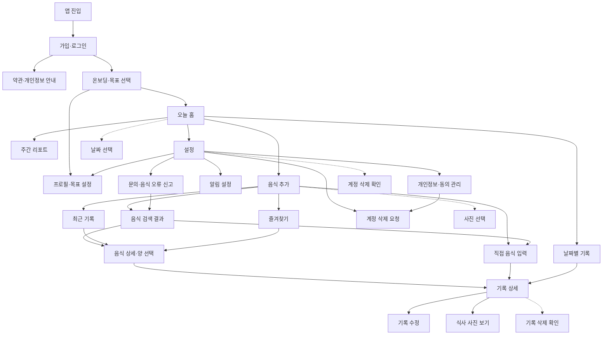
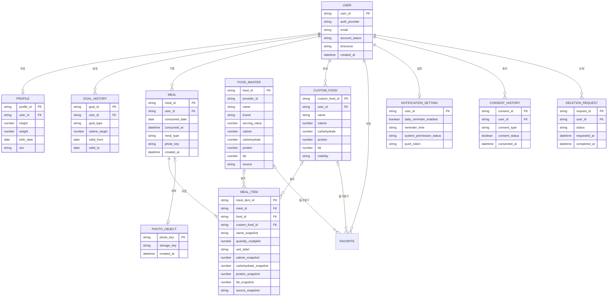
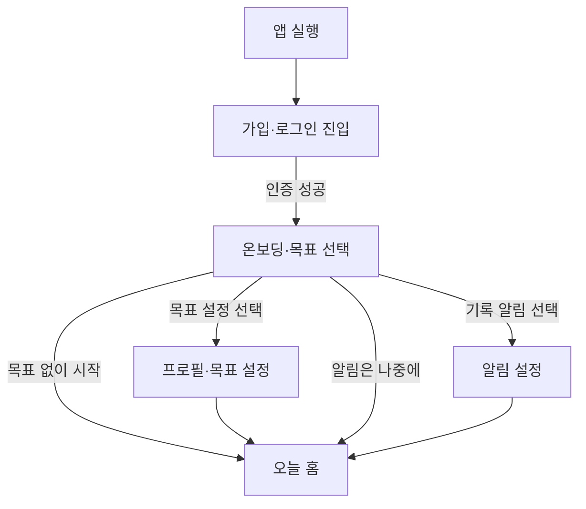
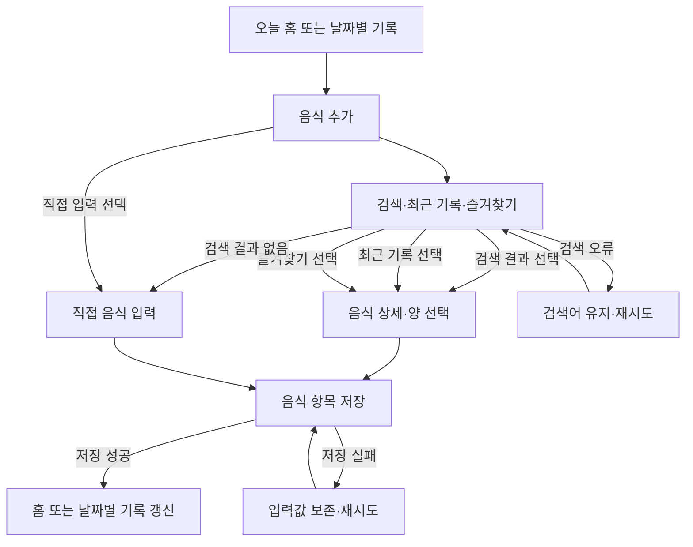
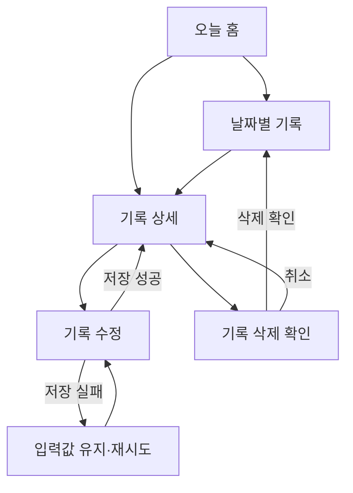
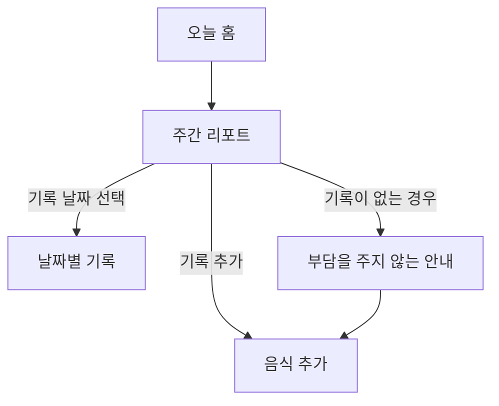
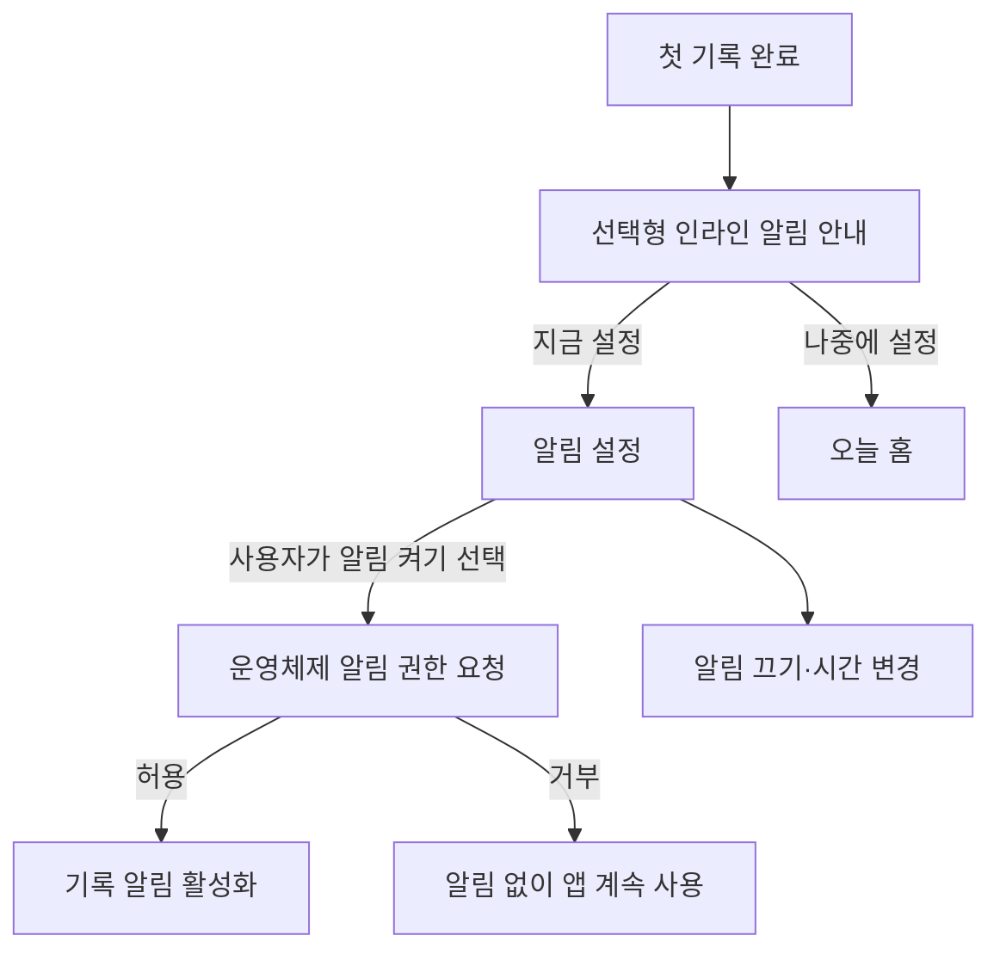
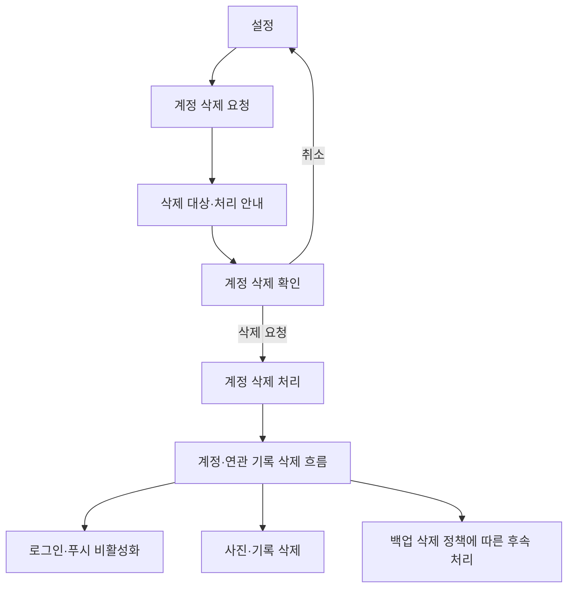

## 1. 문서 정보

- **문서 버전**: v1.0
- **작성일**: 2026-10-01
- **작성자**: 디자인팀
- **문서 상태**: 검토 중
- **작성 기준**: 회의 원문의 명시적 결정과 미결정 사항을 구분해 작성했습니다. 선행 화면 목록은 화면 이름과 경로를 연결하는 참고 자료로 활용하되, 회의 원문과 충돌하는 항목은 회의 원문을 우선했습니다.
- **경로 기준**: 아래 경로는 모바일 앱 내부 화면 경로 초안입니다. 웹 주소가 아니며, 실제 앱 내 주소 체계와 화면 구현 방식은 개발 설계 과정에서 확정해야 합니다.

### 변경 이력

| 버전 | 날짜 | 변경 내용 | 작성자 |
|---|---|---|---|
| v1.0 | 2026-10-01 | 회의 내용을 바탕으로 메뉴·페이지·콘텐츠·검색·권한 구조 초안 작성 | 디자인팀 |

### 문서 내 상태 표기

| 표기 | 의미 |
|---|---|
| 회의 확정 | 회의에서 결정한 내용 |
| 미정 | 회의에서 결론을 내리지 않아 추가 확인이 필요한 내용 |
| 제안 | 회의에서 검토한 설계 방향이며, 최종 합의 여부가 분명하지 않은 내용 |
| 추정 필요 | 회의에 근거가 없어 상세 설계를 위해 추가로 정해야 하는 내용 |

## 2. 정보 구조 개요

| 항목 | 내용 |
|---|---|
| **구조 유형** | 계층형·작업 중심·개인 데이터 중심의 하이브리드 |
| **최대 깊이** | 4단계. 앱 진입 → 주요 영역 → 작업 화면 → 확인·오류 상태 |
| **최대 너비** | 주요 탐색 영역은 3개를 기본으로 구성. 한 화면 내 음식 구분은 아침·점심·저녁·간식 4개로 제한 |
| **범위** | iOS·안드로이드 공통 모바일 앱의 사용자 화면과 주요 데이터 구조 |
| **총 페이지 수** | 18개 화면 기준. 모달 5개, 공통 팝업·상태 4개 별도 집계 |
| **대상 사용자** | 식단을 기록하고 싶지만 입력 부담으로 중단하기 쉬운 국내 일반 사용자 |
| **핵심 작업** | 음식 찾기·추가, 기록 확인·수정·삭제, 주간 리포트 확인, 계정·개인정보·알림 관리 |
| **플랫폼** | iOS·안드로이드 공통 앱. 리액트 네이티브 개발 방향은 회의에서 합의 |
| **관리자 화면** | MVP 화면 범위에 포함하지 않음. 운영자의 사용자 기록 열람은 최소 권한·동의·접근 기록을 전제로 별도 검토 |

### 2.1 구조 유형 선정 이유

#### 계층형 구조

홈, 주간 리포트, 설정을 최상위 탐색 영역으로 두고 각 영역에서 관련 작업으로 이동합니다. 사용자는 홈에서 당일 기록을 확인하고, 음식 추가나 기록 수정 같은 세부 작업은 하위 화면에서 수행합니다.

- **장점**: 주요 목적과 화면 간 관계가 분명합니다.
- **주의점**: 기록 추가 과정이 길어지지 않도록 검색·최근 기록·즐겨찾기·직접 입력을 한 음식 추가 영역 안에 모읍니다.
- **적용 범위**: 홈·리포트·설정 및 각 영역의 세부 화면

#### 작업 중심 구조

사용자는 앱을 열어 정해진 메뉴를 탐색하기보다 “먹은 음식을 기록한다”, “기록을 고친다”, “지난주 기록을 확인한다”와 같은 목적을 수행합니다.

- 음식 추가는 검색·최근 기록·즐겨찾기·직접 입력으로 이어집니다.
- 검색 실패나 외부 API 오류가 있어도 직접 입력이나 최근 기록으로 기록을 이어갈 수 있어야 합니다.
- 저장·수정·삭제 결과와 오류 상태를 명확히 보여줍니다.

#### 개인 데이터 중심 구조

식사 기록·사용자 입력 음식·즐겨찾기·목표·알림 설정은 사용자별로 분리합니다. 음식 데이터 공급자가 바뀌더라도 사용자의 과거 기록이 바뀌지 않도록 기록 당시 음식 이름과 영양값을 별도로 보존합니다.

#### 대상자별 구조

MVP는 일반 사용자 앱을 중심으로 구성합니다. 관리자용 메뉴나 다른 사용자의 기록을 보는 기능은 제공하지 않는 것을 기본으로 합니다. 관리자 권한과 운영 도구의 구체 범위는 추정 필요입니다.

#### 정보 구조 설계 원칙

1. **기록 우선**: 홈은 칼로리 목표 달성 여부보다 오늘의 기록 상태와 기록하기를 먼저 보여줍니다.
2. **목표 비강요**: 사용자는 목표 없이도 기록과 주간 리포트를 이용할 수 있습니다.
3. **참고값 명시**: 칼로리·영양값은 정확한 섭취량이 아닌 참고값으로 다룹니다.
4. **결측값 보존**: 영양 정보가 없는 상태를 실제 값 0과 구분합니다.
5. **개인정보 최소화**: 식사 기록 내용을 분석 도구에 보내지 않으며, 외부 식품 API에는 검색어만 전달하는 방향으로 설계합니다.
6. **기록 안정성**: 저장 결과를 표시하고 실패 시 입력값을 보존하며, 재시도 때 중복 저장을 방지합니다.
7. **확장 가능한 데이터 구조**: 음식 데이터 공급자 변경, 목표 이력, 시간대별 기록과 향후 리포트 확장을 고려합니다.

## 3. 사이트맵

아래 사이트맵은 사용자에게 노출되는 MVP 화면을 중심으로 작성했습니다. 직접 음식 입력, 계정 삭제, 오류 안내처럼 메뉴에서 항상 보이지 않더라도 주요 작업 경로에 필요한 화면은 포함했습니다.



### 3.1 사이트맵 범위와 해석

- `RECENT`와 `FAVORITES`는 음식 추가 화면 안의 목록 또는 탭입니다. 별도 화면으로 구현할지, 같은 화면의 전환 상태로 구현할지는 디자인·개발 단계에서 확정해야 합니다.
- 기록 목록과 음식 기록 항목은 날짜와 식사 구분에 따라 보여줍니다. 한 끼에 여러 항목을 추가할 수 있으며, 별도의 식사 모음 단위는 MVP에서 사용하지 않습니다.
- 사진 한 장 첨부는 후반부 논의에서 포함 방향으로 정리됐습니다. 식사 저장을 먼저 완료한 뒤 사진을 추가하며, 사진 자동 인식은 MVP 필수 기능이 아닙니다.
- 자동 칼로리 목표, 로그인 제공자, 게스트 계정, 사진 처리 세부, 주간 리포트의 최소 데이터 기준은 미정입니다.
- 사용자용 화면이 아닌 서버 운영·관리 화면은 이 사이트맵에 포함하지 않았습니다.

## 4. 네비게이션 구조

### 4.1 글로벌 네비게이션

모바일 화면의 공통 주요 이동 구조입니다. 탭 형태로 제공할지, 다른 내비게이션 형식으로 제공할지는 미정입니다.

| 순서 | 메뉴명 | 경로 | 아이콘 제안 | 접근 권한 | 설명 |
|---|---|---|---|---|---|
| 1 | 홈 | `/home` | 홈 모양 아이콘 | 인증된 사용자 | 오늘의 기록 상태, 식사 구분별 기록, 음식 추가 진입 |
| 2 | 주간 리포트 | `/reports/weekly` | 요약·그래프 아이콘 | 인증된 사용자 | 완료된 주의 기록 일수, 기록된 날 기준 영양 정보, 끼니 패턴 |
| 3 | 설정 | `/settings` | 설정 아이콘 | 인증된 사용자 | 프로필·목표, 알림, 개인정보·동의, 계정 삭제, 문의 |

**탐색 원칙**

- 앱을 열었을 때 기록 작업에 가장 빠르게 접근할 수 있도록 홈을 기본 진입 화면으로 둡니다.
- 음식 추가, 날짜별 기록, 기록 수정·삭제는 홈과 기록 상세에서 이어지는 작업 경로로 제공합니다.
- 주간 리포트는 사용자가 직접 확인할 수 있어야 하며, 푸시를 설정하지 않아도 접근할 수 있습니다.
- 메뉴의 시각적 위치, 하단 메뉴 사용 여부, 뒤로가기 동작은 추정 필요입니다.

### 4.2 로컬 네비게이션

#### 홈 내부

| 메뉴·동작 | 경로 또는 위치 | 설명 |
|---|---|---|
| 날짜 이동 | `/records/:date` 또는 홈 내부 날짜 전환 | 오늘 또는 과거 날짜 기록 확인 |
| 오늘로 돌아가기 | 홈 내부 동작 | 과거 날짜를 보고 있을 때 오늘 날짜로 이동 |
| 식사 구분 | 홈 내부 목록 | 아침·점심·저녁·간식별 기록 확인 |
| 음식 추가 | `/food/add` | 선택한 날짜와 식사 구분에 음식 항목 추가 |
| 주간 리포트 | `/reports/weekly` | 완료된 주의 기록 정보 확인 |
| 설정 | `/settings` | 계정과 앱 설정 진입 |

#### 음식 추가 내부

| 메뉴·동작 | 경로 또는 위치 | 설명 |
|---|---|---|
| 검색 | `/food/search` | 음식 이름으로 외부 또는 내부 음식 데이터 검색 |
| 최근 기록 | 음식 추가 화면 내부 | 최근에 기록한 음식 재사용 |
| 즐겨찾기 | 음식 추가 화면 내부 | 즐겨찾기한 음식 재사용 |
| 직접 입력 | `/food/custom/new` | 검색 결과가 없거나 사용자가 직접 입력하려는 경우 |
| 음식 선택 | `/food/:foodId/select` | 기준 제공량·영양값 확인, 양·식사 구분 지정 |

- 최근 기록·즐겨찾기·검색의 기본 탭은 회의에서 확정되지 않았습니다.
- 검색은 한 글자 입력을 허용하고 약 350밀리초 대기 후 요청하는 방향이 후반부에 제시됐습니다. 공급자 계약과 호출 제한 확인 후 확정해야 합니다.
- 검색 결과가 없거나 검색 API가 실패해도 직접 입력으로 이동할 수 있어야 합니다.

#### 설정 내부

| 메뉴명 | 경로 | 설명 |
|---|---|---|
| 프로필·목표 | `/settings/profile-goal` | 선택적 프로필 정보 및 목표 관리 |
| 알림 설정 | `/settings/notifications` | 사용자가 선택한 기록 알림과 시간 관리 |
| 개인정보·동의 관리 | `/settings/privacy` | 약관·개인정보 안내 및 선택적 제품 분석 동의 |
| 계정 삭제 | `/settings/account/delete` | 앱 안에서 계정 및 연관 기록 삭제 요청 |
| 문의·음식 오류 신고 | `/support` | 문의 경로 및 음식 정보 오류 신고 안내 |

### 4.3 푸터 네비게이션

모바일 앱 전역에 고정 푸터 메뉴가 있는지는 회의에서 확정되지 않았습니다. 웹 서비스의 푸터를 그대로 적용하지 않으며, 아래 항목은 설정·안내 화면에 배치하는 구조를 제안합니다.

| 링크명 | 경로 또는 위치 | 설명 |
|---|---|---|
| 이용약관 | `/legal/terms` 또는 개인정보 화면 내 링크 | 서비스 이용약관 확인 |
| 개인정보 처리 안내 | `/legal/privacy` 또는 개인정보 화면 내 링크 | 수집 항목·목적·보유 기간·위탁 업체 등 확인 |
| 문의 | `/support` | 앱 사용 문의 경로 |
| 음식 정보 오류 신고 | `/support/food/:foodId` | 음식 식별 정보를 미리 채운 신고 경로 |

- 실제 약관·개인정보 안내 주소, 문의 주소, 외부 연결 방식은 추정 필요입니다.
- 마케팅 알림 동의는 MVP에 두지 않습니다.
- 이용약관, 개인정보 처리 동의, 푸시 선택은 서로 구분합니다.

### 4.4 브레드크럼 및 이전 화면 이동

모바일 앱에 웹 형태의 브레드크럼을 상시 표시할지는 회의에서 확정되지 않았습니다. 좁은 화면과 빠른 기록 흐름을 고려해, 기본적으로 상단 제목과 뒤로가기 동작으로 현재 위치를 표현하는 방안을 제안합니다.

**위치 관계 예시**

```text
홈 > 음식 추가 > 검색 결과 > 음식 상세·양 선택
홈 > 날짜별 기록 > 기록 상세 > 기록 수정
설정 > 개인정보·동의 관리 > 계정 삭제 요청
```

**구현 원칙**

- 상위 화면으로 돌아가는 동작은 현재 작성 중인 입력을 잃지 않도록 처리합니다.
- 저장 실패나 통신 오류가 있으면 오류 화면에서 입력 흐름을 끊지 않습니다.
- 홈에서 특정 날짜를 선택해 기록을 추가하면 해당 날짜가 기록의 기본 섭취 날짜가 됩니다.
- 기록 수정·삭제 후에는 부모 기록 목록과 합계를 갱신합니다.

## 5. 콘텐츠 분류 체계

### 5.1 1단계 카테고리

| 카테고리 ID | 카테고리명 | 설명 | 하위 항목 수 |
|---|---|---|---:|
| CAT-001 | 앱 시작·이용 안내 | 앱 진입, 인증, 온보딩, 선택적 목표 안내 | 3개 |
| CAT-002 | 식사 기록 | 홈, 날짜별 조회, 음식 추가, 직접 입력, 상세·수정·삭제 | 8개 |
| CAT-003 | 주간 리포트 | 완료된 주의 기록 일수·영양 정보·끼니 패턴 | 1개 |
| CAT-004 | 설정·개인정보 | 프로필·목표, 알림, 개인정보·동의, 계정 삭제, 문의 | 5개 |

### 5.2 2단계 카테고리

| 상위 ID | 상위명 | 하위 ID | 하위명 | 설명 | 페이지 수 |
|---|---|---|---|---|---:|
| CAT-001 | 앱 시작·이용 안내 | SUB-001 | 진입·인증 | 로그인 방식 선택과 인증 진입 | 1 |
| CAT-001 | 앱 시작·이용 안내 | SUB-002 | 온보딩·목표 선택 | 앱 안내와 목표 없이 시작하거나 선택적으로 목표 설정 | 1 |
| CAT-001 | 앱 시작·이용 안내 | SUB-003 | 약관·개인정보 안내 | 이용약관과 개인정보 처리 안내 | 안내 페이지 수 추정 필요 |
| CAT-002 | 식사 기록 | SUB-004 | 홈·기록 현황 | 오늘의 기록 상태와 식사 구분별 항목 확인 | 1 |
| CAT-002 | 식사 기록 | SUB-005 | 음식 탐색·선택 | 검색, 최근 기록, 즐겨찾기, 음식 상세 | 3 |
| CAT-002 | 식사 기록 | SUB-006 | 직접 입력 | 사용자 지정 음식 이름과 선택 영양 정보 입력 | 1 |
| CAT-002 | 식사 기록 | SUB-007 | 날짜별 기록·관리 | 날짜별 목록, 기록 상세, 기록 수정 | 3 |
| CAT-002 | 식사 기록 | SUB-008 | 사진 확인 | 기록에 첨부한 사진 보기 | 1 |
| CAT-003 | 주간 리포트 | SUB-009 | 주간 요약 | 기록 일수, 기록된 날 기준 평균, 끼니 패턴 확인 | 1 |
| CAT-004 | 설정·개인정보 | SUB-010 | 프로필·목표 | 선택적 프로필과 목표 관리 | 1 |
| CAT-004 | 설정·개인정보 | SUB-011 | 알림 | 선택형 기록 알림과 시간 설정 | 1 |
| CAT-004 | 설정·개인정보 | SUB-012 | 개인정보·동의 | 개인정보 안내, 동의 상태, 선택적 제품 분석 | 1 |
| CAT-004 | 설정·개인정보 | SUB-013 | 계정 삭제 | 계정 및 연관 기록 삭제 요청 | 1 |
| CAT-004 | 설정·개인정보 | SUB-014 | 문의·신고 | 문의 및 음식 정보 오류 신고 | 1 |

### 5.3 3단계 카테고리: 화면 목록

| 페이지 ID | 페이지명 | 경로 | 상위 항목 | 설명 |
|---|---|---|---|---|
| P-001 | 가입·로그인 진입 | `/entry` | 진입·인증 | 확정된 인증 방식으로 가입·로그인 진입 |
| P-002 | 온보딩·목표 선택 | `/onboarding` | 온보딩·목표 선택 | 목표 없이 시작하거나 목표 설정 선택 |
| P-003 | 오늘 홈 | `/home` | 홈·기록 현황 | 오늘의 기록 상태와 식사 구분별 항목 표시 |
| P-004 | 음식 추가 | `/food/add` | 음식 탐색·선택 | 검색·최근 기록·즐겨찾기·직접 입력으로 진입 |
| P-005 | 음식 검색 결과 | `/food/search` | 음식 탐색·선택 | 검색 결과, 빈 결과, 오류 결과 표시 |
| P-006 | 음식 상세·양 선택 | `/food/:foodId/select` | 음식 탐색·선택 | 기준 제공량·영양 정보·양·식사 구분 선택 |
| P-007 | 직접 음식 입력 | `/food/custom/new` | 직접 입력 | 음식 이름 필수, 영양 정보 선택 입력 |
| P-008 | 날짜별 기록 | `/records/:date` | 날짜별 기록·관리 | 선택 날짜의 식사 구분별 항목 및 합계 |
| P-009 | 기록 상세 | `/records/items/:itemId` | 날짜별 기록·관리 | 기록 당시 이름·양·영양값·날짜 확인 |
| P-010 | 기록 수정 | `/records/items/:itemId/edit` | 날짜별 기록·관리 | 기록 항목 수정 및 삭제 진입 |
| P-011 | 식사 사진 보기 | `/records/:recordId/photo` | 사진 확인 | 식사 기록에 연결된 사진 보기 |
| P-012 | 주간 리포트 | `/reports/weekly` | 주간 요약 | 완료된 주의 기록·영양 정보·끼니 패턴 |
| P-013 | 설정 | `/settings` | 설정·개인정보 | 프로필·알림·개인정보·계정 삭제·문의 진입 |
| P-014 | 프로필·목표 설정 | `/settings/profile-goal` | 프로필·목표 | 선택적 프로필 정보 및 목표 조회·수정 |
| P-015 | 알림 설정 | `/settings/notifications` | 알림 | 기록 알림 동의·시간·운영체제 권한 상태 관리 |
| P-016 | 개인정보·동의 관리 | `/settings/privacy` | 개인정보·동의 | 약관·처리 안내와 선택적 제품 분석 동의 관리 |
| P-017 | 계정 삭제 요청 | `/settings/account/delete` | 계정 삭제 | 앱 안에서 계정과 연관 기록의 삭제 요청 |
| P-018 | 문의·음식 오류 신고 안내 | `/support` | 문의·신고 | 문의 경로 및 음식 정보 오류 신고 이동 |

**페이지 수 산정 기준**

- 위 18개는 화면 목적과 주요 구성이 구분되는 페이지 기준입니다.
- 로그인 제공자별 별도 화면이 필요한지, 약관·개인정보 안내를 별도 내부 페이지로 둘지는 미정입니다. 그에 따른 페이지 수는 추가될 수 있습니다.
- 검색 결과 없음, 네트워크 오류, 기록 없음은 별도 페이지가 아니라 같은 화면의 상태로 계산합니다.
- 최근 기록과 즐겨찾기는 음식 추가 화면 안의 목록 또는 탭으로 분류하며, 별도 화면 수에는 포함하지 않습니다.
- 선택 확인·날짜 선택·사진 선택 같은 겹쳐 표시되는 화면은 모달로 별도 집계합니다.

### 5.4 4단계 카테고리: 주요 상태·모달

| 항목 ID | 항목명 | 유형 | 연결 화면 | 설명 |
|---|---|---|---|---|
| M-001 | 날짜 선택 | 모달 | P-003, P-008 | 기록 날짜 변경. 미래 날짜는 선택하지 않도록 설계 |
| M-002 | 기록 삭제 확인 | 모달 | P-009, P-010 | 선택한 기록 항목 삭제 확인 |
| M-003 | 사진 선택 | 운영체제 선택 화면 | P-003 또는 기록 흐름 | 식사 저장 후 사진 한 장 선택 |
| M-004 | 계정 삭제 확인 | 모달 | P-017 | 삭제 대상과 요청 전 최종 확인 |
| M-005 | 제품 분석 동의 확인 | 모달 | P-016 | 선택적 분석 동의 변경 안내. 실제 방식은 개인정보 검토 필요 |
| ST-001 | 검색 결과 없음 | 화면 상태 | P-005 | 직접 입력으로 이어지는 안내 |
| ST-002 | 검색 오류 | 화면 상태 | P-005 | 빈 결과와 구분하고 재시도 제공 |
| ST-003 | 영양 정보 없음 | 화면 상태 | P-006, P-007, P-009 | 영양값 미입력을 0과 구분 |
| ST-004 | 저장 실패 | 화면 상태 | P-006, P-007, P-010 | 입력값 보존과 재시도 제공 |
| ST-005 | 기록 없음 | 화면 상태 | P-003, P-008, P-012 | 0칼로리로 오해되지 않는 안내 제공 |
| ST-006 | 사진 업로드 실패 | 화면 상태 | 기록 상세·사진 흐름 | 식사 기록은 유지하고 사진 상태만 안내 |

## 6. 콘텐츠 모델

### 6.1 콘텐츠 유형 정의

아래 모델은 회의에서 논의된 데이터 영역을 정보 구조 관점에서 정리한 것입니다. 필드의 구체 자료형, 필수 여부, 보유 기간, 암호화 방식은 개발·개인정보 검토 후 확정해야 합니다.

#### 사용자

| 속성 | 자료형 제안 | 필수 | 설명 | 제약·확인 사항 |
|---|---|---:|---|---|
| 사용자 식별자 | 고유 식별값 | 예 | 내부 사용자 식별값 | 서비스 인증 식별자와 분석 식별자 연결 방식 검토 |
| 인증 제공자 | 값 목록 | 미정 | 이메일·애플·구글 등 인증 방식 | 최종 제공자 범위 미정 |
| 이메일 | 문자열 | 미정 | 인증에 필요한 경우 보관 | 게스트 허용 여부와 로그인 제공자에 따라 달라짐 |
| 계정 상태 | 값 목록 | 예 | 활성·삭제 요청 중 등 | 삭제 요청 시 로그인·푸시 비활성화 흐름 정의 |
| 시간대 | 문자열 | 제안 | 날짜·알림 계산용 사용자 시간대 | MVP의 변경 화면 제공 여부 미정 |
| 생성 시각 | 날짜·시각 | 예 | 계정 생성 시점 | 표준 시각 기준으로 저장하는 방향 논의 |
| 수정 시각 | 날짜·시각 | 예 | 사용자 정보 수정 시점 | 보유 범위 확인 필요 |

#### 사용자 프로필

| 속성 | 자료형 제안 | 필수 | 설명 | 제약·확인 사항 |
|---|---|---:|---|---|
| 사용자 식별자 | 고유 식별값 | 예 | 사용자와 연결 | 사용자별 접근 통제 |
| 키 | 숫자 | 미정 | 목표 계산·표시 목적 | 선택 여부와 보유 필요성 추가 확인 |
| 체중 | 숫자 | 미정 | 목표 계산·표시 목적 | 체중 일별 추적은 MVP 제외 |
| 생년월일 또는 연령 정보 | 날짜 또는 선택값 | 미정 | 목표 계산 검토용 | 수집 필요성 및 대체 방식 확인 |
| 성별 정보 | 값 목록 | 미정 | 목표 계산에 필요한 경우 검토 | 필수 여부와 미입력 시 처리 미정 |
| 입력·수정 시각 | 날짜·시각 | 예 | 프로필 정보 변경 시점 | 값이 없는 상태도 지원 |
| 수집 목적 안내 상태 | 동의·확인 이력 | 미정 | 정보 입력 전 목적 안내 확인 | 정책 설계와 연결 |

#### 목표 이력

| 속성 | 자료형 제안 | 필수 | 설명 | 제약·확인 사항 |
|---|---|---:|---|---|
| 목표 식별자 | 고유 식별값 | 예 | 목표 이력 식별 | 사용자 삭제와 함께 삭제 |
| 사용자 식별자 | 고유 식별값 | 예 | 목표 소유자 | 사용자별 분리 |
| 목표 유형 | 값 목록 | 미정 | 체중 목표, 식사 습관 확인 등 | 화면 선택지 문구 검토 중 |
| 일일 칼로리 목표 | 숫자 | 선택 | 사용자가 설정한 목표 | 직접 입력 허용 여부와 안전 기준 미정 |
| 단백질·탄수화물·지방 목표 | 숫자 | 선택 | 향후 목표 확장 가능성 | 화면 제공 범위 미정 |
| 유효 시작일·종료일 | 날짜 | 제안 | 목표 적용 기간 | 식사 날짜 기준 당시 목표 조회 |
| 생성·수정 시각 | 날짜·시각 | 예 | 목표 변경 이력 관리 | 과거 기록에 새 목표를 소급 적용하지 않음 |

#### 음식 마스터

| 속성 | 자료형 제안 | 필수 | 설명 | 제약·확인 사항 |
|---|---|---:|---|---|
| 내부 음식 식별자 | 고유 식별값 | 예 | 앱 내부 음식 식별 | 외부 공급자 식별자와 분리 |
| 외부 공급자 식별자 | 문자열 | 선택 | 원본 음식 데이터 식별 | 공급자별 식별 체계 대응 |
| 음식 이름 | 문자열 | 예 | 화면 표시용 음식 이름 | 외부 데이터 변경 이력 고려 |
| 브랜드 이름 | 문자열 | 선택 | 브랜드 상품 구분 | 출처·상업적 재표시 권한 확인 |
| 음식 종류 | 값 목록 | 제안 | 일반 음식·브랜드 음식 등 구분 | 값 체계 추정 필요 |
| 기준 제공량 | 숫자·표시명 | 선택 | 제공 데이터가 있는 경우 기준량 표시 | 임의의 기본 단위를 만들지 않음 |
| 칼로리·탄수화물·단백질·지방 | 숫자 또는 비어 있음 | 선택 | 기준량의 영양 정보 | 값 없음과 0을 구분 |
| 영양 정보 출처 | 문자열 또는 연결 정보 | 선택 | 데이터 제공처 확인 | 화면 표시 의무와 계약 조건 확인 |
| 공개 범위 | 값 목록 | 예 | 공통 음식 또는 개인 음식 구분 | 개인 입력 음식은 기본적으로 본인만 노출 |
| 공급자 갱신 시각 | 날짜·시각 | 선택 | 최신 데이터 갱신 시점 | 원본 데이터와 내부 보정값 구분 |

#### 사용자 입력 음식

| 속성 | 자료형 제안 | 필수 | 설명 | 제약·확인 사항 |
|---|---|---:|---|---|
| 음식 식별자 | 고유 식별값 | 예 | 개인 음식 식별 | 음식 마스터와 구분 또는 소유자 정보 포함 |
| 소유자 사용자 식별자 | 고유 식별값 | 예 | 음식 소유자 | 다른 사용자의 검색 결과에 노출하지 않음 |
| 음식 이름 | 문자열 | 예 | 사용자가 입력한 음식 이름 | 분석 도구로 전송하지 않음 |
| 영양 정보 | 숫자 또는 비어 있음 | 선택 | 사용자가 아는 경우에만 입력 | 비어 있어도 저장 허용 |
| 출처 유형 | 값 목록 | 예 | 사용자 입력·외부 제공처 등 | 데이터 출처 구분 |
| 공용 공개 동의 | 참·거짓 또는 동의 이력 | 선택 | 공용 데이터 전환 시 별도 동의 | 동의 전에는 개인 범위 유지 |
| 생성·수정 시각 | 날짜·시각 | 예 | 개인 음식 변경 시점 | 로그에 음식 이름이 남지 않도록 주의 |

#### 식사 기록

회의에서는 식사와 식사 음식 항목을 분리하는 구조가 논의됐습니다. 한 식사 구분에 여러 음식 항목을 연결하며, 별도 식사 묶음 식별값은 MVP 필수로 두지 않는 방향입니다.

| 속성 | 자료형 제안 | 필수 | 설명 | 제약·확인 사항 |
|---|---|---:|---|---|
| 식사 식별자 | 고유 식별값 | 예 | 식사 기록 식별 | 한 기록에 음식 항목 여러 개 연결 |
| 사용자 식별자 | 고유 식별값 | 예 | 기록 소유자 | 사용자별 분리 |
| 섭취 날짜 | 날짜 | 예 | 기록이 속하는 현지 날짜 | 기록 생성 시각과 분리 |
| 섭취 시각 | 날짜·시각 | 선택 또는 예 | 식사 시각 표시·정렬 | 화면 입력 필수 여부 미정 |
| 식사 구분 | 값 목록 | 예 | 아침·점심·저녁·간식 | 사용자가 추가·이름 변경하는 기능 제외 |
| 생성 시각 | 날짜·시각 | 예 | 실제 기록 저장 시점 | 표준 시각 저장 방향 논의 |
| 수정 시각 | 날짜·시각 | 예 | 기록 변경 시점 | 수정·삭제 후 리포트 갱신 |
| 기록 사진 키 | 문자열 | 선택 | 별도 저장소 사진 경로 식별값 | 후반부 논의에서 식사당 한 장 포함 방향 |
| 메모 | 문자열 | 제외 | 사용자 자유 입력 메모 | MVP에서 제외 |

#### 식사 음식 항목

| 속성 | 자료형 제안 | 필수 | 설명 | 제약·확인 사항 |
|---|---|---:|---|---|
| 항목 식별자 | 고유 식별값 | 예 | 음식 항목 식별 | 중복 저장 방지용 요청 식별값 별도 검토 |
| 식사 식별자 | 고유 식별값 | 예 | 식사 기록과 연결 | 한 식사에 여러 항목 허용 |
| 음식 식별자 | 고유 식별값 | 선택 | 음식 마스터 또는 개인 음식 연결 | 직접 입력 음식 구조에 따라 선택 가능 |
| 기록 당시 음식 이름 | 문자열 | 예 | 당시 표시된 이름 보존 | 외부 음식 DB 변경에 영향받지 않음 |
| 기록 당시 제공량·표시 단위 | 숫자·문자열 | 예 | 제공량 또는 사용자가 선택한 양 | 기준 제공량과 배수 방식 우선 |
| 수량 배수 | 숫자 | 예 | 기준량 대비 양 조절 | 직접 입력 기본값은 1회분 |
| 기록 당시 영양값 | 숫자 또는 비어 있음 | 선택 | 칼로리·탄수화물·단백질·지방 스냅샷 | 영양소별 결측을 개별 계산 |
| 데이터 출처 | 값 또는 연결 정보 | 선택 | 외부 데이터·사용자 입력 등 | 출처 확인이 가능하도록 저장 |
| 생성·수정 시각 | 날짜·시각 | 예 | 항목 저장·수정 시점 | 재시도 중복 방지 고려 |

#### 즐겨찾기

| 속성 | 자료형 제안 | 필수 | 설명 | 제약·확인 사항 |
|---|---|---:|---|---|
| 즐겨찾기 식별자 | 고유 식별값 | 예 | 즐겨찾기 관계 식별 |  |
| 사용자 식별자 | 고유 식별값 | 예 | 사용자 소유 | 다른 사용자에게 노출하지 않음 |
| 음식 식별자 | 고유 식별값 | 예 | 공통 음식 또는 개인 음식 연결 | 두 유형 모두 지원 |
| 생성 시각 | 날짜·시각 | 예 | 즐겨찾기 시점 | 정렬 방식은 추정 필요 |

#### 최근 기록

| 속성 | 자료형 제안 | 필수 | 설명 | 제약·확인 사항 |
|---|---|---:|---|---|
| 사용자 식별자 | 고유 식별값 | 예 | 기록 주체 | 사용자별 분리 |
| 음식 식별자 또는 기록 항목 식별자 | 고유 식별값 | 예 | 최근 기록 재사용 대상 | 복사 시 새 기록 생성 |
| 최근 기록 시각 | 날짜·시각 | 예 | 최근 항목 정렬 | 보관 기간은 추정 필요 |

#### 알림 설정

| 속성 | 자료형 제안 | 필수 | 설명 | 제약·확인 사항 |
|---|---|---:|---|---|
| 사용자 식별자 | 고유 식별값 | 예 | 설정 소유자 | 사용자별 분리 |
| 기록 알림 선택 상태 | 참·거짓 | 예 | 사용자가 앱 안에서 선택한 상태 | 기본값 꺼짐 |
| 알림 시각 | 시각 | 조건부 | 선택한 기록 알림 시각 | 기본 저녁 8시 논의, 사용자 선택 방식 확정 필요 |
| 운영체제 권한 상태 | 값 목록 | 예 | 허용·거부 등 기기 권한 상태 | 앱 내 설정과 분리 관리 |
| 푸시 식별 토큰 | 문자열 | 조건부 | 푸시 발송에 필요한 토큰 | 탈퇴 시 비활성화·삭제 |
| 주간 리포트 알림 상태 | 미정 | 미정 | 회의에서 제외 결정이 우선 | 초기 MVP 화면에서 제외하는 방향 |
| 수정 시각 | 날짜·시각 | 예 | 설정 변경 시점 | 발송 직전 최신 상태 확인 |

#### 주간 리포트 집계

| 속성 | 자료형 제안 | 필수 | 설명 | 제약·확인 사항 |
|---|---|---:|---|---|
| 사용자 식별자 | 고유 식별값 | 예 | 리포트 소유자 | 본인 기록만 사용 |
| 시작일·종료일 | 날짜 | 예 | 한국 시간 기준 완료된 주 | 월요일부터 일요일 |
| 기록한 날짜 수 | 정수 | 예 | 기록이 있는 날짜 수 | 미기록 날짜와 영양값 누락 구분 |
| 기록된 날 평균 칼로리 | 숫자 또는 비어 있음 | 선택 | 기록이 있는 날만 계산 | 표시 기준을 명시 |
| 탄수화물·단백질·지방 집계 | 숫자 또는 비어 있음 | 선택 | 값이 있는 항목만 영양소별 집계 | 합계 또는 평균 표시 방식은 화면에서 확정 |
| 끼니 패턴 | 요약 자료 | 선택 | 가장 자주 기록한 식사 구분 등 | 과도한 평가 문구 금지 |
| 목표 비교 자료 | 숫자 또는 비어 있음 | 선택 | 해당 날짜에 유효한 목표가 있을 때 제공 | 목표 이력을 기준으로 계산 |
| 계산 시각 | 날짜·시각 | 예 | 리포트 생성 또는 갱신 시점 | 화면 진입 시 계산, 이후 캐시 검토 |

#### 동의 이력

| 속성 | 자료형 제안 | 필수 | 설명 | 제약·확인 사항 |
|---|---|---:|---|---|
| 동의 이력 식별자 | 고유 식별값 | 예 | 동의 내역 식별 | 개인정보 정책 검토 필요 |
| 사용자 식별자 | 고유 식별값 | 조건부 | 회원 동의 주체 | 비회원 시작 여부에 따라 달라짐 |
| 동의 유형 | 값 목록 | 예 | 약관·개인정보·푸시·제품 분석 등 | 각각 구분 |
| 동의 상태 | 참·거짓 | 예 | 동의 또는 거부 상태 | 선택 동의 기본 해제 원칙 |
| 동의 시각 | 날짜·시각 | 예 | 변경 시점 기록 | 보관 기준 확인 필요 |
| 안내 문서 버전 | 문자열 | 제안 | 당시 고지 내용 식별 | 기록 범위와 보유 기간은 추가 검토 |

#### 계정 삭제 요청

| 속성 | 자료형 제안 | 필수 | 설명 | 제약·확인 사항 |
|---|---|---:|---|---|
| 삭제 요청 식별자 | 고유 식별값 | 예 | 요청 식별 | 삭제 처리 추적 |
| 사용자 식별자 | 고유 식별값 | 예 | 요청 대상 | 삭제 완료 후 연결 정보 처리 정책 확인 |
| 요청 상태 | 값 목록 | 예 | 접수·처리 중·완료 등 | 사용자에게 표시할 처리 상태는 정책 확인 후 결정 |
| 요청 시각 | 날짜·시각 | 예 | 삭제 요청 시점 |  |
| 처리 완료 시각 | 날짜·시각 | 선택 | 삭제 완료 시점 | 삭제 처리 시간 미정 |
| 처리 항목 | 값 또는 연결 관계 | 예 | 계정·기록·사진·푸시 토큰 등 | 백업의 완전 삭제 시점 미정 |

### 6.2 콘텐츠 관계



### 6.3 데이터 구조 원칙

- 외부 음식 데이터는 내부 표준 모델로 변환하고 공급자 연결부를 분리합니다.
- 기록 시점의 음식 이름·양·단위·영양값·출처를 음식 항목에 저장합니다.
- 외부 음식 데이터가 변경돼도 과거 기록이나 과거 리포트에 자동 반영하지 않습니다.
- 음식 항목을 추가할 때 항목별로 저장하며, 같은 날짜와 식사 구분의 항목을 합산해 보여줍니다.
- 식사 구분은 아침·점심·저녁·간식 네 가지로 고정합니다.
- 식사 기록에는 생성 시각과 섭취 날짜를 구분해 저장합니다. 리포트는 생성 시각이 아니라 섭취 날짜 기준으로 집계합니다.
- 저장 시점의 현지 날짜를 기본값으로 사용하고, 시간대가 변경돼도 과거 식사 날짜를 자동으로 다시 계산하지 않습니다.
- 목표 변경은 이력으로 관리하며, 식사 날짜 기준으로 당시 유효한 목표를 조회합니다.
- 기록이 없던 날짜와 기록은 있으나 영양 정보가 없는 날짜를 구분합니다.
- 영양소별 계산은 해당 영양소의 값이 있는 항목만 각각 포함합니다.
- 식사 기록 데이터는 분석 이벤트와 진단 로그에 자동 첨부하지 않습니다.
- 계정 삭제와 연결된 기록·사진·푸시 토큰 삭제 흐름을 설계하되, 백업 삭제 시점과 보유 기간은 정책 확인 전 확정하지 않습니다.

## 7. 라벨링 시스템

### 7.1 화면명

| 페이지 ID | 한글 이름 | 내부 이름 | 설명 |
|---|---|---|---|
| P-001 | 가입·로그인 진입 | Entry | 확정된 인증 방식으로 앱에 진입 |
| P-002 | 온보딩·목표 선택 | Onboarding | 앱 안내 및 선택적 목표 시작 |
| P-003 | 오늘 홈 | Home | 오늘의 기록 상태와 식사 구분별 기록 |
| P-004 | 음식 추가 | Food Add | 검색·최근·즐겨찾기·직접 입력 진입 |
| P-005 | 음식 검색 결과 | Food Search | 음식 검색 결과와 빈 결과·오류 표시 |
| P-006 | 음식 상세·양 선택 | Food Select | 음식 정보·양·식사 구분 확인 |
| P-007 | 직접 음식 입력 | Custom Food | 사용자 입력 음식 저장 |
| P-008 | 날짜별 기록 | Daily Records | 선택 날짜의 기록 목록 |
| P-009 | 기록 상세 | Record Detail | 기록 당시 항목 확인 |
| P-010 | 기록 수정 | Record Edit | 기록 항목 수정 |
| P-011 | 식사 사진 보기 | Meal Photo | 첨부 사진 확인 |
| P-012 | 주간 리포트 | Weekly Report | 완료된 주의 기록 기반 요약 |
| P-013 | 설정 | Settings | 설정 메뉴 모음 |
| P-014 | 프로필·목표 설정 | Profile and Goal | 선택적 프로필·목표 관리 |
| P-015 | 알림 설정 | Notifications | 기록 알림 설정 |
| P-016 | 개인정보·동의 관리 | Privacy and Consent | 개인정보 안내와 선택적 동의 |
| P-017 | 계정 삭제 요청 | Account Deletion | 계정 및 연관 데이터 삭제 요청 |
| P-018 | 문의·음식 오류 신고 안내 | Support | 문의 및 음식 정보 오류 신고 |

### 7.2 UI 요소 용어

| 구분 | 표준 용어 | 비슷한 말 | 사용 지침 |
|---|---|---|---|
| 주요 버튼 | 기록하기 | 음식 추가, 추가 | 기록을 새로 시작할 때 사용 |
| 주요 버튼 | 저장 | 완료, 등록 | 입력한 기록을 저장할 때 사용 |
| 주요 버튼 | 직접 입력 | 음식 직접 추가 | 검색 결과가 없거나 직접 입력을 선택할 때 사용 |
| 주요 버튼 | 다시 시도 | 재시도 | 저장·검색 등 실패한 작업 재실행 |
| 보조 동작 | 취소 | 닫기 | 현재 작업을 중단할 때 사용. 미저장 내용 처리 기준 필요 |
| 수정 동작 | 수정 | 편집 | 기존 기록 변경 시 사용 |
| 삭제 동작 | 삭제 | 제거 | 파괴적 작업. 확인 절차와 함께 사용 |
| 탐색 동작 | 오늘로 이동 | 오늘 | 선택한 과거 날짜에서 오늘로 복귀 |
| 정보 표기 | 영양 정보 없음 | 미입력 | 값이 없음을 의미하며 0과 구분 |
| 정보 표기 | 기록된 내용 기준 | 기록 기준 | 리포트 수치가 실제 전체 섭취량을 의미하지 않음을 표시 |
| 정보 표기 | 참고값 | 예상값 | 칼로리·영양값의 불확실성을 전달 |
| 알림 선택 | 기록 알림 받기 | 알림 켜기 | 사용자가 앱 안에서 선택할 때만 활성화 |
| 분석 선택 | 제품 분석 허용 | 분석 동의 | 선택적 제품 분석이며, 거부해도 핵심 기능 이용 가능 |

### 7.3 상태 메시지

| 상태 | 메시지 제안 | 설명 |
|---|---|---|
| 저장 중 | “저장하고 있어요.” | 저장 처리 중임을 표시 |
| 저장 성공 | “기록을 저장했어요.” | 서버 저장 확인 후 표시 |
| 저장 실패 | “저장되지 않았어요. 입력 내용을 유지했어요. 다시 시도해 주세요.” | 입력값을 보존하고 재시도 제공 |
| 검색 중 | “음식을 찾고 있어요.” | 검색 결과 영역에 표시 |
| 검색 결과 없음 | “찾는 음식이 없어요. 직접 입력해 기록할 수 있어요.” | API 오류와 구분 |
| 검색 오류 | “음식을 불러오지 못했어요. 검색어를 유지했어요. 다시 시도해 주세요.” | 검색어를 지우지 않고 재시도 제공 |
| 기록 없음 | “아직 기록이 없어요. 한 끼부터 남겨볼까요?” | 부담을 주지 않는 안내와 기록 추가 동작 |
| 영양 정보 누락 | “일부 음식 정보가 없어 영양소별 합계가 다를 수 있어요.” | 영양값이 없는 항목 안내 |
| 사진 업로드 실패 | “식사 기록은 저장했어요. 사진은 다시 올릴 수 있어요.” | 식사 기록과 사진 상태를 분리 |
| 알림 권한 거부 | “알림 없이도 앱을 계속 사용할 수 있어요.” | 알림 설정을 강요하지 않음 |
| 오류 일반 안내 | “문제가 생겼어요. 다시 시도해 주세요.” | 구체적인 오류 정보가 불필요하게 노출되지 않도록 사용 |

### 7.4 영양·리포트 용어 원칙

- “섭취량”을 단정하기보다 “기록된 섭취량” 또는 “기록된 내용 기준”을 사용합니다.
- 사용자가 기록하지 않은 날은 0으로 표시하지 않습니다.
- 영양 정보가 없는 값은 0으로 바꾸지 않고 “정보 없음”으로 표시합니다.
- “달성”, “실패”, “좋음”, “나쁨” 등 사용자를 평가하거나 압박하는 표현은 사용하지 않습니다.
- 목표가 없는 사용자에게 목표 대비 수치를 보여주지 않습니다.
- 지난주 비교는 데이터가 충분한 경우에만 보조 정보로 제공하며, 최소 기준은 미정입니다.
- 칼로리·영양 정보는 참고값으로 안내하며, 의학적 조언이나 처방처럼 표현하지 않습니다.

## 8. 검색 시스템

### 8.1 검색 범위

| 검색 대상 | 검색 가능 여부 | 범위와 원칙 |
|---|---|---|
| 공통 음식 데이터 | 가능 | 외부 식품 데이터 또는 내부 표준 모델에 등록된 음식 |
| 브랜드 상품 | 가능 | 출처·라이선스·상업적 재표시 권한이 확인된 항목만 사용 |
| 최근 기록 음식 | 가능 | 해당 사용자 본인의 최근 기록에서 재사용 |
| 즐겨찾기 음식 | 가능 | 해당 사용자 본인의 즐겨찾기에서 재사용 |
| 사용자 입력 음식 | 가능 | 해당 사용자에게만 보이는 개인 음식 |
| 다른 사용자의 개인 음식 | 불가 | 별도 동의 없이 다른 사용자의 검색 결과에 노출하지 않음 |
| 음식 기록 내용 | 전역 검색 불가 | 사용자의 과거 기록을 검색하는 기능은 별도 정의되지 않음 |
| 식사 사진 | 검색 불가 | 사진 자동 인식은 MVP 필수 범위가 아니며 검색 대상이 아님 |
| 음식명 분석 자료 | 수집하지 않음 | 제품 분석 이벤트에 검색어·음식명을 포함하지 않음 |

### 8.2 검색 동작

| 항목 | 기준 |
|---|---|
| 검색어 입력 | 음식 이름 입력을 받음 |
| 최소 글자 수 | 한 글자 검색 허용 방향이 후반부에 제시됨. 공급자 호출 조건 확인 후 확정 |
| 요청 지연 | 입력 후 약 350밀리초 대기하는 방향이 후반부에 제시됨. 기존의 두 글자·약 300밀리초 논의와 차이가 있어 최종 확정 필요 |
| 최근 음식 활용 | 서버 응답 전 최근 기록과 캐시 결과를 먼저 활용하는 방안 검토 |
| 공백 처리 | 띄어쓰기 차이를 줄이기 위한 공백 정규화 검토 |
| 동의어 처리 | 자주 쓰는 표현 20~30개 매핑 검토 |
| 결과 정렬 | 관련도·브랜드 일치·사용자 최근 선택 등을 활용하는 방안 검토. 공급자 응답 구조 확인 후 확정 |
| 자동 선택 | 유사한 결과를 자동 선택하지 않음 |
| 빈 결과 처리 | 직접 입력을 안내 |
| 오류 처리 | 검색 결과 없음과 API·네트워크 오류를 구분하고 재시도 제공 |
| 기록 연결 | 검색이 실패해도 직접 입력·최근 기록·즐겨찾기를 통해 기록 가능 |
| 검색 분석 | 검색 결과 유무 등 최소 정보만 검토. 검색어·음식명은 분석 이벤트에 포함하지 않음 |

### 8.3 검색 결과 콘텐츠

검색 결과에는 공급자 응답과 계약상 표시 조건을 확인한 뒤 아래 정보의 제공 여부를 확정합니다.

| 항목 | 표시 기준 |
|---|---|
| 음식 이름 | 검색 결과에서 식별할 수 있게 표시 |
| 브랜드 이름 | 브랜드 상품인 경우 구분 표시 검토 |
| 기준 제공량 | 데이터에 기준 제공량이 있는 경우 표시 |
| 칼로리 | 참고값으로 표시 |
| 탄수화물·단백질·지방 | 상세 화면 또는 보조 정보로 제공 |
| 영양 정보 출처 | 상세 화면에서 확인 가능하도록 설계 |
| 영양 정보 누락 | 실제 값 0과 구분해 표시 |
| 출처·제공량 누락 | 임의의 단위나 수치를 만들지 않고 안내 |

### 8.4 검색 개인정보·외부 처리 원칙

- 외부 식품 데이터 API에는 검색어만 전달하는 방향입니다.
- 사용자 식별자, 이메일, 프로필 정보, 기록 날짜, 식사 기록은 전달하지 않습니다.
- 검색어는 외부 공급자에게 전달될 수 있으므로 공급자의 보관 조건, 이용 조건, 국외 처리 여부를 확인해야 합니다.
- 외부 검색어 처리 조건은 개인정보 처리 안내에 반영해야 합니다.
- 공급자별 캐시 보관 허용 기간과 호출 한도는 계약에서 확인해야 합니다.
- 분석 이벤트에는 검색어·음식 이름을 넣지 않습니다.
- 대표 메뉴 50개와 브랜드 상품 20개 수준의 검색 시험 자료를 준비하는 방안이 논의됐습니다. 실제 시험 결과와 공급자 선정 기준은 별도 산출물로 관리합니다.

## 9. URL 구조

### 9.1 설계 원칙

아래 경로는 모바일 앱 내부 화면 식별을 위한 초안입니다. 외부 웹 주소가 아닌 만큼, 실제 화면 전환은 앱의 탐색 구조와 개발 방식에 맞춰 확정해야 합니다.

1. 화면 목적과 상위 영역이 드러나는 경로를 사용합니다.
2. 사용자 기록은 날짜·기록 식별값을 경로로 표현합니다.
3. 기록 상세와 수정은 같은 기록 식별값을 공유합니다.
4. 검색어·이메일·식사 내용 등 개인정보를 경로 매개값에 넣지 않습니다.
5. 모달과 상태 화면은 독립 경로 대신 부모 화면의 상태로 표현할 수 있습니다.
6. 동적 주소의 실제 형식과 식별자 형식은 개발 설계에서 확정합니다.

### 9.2 화면 경로 목록

| 페이지 | 경로 패턴 | 예시 | 설명 |
|---|---|---|---|
| 가입·로그인 진입 | `/entry` | `/entry` | 가입·로그인 시작 |
| 온보딩·목표 선택 | `/onboarding` | `/onboarding` | 이용 안내와 목표 선택 |
| 오늘 홈 | `/home` | `/home` | 오늘 기록 상태 |
| 음식 추가 | `/food/add` | `/food/add` | 음식 추가 시작 |
| 음식 검색 결과 | `/food/search` | `/food/search` | 검색어는 경로에 포함하지 않음 |
| 음식 상세·양 선택 | `/food/:foodId/select` | `/food/food-123/select` | 음식 선택 후 기록 설정 |
| 직접 음식 입력 | `/food/custom/new` | `/food/custom/new` | 사용자 입력 음식 생성 |
| 날짜별 기록 | `/records/:date` | `/records/2026-10-01` | 선택 날짜 기록 |
| 기록 상세 | `/records/items/:itemId` | `/records/items/item-123` | 기록 항목 상세 |
| 기록 수정 | `/records/items/:itemId/edit` | `/records/items/item-123/edit` | 기록 항목 수정 |
| 식사 사진 보기 | `/records/:recordId/photo` | `/records/record-123/photo` | 연결 사진 보기 |
| 주간 리포트 | `/reports/weekly` | `/reports/weekly` | 완료된 주의 리포트 |
| 설정 | `/settings` | `/settings` | 설정 항목 모음 |
| 프로필·목표 설정 | `/settings/profile-goal` | `/settings/profile-goal` | 프로필·목표 관리 |
| 알림 설정 | `/settings/notifications` | `/settings/notifications` | 기록 알림 관리 |
| 개인정보·동의 관리 | `/settings/privacy` | `/settings/privacy` | 개인정보 안내·동의 |
| 계정 삭제 요청 | `/settings/account/delete` | `/settings/account/delete` | 앱 내 계정 삭제 요청 |
| 문의·오류 신고 | `/support` | `/support` | 문의 및 음식 정보 오류 신고 |

### 9.3 모달·화면 상태 경로

| 항목 | 경로 또는 식별자 | 적용 화면 | 비고 |
|---|---|---|---|
| 날짜 선택 | `modal/date-picker` | 홈·날짜별 기록 | 미래 날짜 제한 |
| 기록 삭제 확인 | `modal/delete-record` | 기록 상세·수정 | 삭제 대상 식별 필요 |
| 사진 선택 | `modal/photo-picker` | 기록 흐름 | 운영체제 사진 선택 화면 활용 여부 확인 |
| 계정 삭제 확인 | `modal/delete-account-confirm` | 계정 삭제 요청 | 삭제 대상 안내 |
| 제품 분석 동의 확인 | `modal/analytics-consent` | 개인정보·동의 관리 | 실제 동의 방식 확인 |
| 검색 결과 없음 | 화면 상태 `search-empty` | 검색 결과 | 직접 입력으로 연결 |
| 검색 오류 | 화면 상태 `search-error` | 검색 결과 | 검색어 유지 및 재시도 |
| 저장 실패 | 화면 상태 `save-error` | 음식 선택·직접 입력·수정 | 입력값 보존 |
| 사진 업로드 실패 | 화면 상태 `photo-upload-error` | 사진 첨부 흐름 | 식사 기록과 별도 처리 |

## 10. 리다이렉션 및 진입 규칙

| 원본 경로·상태 | 대상 경로 | 이유·처리 |
|---|---|---|
| 로그인 상태로 앱 시작 | `/home` | 정상 진입 |
| 로그인되지 않은 상태에서 기록 화면 진입 | `/entry` | 인증 필요 여부에 따라 진입. 게스트 방식 확정 후 갱신 |
| 인증 성공·온보딩 미완료 | `/onboarding` | 이용 안내와 목표 선택 |
| 인증 성공·온보딩 완료 | `/home` | 홈으로 이동 |
| 로그인 실패 | `/entry` 유지 | 오류 안내와 문의 경로 제공 |
| 검색 결과 없음 | `/food/search` 유지 | 직접 입력 동작 제공 |
| 검색 API 오류 | `/food/search` 유지 | 검색어 보존, 재시도 제공 |
| 음식 선택 후 저장 성공 | `/home` 또는 `/records/:date` | 기록을 추가한 원래 날짜 화면으로 복귀 |
| 음식 선택 후 저장 실패 | 현재 입력 화면 유지 | 입력값 보존, 재시도 제공 |
| 기록 수정 저장 성공 | `/records/items/:itemId` 또는 `/records/:date` | 기록 상세·목록 갱신 |
| 기록 삭제 성공 | `/records/:date` | 날짜별 목록 및 합계 갱신 |
| 알림 권한 거부 | `/settings/notifications` 유지 | 앱 사용 차단 없이 설정 안내 |
| 계정 삭제 요청 완료 | `/entry` 또는 삭제 완료 안내 | 로그아웃·푸시 비활성화 후 정책에 따라 처리 |
| 잘못된 기록 식별값 | `/home` 또는 `/records/:date` | 오류 안내 후 안전한 상위 화면으로 이동. 구체 동작 추정 필요 |

- `/home`에서 다른 날짜를 보고 있는 상태는 경로에 날짜를 포함할지 화면 내부 상태로 유지할지 추정 필요입니다.
- 로그인 이후 게스트 기록 병합이 지원된다면 별도 연결·병합 흐름이 필요합니다. 계정 방식이 미정이므로 현재 경로에는 포함하지 않았습니다.
- 계정을 유지한 채 기록 전체를 초기화하는 기능은 MVP 필수 범위에서 제외됐습니다.

## 11. 사용자 흐름

### 11.1 신규 사용자 진입 및 온보딩



- 로그인 제공자와 게스트 시작 여부는 미정입니다.
- 목표 없이 시작하는 흐름은 회의에서 합의됐습니다.
- 자동 권장 칼로리는 전문가 검토와 안전 기준 확인 전 임의로 표시하지 않습니다.
- 자동 목표의 안전 기준을 다음 주 화요일까지 확인하지 못하면 자동 칼로리 목표는 MVP에서 제외합니다.

### 11.2 음식 검색·기록 추가



- 한 끼에 여러 음식 항목을 추가할 수 있습니다.
- 음식 항목은 하나씩 저장합니다.
- 기록 날짜와 식사 구분은 음식 추가가 시작된 화면을 기준으로 전달합니다.
- 외부 API 오류와 결과 없음은 다른 상태로 표시합니다.
- 직접 입력 음식은 영양 정보 없이도 저장할 수 있습니다.

### 11.3 기록 확인·수정·삭제



- 날짜별 목록은 날짜와 식사 구분 기준으로 기록을 보여줍니다.
- 기록 수정·삭제는 본인 기록만 가능합니다.
- 수정·삭제 후 다시 연 주간 리포트는 갱신된 기록을 기준으로 계산합니다.
- 미래 날짜 기록은 막는 방향입니다.
- 과거 날짜 입력은 허용하는 방향이며, 화면 탐색 범위와 날짜 선택 정책은 확정 필요입니다.

### 11.4 주간 리포트 확인



- 주간 리포트는 한국 시간 기준 월요일부터 일요일까지 완료된 주를 기준으로 합니다.
- 리포트는 사용자가 열 때 계산하는 방식으로 시작합니다.
- 기록이 없는 날은 0으로 표시하지 않습니다.
- 평균 칼로리는 기록이 있는 날만 계산하고 기준을 명시합니다.
- 영양 정보가 빠진 항목은 영양소별로 따로 계산에서 제외합니다.
- 리포트의 최소 기록 기준과 지난주 비교 조건은 미정입니다.

### 11.5 알림 설정



- 기록 알림은 사용자가 앱 안에서 선택한 경우에만 활성화합니다.
- 기본 상태는 꺼짐입니다.
- 기본 시간은 저녁 8시로 논의됐으나, 사용자 시간 선택 방식과 기본값 적용 방식은 최종 확인이 필요합니다.
- 첫 실행 직후가 아니라 첫 기록 완료 후 선택형 안내를 제공하는 방향입니다.
- 기록 알림은 하루 최대 한 번이며, 그날 기록이 한 건 이상이면 건너뜁니다.
- 주간 리포트 알림은 초기 범위에서 제외하는 결정이 우선합니다.
- 알림 문구에는 음식명·칼로리·체중 등 개인 정보를 포함하지 않습니다.

### 11.6 계정 삭제



- 계정 삭제 요청은 앱 안에서 할 수 있도록 설계합니다.
- 계정과 연관된 식사 기록 삭제를 기본으로 합니다.
- 사진 삭제, 푸시 토큰 비활성화, 백업에서의 완전 삭제 시점과 보유 기간은 정책 확인이 필요합니다.
- 장기 미사용 계정 자동 삭제는 정책이 확정되기 전까지 구현하지 않습니다.

## 12. 모바일 대응 및 접근 권한

### 12.1 모바일 대응

| 영역 | iOS | 안드로이드 | 확인 사항 |
|---|---|---|---|
| 앱 개발 방식 | 리액트 네이티브 기반 공통 앱 | 리액트 네이티브 기반 공통 앱 | 네이티브 권한 동작과 배포 절차 확인 |
| 로그인 | 인증 제공자별 구현·심사 조건 확인 | 인증 제공자별 구현 확인 | 제공자 범위 미정 |
| 날짜·시간 선택 | 운영체제 선택기 또는 공통 화면 검토 | 운영체제 선택기 또는 공통 화면 검토 | 미래 날짜 제한·시간 입력 방식 |
| 푸시 권한 | 요청 거부 이후 설정 이동 안내 | 운영체제 버전별 권한 상태 확인 | 지원 운영체제 버전 미정 |
| 사진 선택 | 운영체제 사진 선택 방식 확인 | 운영체제 사진 선택 방식 확인 | 사진 한 장 첨부를 진행할 경우에만 해당 |
| 기기별 화면 | 화면 크기·글자 크기 검증 | 기기별 화면·운영체제 검증 | 시험 기기 수와 최소 운영체제 버전 미정 |
| 접근성 | 시스템 글자 크기, 버튼 이름, 색상 외 구분 | 시스템 글자 크기, 버튼 이름, 색상 외 구분 | 복잡한 차트의 상세 대체 텍스트 우선순위 검토 |

- 색상만으로 기록 상태를 표현하지 않습니다.
- 시스템 글자 크기를 키워도 주요 화면이 깨지지 않도록 합니다.
- 버튼과 주요 조작 요소에 읽을 수 있는 이름을 제공합니다.
- 상세 차트의 대체 설명 범위는 기능별 우선순위에 따라 정합니다.
- 지원 운영체제 버전은 보급률과 시험 여건 확인 후 확정합니다.

### 12.2 권한별 접근 범위

| 기능·화면 | 비회원 | 회원 | 관리자 |
|---|---|---|---|
| 가입·로그인 진입 | 허용 | 허용 | 일반 사용자와 동일한 진입 화면 |
| 약관·개인정보 안내 | 허용 | 허용 | 일반 안내 접근 가능 |
| 온보딩·목표 선택 | 인증·게스트 정책에 따라 미정 | 허용 | 사용자 화면은 일반 사용자와 동일 |
| 오늘 홈 | 게스트 정책에 따라 미정 | 본인 기록만 허용 | 별도 관리자 홈 없음 |
| 음식 검색 | 인증·게스트 정책에 따라 미정 | 허용 | 운영 목적의 별도 도구 미정 |
| 최근 기록·즐겨찾기 | 게스트 정책에 따라 미정 | 본인 데이터만 허용 | 사용자별 정보 임의 조회 불가 |
| 직접 입력 음식 | 게스트 정책에 따라 미정 | 본인 음식 생성·조회 | 일반 운영자에게 기본 공개하지 않음 |
| 날짜별 기록·기록 상세 | 허용하지 않음. 게스트가 확정되면 범위 재정의 | 본인 기록만 허용 | 일반 화면에서 사용자 기록 열람 불가 |
| 기록 수정·삭제 | 허용하지 않음. 게스트가 확정되면 범위 재정의 | 본인 기록만 허용 | 사용자 대신 임의 수정 불가 |
| 주간 리포트 | 허용하지 않음. 게스트 기록 제공 여부에 따라 재정의 | 본인 기록만 허용 | 사용자 리포트 임의 열람 불가 |
| 프로필·목표 설정 | 인증·게스트 정책에 따라 미정 | 본인 정보만 허용 | 민감한 프로필 정보 접근 제한 |
| 알림 설정 | 게스트 알림 제공 여부 미정 | 본인 설정만 허용 | 사용자 설정 변경 불가 |
| 개인정보·동의 관리 | 공개 안내는 허용 | 본인 동의 상태 관리 | 업무상 필요 최소 범위 |
| 계정 삭제 | 인증 구조 확정 후 정의 | 본인 계정만 요청 | 사용자를 대신한 임의 삭제 금지 |
| 문의·음식 오류 신고 | 허용 | 허용 | 운영 처리는 별도 운영 절차 |
| 모달·상태 화면 | 부모 화면 권한에 따름 | 부모 화면 권한에 따름 | 부모 화면 권한에 따름 |

**권한 표기**

- **허용**: 해당 역할에서 이용 가능
- **허용하지 않음**: 해당 역할에서 이용 불가
- **미정**: 계정·게스트 방식 확정 후 결정

**관리자 접근 원칙**

- MVP에는 관리자 전용 사용자 기록 열람 화면을 포함하지 않습니다.
- 사용자의 식사 기록이나 사진을 운영자가 확인해야 하는 경우, 동의·권한 승인·접근 기록이 필요합니다.
- 진단 로그에는 기기 종류·앱 버전·요청 식별값·오류 코드 등 필요한 정보만 포함하고 음식명과 자유 입력 내용은 자동 첨부하지 않습니다.

## 작성 완료 후 확인사항

- [x] 메뉴 구조를 최대 4단계 이내로 정리함
- [x] 페이지 목록과 내부 경로를 정의함
- [x] 메인 화면·세부 화면·모달·오류 상태를 구분함
- [x] 글로벌·로컬·푸터 네비게이션을 구분하고 미확정 사항을 표시함
- [x] URL 목록을 모바일 앱 내부 경로 초안으로 제시함
- [x] 비회원·회원·관리자별 접근 범위를 정리하고 미정 사항을 표시함
- [x] 음식 검색 범위와 검색 실패 대안을 정의함
- [x] 콘텐츠 모델과 콘텐츠 관계를 제시함
- [x] 음식·영양 정보의 기록 시점 보존, 결측값 처리, 사용자별 비공개 원칙을 반영함
- [x] 신규 사용자·음식 기록·수정·리포트·알림·계정 삭제 흐름을 포함함
- [x] 접근성·개인정보·저장 실패·오류 상태를 IA에 반영함
- [ ] 로그인 제공자와 게스트 이용·계정 연결 방식 확정 필요
- [ ] 음식 데이터 공급처·검색 호출 조건·캐시 정책 확정 필요
- [ ] 검색의 최소 입력 길이와 요청 대기 시간 확정 필요
- [ ] 목표 수치 입력 여부와 안전 기준 전문가 검토 필요
- [ ] 사진 한 장 첨부의 최종 구현 범위·저장·삭제 조건 확인 필요
- [ ] 기록 알림의 기본 시간·시간 선택 방식 확정 필요
- [ ] 주간 리포트의 비교 최소 기록 기준 확정 필요
- [ ] 과거 날짜 탐색 범위와 날짜 선택 동작 확정 필요
- [ ] 지원 운영체제 버전과 권한별 시험 범위 확정 필요
- [ ] 계정 삭제 처리 시간·백업 삭제 시점·데이터 보유 정책 확인 필요
- [ ] 앱 내 문의 경로와 약관·개인정보 안내 경로 확정 필요