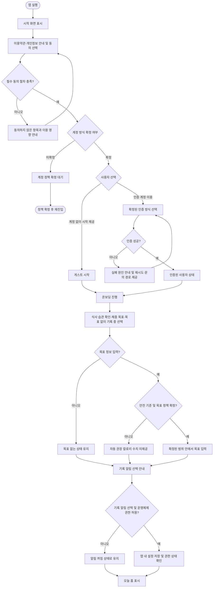
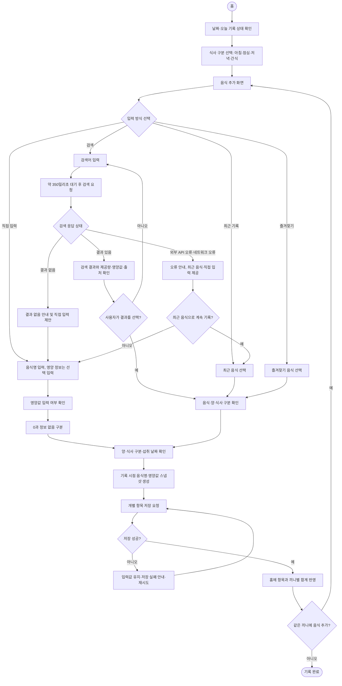
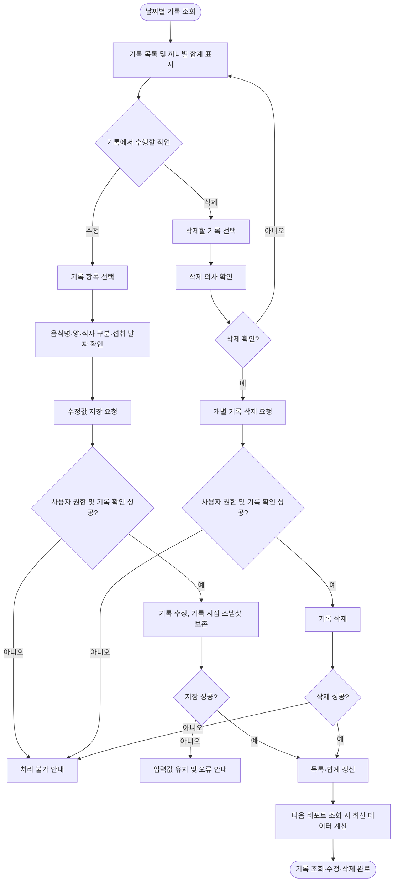
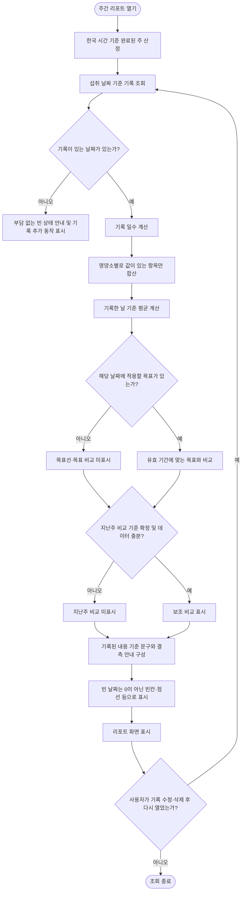
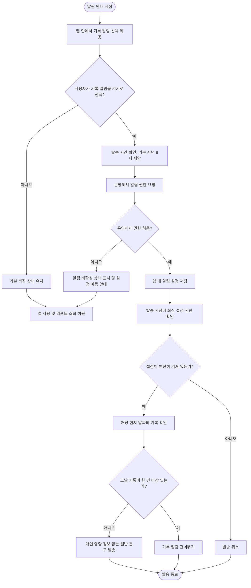
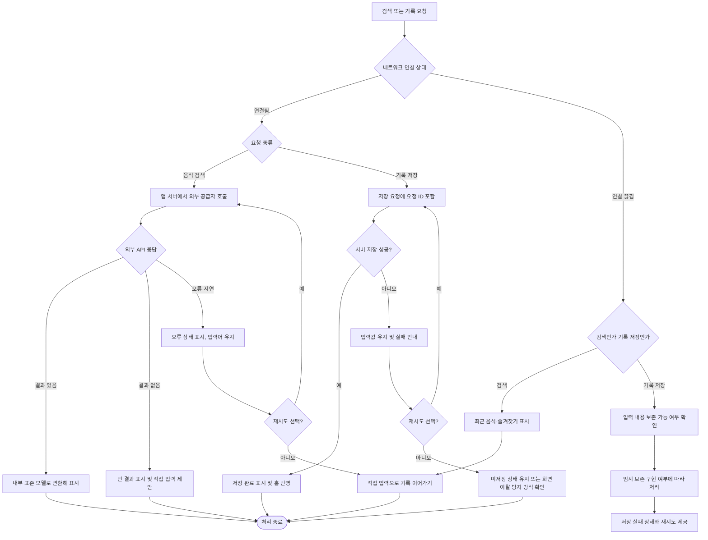
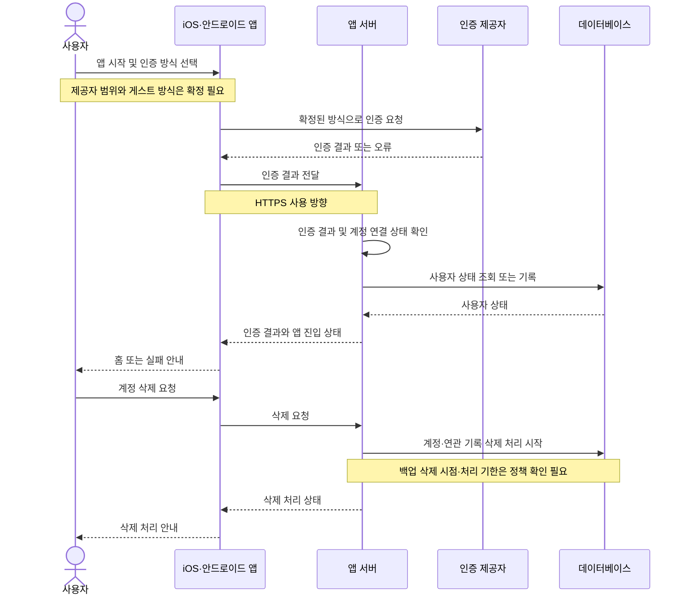
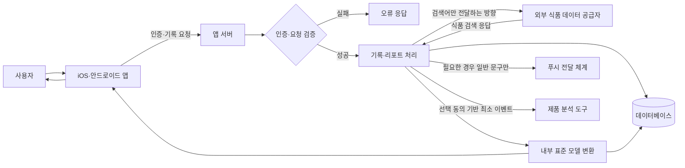
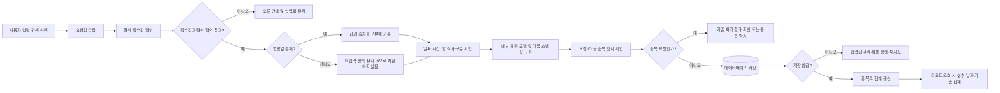
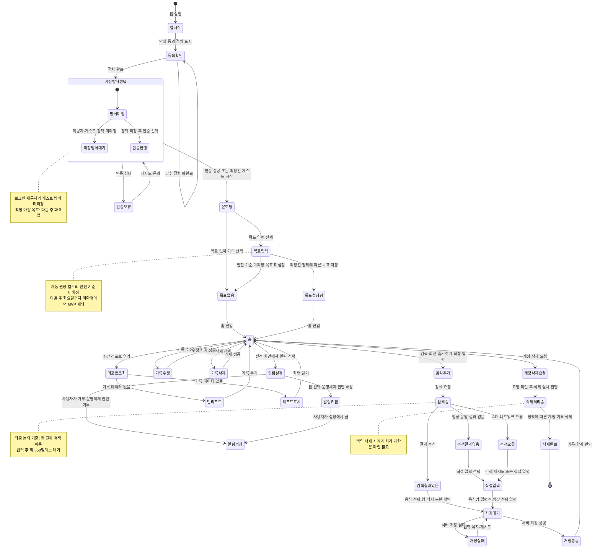

## 1. 문서 정보

| 항목 | 내용 |
|---|---|
| **문서명** | 식단 기록 앱 핵심 이용 흐름도 |
| **버전** | v1.0 |
| **작성일** | 2026-10-01 |
| **작성자** | 프로세스 설계팀 |
| **승인자** | 미정 |

> **표기 원칙:** 회의에서 명시적으로 정리된 범위와 미결정 항목을 구분했습니다. 구현 방식이나 운영 세부가 회의에서 확정되지 않은 경우에는 **추정 필요**로 표시했습니다. 단계별 처리 시간도 별도 합의가 없는 한 **추정 필요**입니다. 다이어그램의 입력·출력은 회의에서 논의된 사용자 흐름과 데이터 구조를 바탕으로 정리했습니다.

## 2. 프로세스 개요

### 2.1 프로세스 정보

이 문서는 체중 관리를 원하는 일반 사용자가 식사 기록을 시작하고, 음식 정보를 찾아 기록한 뒤, 기록을 수정·삭제하고, 주간 리포트에서 다시 확인하는 MVP 핵심 흐름을 정의합니다. 이 프로세스의 목적은 영양 상담이나 정확한 섭취량 측정이 아니라 **기록 부담을 낮추고, 사용자가 기록한 내용을 신뢰할 수 있게 보존하는 것**입니다. 영양 정보는 참고값으로 다루며, 실제 섭취량을 확정적으로 보여주지 않습니다.

범위에는 iOS·안드로이드 공통 앱에서의 가입·온보딩, 선택적 목표 설정, 홈, 음식 검색·최근 기록·즐겨찾기·직접 입력, 식사 기록·수정·삭제, 주간 리포트, 선택형 기록 알림, 계정 삭제가 포함됩니다. 한 식사 구분에 여러 음식 항목을 추가하고, 각 항목은 개별 저장합니다. MVP의 사진 기능은 회의 후반에 **식사당 사진 한 장 첨부**를 포함하는 방향으로 정리됐으나, 핵심 기록 저장과 분리하고 5주 차까지 개발 여건을 확인해 통합하는 순서입니다. 사진 자동 인식은 출시 필수 기능으로 확정되지 않았으며, 기술 검증 결과와 일정 영향을 보고 판단합니다.

사진 자동 인식, 바코드, 친구 공유, 전문가 상담, 운동·수면 기록, 건강 플랫폼 연동, 체중 일별 추적, 결제 및 광고는 MVP 범위에서 제외합니다. 자동 권장 칼로리는 전문가 검토가 완료되지 않으면 MVP에서 제외하기로 했고, 사용자가 목표 없이 기록하는 흐름은 허용합니다. 외부 식품 API 공급처, 로그인 제공자 범위, 오프라인 임시 보존의 구현 수준, 기록 전체 초기화, 지원 OS 버전, 데이터 내보내기, 보관·삭제 세부 정책 등은 확정되지 않았습니다.

프로세스는 사용자 앱, 앱 서버, 데이터베이스, 외부 식품 데이터 공급자, 푸시 전달 체계, 제품 분석 도구 및 스토어 심사 절차와 관계됩니다. 외부 식품 API에는 검색어만 전달하고 사용자 식별 정보나 식사 기록은 전달하지 않는 방향입니다. 기록 당시 음식명과 영양값은 스냅샷으로 저장해 외부 음식 정보가 변경되어도 기존 기록과 리포트가 바뀌지 않도록 합니다. 외부 공급자의 약관·보관 조건·재표시 권한, 개인정보 처리와 국외 이전 여부는 출시 전 확인해야 합니다.

| 항목 | 내용 |
|---|---|
| **프로세스 명** | 식사 기록 및 기록 기반 주간 리포트 제공 |
| **프로세스 ID** | P-001 |
| **목적** | 사용자가 식사를 쉽게 기록하고, 기록된 내용과 주간 패턴을 다시 확인할 수 있도록 지원 |
| **소유자** | PM — 프로세스 전반과 요구사항 관리. 상세 운영 책임자는 미정 |
| **관련 시스템** | iOS·안드로이드 공통 앱, 앱 서버, 데이터베이스, 외부 식품 데이터 API, 푸시 전달 체계, 선택적 제품 분석 도구, 앱 스토어·플레이 스토어 |
| **선행 프로세스** | MVP 범위·화면·데이터 구조 확정, 외부 식품 API 및 인증 방식 검토, 개인정보·보안 검토 |
| **후행 프로세스** | 베타 검증, 오류·데이터 품질 개선, 공개 출시 및 출시 후 지표·과금 방향 검토 |

### 2.2 프로세스 목표

- [ ] 사용자가 목표 설정을 강요받지 않고 앱을 시작할 수 있게 한다.
- [ ] 검색 결과가 없거나 외부 API가 실패해도 직접 입력이나 최근 기록으로 기록을 이어갈 수 있게 한다.
- [ ] 영양 정보의 미입력과 실제 값 0을 구분하고, 기록 자체는 영양 정보 없이도 저장할 수 있게 한다.
- [ ] 기록 당시 음식명과 영양값을 보존해 과거 기록과 리포트의 일관성을 유지한다.
- [ ] 기록 일수, 기록한 날 기준 평균 영양값, 끼니별 기록 패턴을 중립적인 표현으로 제공한다.
- [ ] 계정·기록·검색어·분석 정보의 처리 범위를 구분하고 개인정보 노출을 최소화한다.

## 3. 주요 시나리오 플로우

### 3.1 앱 시작·가입·온보딩·로그인 플로우

#### 프로세스 설명

프로세스는 사용자가 앱을 처음 실행하거나 기존 계정으로 앱에 진입할 때 시작합니다. 종료 조건은 홈 화면 진입입니다. 홈 진입 후에는 목표가 설정되지 않은 상태에서도 식사 기록을 이용할 수 있어야 합니다. 앱은 iOS와 안드로이드에서 제공하며, 리액트 네이티브 기반의 공통 앱으로 개발하는 방향이 정리됐습니다.

사용자와 앱이 직접 수행하는 단계는 화면 안내, 동의 선택, 인증 방식 선택, 목표 설정 선택입니다. 로그인 방식은 회의에서 게스트 모드와 이메일·애플·구글 로그인이 논의됐으나 확정되지 않았습니다. 후반부에는 이메일·애플·구글 인증을 우선 검토하고 카카오는 2차로 두는 안이 정리됐지만, 최종 제공자 범위는 다음 주 화요일까지 동결하기로 했습니다. 따라서 이 문서에서는 가입 절차나 인증 제공자를 확정된 기능으로 단정하지 않습니다.

서비스 이용약관, 개인정보 처리 동의, 푸시 알림 수신 동의는 서로 구분하고, 선택 동의를 미리 선택하지 않는 방향입니다. 알림 동의는 가입이나 기본 이용의 전제 조건이 아니며, 알림을 원하지 않는 사용자도 앱을 계속 사용할 수 있어야 합니다. 게스트 계정의 저장 위치, 앱 삭제 시 데이터 처리, 게스트 기록과 인증 계정의 병합 방식은 미정입니다.

완료 기준은 사용자에게 필요한 약관·개인정보 안내를 제공하고, 회의에서 확정될 계정 정책에 따른 시작 절차를 거쳐 홈에 도달하는 것입니다. 회원 생성 방식, 인증 실패 시 복구 방법, 세션 유지 기준은 구현·정책 확정이 필요합니다. 가입 완료까지의 처리 시간과 온보딩 소요 시간은 **추정 필요**입니다.

#### 단계별 상세

| 단계 | 활동 | 담당 | 입력 | 출력 | 완료 기준 | 소요 시간 |
|---:|---|---|---|---|---|---|
| 1 | 앱 실행 및 시작 화면 표시 | 사용자·앱 | 앱 실행, 기기·앱 상태 | 시작 화면 | 시작 화면 표시 | 추정 필요 |
| 2 | 이용 안내 및 필수·선택 동의 항목 확인 | 사용자·앱 | 이용약관, 개인정보 처리 안내, 동의 항목 | 동의 선택 상태 | 필수 동의 항목의 처리 방식 확인. 선택 동의는 미리 선택하지 않음 | 추정 필요 |
| 3 | 계정 없이 시작 또는 인증 방식 선택 | 사용자·앱 | 계정 정책, 사용자의 선택 | 시작 방식 선택 | 로그인·게스트 제공 범위가 확정된 뒤 해당 방식으로 진행 | 정책 미정 |
| 4 | 인증 제공자 인증 또는 게스트 초기화 | 앱·인증 제공자·앱 서버 | 인증 정보 또는 게스트 식별 정보 | 인증 결과 또는 게스트 상태 | 인증 성공 또는 게스트 사용 가능 상태 | 추정 필요 |
| 5 | 온보딩에서 시작 방식 선택 | 사용자·앱 | 식사 습관 확인, 체중 목표 설정, 목표 없이 기록 선택지 | 선택한 시작 방식 | 목표 입력을 건너뛰어도 다음 단계로 진행 | 추정 필요 |
| 6 | 프로필·목표 정보 선택 입력 | 사용자·앱 | 선택한 경우에 한해 필요한 프로필·목표 정보 | 저장 요청값 또는 입력 없음 | 필수 입력을 강제하지 않음. 자동 권장 칼로리 기준 미확정 시 수치를 만들지 않음 | 추정 필요 |
| 7 | 알림 안내와 선택 | 사용자·앱 | 기록 알림 안내, 기본 시간 저녁 8시 제안 | 앱 내 알림 선택 상태 | 사용자가 선택하지 않아도 가입·앱 이용 가능. 기본값은 꺼짐 | 추정 필요 |
| 8 | 홈으로 이동 | 앱 | 계정·프로필·목표·알림 상태 | 오늘 홈 | 오늘 기록 상태와 기록 동작 이용 가능 | 추정 필요 |

#### Mermaid 다이어그램

#### 상세 설명

1. 로그인 제공자, 게스트 계정의 저장 위치, 게스트 기록 병합은 미정입니다. 계정 기능의 상태와 선택지는 이 결정이 끝나기 전까지 화면·개발 요구사항으로 확정할 수 없습니다.
2. 온보딩은 목표 입력을 강요하지 않습니다. 자동 칼로리 목표의 안전 기준을 전문가 검토로 확정하지 못하면, 다음 주 화요일까지의 합의에 따라 자동 칼로리 목표를 MVP에서 제외합니다.
3. 약관·개인정보 동의와 푸시 선택은 별개입니다. 알림을 켜지 않거나 운영체제 권한을 거부해도 앱 이용은 계속 가능해야 합니다.
4. 인증 방식별 오류 문구, 인증 재시도 횟수, 세션 만료 기준, 게스트 데이터 병합 규칙은 회의에서 확정되지 않았으므로 **추정 필요**입니다.

### 3.2 홈·음식 검색·직접 입력·식사 기록 플로우

#### 프로세스 설명

프로세스는 사용자가 홈에서 기록할 날짜와 식사 구분을 확인하고, 음식 추가를 시작하면서 열립니다. 음식 추가 경로는 검색, 최근 기록, 즐겨찾기, 직접 입력입니다. 검색을 이용할 수 없거나 검색 결과가 없더라도 기록을 중단시키지 않고 직접 입력으로 이어지도록 합니다. 검색 결과를 자동으로 선택하거나 비슷한 이름의 첫 결과를 자동 저장하지 않습니다.

음식 검색은 최종 논의 기준으로 한 글자 검색을 허용하고, 입력 후 약 350밀리초 대기하는 방식이 제안됐습니다. 최근 음식과 캐시를 활용하는 방안도 함께 논의됐으며, 캐시 보관 기간과 호출 제한은 공급자 계약 확인이 필요합니다. 검색 결과에는 가능한 경우 음식명, 제공량, 칼로리, 출처를 보여주되 출처의 노출 방식과 제공량 누락 시 처리 기준은 공급자 약관 및 UI 확정이 필요합니다.

사용자는 아침·점심·저녁·간식 중 하나를 선택합니다. 현재 시각에 따른 식사 구분은 추천일 뿐이며 사용자가 저장 전에 바꿀 수 있습니다. 검색 음식에 기준 제공량이 있으면 이를 표시하고 배수로 양을 조절합니다. 직접 입력 음식은 1회분을 기본으로 하며, 영양값은 모르면 비워도 됩니다. 0과 미입력을 구분하고, 영양값이 없는 항목도 기록으로 저장합니다.

한 식사 구분에는 여러 음식 항목을 추가할 수 있습니다. 항목마다 개별 저장하고, 같은 날짜와 식사 구분의 항목은 함께 합산해 표시합니다. 생성 시각과 실제 섭취 날짜는 구분하며, 섭취 날짜를 기준으로 리포트를 계산합니다. 미래 날짜 기록은 막는 방향으로 논의됐습니다. 사용자의 화면에서 과거 날짜를 어디까지 탐색하게 할지는 확정이 필요하며, 회의에서는 최근 7일 탐색과 날짜 선택기를 함께 논의했습니다.

#### 단계별 상세

| 단계 | 활동 | 담당 | 입력 | 출력 | 완료 기준 | 소요 시간 |
|---:|---|---|---|---|---|---|
| 1 | 홈에서 날짜·오늘 기록 상태 확인 | 사용자·앱 | 사용자 계정, 선택 날짜, 해당 날짜의 기록 | 날짜별 기록 목록 및 끼니별 합계 | 기록 상태와 기록 추가 동작 표시 | 추정 필요 |
| 2 | 음식 추가 시작 | 사용자 | 식사 구분 또는 식사 추가 동작 | 음식 추가 화면 | 검색·최근·즐겨찾기·직접 입력 경로 제공 | 추정 필요 |
| 3 | 입력 방식 선택 | 사용자 | 검색어, 최근 항목, 즐겨찾기 항목, 직접 입력 선택 | 선택된 입력 경로 | 선택한 경로에 맞는 입력 화면 제공 | 추정 필요 |
| 4 | 음식 검색 요청 | 앱·앱 서버 | 검색어. 외부 API 호출 시 사용자 ID·식사 기록은 제외하는 방향 | 내부 표준 모델로 변환한 검색 결과 | 검색 결과 또는 빈 결과·오류 상태 구분 | 약 350밀리초 대기 후 요청을 보내는 안. 응답 시간은 추정 필요 |
| 5 | 검색 결과 확인 또는 직접 입력 전환 | 사용자·앱 | 검색 결과, 검색 실패·빈 결과 상태 | 선택한 음식 또는 직접 입력 화면 | 사용자가 직접 결과를 선택하거나 직접 입력으로 이동 | 추정 필요 |
| 6 | 음식·양·식사 구분 입력 | 사용자 | 음식, 제공량, 배수, 식사 구분, 섭취 날짜 | 저장할 식사 음식 항목 | 양과 식사 구분 확인. 메모·그램 환산·자유 단위 입력은 MVP 제외 방향 | 추정 필요 |
| 7 | 영양 정보 확인 또는 생략 | 사용자·앱 | 음식 데이터의 영양값 또는 직접 입력한 값 | 영양값, 출처, 결측 상태 | 값이 없을 때 0으로 저장하지 않고 비어 있는 상태로 유지 | 추정 필요 |
| 8 | 식사 기록 저장 요청 | 앱 | 사용자·날짜·식사 구분·음식 항목·영양값 스냅샷·요청 ID | 서버 저장 요청 | 중복 저장 방지용 요청 ID 포함 방안 반영 | 추정 필요 |
| 9 | 저장 결과 확인 및 화면 반영 | 앱 서버·앱 | 저장 요청과 처리 결과 | 저장 완료 또는 실패 상태 | 성공 시 목록·합계 반영. 실패 시 입력값 유지 및 재시도 안내 | 추정 필요 |
| 10 | 추가 음식 기록 또는 종료 | 사용자·앱 | 같은 날짜·식사 구분의 추가 음식 여부 | 추가된 항목 또는 홈 복귀 | 한 끼에 여러 항목을 추가하거나 홈으로 복귀 | 추정 필요 |

#### Mermaid 다이어그램

#### 상세 설명

1. 검색 결과가 없는 경우와 외부 API 오류는 서로 다른 상태로 처리합니다. 두 경우 모두 직접 입력 또는 최근 기록을 이용할 수 있어야 하며, 오류를 검색 결과 없음으로 오인하게 해서는 안 됩니다.
2. 외부 API에 전달되는 데이터는 검색어만으로 제한하는 방향입니다. 공급자에게 검색어가 전달되고 보관될 수 있는지, 사용자 고지·개인정보 처리방침에 어떻게 반영할지는 계약 및 법무 검토가 남아 있습니다.
3. 직접 입력은 음식명만으로도 저장할 수 있습니다. 칼로리나 탄단지 값이 없는 기록은 기록 개수에는 포함하지만 해당 영양소 합계에서는 제외합니다. 각 영양소는 값이 있는 항목만 따로 계산합니다.
4. 기록 저장이 실패하면 화면을 닫거나 입력값을 버리지 않습니다. 요청 ID를 이용한 중복 방지, 임시 보존, 자동 재시도 중 어느 수준을 구현할지는 기술 난이도 산정이 필요합니다. 완전한 오프라인 동기화는 MVP에서 제외하는 방향입니다.

### 3.3 기록 조회·수정·삭제 플로우

#### 프로세스 설명

사용자는 홈이나 날짜별 기록 화면에서 저장된 식사 항목을 확인하고, 잘못 입력한 음식명·양·식사 구분·섭취 날짜 등을 수정하거나 개별 기록을 삭제할 수 있습니다. 기록 목록에는 식사 구분별 항목과 합계가 표시되며, 영양값이 없는 기록은 삭제된 기록처럼 취급하지 않습니다.

기록을 수정할 때는 최신 음식 마스터 정보를 자동으로 다시 적용하지 않습니다. 기록 당시 음식명과 영양값 스냅샷을 유지하여 외부 DB 변경으로 과거 수치가 조용히 달라지는 일을 막습니다. 사용자가 직접 최신 음식 정보로 갱신하는 기능은 MVP에 포함하지 않습니다.

기록 삭제는 MVP에 포함하며, 계정 삭제와는 별도의 동작입니다. 계정을 유지한 채 모든 기록을 초기화하는 기능은 삭제 대상과 의미를 더 정해야 하므로 필수 범위에서 제외하고, 난이도와 사용자 테스트 결과에 따라 추가 후보로 둡니다. 삭제 전 확인 방식, 삭제 복구 가능 여부, 서버 삭제 완료 시점은 확정되지 않았습니다.

#### 단계별 상세

| 단계 | 활동 | 담당 | 입력 | 출력 | 완료 기준 | 소요 시간 |
|---:|---|---|---|---|---|---|
| 1 | 날짜별 기록 목록 열기 | 사용자·앱 | 선택 날짜 | 해당 날짜 기록과 끼니별 합계 | 선택 날짜의 기록 표시 | 추정 필요 |
| 2 | 수정 또는 삭제할 항목 선택 | 사용자 | 기록 항목 | 상세 화면 또는 동작 선택 | 대상 기록 식별 | 추정 필요 |
| 3 | 수정값 입력 또는 삭제 확인 | 사용자·앱 | 음식명·양·구분·날짜 변경값 또는 삭제 선택 | 수정·삭제 요청 내용 | 사용자가 변경·삭제 의사를 확인 | 추정 필요 |
| 4 | 소유자·대상 기록 확인 | 앱 서버 | 사용자 식별 정보, 기록 식별 정보 | 권한·대상 확인 결과 | 해당 사용자 소유 기록인지 확인 | 추정 필요 |
| 5 | 기록 수정 또는 삭제 | 앱 서버·데이터베이스 | 요청값 | 변경된 기록 또는 삭제 결과 | 수정 시 기록 스냅샷 규칙을 유지. 삭제 시 해당 기록 제거 | 추정 필요 |
| 6 | 리포트 집계 갱신 | 앱 서버 | 수정·삭제 후 기록 | 최신 집계 대상 데이터 | 다음 리포트 조회 시 변경 내용 반영 | 추정 필요 |
| 7 | 완료 상태 표시 | 앱 | 처리 결과 | 갱신된 목록 또는 오류 안내 | 변경·삭제 결과를 사용자가 확인 가능 | 추정 필요 |

#### Mermaid 다이어그램

#### 상세 설명

1. 수정은 기록 당시 저장한 음식명과 영양값을 기준으로 처리합니다. 외부 음식 DB의 최신 정보로 기존 기록을 자동 갱신하지 않습니다.
2. 삭제는 개별 기록 삭제와 계정 삭제로 구분합니다. 개별 기록을 삭제한 뒤 리포트 집계를 화면 진입 때 다시 계산하도록 하되, 캐시를 사용할 경우 갱신 조건은 추가 설계가 필요합니다.
3. 계정은 유지하면서 기록 전체를 초기화하는 기능은 MVP 필수 범위가 아닙니다. 음식 목록, 즐겨찾기, 목표, 설정 가운데 무엇을 초기화할지 합의되지 않아 구현 기준은 **추정 필요**입니다.
4. 기록 수정·삭제의 취소·복구 기능, 확인 단계의 화면 구성, 실제 삭제 처리 시간은 회의에서 확정되지 않았습니다.

### 3.4 주간 리포트 조회 플로우

#### 프로세스 설명

사용자가 주간 리포트를 열면 앱 서버는 저장된 식사 기록의 스냅샷을 기준으로 리포트 데이터를 계산합니다. 리포트는 한국 시간 기준 월요일부터 일요일까지의 완료된 주를 ‘지난주’로 다루며, 현재 주간 현황은 홈에서 확인하는 방향입니다. 기록을 생성한 시각이 아니라 사용자가 지정한 섭취 날짜를 기준으로 집계합니다.

리포트의 핵심 항목은 7일 중 기록한 일수, 기록된 날 기준 평균 칼로리, 목표가 있는 경우 목표 대비 평균, 끼니별 기록 패턴입니다. 칼로리와 탄수화물·단백질·지방을 중심으로 구성하되, 영양값은 각 영양소 값이 있는 기록만 따로 합산합니다. 기록이 없는 날은 0으로 표현하지 않으며, 영양 정보가 누락되어 합계가 불완전한 경우에는 별도 안내를 제공합니다.

리포트는 사용자가 열 때 계산하는 온디맨드 방식을 사용하고, 성능을 확인한 뒤 캐시를 검토합니다. 기록 수정·삭제 후 다시 열었을 때 최신 데이터가 반영돼야 합니다. 건강 점수, 좋음·나쁨 평가, 실패를 암시하는 표현은 사용하지 않으며, ‘기록된 내용 기준’임을 표시합니다.

지난주 비교는 데이터가 충분한 경우에만 보조로 제공하는 방향이지만, 최소 기록 기준은 확정되지 않았습니다. 목표 변경은 유효 시작일·종료일을 저장해 식사 날짜 당시의 목표를 적용하고, 목표가 없었던 날짜는 비교하지 않습니다. 데이터가 없거나 기준이 충족되지 않은 경우 화면 문구와 비교 노출 조건은 추가 확정이 필요합니다.

#### 단계별 상세

| 단계 | 활동 | 담당 | 입력 | 출력 | 완료 기준 | 소요 시간 |
|---:|---|---|---|---|---|---|
| 1 | 주간 리포트 진입 | 사용자·앱 | 리포트 화면 요청 | 리포트 조회 요청 | 조회 대상 주간 설정 | 추정 필요 |
| 2 | 조회 기간 산정 | 앱 서버 | 한국 시간 기준, 완료된 주 | 월요일~일요일 기간 | ‘지난주’ 기간이 명확히 산정됨 | 추정 필요 |
| 3 | 섭취 날짜 기준 기록 조회 | 앱 서버·데이터베이스 | 사용자·기간 | 해당 기간 식사 기록 | 생성 시각이 아닌 섭취 날짜로 조회 | 추정 필요 |
| 4 | 기록 일수·영양값 집계 | 앱 서버 | 기록 및 영양값 스냅샷 | 기록 일수, 영양소별 합계·평균 | 결측 영양값과 미기록 날짜를 구분 | 추정 필요 |
| 5 | 목표 이력 적용 | 앱 서버 | 목표 유효 기간, 식사 날짜 | 해당 날짜의 목표 비교값 | 목표가 있었던 날짜만 비교 | 추정 필요 |
| 6 | 데이터 충분성 판단 | 앱 서버 | 기록 일수·비교 기준 | 비교 가능 여부 | 지난주 비교 최소 기준은 확정 필요 | 미정 |
| 7 | 결과 문구·표시 생성 | 앱 서버·앱 | 집계 결과, 결측 여부 | 중립적인 리포트 화면 | 기록된 내용 기준 표시, 빈 날짜를 0으로 오인시키지 않음 | 추정 필요 |
| 8 | 화면 표시 및 갱신 | 앱 | 리포트 응답 | 리포트 표시 | 수정·삭제 후 다시 조회하면 최신 정보 표시 | 추정 필요 |

#### Mermaid 다이어그램

#### 상세 설명

1. 평균은 기록이 있는 날 기준으로 계산하며, 미기록 날짜를 0으로 넣지 않습니다. 화면에도 평균 기준을 표시해 실제 섭취량이나 일주일 전체 섭취량으로 오해하지 않도록 합니다.
2. 영양값 결측은 영양소별로 처리합니다. 예를 들어 칼로리가 없는 항목을 칼로리 합계에는 포함하지 않더라도, 단백질 값이 있다면 단백질 계산에는 포함할 수 있습니다.
3. 목표가 설정되지 않았거나 목표 변경 시점 이전인 날짜에는 목표 비교를 표시하지 않습니다. 목표 변경을 과거 기록에 소급 적용하지 않습니다.
4. 지난주 비교의 최소 기록 기준, 리포트 화면의 정확한 기간 선택 범위, 빈 상태 문구 외의 예외 문구는 추가 확정이 필요합니다. 별도 리포트 알림이나 이를 위한 정기 배치 작업은 MVP에서 제외하는 방향입니다.

### 3.5 기록 알림 설정·발송 플로우

#### 프로세스 설명

기록 알림은 사용자가 앱 안에서 선택한 경우에만 켤 수 있습니다. 기본값은 꺼짐이며, 약관 동의와 별개로 처리합니다. 온보딩이나 첫 기록 후 안내할 수 있으나, 운영체제 권한은 사용자가 실제로 알림을 켜기로 선택할 때 요청하는 방향입니다.

MVP에서 포함하는 것은 사용자가 선택한 시간의 하루 한 번 기록 알림입니다. 기본 시간은 저녁 8시로 제안됐지만 사용자는 설정에서 변경할 수 있어야 합니다. 알림 설정 화면에서 끄거나 시간을 바꾼 경우 발송 작업이 이전 설정을 따르지 않도록 최신 설정 상태를 확인합니다.

그날 식사 기록이 한 건 이상 있으면 기록 알림은 보내지 않습니다. 알림 문구에는 음식명·칼로리·체중 등 개인 영양 정보를 넣지 않습니다. 주간 리포트 알림은 앞선 논의에서 제외됐으며, 회의 후반부에는 사용자가 켠 경우의 주간 알림도 언급됐습니다. 이 문서에서는 MVP 의사결정인 **주간 리포트 푸시 제외**를 기준으로 합니다.

운영체제 권한을 거부했거나 알림이 꺼져 있어도 앱 사용과 리포트 조회는 가능해야 합니다. 사용자가 운영체제 설정에서 권한을 변경한 뒤 앱으로 돌아오는 경우의 상태 동기화 방식은 구현 세부 확인이 필요합니다. 발송 시간대별 예약 방식과 재시도·중복 방지 세부 구현은 **추정 필요**입니다.

#### 단계별 상세

| 단계 | 활동 | 담당 | 입력 | 출력 | 완료 기준 | 소요 시간 |
|---:|---|---|---|---|---|---|
| 1 | 알림 안내 표시 | 앱 | 온보딩 또는 첫 기록 완료 상태 | 알림 선택 안내 | 알림 없는 사용도 동등하게 선택 가능 | 추정 필요 |
| 2 | 앱 내 알림 선택 및 시간 설정 | 사용자·앱 | 켜기·끄기 선택, 발송 시각 | 앱 내 알림 설정 | 사용자가 명시적으로 선택한 경우에만 활성화 | 추정 필요 |
| 3 | 운영체제 권한 요청 | 앱·운영체제 | 사용자의 알림 켜기 선택 | 권한 허용·거부 상태 | 권한 결과를 앱 설정과 구분해 저장 | 추정 필요 |
| 4 | 발송 대상 및 시각 확인 | 앱 서버·푸시 전달 체계 | 사용자 설정, 푸시 권한, 사용자 시간대 | 발송 대상 | 최신 설정이 켜져 있고 권한 상태가 유효함 | 추정 필요 |
| 5 | 당일 기록 여부 확인 | 앱 서버·데이터베이스 | 해당 사용자 현지 날짜의 식사 기록 | 발송·건너뛰기 판단 | 한 건 이상 기록했으면 발송하지 않음 | 추정 필요 |
| 6 | 일반 문구 알림 발송 | 앱 서버·푸시 전달 체계 | 일반적인 알림 문구 | 사용자 기기 알림 | 개인 영양 정보가 본문에 없음 | 추정 필요 |
| 7 | 설정 변경·권한 거부 반영 | 사용자·앱 | 설정 변경, 운영체제 권한 상태 | 갱신된 알림 상태 | 끄기·권한 거부 상태에서 알림이 활성으로 보이지 않음 | 추정 필요 |

#### Mermaid 다이어그램

#### 상세 설명

1. 사용자가 알림을 원하지 않는 선택은 알림을 켜는 선택과 동등하게 제공해야 합니다. 알림 수신 동의는 이용약관이나 개인정보 처리 동의와 묶지 않습니다.
2. 운영체제 권한을 거부하면 앱 안에서 알림이 켜진 상태로 표시하지 않습니다. 설정 앱으로 이동하는 방법을 안내하는 세부 화면은 추가 설계가 필요합니다.
3. 발송 직전에 사용자의 최신 설정과 해당 날짜의 기록 여부를 확인합니다. 이미 알림을 끈 사용자에게 과거 예약이 발송되지 않도록 하는 방식은 개발 설계가 필요합니다.
4. MVP에서는 매일 기록 알림만 대상으로 합니다. 주간 리포트 푸시는 제외하고, 알림을 받지 않아도 사용자는 앱에서 리포트를 확인할 수 있습니다.

## 4. 예외 처리 플로우

### 4.1 주요 예외 시나리오

회의에서 발생 빈도를 추정한 내용은 없습니다. 따라서 빈도는 수치로 단정하지 않고 **미측정**으로 표시합니다. 사용자에게 보여줄 문구는 회의에서 직접 제안된 저장 실패 문구 외에는 예시이며, 최종 문구 확정이 필요합니다.

| 예외 상황 | 원인 | 빈도 | 처리 방법 | 사용자 피드백 | 복구 절차 |
|---|---|---|---|---|---|
| 인증 방식 미확정·제공자 인증 실패 | 로그인 방식·제공자 범위 미확정, 인증 제공자 장애 등 | 미측정 | 확정된 방식과 제공자만 노출. 실패 상태와 문의 경로 제공 | 문구 확정 필요 | 재시도 또는 문의. 게스트 대체 여부는 계정 정책에 따라 결정 |
| 약관·개인정보 동의 미완료 | 필수 동의 절차를 완료하지 않음 | 미측정 | 동의 항목과 선택 항목을 구분해 표시 | 문구 확정 필요 | 동의 항목 확인 후 다시 진행 |
| 외부 음식 API 검색 결과 없음 | 공급자 데이터에 항목이 없거나 검색어 불일치 | 미측정 | 빈 결과와 오류를 구분. 직접 입력·최근 기록 경로 제공 | 직접 입력 안내 | 음식명 직접 입력 또는 최근 기록 선택 |
| 외부 음식 API 오류·지연 | 공급자·네트워크 장애 또는 응답 지연 | 미측정 | 최근 음식·즐겨찾기·직접 입력으로 기록 계속. 입력어 유지와 로딩 상태 제공 | 재시도 안내 문구는 확정 필요 | 재시도 또는 검색을 중단하고 직접 입력 |
| 영양 정보 누락 | 음식 데이터에 일부 또는 전체 영양값이 없음 | 미측정 | 0과 미입력을 구분. 값이 있는 영양소만 집계 | “일부 음식 정보가 없어 영양소별 합계가 다를 수 있어요” 방향 | 기록은 유지하고 정보 없음 상태로 표시 |
| 기록 저장 실패 | 네트워크·서버 오류 등 | 미측정 | 입력값 유지. 실패 상태 표시. 요청 ID를 이용한 중복 방지 방안 반영 | “저장되지 않았어요. 다시 시도해 주세요” | 재시도. 임시 보존 수준은 기술 난이도 확인 필요 |
| 저장 중 중복 요청 | 사용자가 저장 버튼을 반복 선택하거나 재전송 | 미측정 | 요청 ID 등으로 중복 방지 | 처리 중·완료 상태 표시 | 결과 확인 후 한 건만 반영 |
| 날짜·시간 불일치 | 기록 생성 시각과 실제 섭취 날짜 차이, 시간대 변경 | 미측정 | 생성 시각과 섭취 날짜를 분리. 과거 날짜 자동 재계산 금지 방향 | 날짜 변경 안내는 설계 필요 | 기록 수정에서 날짜·시간 변경 |
| 목표 미설정 또는 목표 기준 미확정 | 사용자가 목표 없이 시작하거나 안전 기준 미완료 | 미측정 | 칼로리 게이지·목표 비교 미표시. 자동 권장 칼로리 미제공 | 목표 없이 기록 가능함을 안내 | 기록 흐름 이용. 전문가 검토 후 범위 확정 |
| 푸시 권한 거부·설정 불일치 | 운영체제 권한 거부, 사용자가 앱 안에서 알림을 끔 | 미측정 | 알림을 켠 상태로 오인하지 않도록 앱 설정 상태 분리 | 권한 설정 안내 문구 확정 필요 | 사용자가 설정에서 다시 켜도록 안내. 반복 권한 요청 방식은 확인 필요 |
| 계정·기록 삭제 처리 지연 | 서버·스토리지·백업 삭제가 비동기 처리될 수 있음 | 미측정 | 삭제 요청 상태와 처리 정책 안내. 토큰 비활성화 등 세부 구현 확인 | 완료 시점 안내 방식 미정 | 개인정보·운영 정책 확정 후 처리 |
| 외부 공급자 계약·라이선스 미확정 | 재표시·캐시·보관·비용·국외 처리 조건 확인 지연 | 일정 위험 | 금요일까지 미확정 시 임시 테스트 데이터로 개발. 2주 차 화요일까지 미정이면 출시 일정 위험으로 상향 | 사용자 안내 문구와 API 대체 범위 미정 | 내부 테스트 데이터 또는 공공 데이터 중심으로 범위 축소 검토 |
| 스토어 심사 지연·반려 | 스토어 검토 및 계정·권한 문제 | 일정 위험 | 7주 차 말 제출 목표, 9주 차 완충 고려 | 공개일은 심사 통과 전 약속하지 않음 | 반려 수정 후 재제출 |

### 4.2 네트워크·외부 API·저장 오류 처리

#### Mermaid 다이어그램

#### 상세 설명

네트워크가 끊긴 경우 음식 검색을 새로 수행할 수 없더라도 최근 음식이나 즐겨찾기를 보여주고, 직접 입력을 통해 기록을 계속할 수 있도록 합니다. 오프라인에서 작성한 기록을 완전히 동기화하는 기능은 충돌 처리 부담 때문에 MVP에서 제외하는 방향입니다. 다만 입력 도중 네트워크가 끊겨도 내용이 사라지지 않도록 임시 보존과 재시도 가능성을 검토합니다.

음식 검색 API 오류와 결과 없음은 별도 상태로 표시합니다. API가 실패했는데 “검색 결과 없음”으로 안내하면 사용자가 데이터가 없는 것으로 오해할 수 있습니다. 검색어 자체는 입력창에 유지하고, 직접 입력 경로를 제공합니다. 검색어의 캐시 보관 기간과 API 호출 제한은 공급자 계약 확인이 필요합니다.

기록 저장은 서버 응답이 성공한 뒤 완료 상태를 표시합니다. 실패하면 입력값을 유지하고, 회의에서 제안된 실패 안내와 재시도 동작을 제공합니다. 재전송 시 중복 기록이 생기지 않도록 요청 ID를 활용하는 방안이 논의됐습니다. 임시 저장의 보존 기간, 앱을 닫은 뒤 복원 여부, 재시도 횟수는 회의에서 확정되지 않았습니다.

응답 시간 기준으로는 검색 API가 대부분 2초 안에 응답하도록 하는 목표가 제안됐습니다. 지연 시 로딩 상태와 입력어 유지를 제공하고, 3초 이상 무응답이면 재시도 안내를 하는 안이 논의됐습니다. 이는 베타 품질 목표·설계 제안으로 다뤄졌으며, 최종 성능 기준 및 외부 공급자 계약상 보장 여부는 확인이 필요합니다.

### 4.3 오류 코드 매핑

아래 코드는 구현 시 사용할 수 있는 **제안**입니다. 회의에서 실제 오류 코드 체계나 코드값이 합의되지는 않았습니다.

| 오류 코드 | HTTP 상태 | 설명 | 사용자 메시지 | 조치 |
|---|---:|---|---|---|
| `AUTH_UNCONFIRMED` | 추정 필요 | 인증 방식·계정 정책 미확정 또는 인증 상태 확인 필요 | 문구 확정 필요 | 인증 정책 확정 후 구현 범위 결정 |
| `AUTH_FAILED` | 추정 필요 | 인증 제공자 인증 실패 | 로그인 상태를 확인해 주세요 — 문구 제안 | 재시도·문의 경로 제공 |
| `FOOD_SEARCH_EMPTY` | 추정 필요 | 검색은 정상 처리됐으나 결과 없음 | 찾는 음식이 없어요. 직접 입력할 수 있어요 — 문구 제안 | 직접 입력 또는 최근 음식 이용 |
| `FOOD_API_UNAVAILABLE` | 추정 필요 | 외부 식품 API 오류·지연 | 검색을 완료하지 못했어요. 다시 시도하거나 직접 입력해 주세요 — 문구 제안 | 입력어 유지, 재시도·직접 입력 |
| `RECORD_SAVE_FAILED` | 추정 필요 | 기록 저장 실패 | 저장되지 않았어요. 다시 시도해 주세요 — 회의에서 제안된 문구 | 입력값 유지, 재시도 |
| `RECORD_DUPLICATE` | 추정 필요 | 재전송 등으로 중복 기록 위험 발생 | 중복 저장 여부를 확인해 주세요 — 문구 제안 | 요청 ID로 중복 방지·기록 조회 |
| `NUTRITION_MISSING` | 추정 필요 | 영양값 일부 또는 전체 누락 | 일부 음식 정보가 없어 영양소별 합계가 다를 수 있어요 | 해당 값은 합계에서 제외하되 기록은 유지 |
| `PUSH_PERMISSION_DENIED` | 추정 필요 | 운영체제 푸시 권한 거부 | 알림 없이도 앱을 이용할 수 있어요 — 문구 제안 | 알림 끈 상태 유지·설정 안내 |
| `DELETE_PROCESSING` | 추정 필요 | 계정 또는 연관 데이터 삭제 처리 중 | 삭제 완료 시점을 안내하는 문구 필요 | 처리 상태·보관 정책 확정 후 반영 |
| `STORE_REVIEW_DELAY` | 해당 없음 | 스토어 심사 지연·반려 | 내부 일정 위험으로 관리 | 공개일 확정 보류, 수정·재제출 |

## 5. 시스템 간 연동 플로우

### 5.1 인증 연동

인증은 iOS·안드로이드 앱과 인증 제공자, 앱 서버 및 데이터베이스 사이에서 수행됩니다. 회의에서는 이메일·애플·구글을 우선 검토하고 카카오는 2차 우선순위로 두는 안이 논의됐으나, 최종 제공자와 게스트 모드 여부는 미정입니다. 외부 로그인 제공자의 심사 요건, 인증 SDK 범위, 계정 연결 방식, 게스트 데이터 저장·병합 방식은 확정 후 반영해야 합니다.

통신은 HTTPS 사용을 전제로 논의됐습니다. 토큰 종류·유효기간·저장 방식, 인증 서버 통신 방식, 재인증 정책은 회의에서 확정되지 않았으며 구체화가 필요합니다. 계정 삭제 시에는 로그인과 푸시 토큰을 비활성화하고 계정·식사 기록을 함께 삭제하는 방향이 정리됐지만, 백업에서의 삭제 시점과 완료 처리 기한은 정책 확인이 필요합니다.

인증 제공자 장애가 발생하면 신규 로그인이나 인증 갱신에 영향을 줄 수 있습니다. 회의에서 인증 실패를 앱 사용 중에 어떻게 복구할지, 게스트로 전환할지, 계정 연결을 어디까지 지원할지는 결정하지 않았습니다. 따라서 장애 대체 경로는 **추정 필요**이며, 해당 경로를 확정하기 전에는 계정 정책을 완료된 것으로 간주하지 않습니다.

#### 순서도

#### 상세 설명

1. 앱은 확정된 인증 제공자만 표시해야 합니다. 애플·구글·이메일의 조합과 게스트 모드 제공 여부가 미정이므로, 최종 로그인 화면과 오류 처리 분기는 확정 이후 구현해야 합니다.
2. 인증 결과와 앱 계정의 연결·생성 방식은 앱 서버에서 확인합니다. 실제 요청 형식, 토큰 규격과 만료 기준은 회의에서 합의되지 않았으므로 **추정 필요**입니다.
3. iOS 외부 로그인 심사 요건과 제공자별 계정 연결·탈퇴 처리는 확인 과제입니다. 인증 제공자 한 곳에 장애가 발생했을 때 다른 인증 방법이나 게스트 모드로 전환할 수 있는지는 미정입니다.
4. 계정 삭제는 앱 안에서 요청할 수 있게 하고, 계정과 식사 기록을 함께 삭제하는 것이 기본 방향입니다. 백업 삭제 시점, 요청 후 완료까지의 시간, 삭제 대기 상태의 세부 정책은 법무·개인정보 검토가 필요합니다.

### 5.2 데이터 연동

#### Mermaid 다이어그램

#### 상세 설명

1. 기록 생성·수정·삭제와 리포트 집계는 앱 서버와 데이터베이스를 중심으로 처리합니다. 영양 정보는 기록 당시 스냅샷을 사용하며, 리포트 표시 과정에서 외부 식품 API를 호출하지 않습니다.
2. 음식 검색은 앱 서버를 거쳐 외부 공급자와 연동하는 방향입니다. 외부 공급자에게는 검색어만 보내고 사용자 식별 정보나 기록 데이터는 전달하지 않도록 설계합니다. 공급자 약관의 검색어 보관·처리 조건, 재표시 권한, 캐시 허용 기간, 호출 제한은 미확정입니다.
3. 외부 응답은 앱에 그대로 노출하지 않고 내부 표준 모델로 변환합니다. 내부 모델에는 음식 식별 정보, 표시 이름, 제공량, 영양값, 출처 등 필요한 항목을 담는 방향으로 논의됐으나, 최종 필드와 데이터 보존 규칙은 API 검토 후 확정해야 합니다.
4. 제품 분석은 선택적으로 거부할 수 있게 하고 음식명·칼로리·몸무게·자유 입력 메모를 포함하지 않는 방향입니다. 보안·장애 대응 로그는 제품 분석과 분리하고, 외부 분석 업체의 데이터 처리 위치와 보관 기간은 확인해야 합니다.

## 6. 비즈니스 로직 플로우

### 6.1 데이터 처리 플로우

#### 데이터 수집·검증·변환·저장

식사 기록 데이터는 사용자가 선택한 음식 또는 직접 입력한 음식, 식사 구분, 섭취 날짜·시간, 양, 가능한 영양값으로 구성합니다. 직접 입력 음식은 음식명만으로도 저장할 수 있습니다. 영양 정보가 없으면 숫자 0을 대신 저장하지 않고 미입력 상태로 유지합니다. 영양 정보 출처도 저장하는 방향이 논의됐습니다.

외부 음식 API 응답은 앱에 그대로 전달하지 않고 내부 표준 모델로 변환합니다. 외부 음식의 최신 정보와 기록 당시 사용자가 선택한 음식명·영양값을 분리합니다. 기록 시점의 스냅샷을 보존해 외부 DB가 변경되어도 과거 식사 기록과 리포트가 자동으로 바뀌지 않게 합니다.

식사 날짜는 저장 시점의 사용자 현지 날짜를 기본값으로 하고, 사용자가 수정할 수 있도록 하는 방향입니다. 데이터베이스에는 UTC 시각을 저장하고 프로필에 시간대를 보관하는 구조가 논의됐습니다. 시간대 변경으로 과거 식사 날짜를 자동 재계산하지 않습니다. 기록 생성 시각과 섭취 날짜는 별도로 저장하며, 리포트는 섭취 날짜를 기준으로 계산합니다.

저장 전 필수 검증 규칙, 중복 요청 판정 기준, 사용자가 입력한 수치의 범위 검증, 과거 날짜 허용 범위는 세부 확정이 필요합니다. 미래 기록은 막는 방향으로 논의됐고, 기록 생성일 이전의 섭취 날짜 입력은 허용하는 방향으로 정리됐습니다. 삭제 요청, 오류 로그, 접근 권한은 개인정보 처리 원칙과 함께 점검해야 합니다.

#### Mermaid 다이어그램

#### 상세 설명

1. 직접 입력 음식의 음식명은 저장에 필요한 핵심 입력입니다. 영양값은 선택 입력이며, 미입력은 `0`과 구분합니다. 값이 없는 항목도 식사 기록으로 저장하고, 영양 합계에서는 해당 영양소 계산에서 제외합니다.
2. 외부 공급자 응답은 내부 표준 모델로 변환합니다. 공급처별 식별자와 데이터 구조를 내부 데이터 구조에서 분리하는 어댑터 방식은 공급자 변경에 대비하기 위한 설계 방향입니다.
3. 식사 기록에는 기록 당시 음식명·양·단위·영양값 스냅샷과 출처를 보존합니다. 외부 데이터가 변경되어도 과거 기록과 리포트는 자동으로 수정하지 않습니다. 사용자가 최신 정보를 불러오는 기능은 MVP 범위에서 제외합니다.
4. 날짜·수량·영양값의 입력 허용 범위와 잘못된 값의 거부 기준은 회의에서 정하지 않았습니다. 숫자 검증, 최대·최소값, 날짜 제한 등은 **추정 필요**이며, 확정 전 임의 기준을 요구사항으로 적용하지 않습니다.
5. 로그에는 식사 내용이나 민감한 프로필 값을 남기지 않는 방향입니다. 오류 진단은 앱 버전·플랫폼·오류 코드·요청 ID 등 필요한 정보 중심으로 구성하고, 운영자가 사용자 기록을 볼 때는 동의·권한 승인·접근 로그를 요구하는 방안이 논의됐습니다.

### 6.2 상태 전이 다이어그램

#### Mermaid 다이어그램

#### 상태 정의와 전이 기준

| 상태 | 의미 | 다음 상태 조건 |
|---|---|---|
| 앱 시작 | 앱 실행 직후 | 안내·동의 절차 표시 |
| 계정 방식 선택 | 로그인 또는 게스트 시작 방식을 정하는 상태 | 제공자·게스트 정책 확정 후 해당 방식으로 진행 |
| 인증 진행 | 확정된 인증 방식으로 사용자 확인 | 성공 시 온보딩, 실패 시 인증 오류 |
| 목표 없음 | 사용자가 목표 없이 시작했거나 자동 목표 기준이 미확정인 상태 | 홈에서 기록 가능 |
| 목표 설정됨 | 확정된 정책에 따라 목표가 저장된 상태 | 홈과 목표 기반 비교에 사용 |
| 검색 중 | 외부 식품 데이터 또는 캐시를 이용해 음식 검색 중 | 결과 있음·결과 없음·오류 중 하나 |
| 저장 대기 | 음식·양·날짜·식사 구분이 정리되어 저장 요청 중 | 성공 또는 실패 |
| 저장 실패 | 서버 저장이 완료되지 않은 상태 | 입력 유지 후 재시도 또는 복구 안내 |
| 리포트 표시 | 완료된 주의 기록 기반 리포트 표시 | 화면 종료 또는 기록 변경 후 재조회 |
| 알림 꺼짐 | 사용자 선택 또는 운영체제 권한 거부로 발송하지 않는 상태 | 사용자가 앱 안에서 다시 설정하는 경우에만 켜짐 |
| 삭제 처리 중 | 계정·연관 기록 삭제 요청이 처리되는 상태 | 처리 정책에 따른 삭제 완료 |

#### 상세 설명

회원 상태 전이에는 일반적인 이메일 가입 완료, 비밀번호 변경, 인증 토큰 발급 같은 세부 절차를 넣지 않았습니다. 회의에서는 이메일·애플·구글·게스트 방식이 논의됐지만, 로그인 제공자와 게스트 저장·병합 방식은 확정되지 않았기 때문입니다.

기록 상태는 검색 결과와 API 오류를 구분합니다. 결과가 없는 상태에서는 직접 입력을 선택할 수 있고, 검색 오류 상태에서도 입력어를 유지한 채 다시 시도하거나 직접 입력할 수 있습니다. 음식 기록은 저장 성공이 확인되기 전에는 완료 상태로 표시하지 않습니다.

리포트 상태는 데이터가 없는 경우와 데이터가 있는 경우를 나눕니다. 데이터가 없는 경우에는 0으로 계산하지 않고 부담이 적은 안내와 기록 추가 동작을 제공합니다. 데이터가 있는 경우에도 기록한 날짜 수와 영양값이 제공되는 범위를 표시합니다.

계정 삭제 상태의 처리 기한, 삭제 대기 상태의 취소 가능 여부, 백업 삭제 시점은 정책이 정해지지 않았습니다. 자동 미사용 계정 삭제는 정책이 확정되기 전까지 구현하지 않는 방향이며, 탈퇴 요청에 따른 삭제 흐름을 우선합니다.

## 7. 성능 및 볼륨 고려사항

회의에서 확정한 서비스 규모, 초당 요청 수, 일일 가입자 수는 없습니다. 따라서 규모·응답 시간 수치를 확정 요구사항으로 쓰지 않습니다. 검색 지연, 데이터 증가, 외부 API 비용, 백업·복구는 베타와 운영 중 측정하거나 출시 전에 검증해야 합니다.

| 항목 | 회의에서 나온 기준·상태 | 대응 방안 |
|---|---|---|
| 음식 검색 대기 시간 | 입력 후 약 350밀리초 디바운스 적용 방향으로 최종 논의. 앞선 논의에는 300밀리초도 있어 기준 정합성 확인 필요 | 구현 기준을 한 값으로 확정. 이전 요청 응답 무시, 최근 음식·캐시 활용 검토 |
| 음식 검색 응답 시간 | 대부분 2초 안에 응답하도록 하는 목표가 제안됨. 3초 이상 무응답 시 재시도 안내가 논의됨 | 실제 공급자 응답 시간을 검증. 검색어 유지, 로딩 표시, 결과 없음과 오류 구분 |
| 검색 API 요청량 | 호출량 한도와 비용은 외부 공급자 계약 확인 필요 | 프록시 서버에서 호출량 제한·사용량 알림 검토. 캐시 허용 기간은 계약 확인 |
| 기록 저장 신뢰성 | 치명적인 데이터 유실 0건이 베타 품질 목표로 제안됨 | 저장 중·성공·실패 상태 표시, 실패 시 입력값 유지, 요청 ID 기반 중복 방지 검토 |
| 오프라인 상태 | 완전한 오프라인 동기화는 MVP에서 제외하는 방향 | 최근 음식 활용, 입력 중 임시 보존·재시도 가능성의 구현 난이도 산정 |
| 리포트 계산 | 화면 진입 시 온디맨드 계산. 초기에는 별도 배치 작업 없이 운영하는 방향 | 섭취 날짜 기준 집계, 기록 수정·삭제 후 재조회 시 갱신. 성능 측정 후 캐시 검토 |
| 음식·기록 데이터 증가 | 사용자 규모와 장기 사용량은 미정. 날짜별·사용자별 기록 조회 필요 | 사용자·날짜별 조회 구조를 설계하고, 예상 데이터량과 인덱스는 기술 설계에서 검토 |
| 외부 식품 API 비용 | 월 30만 원은 계약 전 검토용 참고치이며 절대 한도는 아님. 공급자 견적 미확정 | 사용자 500명·5천 명·5만 명 기준 및 검색 횟수 가정, 캐시 적용 전후 비용 추정 |
| 스토리지·운영 비용 | 검색 API·서버 비용 추정 필요. MVP 사진 첨부는 식사당 한 장을 5주 차까지 여건에 따라 통합하는 방향 | 실제 사진 범위와 저장 정책을 확정한 뒤 비용 산정. 사진 크기·보관·삭제 정책은 구체화 필요 |
| 모니터링 | 서버 오류율·응답 시간·저장 실패율 모니터링 논의 | 앱 버전·플랫폼·오류 코드·요청 ID 중심으로 기록. 식사 내용·자유 메모는 로그에 자동 첨부하지 않음 |
| 백업 및 복구 | 자동 백업, 백업 암호화·접근 권한 관리, 출시 전 최소 한 번의 복구 테스트 논의 | 출시 전 복구 테스트 실시. 백업 보존 기간과 삭제 요청 반영 시점은 운영 정책 확인 |
| 베타 품질 지표 | 주요 기록 흐름 완료율 95% 이상, 크래시 없는 세션 비율 99% 이상, 치명적인 데이터 유실 0건이 제안됨 | 베타 표본이 작을 수 있음을 고려하고, 수치뿐 아니라 사용자 관찰·인터뷰 결과와 함께 판단 |
| 앱 응답 시간·동시 요청·일일 가입자 수 | 수치 합의 없음 | 성능 시험 기준은 실제 API·기기·베타 규모를 확인한 뒤 설정. 임의의 목표 수치 미적용 |

## 8. 미결정·사람 확인 항목

아래 항목은 흐름 자체에 영향을 주므로, 확정되기 전까지 세부 화면·처리 규칙은 제안이나 추정으로 다룹니다.

| 항목 | 현재 상태 | 확인 시점·담당 |
|---|---|---|
| 로그인 제공자 및 게스트 계정 방식 | 이메일·애플·구글 우선 검토. 게스트 모드와 계정 병합·저장 위치 미정 | 다음 주 화요일까지 범위 동결 목표. 최개발, 김PM |
| 자동 권장 칼로리와 안전 기준 | 전문가·제품·법률 검토 필요. 확인되지 않으면 MVP에서 제외 | 다음 주 화요일까지 확인 목표. 이대표가 전문가 자문 연결 |
| 음식 API 공급처·계약·라이선스 | 국내 데이터 범위, 재표시 권한, 검색어 보관, 캐시 기간, 비용 미정 | 금요일까지 샘플·조건 확인. 2주 차 화요일까지 미정이면 일정 위험 상향 |
| 검색 디바운스 기준 | 앞선 논의에는 약 300밀리초, 후반부 최종 논의에는 약 350밀리초 | 구현 전 단일 기준 확정 필요 |
| 사진 첨부 통합 범위 | 후반부에 식사당 사진 한 장 포함 방향. 기본 기록 우선, 5주 차까지 여건에 따라 통합 | 사진 저장·삭제·권한·실패 처리 범위 확정 필요 |
| 사진 자동 인식 | MVP 필수 아님. 1주 차 기술 검증 후 별도 판단 | 1주 차 금요일 검증 결과와 일정 영향 검토 |
| 최근 날짜 탐색 범위 | 최근 7일 탐색과 OS 날짜 선택기를 통한 과거 날짜 선택이 함께 논의됨 | 화면 범위·과거 입력 정책 확정 필요 |
| 기록 전체 초기화 | MVP 필수 제외, 여유가 있으면 후보 | 삭제 대상과 난이도 확인 후 판단 |
| 데이터 다운로드 | MVP 포함 여부 미정 | 개인정보 담당·법무 확인 필요. 김PM 확인 예정 |
| 지원 OS 버전 | 안드로이드 10 이상·iOS 16 이상은 제안이며 확정 아님 | 사용자 범위 근거 확인 후 확정. 최개발 |
| 공개 출시일 | 8주 차는 출시 후보 주간, 9주 차는 심사 완충 | 베타 결과와 스토어 심사 통과 후 공개일 결정 |
| 백업 보존·탈퇴 처리 시간 | 미정 | 운영·개인정보·법무 정책 확인 필요 |
| 푸시 구현 세부 | 사용자 선택형 매일 기록 알림, 기본 꺼짐, 기본 시간 저녁 8시 제안. 운영체제 권한 상태와 예약 처리 세부 미정 | 기술 검증 및 화면 설계 필요 |
| 개발 지원 인력 | 앱 UI를 위한 개발 지원이 있으면 일정이 안정될 수 있다는 의견. 배정 여부 미정 | 김PM·이대표 조율 |

## 9. 작성 완료 후 확인사항

- [x] 주요 사용자 흐름을 시작부터 종료까지 정리했습니다.
- [x] 주요 프로세스별 Mermaid 다이어그램을 작성했습니다.
- [x] 단계별 담당, 입력, 출력, 완료 기준을 표기했습니다.
- [x] 미정인 처리 시간과 정책은 임의로 확정하지 않고 **추정 필요** 또는 **미정**으로 표시했습니다.
- [x] 검색 결과 없음, 외부 API 오류, 네트워크 끊김, 저장 실패·중복, 영양값 누락, 푸시 권한 거부, 계정 삭제 등 예외를 포함했습니다.
- [x] 외부 API·인증·데이터베이스·푸시·분석 도구 간 연동 흐름을 정리했습니다.
- [x] 사진 첨부에 관한 회의 내 상이한 논의는 후반부의 식사당 사진 한 장 포함 방향을 반영하고, 5주 차까지의 통합 여부를 조건부로 표시했습니다.
- [x] 사진 자동 인식, 목표 설정, 로그인 제공자, 외부 식품 API 등 미확정·검증 대상은 확정 기능처럼 표현하지 않았습니다.