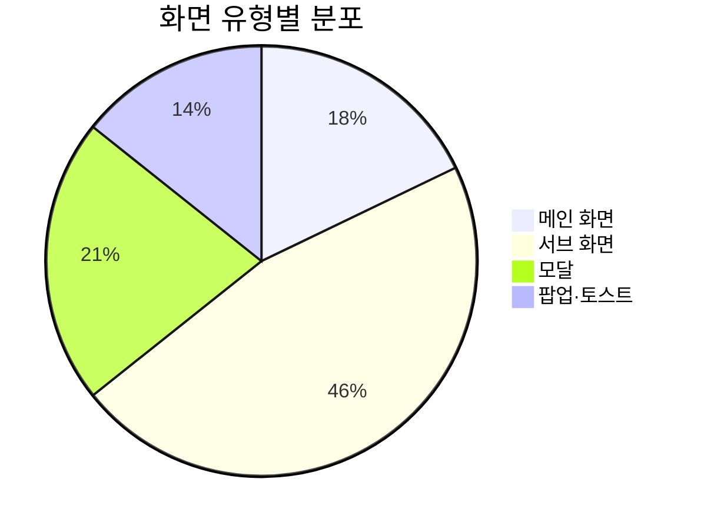
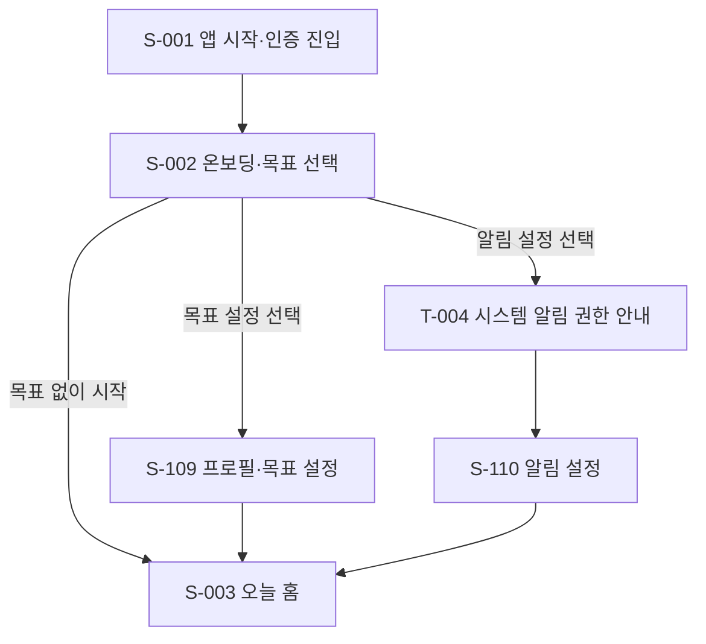
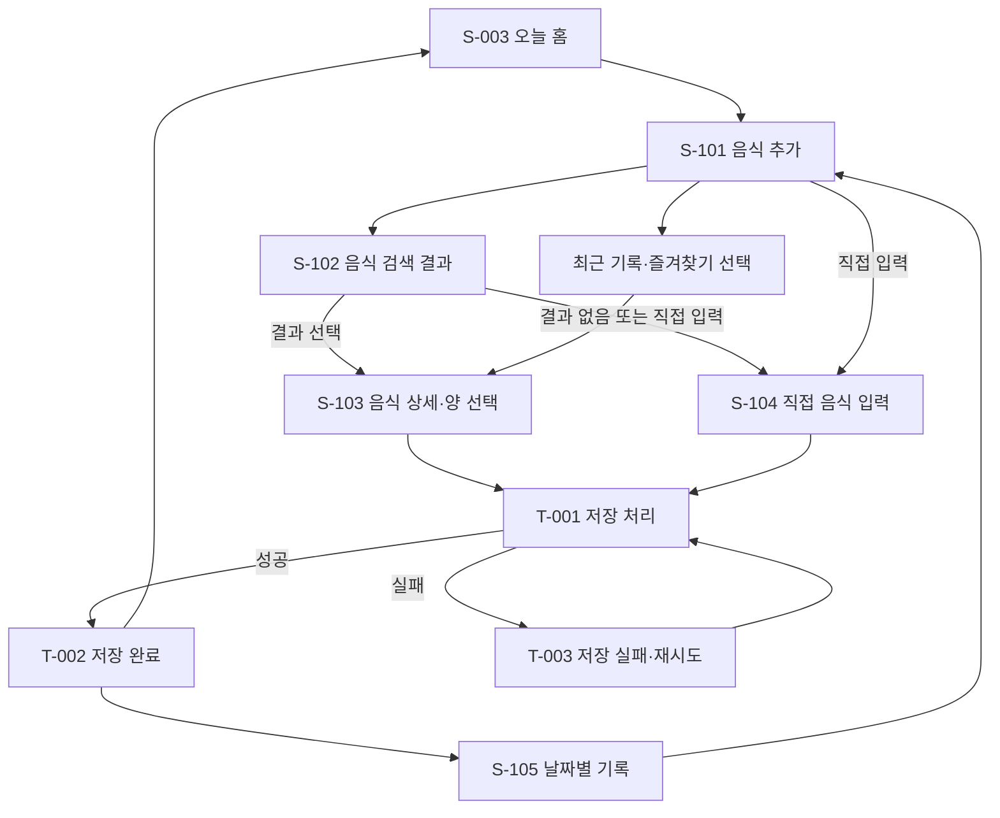
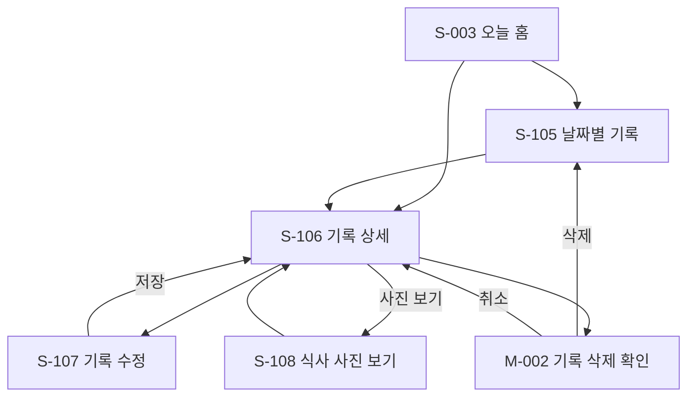
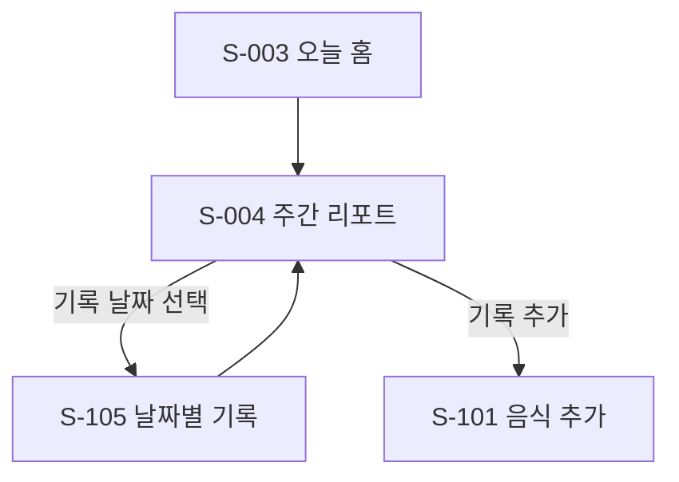
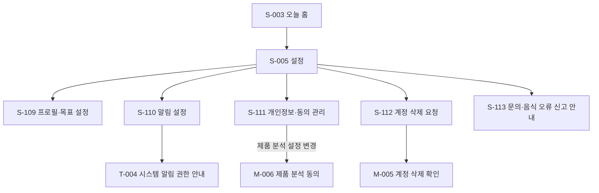

## 1. 문서 정보

- **문서 버전**: v1.0
- **작성일**: 2026-10-01
- **작성자**: 디자인팀
- **문서 상태**: 검토 중
- **작성 기준**: 회의에서 확인된 화면·기능 결정과 미확정 사항을 구분했습니다. 화면 경로는 모바일 앱의 내부 경로 초안이며, 실제 주소 체계와 화면 구현 방식은 개발 설계 과정에서 확정해야 합니다. 사진 첨부는 회의 중 제외와 포함 논의가 모두 있었으나, 후반부에 식사당 한 장 첨부를 포함하는 방향으로 정리된 내용을 반영했습니다. 사진 자동 인식은 MVP 필수 기능으로 포함하지 않습니다.

**변경 이력**

| 버전 | 날짜 | 변경 내용 | 작성자 |
|---|---|---|---|
| v1.0 | 2026-10-01 | 회의 내용을 바탕으로 MVP 화면 목록 및 상세 명세 초안 작성 | 디자인팀 |

## 2. 화면 개요

| 항목 | 내용 |
|---|---|
| **총 화면 수** | 28개 |
| **화면 분류** | 메인: 5개, 서브: 13개, 모달: 6개, 팝업·토스트: 4개 |
| **최대 깊이** | 3단계. 앱 진입 → 주요 화면 → 세부 화면·모달 기준 |
| **권한 레벨** | 비회원, 회원, 관리자 |
| **대상 플랫폼** | iOS·안드로이드 모바일 앱. 리액트 네이티브 개발 방향 |
| **관리자 화면** | MVP의 관리자 전용 화면은 확정되지 않음. 운영 조회가 필요한 경우 최소 권한과 접근 기록을 별도로 검토 |

**화면 수 산정 기준**

- 화면의 전체 레이아웃과 주요 목적이 다른 경우 별도 화면으로 셉니다.
- 검색 결과 없음, 통신 오류처럼 같은 화면 안에서 내용만 달라지는 경우는 화면 수에 포함하지 않고 상태로 정의합니다.
- 사진 선택, 삭제 확인처럼 기존 화면 위에 겹쳐 표시되는 화면은 모달로 셉니다.
- 저장 중 표시와 저장 완료 안내처럼 짧게 나타나는 요소는 팝업·토스트로 셉니다.
- 화면 수와 우선순위는 문서상 분류이며, 회의에서 수치를 확정한 것은 아닙니다.

**화면 분포**

## 3. 화면 분류 체계

### 3.1 메인 화면

앱의 주요 이동 메뉴에 포함되는 화면입니다. 모바일 화면에서 하단 메뉴 또는 상단 동작을 통해 접근합니다. 인증 방식이 확정되지 않았으므로 앱 진입 및 인증 화면은 실제 로그인 제공자에 따라 통합하거나 분리할 수 있습니다.

### 3.2 서브 화면

메인 화면에서 특정 작업을 수행하기 위해 이동하는 상세 화면입니다. 음식 검색·입력, 기록 상세·수정, 날짜 선택, 프로필·목표, 개인정보 설정 등이 포함됩니다.

### 3.3 모달

현재 화면을 유지한 채 위에 겹쳐 표시하는 화면입니다. 사진 선택, 날짜 선택, 기록 삭제 확인 등 짧고 독립적인 작업에 사용합니다.

### 3.4 팝업·토스트

처리 결과, 오류, 권한 상태 등을 알리는 간단한 요소입니다. 별도의 화면 이동 없이 표시하며, 저장 실패 등 사용자의 재시도가 필요한 경우에는 자동으로 사라지지 않는 안내를 사용합니다.

## 4. 화면 목록

### 4.1 메인 화면

| 화면 ID | 화면명 | 경로 | 화면 유형 | 설명 | 우선순위 |
|---|---|---|---|---|---|
| S-001 | 앱 시작·인증 진입 | `/entry` | 시작·인증 | 앱 실행 후 로그인 또는 계정 생성·시작 방식 선택 | P0 |
| S-002 | 온보딩·목표 선택 | `/onboarding` | 안내·선택 | 앱 이용 안내와 목표 선택. 목표 없이 시작 허용 | P0 |
| S-003 | 오늘 홈 | `/home` | 메인·기록 조회 | 오늘 날짜, 기록 상태, 식사별 기록 및 기록 시작 제공 | P0 |
| S-004 | 주간 리포트 | `/reports/weekly` | 리포트 조회 | 완료된 주의 기록 일수, 영양 정보, 끼니 패턴 제공 | P0 |
| S-005 | 설정 | `/settings` | 설정 목록 | 프로필·목표·알림·개인정보·계정 삭제·문의 진입 | P0 |

### 4.2 서브 화면

| 화면 ID | 화면명 | 경로 | 화면 유형 | 상위 화면 | 설명 | 우선순위 |
|---|---|---|---|---|---|---|
| S-101 | 음식 추가 | `/food/add` | 음식 선택 | S-003 | 검색·최근 기록·즐겨찾기에서 음식 추가 | P0 |
| S-102 | 음식 검색 결과 | `/food/search` | 검색 목록 | S-101 | 검색 결과와 검색 상태 표시 | P0 |
| S-103 | 음식 상세·양 선택 | `/food/:foodId/select` | 상세·선택 | S-101, S-102 | 음식 정보, 제공량, 양 배수, 식사 구분 확인 | P0 |
| S-104 | 직접 음식 입력 | `/food/custom/new` | 생성 | S-101, S-102 | 검색되지 않는 음식 이름과 선택 영양 정보를 입력 | P0 |
| S-105 | 날짜별 기록 | `/records/:date` | 기록 목록 | S-003 | 선택 날짜의 식사 구분별 음식과 합계 조회 | P0 |
| S-106 | 기록 상세 | `/records/items/:itemId` | 상세 | S-105 | 개별 기록 내용과 기록 시점 영양 정보 확인 | P0 |
| S-107 | 기록 수정 | `/records/items/:itemId/edit` | 수정 | S-106 | 음식 이름·양·식사 구분·섭취 날짜 수정 | P0 |
| S-108 | 식사 사진 보기 | `/records/:recordId/photo` | 사진 조회 | S-106 | 첨부된 식사 사진 확인 | P1 |
| S-109 | 프로필·목표 설정 | `/settings/profile-goal` | 조회·수정 | S-005 | 선택적 프로필 정보와 목표 확인·수정 | P0 |
| S-110 | 알림 설정 | `/settings/notifications` | 설정 | S-005 | 선택형 기록 알림과 알림 시간 관리 | P0 |
| S-111 | 개인정보·동의 관리 | `/settings/privacy` | 설정·동의 | S-005 | 약관·개인정보 안내, 선택적 제품 분석 동의 관리 | P0 |
| S-112 | 계정 삭제 요청 | `/settings/account/delete` | 삭제 요청 | S-005 | 계정 및 연관 기록 삭제 안내와 요청 | P0 |
| S-113 | 문의·음식 오류 신고 안내 | `/support` | 문의·신고 | S-005, S-102, S-103 | 문의 경로 및 음식 정보 오류 신고 이동 안내 | P1 |

### 4.3 모달 화면

| 모달 ID | 모달명 | 경로 또는 식별자 | 트리거 | 크기·표시 방식 | 설명 |
|---|---|---|---|---|---|
| M-001 | 날짜 선택 | `modal/date-picker` | S-003, S-105의 날짜 선택 | 화면 하단 또는 전체 화면 | 과거 날짜 선택. 미래 날짜는 선택 불가 |
| M-002 | 기록 삭제 확인 | `modal/delete-record` | S-106 또는 S-107의 삭제 동작 | 확인 대화상자 | 선택한 기록을 삭제할지 확인 |
| M-003 | 즐겨찾기 관리 | `modal/favorites` | S-101의 즐겨찾기 동작 | 화면 하단 목록 | 음식 즐겨찾기 추가·해제 |
| M-004 | 사진 선택 | `modal/photo-picker` | 기록 저장 후 사진 추가 | 운영체제 사진 선택 화면 | 식사당 한 장 선택. 운영체제 권한·사진 선택 동작에 따름 |
| M-005 | 계정 삭제 확인 | `modal/delete-account-confirm` | S-112의 삭제 요청 | 확인 대화상자 | 삭제 대상과 요청 전 확인 안내 |
| M-006 | 제품 분석 동의 | `modal/analytics-consent` | S-111에서 제품 분석 설정 변경 | 확인 대화상자 | 선택적 분석 동의 변경 안내 |

### 4.4 팝업·토스트

| 팝업 ID | 팝업명 | 유형 | 표시 조건 | 설명 |
|---|---|---|---|---|
| T-001 | 저장 처리 상태 | 진행 표시 | 기록 저장 요청 | 저장 중 상태를 표시하고 중복 저장을 방지 |
| T-002 | 저장 완료 | 성공 안내 | 기록 저장 성공 | 저장 결과를 알리고 홈 또는 날짜별 기록에 반영 |
| T-003 | 저장 실패·재시도 | 오류 안내 | 저장 실패 또는 응답 불명확 | 입력 내용을 유지하고 재시도 동작 제공 |
| T-004 | 시스템 알림 권한 안내 | 권한 안내 | 사용자가 앱 안에서 알림을 켜기로 선택 | 운영체제 권한 요청 전에 맥락을 안내. 거부해도 앱 이용 가능 |

## 5. 화면 상세 명세

### 5.1 공통 화면 규칙

#### 공통 표시 원칙

- 기록 완료 상태와 오늘의 기록을 칼로리 목표 달성 여부보다 앞세웁니다.
- 칼로리·영양값은 참고값으로 표현하고, 실제 섭취량을 확정적으로 보여주지 않습니다.
- 목표가 없는 사용자는 기록과 리포트를 이용할 수 있으며, 목표 비교와 칼로리 목표 게이지는 표시하지 않습니다.
- 영양값이 없는 상태와 실제 값이 0인 상태를 구분합니다.
- 기록이 없는 날짜는 0으로 표시하지 않고 빈 상태로 보여줍니다.
- 검색 결과 없음과 검색 요청 오류를 구분합니다.
- 외부 음식 데이터의 출처는 확인할 수 있도록 제공하되, 표시 방식은 공급자 계약상 출처 표시 의무를 확인한 뒤 확정합니다.
- 기록에 일부 영양 정보가 없는 경우 다음 안내 문구를 사용합니다.  
  **“일부 음식 정보가 없어 영양소별 합계가 다를 수 있어요.”**
- 푸시 문구에는 음식명·칼로리·체중 등 개인 기록 정보를 포함하지 않습니다.
- 화면 상태와 버튼을 색상만으로 구분하지 않습니다. 주요 화면은 시스템 글자 크기에서 깨지지 않아야 하며, 버튼에는 읽을 수 있는 이름을 제공합니다.
- 저장 실패 시 입력값을 유지하고, 사용자가 저장 완료 여부를 알 수 있도록 진행·성공·실패 상태를 구분합니다.
- iOS와 안드로이드의 기기별 권한·화면 표시 차이는 별도 확인합니다. 지원 운영체제 버전은 미정입니다.

#### 공통 탐색 구조

- **주요 메뉴**: 홈, 주간 리포트, 설정을 중심으로 구성합니다.
- **홈 내부 이동**: 날짜 선택, 식사별 기록 목록, 음식 추가, 기록 상세로 이동합니다.
- **기록 추가 흐름**: 음식 추가 → 검색·최근·즐겨찾기 또는 직접 입력 → 양·식사 구분 확인 → 저장 → 홈 또는 날짜별 기록으로 복귀합니다.
- **알림 설정 흐름**: 앱 안에서 사용자가 알림을 켜기로 선택한 뒤에만 운영체제 권한을 요청합니다.
- **관리자 화면**: MVP 관리자 전용 화면은 정의하지 않습니다. 운영자가 사용자의 기록을 조회해야 하는 경우에는 사용자의 동의, 접근 권한 승인, 접근 기록이 필요하며 상세 운영 화면은 별도 검토 대상입니다.

---

### 5.2 S-001: 앱 시작·인증 진입

**목적**  
사용자가 로그인하거나 계정을 만들고 앱을 이용하도록 진입 경로를 제공합니다. 게스트 시작 여부와 최종 인증 제공자는 미정입니다.

**구성 요소**

| 요소 | 유형 | 필수 | 설명·동작 |
|---|---|---:|---|
| 앱 이름·간단한 가치 설명 | 안내 문구 | 예 | 기록을 쉽게 남기는 앱임을 설명 |
| 로그인 선택 버튼 | 버튼 | 예 | 확정된 인증 제공자 방식으로 로그인 |
| 계정 생성 동작 | 버튼 또는 링크 | 조건부 | 선택한 인증 방식에 따라 가입 절차 시작 |
| 게스트 시작 | 버튼 또는 링크 | 미정 | 제공 여부, 저장 위치, 계정 연결·병합 방식 확인 필요 |
| 약관·개인정보 안내 | 링크 | 예 | 이용약관 및 개인정보 처리 안내로 이동 |
| 로그인 실패 문의 주소 | 링크 | 예 | 인증에 실패해도 문의 경로를 찾을 수 있도록 제공 |

**진입 경로**

- 앱 최초 실행
- 로그아웃 상태에서 앱 실행
- 인증 만료 또는 인증 필요 시

**이동 화면**

- 로그인·계정 생성 성공 → S-002
- 약관·개인정보 안내 → S-111 또는 별도 안내 화면
- 로그인 오류 문의 → S-113
- 게스트 시작이 확정된 경우 → S-002 또는 S-003

**접근 권한**

- 비회원: 접근 가능
- 회원: 접근 가능하나 유효한 로그인 상태면 기본적으로 S-003으로 이동
- 관리자: 일반 사용자와 같은 진입 화면 사용

**상태·예외**

- 인증 제공자 범위가 확정되기 전에는 화면의 버튼 구성과 순서를 확정하지 않습니다.
- 게스트 방식이 도입되면 기기 변경·앱 삭제 시 데이터 처리와 회원 전환 흐름을 안내해야 합니다.
- 인증 제공자별 iOS 심사 조건을 확인합니다.

---

### 5.3 S-002: 온보딩·목표 선택

**목적**  
서비스의 사용 목적과 기록 방식을 안내하고, 목표 없이 시작하거나 선택적으로 목표 설정을 진행할 수 있게 합니다.

**구성 요소**

| 요소 | 유형 | 필수 | 설명·동작 |
|---|---|---:|---|
| 간단한 이용 안내 | 안내 화면 | 예 | 기록과 주간 리포트 중심의 서비스임을 안내 |
| 시작 방식 선택 | 선택 카드 | 예 | ‘식사 습관 확인’, ‘체중 목표 설정’, ‘목표 없이 기록’ 제안 |
| 목표 없이 시작 | 버튼 | 예 | 신체 정보나 목표 입력 없이 기록으로 이동 |
| 목표 설정 시작 | 버튼 | 선택 | 선택적 프로필·목표 설정으로 이동 |
| 건너뛰기 | 버튼 | 예 | 목표 설정 등 선택 항목을 건너뛰게 함 |
| 알림 안내 | 선택 안내 | 예 | 기록 알림을 받을지 사용자에게 선택권 제공 |
| 알림 나중에 설정 | 버튼 | 예 | 알림을 켜지 않고 앱 이용 계속 |
| 개인정보·수집 목적 안내 | 링크·설명 | 예 | 선택 입력 정보의 사용 목적 안내 |

**진입 경로**

- S-001에서 인증 또는 게스트 시작 후

**이동 화면**

- 목표 없이 시작 → S-003
- 목표 설정 선택 → S-109
- 알림 설정을 선택한 경우 → T-004를 거쳐 S-110
- 약관·개인정보 안내 → S-111

**접근 권한**

- 비회원: 접근 가능
- 회원: 가입 직후 접근
- 관리자: 일반 사용자와 같은 화면

**설계 규칙**

- 키·체중·나이·성별을 앱 시작의 필수 입력값으로 요구하지 않습니다.
- 자동 권장 칼로리는 전문가 검토와 안전 기준 확인 전 임의로 표시하지 않습니다.
- 목표 입력 방식 및 안전하지 않은 목표값을 막는 기준은 미정입니다.
- 다음 주 화요일까지 안전 기준이 확인되지 않으면 자동 칼로리 목표를 MVP에서 제외합니다.
- 목표 선택지의 문구와 리포트 관련 표현은 전문가 의견 전까지 변경 가능 상태로 관리합니다.

---

### 5.4 S-003: 오늘 홈

**목적**  
오늘의 기록 상태를 확인하고, 식사 기록을 시작하거나 날짜별 기록을 다시 확인하도록 합니다.

**구성 요소**

| 요소 | 유형 | 필수 | 설명·동작 |
|---|---|---:|---|
| 오늘 날짜·날짜 이동 | 날짜 탐색 | 예 | 날짜 선택 및 과거 날짜 기록 조회 |
| 오늘로 돌아오기 | 버튼 | 예 | 다른 날짜 조회 중 오늘 화면으로 이동 |
| 오늘의 기록 상태 | 상태 카드 | 예 | 기록한 식사 또는 기록된 항목 수를 우선 표시 |
| 식사 구분 목록 | 목록 | 예 | 아침·점심·저녁·간식 네 구분 |
| 식사별 음식 항목 | 기록 목록 | 조건부 | 해당 날짜·식사 구분의 기록 표시 |
| 식사 구분별 합계 | 요약 정보 | 조건부 | 영양 정보가 있는 항목을 기준으로 계산 |
| 기록하기 | 주요 버튼 | 예 | S-101 이동 |
| 칼로리·영양 요약 | 보조 정보 | 조건부 | 기록된 내용 기준으로 표시 |
| 주간 리포트 진입 | 메뉴·카드 | 예 | S-004 이동 |
| 설정 진입 | 메뉴 | 예 | S-005 이동 |

**진입 경로**

- S-002 완료
- 앱 실행 시 로그인 상태 확인 후
- 기록 저장 완료 후
- S-105에서 오늘 날짜로 이동

**이동 화면**

- 음식 추가 → S-101
- 날짜별 기록 상세 → S-105
- 기록 항목 선택 → S-106
- 날짜 선택 → M-001
- 주간 리포트 → S-004
- 설정 → S-005

**접근 권한**

- 비회원: 접근 불가. 게스트 방식이 확정되는 경우 게스트 권한으로 접근 가능 여부를 별도 정의
- 회원: 본인 기록만 접근 가능
- 관리자: 일반 사용자 화면 접근이 기본이며, 관리자 기록 열람 기능은 별도 승인·접근 기록 없이는 제공하지 않음

**상태·예외**

- 목표가 설정되지 않은 경우 칼로리 목표 게이지와 목표 대비 수치를 표시하지 않습니다.
- 기록이 없는 날짜는 0칼로리로 표시하지 않고, 부담을 주지 않는 기록 안내와 기록 추가 동작을 제공합니다.
- 현재 날짜가 바뀐 뒤 앱으로 돌아오면 날짜와 기록을 새로고침합니다.
- 날짜 탐색 화면은 최근 7일을 빠르게 이동하는 안이 논의됐으며, 더 오래된 날짜는 OS 날짜 선택기로 입력할 수 있는 세부 정책이 미확정입니다.
- 미래 날짜 기록은 막는 방향입니다.

---

### 5.5 S-004: 주간 리포트

**목적**  
완료된 주의 기록 일수, 기록된 날 기준 영양 정보, 끼니 패턴을 관찰형·중립적 표현으로 제공합니다.

**구성 요소**

| 요소 | 유형 | 필수 | 설명·동작 |
|---|---|---:|---|
| 리포트 기간 | 제목·기간 표시 | 예 | 한국 시간 기준 월요일부터 일요일까지의 완료된 주 |
| 기록한 날짜 수 | 요약 카드 | 예 | 해당 주에 식사 기록이 있는 날짜 수 |
| 기록된 날의 평균 칼로리 | 요약 카드 | 예 | 기록이 있는 날만 계산하고 기준을 명시 |
| 탄수화물·단백질·지방 요약 | 요약 카드 | 예 | 값이 있는 항목만 영양소별로 계산 |
| 끼니별 기록 패턴 | 단순 차트·문구 | 예 | 가장 자주 기록한 식사 시간대 등 |
| 7일 기록 표시 | 막대·상태 표시 | 조건부 | 기록 없는 날은 0이 아닌 빈칸·점선 등으로 표시 |
| 목표 비교 | 보조 정보 | 조건부 | 목표가 설정된 사용자에게만 제공 |
| 기록 정보 누락 안내 | 안내 문구 | 조건부 | 일부 영양 정보가 합계에 포함되지 않을 수 있음을 안내 |
| 기록 추가 버튼 | 버튼 | 빈 상태일 때 | S-101 또는 S-003으로 이동 |
| 이전 주 보기 | 탐색 동작 | 미정·제안 | 지원할 주 범위와 탐색 방식은 추가 확인 |

**진입 경로**

- S-003의 주간 리포트 진입
- 주요 메뉴에서 리포트 선택

**이동 화면**

- 기록 추가 → S-101
- 특정 날짜의 기록 보기 → S-105
- 홈 → S-003

**접근 권한**

- 비회원: 접근 불가
- 회원: 본인 기록에 한해 접근 가능
- 관리자: 일반 사용자 리포트 접근 불가. 별도 운영 권한 정의 필요

**설계·계산 규칙**

- 리포트는 한국 시간 기준 월요일부터 일요일까지의 종료된 주를 ‘지난주’로 표시합니다. 이번 주 현황은 홈에서 확인하는 방향입니다.
- ‘기록한 날 기준 평균’이라는 계산 기준을 화면에 표시합니다.
- 목표가 없거나 해당 날짜에 유효한 목표가 없으면 목표 비교선을 표시하지 않습니다.
- 목표 변경 이력을 적용해 식사 날짜 당시 유효한 목표를 기준으로 비교합니다.
- 건강 점수, 좋음·나쁨 평가, 실패를 암시하는 표현, 직접적인 식품 추천은 제공하지 않습니다.
- 리포트는 사용자가 열 때 우리 데이터베이스의 기록 시점 영양값을 기준으로 계산합니다. 기록 수정·삭제 후 다시 열면 갱신합니다.
- 지난주 비교는 기록이 충분한 경우에만 보조로 제공하는 방향이며, 최소 기록 기준은 미정입니다.
- 영양소별 값은 각각 값이 있는 항목만 계산합니다. 기록이 없는 날짜와 영양 정보가 빠진 날짜를 구분합니다.
- 빈 상태 문구는 사용자를 탓하지 않는 표현과 기록 추가 동작을 포함합니다.

---

### 5.6 S-005: 설정

**목적**  
사용자가 프로필·목표·알림·개인정보 동의와 계정 삭제, 문의 기능에 접근하도록 합니다.

**구성 요소**

| 요소 | 유형 | 필수 | 설명·동작 |
|---|---|---:|---|
| 프로필·목표 | 메뉴 | 예 | S-109 이동 |
| 알림 설정 | 메뉴 | 예 | S-110 이동 |
| 개인정보·동의 | 메뉴 | 예 | S-111 이동 |
| 계정 삭제 | 메뉴 | 예 | S-112 이동 |
| 문의 | 메뉴·링크 | 예 | S-113 또는 외부 문의 경로 |
| 앱 정보·약관 | 링크 | 예 | 이용약관·개인정보 처리 안내 |

**진입 경로**

- S-003의 설정 메뉴

**이동 화면**

- 프로필·목표 → S-109
- 알림 설정 → S-110
- 개인정보·동의 → S-111
- 계정 삭제 → S-112
- 문의·음식 정보 신고 안내 → S-113

**접근 권한**

- 비회원: 접근 불가. 게스트 시작이 확정되면 게스트에게 제공할 설정 범위를 별도 정의
- 회원: 본인 계정의 설정만 접근 가능
- 관리자: 일반 사용자 설정을 임의로 열람할 수 없음

---

### 5.7 S-101: 음식 추가

**목적**  
검색, 최근 기록, 즐겨찾기를 활용해 음식 기록 흐름에 빠르게 진입하게 합니다.

**구성 요소**

| 요소 | 유형 | 필수 | 설명·동작 |
|---|---|---:|---|
| 음식 검색창 | 입력창 | 예 | 음식명 입력. 검색어 자체를 제품 분석 이벤트로 보내지 않음 |
| 검색 탭 | 탭·목록 | 예 | 음식 검색 결과로 이동 |
| 최근 기록 | 목록 | 예 | 최근에 기록한 음식 재사용 |
| 즐겨찾기 | 목록 | 예 | 사용자가 별표한 음식 재사용 |
| 즐겨찾기 버튼 | 아이콘 버튼 | 예 | 해당 음식 즐겨찾기 추가·해제 |
| 직접 입력 | 버튼 | 예 | S-104 이동 |
| 현재 기록 날짜·식사 구분 | 요약 정보 | 예 | 어느 날짜와 식사 구분에 추가하는지 표시 |

**진입 경로**

- S-003 또는 S-105의 기록 추가 버튼

**이동 화면**

- 검색어 입력 → S-102
- 검색 결과 선택 → S-103
- 최근 기록·즐겨찾기 선택 → S-103
- 직접 입력 → S-104
- 즐겨찾기 관리 → M-003

**접근 권한**

- 비회원: 접근 불가. 게스트 이용이 확정되면 게스트 소유 기록 범위에서 접근
- 회원: 본인 기록 및 개인 음식만 접근 가능
- 관리자: 일반 사용자 음식 목록 접근 불가

**확정·미확정 사항**

- 즐겨찾기는 MVP에 포함합니다.
- 음식 추가 화면의 기본 탭은 최근 탭과 검색 탭 제안이 상충해 미정입니다. 화면 확정 전 사용자 흐름과 검색 API 조건을 반영해 결정해야 합니다.
- 인기 메뉴는 초기 화면에 제공하지 않는 방향입니다.
- 외부 API 검색어 전달·보관 조건을 확인하고 개인정보 안내에 반영해야 합니다.

---

### 5.8 S-102: 음식 검색 결과

**목적**  
검색 결과를 확인하고, 적합한 항목을 고르거나 결과가 없을 때 직접 입력으로 이어가게 합니다.

**구성 요소**

| 요소 | 유형 | 필수 | 설명·동작 |
|---|---|---:|---|
| 검색창 | 입력창 | 예 | 검색어 수정 가능 |
| 검색 결과 목록 | 목록 | 예 | 음식 이름, 브랜드 구분, 기준 제공량, 확인 가능한 영양 정보 표시 |
| 영양 정보 출처 | 정보 표시·상세 연결 | 조건부 | 확인 가능한 출처를 표시하거나 상세에서 확인 |
| 최근 음식 | 보조 목록 | 조건부 | 검색 결과 대기 중에도 최근 항목 활용 가능 |
| 직접 음식 입력 | 버튼 | 예 | 결과가 없거나 원하는 음식이 없을 때 S-104 이동 |
| 검색 결과 없음 안내 | 빈 상태 | 조건부 | 검색 결과 없음과 API 오류를 구분 |
| 통신 오류 안내 | 오류 상태 | 조건부 | 검색어 유지, 재시도 제공 |
| 로딩 표시 | 진행 상태 | 조건부 | 입력어를 유지하고 결과 영역에 표시 |

**진입 경로**

- S-101에서 검색 시작
- S-101에서 검색 탭 선택

**이동 화면**

- 음식 선택 → S-103
- 직접 입력 → S-104
- 다시 검색 → S-102 유지

**접근 권한**

- 비회원: 접근 불가. 게스트 이용이 확정되면 허용 범위를 별도 정의
- 회원: 접근 가능
- 관리자: 일반 검색 화면을 사용하지 않으며, 공급자 운영 도구는 별도 범위

**검색 동작**

- 최종 검색 조건은 추가 확인이 필요합니다. 회의 중 두 글자 이상 입력 후 약 300밀리초 대기 방안과 한 글자 검색 허용·약 350밀리초 대기 방안이 모두 논의됐습니다. 후반 논의에서는 한 글자 검색을 허용하고 약 350밀리초 대기하는 방향이 제시됐으나, 공급자 계약과 호출 제한 확인 후 확정해야 합니다.
- 검색어 공백 정규화와 자주 쓰는 동의어 매핑을 검토합니다.
- 검색어 자체를 분석 이벤트에 저장하지 않습니다. 검색 결과 유무와 같은 최소 정보만 수집하는 방향입니다.
- 외부 식품 API에는 검색어만 전달하며 사용자 식별 정보, 기록 날짜, 식사 기록은 전달하지 않습니다.
- 검색 결과가 없다는 이유로 유사한 음식을 자동 선택하지 않습니다.
- 빈 결과와 통신·API 오류는 서로 다른 안내로 보여줍니다.
- 검색 결과의 기준 제공량이나 출처가 불명확하면 임의 단위를 만들지 않고 안내합니다.
- 검색 공급처, 라이선스, 국내 데이터 범위, 비용, 캐시 허용 기간은 미확정입니다.

---

### 5.9 S-103: 음식 상세·양 선택

**목적**  
선택한 음식의 기준 제공량과 영양 정보를 확인하고, 양·식사 구분을 지정해 기록합니다.

**구성 요소**

| 요소 | 유형 | 필수 | 설명·동작 |
|---|---|---:|---|
| 음식 이름 | 제목 | 예 | 선택한 음식 이름 |
| 음식 출처·브랜드 | 정보 표시 | 조건부 | 공급자 출처와 브랜드 구분 |
| 기준 제공량 | 정보 표시 | 조건부 | 검색 데이터에 기준 제공량이 있는 경우 표시 |
| 양 배수 선택 | 선택 조절 | 예 | 기준량에 대한 배수 선택 |
| 영양 정보 | 요약·상세 | 조건부 | 칼로리 우선, 탄단지는 상세 또는 보조 표시 |
| 영양 정보 없음 | 상태 안내 | 조건부 | 0과 미입력을 구분해 표시 |
| 식사 구분 선택 | 선택 항목 | 예 | 아침·점심·저녁·간식 중 선택 |
| 저장 버튼 | 주요 버튼 | 예 | 기록 저장 |
| 즐겨찾기 | 아이콘 버튼 | 예 | 음식 즐겨찾기 추가·해제 |
| 취소·뒤로 | 버튼 | 예 | 저장 전 이전 화면으로 복귀 |

**진입 경로**

- S-102의 검색 결과 선택
- S-101의 최근 기록·즐겨찾기 선택

**이동 화면**

- 저장 성공 → 진입했던 S-003 또는 S-105
- 기록 저장 중 → T-001
- 저장 완료 → T-002
- 저장 실패 → T-003
- 음식 정보 오류 신고 → S-113

**접근 권한**

- 비회원: 접근 불가. 게스트 이용이 확정되면 본인 기록에 한해 접근
- 회원: 본인 기록에 음식 추가 가능
- 관리자: 사용자 기록을 일반 화면에서 열람할 수 없음

**설계 규칙**

- 식사 구분은 아침·점심·저녁·간식 네 가지로 고정합니다.
- 현재 시간에 따른 식사 구분은 추천만 하고 사용자가 저장 전에 바꿀 수 있습니다.
- 제공 데이터에 기준량이 있으면 이를 표시하고 배수로 조정합니다.
- 그램 환산과 자유 형식 단위 입력은 MVP에서 제외합니다.
- 검색 데이터의 칼로리와 영양값은 참고값으로 표시합니다.
- 기록 시 선택한 음식 이름과 영양값은 식사 기록에 스냅샷으로 보존합니다.
- 한 끼에 여러 음식 항목을 추가할 수 있습니다. 항목별로 즉시 저장하며, 같은 날짜·식사 구분의 항목을 합산해 표시합니다.
- 저장 요청에는 중복 방지를 위한 고유 요청 식별값을 사용하는 방향입니다.

---

### 5.10 S-104: 직접 음식 입력

**목적**  
검색 결과가 없거나 영양 정보를 모르는 경우에도 음식명을 기록하게 합니다.

**구성 요소**

| 요소 | 유형 | 필수 | 설명·동작 |
|---|---|---:|---|
| 음식 이름 | 입력창 | 예 | 직접 입력 음식명 |
| 양 배수 | 선택 조절 | 예 | 기본 1회분, 배수 선택 |
| 칼로리 | 선택 입력 | 아니요 | 사용자가 알고 있는 경우 입력 |
| 탄수화물·단백질·지방 | 선택 입력 | 아니요 | 사용자가 알고 있는 경우 입력 |
| 식사 구분 | 선택 항목 | 예 | 아침·점심·저녁·간식 |
| 정보 없이 저장 안내 | 설명·확인 | 조건부 | 영양 정보가 비어 있어도 기록 가능함을 안내 |
| 저장 버튼 | 주요 버튼 | 예 | 직접 입력 음식과 기록 저장 |
| 취소 버튼 | 버튼 | 예 | 이전 화면으로 복귀 |

**진입 경로**

- S-101의 직접 입력
- S-102의 검색 결과 없음·직접 입력 선택

**이동 화면**

- 저장 성공 → S-003 또는 S-105
- 저장 중·성공·실패 → T-001, T-002, T-003
- 취소 → S-101 또는 S-102

**접근 권한**

- 비회원: 접근 불가. 게스트 이용이 확정되면 게스트 개인 데이터 범위에서 접근
- 회원: 본인의 개인 음식 생성 가능
- 관리자: 일반 사용자 입력 음식은 기본적으로 접근 불가

**설계 규칙**

- 음식 이름은 필수입니다.
- 직접 입력 음식은 1회분을 기본값으로 표시합니다.
- 영양 정보는 모두 비워도 저장할 수 있습니다.
- 값이 없는 상태와 실제 값 0을 구분합니다.
- 값이 없는 영양소는 합계 계산에서 제외하되 식사 기록 자체는 유지합니다.
- 사용자 입력 음식은 기본적으로 본인에게만 보이며 다른 사용자의 검색 결과에 노출하지 않습니다.
- 공용 음식 데이터에 올리려면 별도 동의가 필요합니다.
- 메모 입력은 MVP에서 제외합니다.

---

### 5.11 S-105: 날짜별 기록

**목적**  
선택 날짜의 기록을 식사 구분별로 확인하고, 기록 추가·수정·삭제를 진행합니다.

**구성 요소**

| 요소 | 유형 | 필수 | 설명·동작 |
|---|---|---:|---|
| 선택 날짜 | 날짜 제목 | 예 | 기록의 섭취 날짜 표시 |
| 날짜 이동 | 탐색 동작 | 예 | 날짜 이동과 오늘로 돌아오기 |
| 식사 구분 목록 | 목록 | 예 | 아침·점심·저녁·간식 |
| 음식 항목 | 기록 목록 | 조건부 | 각 항목 이름, 양, 확인 가능한 영양 정보 |
| 식사 구분별 합계 | 요약 정보 | 조건부 | 해당 구분의 기록 항목 합계 |
| 음식 추가 | 버튼 | 예 | S-101 이동 |
| 날짜 비어 있음 안내 | 빈 상태 | 조건부 | 해당 날짜에 기록이 없음을 부담 없이 안내 |

**진입 경로**

- S-003의 날짜 이동
- S-003의 식사 구분 또는 기록 목록 선택
- S-004에서 기록 날짜 선택

**이동 화면**

- 음식 추가 → S-101
- 항목 선택 → S-106
- 날짜 선택 → M-001
- 홈 → S-003

**접근 권한**

- 비회원: 접근 불가. 게스트가 확정되면 게스트 소유 기록만 접근
- 회원: 본인 기록만 접근 가능
- 관리자: 사용자 기록을 일반 화면에서 열람할 수 없음

**설계 규칙**

- 기록 생성 시각과 실제 섭취 날짜를 분리합니다.
- 저장 시점의 사용자 현지 날짜를 기본값으로 하고, 사용자는 날짜와 시간을 바꿀 수 있습니다.
- 미래 날짜 기록은 허용하지 않는 방향입니다.
- 과거 날짜 입력은 허용하는 방향입니다. 입력 가능한 과거 범위는 제한하지 않는 안이 논의됐으나, 화면의 빠른 탐색 범위는 추가 확인이 필요합니다.
- 같은 날짜와 식사 구분의 기록은 함께 표시하고 합산합니다.
- 별도 식사 묶음이나 시간대별 식사 세션은 MVP에서 사용하지 않습니다.
- 기록이 없는 날짜는 0으로 표시하지 않습니다.

---

### 5.12 S-106: 기록 상세

**목적**  
개별 식사 음식 항목의 기록 내용을 확인하고 수정·삭제하도록 합니다.

**구성 요소**

| 요소 | 유형 | 필수 | 설명·동작 |
|---|---|---:|---|
| 기록 음식 이름 | 제목 | 예 | 기록 당시 이름 스냅샷 |
| 양·단위 | 정보 표시 | 예 | 기록 당시 양과 표시 단위 |
| 영양 정보 | 정보 표시 | 조건부 | 기록 당시 영양값 스냅샷 |
| 데이터 출처 | 정보 표시·상세 연결 | 조건부 | 확인 가능한 출처 표시 |
| 섭취 날짜·시간 | 정보 표시 | 예 | 사용자가 기록에 설정한 날짜·시간 |
| 식사 구분 | 정보 표시 | 예 | 아침·점심·저녁·간식 |
| 수정 | 버튼 | 예 | S-107 이동 |
| 삭제 | 버튼 | 예 | M-002 표시 |
| 사진 보기 | 버튼 | 조건부 | 사진 첨부가 있는 경우 S-108 이동 |

**진입 경로**

- S-003 또는 S-105의 기록 항목 선택

**이동 화면**

- 수정 → S-107
- 삭제 확인 → M-002
- 사진 보기 → S-108
- 이전 목록 → S-003 또는 S-105

**접근 권한**

- 비회원: 접근 불가. 게스트 이용이 확정되면 게스트 소유 기록만 접근
- 회원: 본인 기록만 열람 가능
- 관리자: 운영 목적의 임의 열람은 허용하지 않음. 예외 접근에는 동의·권한 승인·접근 기록 필요

---

### 5.13 S-107: 기록 수정

**목적**  
잘못 입력한 식사 항목의 이름, 양, 식사 구분 및 섭취 날짜를 수정합니다.

**구성 요소**

| 요소 | 유형 | 필수 | 설명·동작 |
|---|---|---:|---|
| 음식 이름 | 입력 또는 정보 표시 | 예 | 직접 입력 음식은 이름 수정 가능 여부를 화면 설계에서 확정 |
| 양·배수 | 선택 조절 | 예 | 기록한 양 수정 |
| 영양 정보 | 선택 입력·정보 표시 | 조건부 | 기록 당시 값 또는 사용자가 입력한 값 |
| 식사 구분 | 선택 항목 | 예 | 네 가지 고정 구분 중 수정 |
| 섭취 날짜·시간 | 날짜·시간 선택 | 예 | 미래 날짜 방지 |
| 저장 | 버튼 | 예 | 수정 내용 저장 |
| 삭제 | 버튼 | 예 | M-002 표시 |
| 취소 | 버튼 | 예 | 변경 내용 폐기 후 이전 화면으로 이동 |

**진입 경로**

- S-106의 수정

**이동 화면**

- 수정 저장 성공 → S-106 또는 S-105
- 저장 실패 → T-003
- 삭제 선택 → M-002

**접근 권한**

- 비회원: 접근 불가. 게스트 이용이 확정되면 게스트 소유 기록만 수정 가능
- 회원: 본인 기록만 수정 가능
- 관리자: 사용자 기록 수정 불가

**설계 규칙**

- 기록 당시의 음식 이름과 영양값은 외부 음식 데이터가 바뀌어도 자동으로 바꾸지 않습니다.
- 사용자가 최신 음식 정보로 기록을 갱신하는 기능은 MVP에 포함하지 않습니다.
- 목표 변경은 과거 기록의 목표 비교에 소급 적용하지 않습니다.
- 수정·삭제 후 주간 리포트를 다시 열면 최신 기록으로 계산합니다.

---

### 5.14 S-108: 식사 사진 보기

**목적**  
식사 기록에 첨부된 사진을 확인합니다.

**구성 요소**

| 요소 | 유형 | 필수 | 설명·동작 |
|---|---|---:|---|
| 사진 보기 영역 | 이미지 | 예 | 식사 기록에 연결된 사진 한 장 표시 |
| 사진 닫기 | 버튼 | 예 | 기록 상세로 돌아가기 |
| 사진 삭제 | 버튼 또는 동작 | 조건부 | 기록 사진 삭제 범위와 확인 문구를 설계 |
| 사진 정보 안내 | 안내 문구 | 조건부 | 기록 보조용 사진이며 자동 영양 분석을 하지 않음을 설명 |

**진입 경로**

- S-106에서 사진이 있는 기록 선택

**이동 화면**

- 닫기 → S-106
- 사진 삭제 요청 → 삭제 확인 흐름. 확인 모달은 화면 설계에서 추가 정의

**접근 권한**

- 비회원: 접근 불가. 게스트 이용이 확정되면 게스트 소유 사진만 접근
- 회원: 본인 기록에 연결된 사진만 접근
- 관리자: 사용자 사진을 일반적으로 열람할 수 없음

**확인 필요**

- 회의 후반부에서는 식사당 한 장 첨부를 포함하는 방향으로 정리됐습니다. 사진 용량 제한, EXIF 제거, 저장소 접근 방식, 사진 삭제 시점은 기술·개인정보 검토가 필요합니다.
- 사진 자동 인식과 외부 분석 API 전송은 기본 MVP 범위에 포함하지 않습니다.
- 사진 업로드 실패가 식사 기록 저장을 막아서는 안 됩니다. 식사 저장 후 사진을 추가하고 별도로 처리합니다.

---

### 5.15 S-109: 프로필·목표 설정

**목적**  
사용자가 선택적으로 목표와 프로필 정보를 설정하거나 변경합니다.

**구성 요소**

| 요소 | 유형 | 필수 | 설명·동작 |
|---|---|---:|---|
| 목표 선택 | 선택 카드 | 예 | 식사 습관 확인, 체중 목표 설정, 목표 없이 기록 |
| 칼로리 목표 | 입력·정보 표시 | 조건부 | 직접 입력 허용 여부와 안전 기준 확인 전 확정 불가 |
| 신체 정보 | 선택 입력 | 조건부 | 키·체중·나이·성별의 수집 필요성과 범위 확인 |
| 수집 목적 안내 | 설명 문구 | 해당 시 예 | 프로필 정보를 받는 이유 설명 |
| 목표 변경 이력 | 내부 처리 | 예 | 유효 시작일·종료일을 보관 |
| 저장 버튼 | 버튼 | 선택 변경 시 | 설정 저장 |
| 삭제·수정 안내 | 링크 | 조건부 | 사용자가 입력한 정보를 수정·삭제할 수 있게 함 |

**진입 경로**

- S-002에서 목표 설정 선택
- S-005에서 프로필·목표 선택

**이동 화면**

- 저장 완료 → S-003 또는 S-005
- 취소 → 진입 화면
- 개인정보 안내 → S-111

**접근 권한**

- 비회원: 접근 불가. 게스트 이용이 확정되면 게스트가 설정할 수 있는 범위를 별도 정의
- 회원: 본인 프로필과 목표만 조회·수정 가능
- 관리자: 민감한 프로필 정보는 일반 운영자에게 노출하지 않음

**미확정 사항**

- 목표 수치의 직접 입력 가능 여부
- 자동 칼로리 목표 여부와 안전 기준
- 신체 정보별 필수·선택 여부, 특히 성별 미입력 시 처리 방식
- 전문가 검토 전 목표·리포트 문구의 최종 확정

---

### 5.16 S-110: 알림 설정

**목적**  
사용자가 기록 알림을 선택하고 시간과 권한 상태를 관리합니다.

**구성 요소**

| 요소 | 유형 | 필수 | 설명·동작 |
|---|---|---:|---|
| 기록 알림 켜기·끄기 | 선택 스위치 | 예 | 기본값 꺼짐 |
| 알림 시간 | 시간 선택 | 알림 사용 시 | 기본 시간은 저녁 8시로 논의됐으나, 사용자가 선택하는 방식 확정 필요 |
| 알림 상태 | 상태 안내 | 예 | 앱 내 설정과 운영체제 권한 상태를 구분 |
| 운영체제 설정 안내 | 버튼·링크 | 권한 거부 시 | 운영체제 설정에서 권한 변경 안내 |
| 알림 문구 안내 | 안내 문구 | 예 | 개인 영양 정보를 알림에 포함하지 않음을 안내 |
| 주간 리포트 알림 | 항목 미노출 기본 | 예 | 초기 범위에서 제외하는 방향. 최종 범위 재확인 필요 |

**진입 경로**

- S-005의 알림 설정
- S-002에서 알림 선택
- 첫 기록 완료 후 인라인 안내를 선택했을 때

**이동 화면**

- 권한 요청 → T-004
- 알림 설정 완료 → S-003 또는 S-005
- 권한 거부 후 설정 이동 → 운영체제 설정

**접근 권한**

- 비회원: 접근 불가. 게스트 이용이 확정되면 알림 설정 허용 여부 확인
- 회원: 본인 알림 설정만 변경 가능
- 관리자: 사용자 알림 설정 변경 불가

**설계·동작 규칙**

- 기록 알림은 사용자가 앱 안에서 명시적으로 선택한 경우에만 켭니다.
- 약관 동의와 알림 선택을 분리하며, 알림 기본값은 꺼짐입니다.
- 사용자가 알림을 켜기로 선택한 시점에 운영체제 권한을 요청합니다.
- 권한이 거부되면 앱에서 알림이 켜진 것처럼 표시하지 않습니다.
- 첫 실행 직후 권한 팝업을 띄우지 않고, 첫 기록 완료 후 선택형 안내를 제공하는 방향입니다.
- 기록 알림은 하루 최대 한 번입니다. 해당 날짜에 기록이 한 건 이상 있으면 발송하지 않습니다.
- 푸시 문구에는 음식명·칼로리·체중 등 개인 기록 정보를 넣지 않습니다.
- 주간 리포트 알림은 초기 범위에서 제외하는 결정과, 별도 선택형으로 제공하는 논의가 함께 있어 최종 확인이 필요합니다.

---

### 5.17 S-111: 개인정보·동의 관리

**목적**  
사용자가 개인정보 처리 안내와 선택적 동의를 확인하고 제품 분석 선택을 관리하도록 합니다.

**구성 요소**

| 요소 | 유형 | 필수 | 설명·동작 |
|---|---|---:|---|
| 이용약관 | 링크 | 예 | 서비스 이용약관 확인 |
| 개인정보 처리 안내 | 링크 | 예 | 수집 항목·목적·보유 기간·위탁 업체 안내 |
| 푸시 동의 상태 | 설정 요약 | 예 | 푸시 설정 화면과 연결 |
| 선택적 제품 분석 | 선택 스위치 | 정책 확인 후 | 사용자가 거부해도 핵심 기능은 정상 이용 |
| 외부 검색 처리 안내 | 설명 | 예 | 검색어가 외부 식품 데이터 업체에 전달될 수 있음을 안내 |
| 데이터 삭제 안내 | 링크 | 예 | S-112로 이동 |
| 문의 경로 | 링크 | 예 | 개인정보 관련 문의 경로 제공 |

**진입 경로**

- S-001의 약관·개인정보 링크
- S-005의 개인정보·동의 메뉴

**이동 화면**

- 알림 설정 → S-110
- 계정 삭제 → S-112
- 문의 → S-113

**접근 권한**

- 비회원: 공개 안내 및 동의 화면에 접근 가능
- 회원: 본인 동의 상태 조회·변경 가능
- 관리자: 동의 기록 열람은 업무상 필요 최소 범위로 제한. 세부 권한은 별도 정의

**설계 규칙**

- 서비스 이용약관, 개인정보 처리 동의, 푸시 수신 선택을 구분합니다.
- 마케팅 알림 동의는 MVP에서 두지 않습니다.
- 선택적 제품 분석을 거부해도 앱 기능을 제한하지 않습니다.
- 제품 분석 이벤트에는 음식 이름·칼로리·체중·자유 입력 메모를 포함하지 않습니다.
- 검색어 자체를 제품 분석에 저장하지 않습니다.
- 외부 업체의 처리 위치, 검색어 보관 조건, 국외 이전 여부 및 개인정보 처리방침 반영 내용은 출시 전 확인해야 합니다.
- 서비스 보안·장애 대응을 위한 최소 로그와 선택적 제품 분석은 구분합니다.

---

### 5.18 S-112: 계정 삭제 요청

**목적**  
사용자가 앱 안에서 계정과 연관 기록의 삭제를 요청하게 합니다.

**구성 요소**

| 요소 | 유형 | 필수 | 설명·동작 |
|---|---|---:|---|
| 삭제 대상 안내 | 안내 문구 | 예 | 계정과 연결된 기록이 삭제되는 기본 범위 설명 |
| 삭제 처리 안내 | 안내 문구 | 예 | 처리 시간과 백업 삭제 시점은 정책 확정 후 표시 |
| 삭제 요청 버튼 | 버튼 | 예 | M-005 표시 |
| 본인 확인 | 인증 단계 | 정책·기술 확인 필요 | 재인증 여부와 방식 미정 |
| 취소 | 버튼 | 예 | S-005로 복귀 |

**진입 경로**

- S-005의 계정 삭제
- S-111의 데이터 삭제 안내

**이동 화면**

- 삭제 요청 확인 → M-005
- 요청 완료 → 완료 안내 후 앱 진입 제한 또는 로그인 화면 이동
- 취소 → S-005

**접근 권한**

- 비회원: 접근 불가. 게스트 계정 삭제 방식은 인증 구조 확정 후 정의
- 회원: 본인 계정만 삭제 요청 가능
- 관리자: 사용자 대신 삭제 요청을 임의로 만들 수 없음. 운영 처리는 별도 권한과 기록 필요

**설계 규칙**

- 계정 삭제 시 계정과 연관된 식사 기록을 삭제하는 것을 기본으로 합니다.
- 푸시 토큰 비활성화와 사진·기록 삭제 흐름을 고려합니다.
- 백업에서의 완전 삭제 시점, 처리 완료 시각, 법적 보관 의무는 개인정보·법무 검토 후 확정합니다.
- 장기 미사용 계정 자동 삭제는 정책이 확정되기 전까지 구현하지 않습니다.
- 계정을 유지하면서 기록 전체를 초기화하는 기능은 MVP 필수 범위에서 제외합니다.
- 데이터 사본 다운로드 제공 여부는 추가 확인이 필요합니다.

---

### 5.19 S-113: 문의·음식 오류 신고 안내

**목적**  
로그인 실패, 서비스 이용 문제, 음식 정보 오류 발생 시 사용자가 문의 경로를 찾게 합니다.

**구성 요소**

| 요소 | 유형 | 필수 | 설명·동작 |
|---|---|---:|---|
| 문의 경로 | 링크·버튼 | 예 | 외부 문의 주소 또는 앱 내 문의 경로 |
| 오류 코드·기록 식별값 안내 | 안내 문구 | 조건부 | 문의에 필요한 진단 정보만 사용자가 선택해 전달 |
| 음식 오류 신고 | 버튼·링크 | 조건부 | 음식 식별 정보를 미리 채운 신고 경로 |
| 의견 입력 | 선택 입력 | 조건부 | 사용자가 자유 의견을 선택 입력 |
| 개인정보 안내 | 설명 | 예 | 문의 시 식단 내용이 자동 전달되지 않도록 안내 |

**진입 경로**

- S-005의 문의 메뉴
- S-001의 로그인 실패 화면
- S-103의 음식 정보 출처·오류 안내

**이동 화면**

- 외부 문의 경로 열기
- 음식 오류 신고 양식 또는 이메일 양식 열기
- 이전 화면으로 복귀

**접근 권한**

- 비회원: 문의 경로 접근 가능
- 회원: 문의·오류 신고 가능
- 관리자: 문의 처리 기능은 MVP 화면 목록에 포함하지 않음

**설계 규칙**

- 음식 오류 신고에는 음식 식별 정보를 미리 채우는 방안을 적용합니다.
- 사용자의 자유 의견은 선택 입력으로 처리합니다.
- 영양 정보 수정은 공급자 원본을 확인한 뒤 처리하는 방향입니다.
- 운영자가 신고를 확인하는 주기는 주 2회 방안이 제시됐으나, 운영 담당 및 확정 일정은 별도 확인이 필요합니다.
- 오류 보고에 음식명·자유 메모가 자동으로 첨부되지 않도록 합니다.

---

### 5.20 모달 상세

#### M-001: 날짜 선택

- **목적**: 홈 또는 날짜별 기록 화면의 날짜를 바꿉니다.
- **구성**: 날짜 선택기, 선택 완료, 취소, 오늘로 이동.
- **진입**: S-003 또는 S-105에서 날짜 선택.
- **이동**: 선택한 날짜의 S-105 또는 홈 화면으로 돌아갑니다.
- **규칙**: 미래 날짜는 선택하지 못하게 합니다. 과거 입력 범위와 화면상 최근 날짜 탐색 범위는 확정이 필요합니다.

#### M-002: 기록 삭제 확인

- **목적**: 개별 식사 기록 삭제를 확인합니다.
- **구성**: 삭제 대상 안내, 취소, 삭제.
- **진입**: S-106 또는 S-107에서 삭제 선택.
- **이동**: 삭제 성공 후 S-105로 돌아가며 합계를 갱신합니다.
- **권한**: 본인 기록을 삭제할 수 있는 회원만 실행합니다.

#### M-003: 즐겨찾기 관리

- **목적**: 음식 즐겨찾기를 추가하거나 해제합니다.
- **구성**: 즐겨찾기 음식 목록, 추가·해제 동작, 닫기.
- **진입**: S-101에서 즐겨찾기 관리 선택.
- **이동**: 선택 후 S-101로 돌아갑니다.
- **권한**: 본인 계정의 즐겨찾기만 관리합니다.

#### M-004: 사진 선택

- **목적**: 기록 저장 후 식사 사진 한 장을 선택합니다.
- **구성**: 운영체제 사진 선택 도구, 취소, 선택 완료.
- **진입**: 식사 기록 저장 후 사진 추가 동작.
- **이동**: 사진 선택 후 업로드 상태를 표시하고 기록 화면으로 복귀합니다.
- **규칙**: 사진 업로드 실패가 식사 기록 저장을 되돌리거나 막지 않습니다. EXIF 제거 및 사진 보관·삭제 정책은 확인이 필요합니다.

#### M-005: 계정 삭제 확인

- **목적**: 계정 및 연관 기록 삭제 요청을 사용자가 최종 확인합니다.
- **구성**: 삭제 범위, 취소, 삭제 요청.
- **진입**: S-112에서 삭제 요청 선택.
- **이동**: 요청 접수 후 확인 안내를 표시합니다.
- **규칙**: 삭제 처리 시간과 백업 삭제 시점을 임의로 확정하지 않습니다. 정책 확정 후 문구에 반영합니다.

#### M-006: 제품 분석 동의

- **목적**: 선택적 제품 분석 동의를 켜거나 끌 때 영향을 안내합니다.
- **구성**: 수집 목적·항목 설명, 동의 변경, 취소.
- **진입**: S-111에서 분석 설정 변경.
- **이동**: 변경 완료 후 S-111로 돌아갑니다.
- **규칙**: 분석 동의 여부와 관계없이 식사 기록 등 핵심 기능은 정상 동작해야 합니다. 실제 동의 방식은 개인정보 담당 확인이 필요합니다.

---

### 5.21 공통 팝업·토스트 상세

#### T-001: 저장 처리 상태

- 기록 저장 요청 후 저장 중임을 보여줍니다.
- 사용자가 저장 버튼을 반복해 눌러 중복 저장되지 않도록 합니다.
- 저장 중에는 입력값을 임의로 지우거나 성공으로 오인하게 하지 않습니다.

#### T-002: 저장 완료

- 서버 저장이 확인된 뒤에만 표시합니다.
- 화면에 변경 사항을 반영하고 기록 목록을 갱신합니다.
- 저장 완료가 사용자에게 확인되면 일정 시간 후 닫힐 수 있습니다.

#### T-003: 저장 실패·재시도

- 저장에 실패하면 입력 내용을 보존합니다.
- 재시도 동작을 제공합니다.
- 실패 문구는 저장되지 않았다는 점을 분명히 전달합니다.
- 요청 식별값을 이용해 재시도 중복 저장을 방지하는 방향입니다.

#### T-004: 시스템 알림 권한 안내

- 사용자가 앱 안에서 알림을 켜기로 선택했을 때 운영체제 권한을 요청합니다.
- 권한 거부 시 앱 이용을 막지 않습니다.
- 운영체제 설정에서 권한을 바꿀 수 있도록 안내합니다.
- 앱 내 알림 선택 상태와 운영체제 권한 상태를 분리해 표시합니다.

## 6. 화면 플로우

### 6.1 앱 진입·목표 설정 흐름

> 인증 제공자, 게스트 시작, 목표 수치 입력 범위는 미정입니다. 해당 조건이 확정되면 진입 경로와 온보딩 순서를 갱신해야 합니다.

### 6.2 음식 기록 흐름

### 6.3 기록 확인·수정·삭제 흐름

### 6.4 리포트 흐름

### 6.5 설정·개인정보 흐름

## 7. 화면별 권한

| 화면 ID | 화면명 | 비회원 | 회원 | 관리자 | 비고 |
|---|---|---:|---:|---:|---|
| S-001 | 앱 시작·인증 진입 | O | O | O | 로그인 방식 미정 |
| S-002 | 온보딩·목표 선택 | O | O | O | 게스트 흐름은 인증 정책 확인 필요 |
| S-003 | 오늘 홈 | △ | O | △ | 비회원 표기는 게스트 제공 여부에 따라 확정 |
| S-004 | 주간 리포트 | X | O | X | 본인 기록만 접근 |
| S-005 | 설정 | X | O | △ | 게스트 설정 범위 미정 |
| S-101 | 음식 추가 | X | O | △ | 사용자별 음식 접근 제한 |
| S-102 | 음식 검색 결과 | X | O | △ | 검색어만 외부 전송하는 구조 검토 |
| S-103 | 음식 상세·양 선택 | X | O | △ | 본인 기록에 음식 추가 |
| S-104 | 직접 음식 입력 | X | O | △ | 개인 음식 기본 비공개 |
| S-105 | 날짜별 기록 | X | O | X | 본인 기록만 조회 |
| S-106 | 기록 상세 | X | O | X | 본인 기록만 조회 |
| S-107 | 기록 수정 | X | O | X | 본인 기록만 수정 |
| S-108 | 식사 사진 보기 | X | O | X | 본인 기록에 연결된 사진만 조회 |
| S-109 | 프로필·목표 설정 | X | O | X | 민감 정보 접근 제한 |
| S-110 | 알림 설정 | X | O | X | 본인 설정만 변경 |
| S-111 | 개인정보·동의 관리 | O | O | △ | 공개 안내는 비회원 접근 가능 |
| S-112 | 계정 삭제 요청 | X | O | X | 본인 계정만 요청 |
| S-113 | 문의·음식 오류 신고 안내 | O | O | O | 문의 경로는 인증 없이 접근 가능 |
| M-001 | 날짜 선택 | X | O | X | 부모 화면 권한에 따름 |
| M-002 | 기록 삭제 확인 | X | O | X | 본인 기록만 삭제 |
| M-003 | 즐겨찾기 관리 | X | O | X | 본인 즐겨찾기만 관리 |
| M-004 | 사진 선택 | X | O | X | 부모 화면 권한과 운영체제 권한에 따름 |
| M-005 | 계정 삭제 확인 | X | O | X | 본인 계정만 삭제 요청 |
| M-006 | 제품 분석 동의 | △ | O | △ | 동의 처리 정책 확인 필요 |
| T-001 | 저장 처리 상태 | △ | O | △ | 기록 기능 사용 중 표시 |
| T-002 | 저장 완료 | △ | O | △ | 저장 결과만 표시 |
| T-003 | 저장 실패·재시도 | △ | O | △ | 입력값 보존과 재시도 제공 |
| T-004 | 시스템 알림 권한 안내 | △ | O | △ | 알림 설정을 선택한 경우에만 표시 |

**권한 표기**

- **O**: 허용
- **X**: 허용하지 않음
- **△**: 게스트 계정·관리자 운영 권한 등 추가 정책 확인 필요

**관리자 권한 원칙**

- MVP에 관리자용 사용자 기록 조회 화면은 정의하지 않습니다.
- 운영자가 사용자 기록을 확인해야 하는 경우에는 사용자의 동의, 업무상 권한 승인, 접근 기록이 필요합니다.
- 식사 사진과 기록을 일반 운영자가 임의로 열람하는 구조는 피합니다.

## 8. 반응형·기기별 대응

MVP는 모바일 iOS·안드로이드 앱을 대상으로 하므로 웹 데스크톱·태블릿 화면의 별도 대응 범위는 회의에서 확정되지 않았습니다.

| 화면 영역 | iOS | 안드로이드 | 확인 사항 |
|---|---|---|---|
| 앱 진입·로그인 | 인증 제공자별 동작 확인 | 인증 제공자별 동작 확인 | 최종 인증 방식과 스토어 심사 조건 미정 |
| 날짜·시간 선택 | 운영체제 기본 선택기 또는 공통 화면 검토 | 운영체제 기본 선택기 또는 공통 화면 검토 | 날짜 입력 범위, 미래 날짜 제한 |
| 알림 권한 | 권한 요청·거부 후 설정 이동 확인 | 운영체제 버전별 권한 동작 확인 | 지원 운영체제 버전 미정 |
| 사진 선택 | 선택 사진 접근 및 EXIF 처리 확인 | 선택 사진 접근 및 EXIF 처리 확인 | 사진 한 장 첨부 범위와 권한 동작 |
| 주요 기록 화면 | 화면 크기·글자 크기 점검 | 기기별 화면 크기·글자 크기 점검 | 주요 버튼 이름, 색상 외 상태 구분 |
| 화면 검증 기기 | 아이폰 기기 2종 이상 확보 제안 | 안드로이드 기기 2종 이상 확보 제안 | 기기 수는 제안이며 확보 여부 확인 필요 |

- 시스템 글자 크기를 키워도 주요 화면의 버튼·기록 항목이 겹치지 않도록 설계합니다.
- 상태를 색상만으로 전달하지 않고 문구·아이콘·형태를 함께 사용합니다.
- 버튼과 주요 입력 요소에 읽을 수 있는 이름을 제공합니다.
- 지원 운영체제 버전은 일반 보급률 자료와 테스트 여건을 확인한 뒤 확정합니다.

## 9. 화면 전환 및 동작 규칙

### 9.1 인증 및 권한에 따른 이동

| 조건 | 대상 화면·동작 | 설명 |
|---|---|---|
| 로그인되지 않은 사용자가 기록 화면 접근 | S-001 | 인증 방식과 게스트 제공 여부에 따라 분기 |
| 인증 성공 | S-002 또는 S-003 | 온보딩 완료 여부에 따라 이동 |
| 로그인 실패 | S-001 유지 | 오류 안내와 웹 문의 경로 제공 |
| 알림 권한 거부 | S-110 유지 | 앱 이용을 막지 않고 운영체제 설정 경로 안내 |
| 권한을 허용하지 않은 사용자 | 앱 기능 계속 이용 | 푸시 없이도 기록과 리포트 이용 가능 |

### 9.2 저장·오류 처리

| 상황 | 화면 동작 | 안내 원칙 |
|---|---|---|
| 기록 저장 요청 | T-001 표시 | 저장 중 상태를 명확히 표현 |
| 저장 성공 | T-002 표시 후 목록 갱신 | 저장 완료 후 홈·날짜별 기록에 반영 |
| 저장 실패 | T-003 표시 | 입력값을 유지하고 재시도 제공 |
| 같은 저장 요청 재전송 | 기존 요청 식별값 활용 | 중복 기록 생성 방지 |
| 검색 결과 없음 | S-102에 빈 상태 표시 | 직접 입력으로 계속할 수 있게 안내 |
| 검색 API 오류 | S-102에 오류 상태 표시 | 빈 결과와 오류를 구분하고 검색어 유지 |
| 사진 업로드 실패 | 기록은 유지하고 사진 상태만 안내 | 사진 실패가 식사 기록 저장을 막지 않음 |

### 9.3 삭제·데이터 처리

| 조건 | 화면 동작 | 확인 사항 |
|---|---|---|
| 개별 기록 삭제 | M-002에서 확인 후 삭제 | 해당 날짜·식사 구분 합계 갱신 |
| 계정 삭제 요청 | M-005에서 확인 | 계정과 식사 기록 삭제를 기본으로 함 |
| 탈퇴 후 백업 삭제 | 처리 정책에 따라 진행 | 백업 보존 기간·완전 삭제 시점 미정 |
| 사용자 입력 음식 | 사용자별 접근 제한 | 공용 데이터로 변경하려면 별도 동의 |
| 목표 변경 | 새 목표 유효 기간 기록 | 과거 기록에는 당시 목표 적용 |

### 9.4 미정·추가 확인 항목

| 항목 | 화면에 미치는 영향 | 확정 전 처리 |
|---|---|---|
| 로그인 제공자 및 게스트 시작 | S-001, S-002의 버튼·가입 흐름 | 제공자별 구현·심사 조건 확인 후 확정 |
| 음식 데이터 공급처 | S-102, S-103의 결과 필드·출처 표시 | 계약·라이선스·국내 데이터 범위 확인 |
| 검색 최소 글자 수·대기 시간 | S-102의 검색 동작 | 한 글자 검색 허용 및 약 350밀리초 대기 제안과 기존 두 글자·약 300밀리초 제안 간 확정 필요 |
| 목표 입력 및 안전 기준 | S-002, S-109, S-004 | 전문가 검토 전 자동 권장 칼로리 수치 표시 금지 |
| 기록 탐색 날짜 범위 | S-003, S-105, M-001 | 과거 날짜 입력 허용 범위와 최근 7일 탐색 방식 확정 필요 |
| 사진 한 장 첨부 정책 | S-103, S-108, M-004 | 후반 논의에서 포함 방향. 용량·EXIF·삭제·저장 조건 확인 |
| 알림 시간 선택 방식 | S-110 | 저녁 8시 기본값 제안과 시간 선택 범위 확정 필요 |
| 주간 리포트 알림 | S-110 | 초기 제외 결정과 별도 선택 제공 논의가 함께 있어 최종 범위 확인 |
| 관리자·운영 화면 | S-113과 운영 절차 | 관리자 화면은 MVP 목록에 포함하지 않음 |
| 개인정보 열람·데이터 사본 | S-111, S-112 | 앱 내 제공 범위와 요청 처리 방식 확인 |
| 계정·기록 삭제 처리 시간 | S-112 | 법무·개인정보 검토 전 확정 문구 사용 금지 |

## 작성 완료 후 확인사항

- [x] 모든 화면에 화면 ID, 이름, 경로, 목적을 기재함
- [x] 구성 요소, 진입 경로, 이동 화면을 화면별로 기재함
- [x] 비회원·회원·관리자 권한을 정의하고 미정 사항을 표시함
- [x] 화면 분류와 화면 수 산정 기준을 구분함
- [x] 기록 생성·검색·수정·삭제·리포트·설정 흐름을 도식화함
- [x] 검색 결과 없음, 저장 실패, 기록 없음, 알림 권한 거부 등 주요 상태를 포함함
- [x] 영양 정보의 참고값 표시, 기록 당시 스냅샷, 목표 없는 상태를 화면 규칙에 반영함
- [x] 회의 후반부의 사진 한 장 첨부 포함 논의를 반영하고, 관련 기술·개인정보 확인 사항을 남김
- [ ] 로그인 제공자·게스트 흐름 최종 확정 필요
- [ ] 음식 데이터 공급처와 검색 동작 최종 확정 필요
- [ ] 자동 목표·직접 입력 목표의 전문가 검토 필요
- [ ] 사진 보관·삭제·용량·EXIF 처리 정책 확인 필요
- [ ] 알림 시간 선택 방식과 주간 리포트 알림 범위 확인 필요
- [ ] 지원 운영체제 버전과 기기 시험 범위 확인 필요