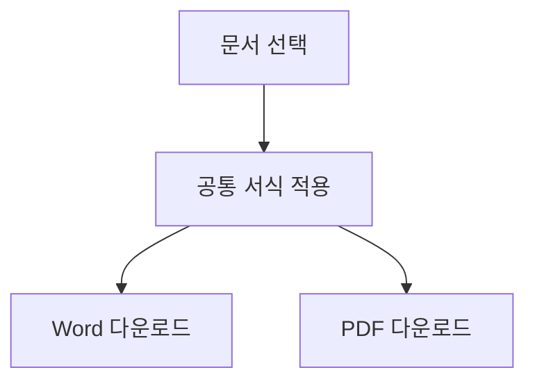

# 제품 요구사항 정의서

## 1. 프로젝트 개요

이 문서는 다운로드 서식을 확인하기 위한 예시입니다. 본문 내용과 수치는 디자인 검증용이며 실제 프로젝트의 요구사항을 나타내지 않습니다.

사용자는 회의 내용을 확인하고 필요한 문서를 다운로드합니다. 문서의 본문과 수치는 유지하며, 제목과 표의 서식을 일관되게 적용합니다.

### 1.1 검증 범위

- 본문과 **강조 문구** 보존
- 한글과 영문 API 이름, `projectId` 표시
- 표의 행과 열, 긴 문장의 자동 줄바꿈

## 2. 기능 요구사항

| 식별자 | 기능 | 요구사항 | 우선순위 |
| --- | --- | --- | --- |
| FR-001 | 문서 조회 | 사용자는 생성된 문서의 본문과 표를 확인할 수 있다. | 높음 |
| FR-002 | 파일 다운로드 | 사용자는 Word와 PDF 형식으로 문서를 내려받을 수 있다. | 높음 |
| FR-003 | 재개 | 완료한 문서와 섹션은 저장하고 미완료 부분부터 이어서 생성한다. | 높음 |
| FR-004 | 취소 | 취소 후 늦게 도착한 응답은 기존 결과를 변경하지 않는다. | 보통 |

### 2.1 확인 순서

1. 프로젝트를 선택한다.
2. 원본 문서의 본문과 수치를 확인한다.
3. 파일을 다운로드하여 원본과 비교한다.

> 원문에 포함된 조건과 주의 사항도 그대로 표시합니다.

## 3. 처리 흐름



### 3.1 데이터 예시

```json
{
  "projectId": "sample-project",
  "amount": 1250000,
  "ratio": "99.9%"
}
```

## 4. 출력 확인

표지에는 문서명과 프로젝트명을 표시합니다. 목차는 원문 제목에서 생성하며, 본문 순서를 바꾸거나 요약하지 않습니다.

| 항목 | 기대 결과 |
| --- | --- |
| 본문 | 문장과 수치가 유지된다. |
| 페이지 | 여백과 페이지 번호가 일관되게 표시된다. |
| 표 | 내용 길이에 맞춰 줄바꿈하며 셀 밖으로 넘치지 않는다. |
| 다이어그램 | 비율을 유지하고 본문 폭 안에 배치한다. |
