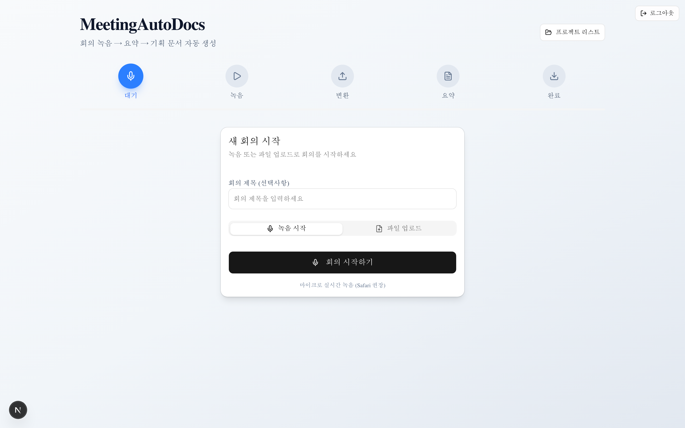
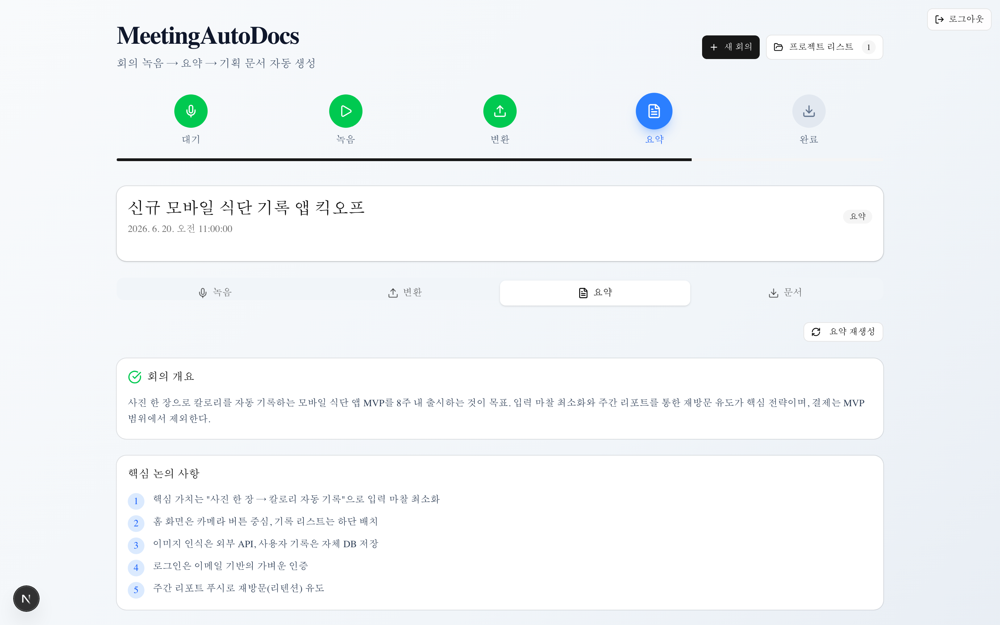
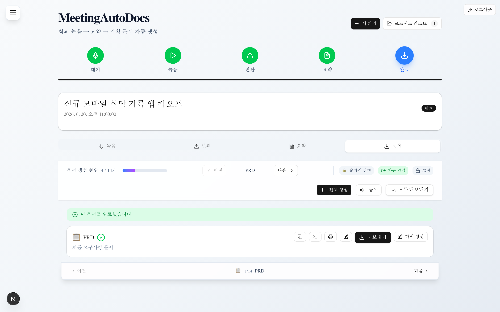
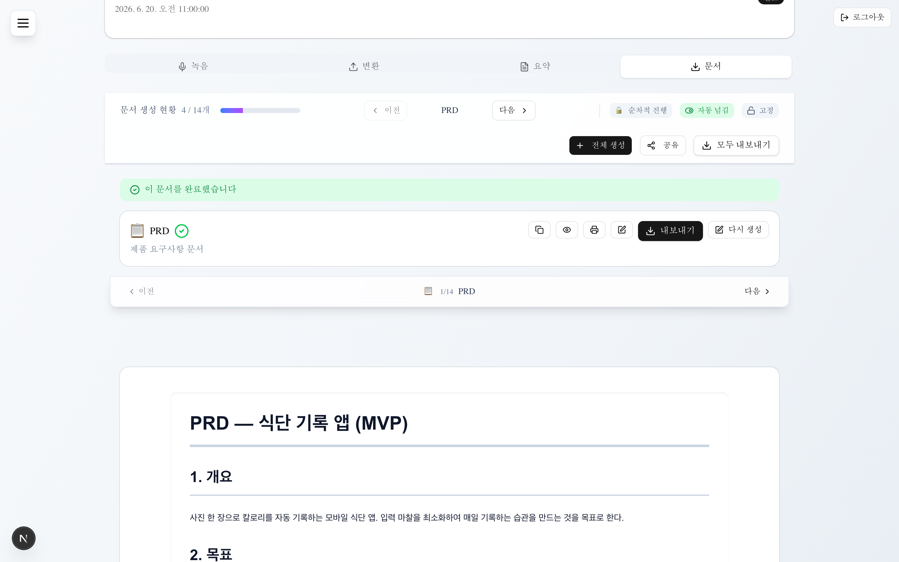

# MeetingAutoDocs — IR

> 회의 한 번으로, 기획 문서 14종이 완성됩니다.



---

## 1. One-liner

**회의 녹음을 올리면, AI가 PRD부터 배포가이드까지 기획 문서 14종을 자동으로 작성합니다.**

기획자가 며칠 걸려 만들던 산출물을 — 회의 직후 몇 분 만에.

---

## 2. The Problem

소프트웨어는 회의에서 시작되지만, 회의 결과는 문서로 옮겨지지 않는다.

- 회의 → 문서화 과정에 **기획자 수일** 소요
- 소규모 팀·1인 개발자는 **기획 인력 부재** → 문서 없이 개발
- 기존 회의록 툴은 **요약까지만**, 실무 산출물로 이어지지 않음

> 결과: 결정은 휘발되고, 개발은 재논의로 되돌아간다.

---

## 3. The Solution

회의 한 번 → 개발에 바로 쓰는 문서 14종.

```
녹음/업로드  →  AI 회의록  →  문서 14종 자동 생성  →  Word/Excel/PPT 내보내기
```



**생성 문서**: PRD · 시나리오 · 기능목록 · 화면목록 · IA · DB설계 · API명세 · 테스트계획 · 플로우차트 · 스토리보드 · 와이어프레임 · WBS · 테스트케이스 · 배포가이드

---

## 4. Product (작동 제품)

단순 데모가 아니라 **전 과정이 동작하는 웹 앱**.



- 문서 14종 생성 + 4종 포맷(DOCX·XLSX·PPTX·MD) 내보내기
- 문서 간 **의존성 자동 전파** — 상위 문서 수정 시 하위 반영
- **시각화 내장** — 플로우차트·ERD·화면 다이어그램 렌더링
- 사용자 계정 단위 **데이터 격리·동기화**



---

## 5. Why Now

- **생성형 AI 대중화** → 문서 자동화 기대치와 수요 동시 상승
- **STT·LLM 단가 하락** → 건당 처리 원가 지속 감소, 마진 개선
- **기획 인력 < 개발 인력** 구조 → 자동화 니즈가 일시적 유행이 아님

---

## 6. Market

| 레이어 | 대상 |
|--------|------|
| Core | 스타트업·SI/SM·디지털 에이전시 |
| Expansion | 기획 산출물이 필요한 모든 프로젝트 조직 |
| Enterprise | 공공 SI·대기업 SI (온프레미스/API) |

---

## 7. Business Model

- **구독형 SaaS** — 회의 처리 건수 / 문서 수 / 팀 좌석 기반
- **확장** — 기업용 API·온프레미스, 협업툴 연동
- 외부 AI API 활용으로 **초기 인프라 투자 최소**, 사용량 연동 원가

---

## 8. Moat (해자)

- 회의록 → **실무 문서 14종** 파이프라인 (요약 도구와의 격차)
- **문서 의존성 그래프** — 단일 문서가 아닌 일관된 산출물 세트
- 누적 사용 데이터 기반 **문서 품질 개선 루프**

---

## 9. Traction & Roadmap

**현재**: 녹음 → 회의록 → 문서 생성 전 과정 동작, 14종·4포맷 지원, 계정 동기화 구현

| 분기 | 마일스톤 |
|------|----------|
| 단기 | 베타 운영·피드백 반영, 문서 품질 안정화 |
| 중기 | 결제·팀 협업·협업툴 연동 |
| 장기 | 기업용(API/온프레미스)·다국어·화자 분리 |

---

## 10. The Ask

투자금은 **(1) 제품 고도화 · (2) AI/인프라 · (3) B2B 영업** 에 집중 투입한다.

> 라운드 규모·밸류·세부 사용처는 IR 미팅에서 별도 자료로 제시.

---

## 11. Contact

**MeetingAutoDocs**
회의 한 번으로, 기획 문서 14종.

---

*본 문서는 투자 유치용 요약 자료입니다. 실제 IR 발표 시 시장 규모(TAM/SAM/SOM) 추정, 재무 모델, 팀 구성을 슬라이드로 보강하십시오. PowerPoint가 필요하면 앱의 내보내기 기능 또는 본 문서를 슬라이드로 변환해 활용할 수 있습니다.*
